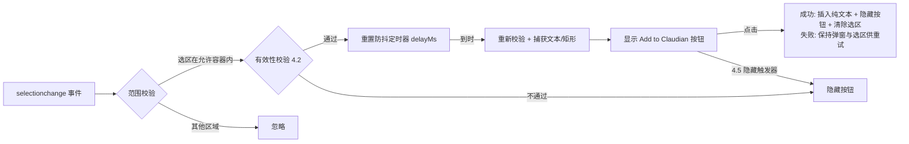

# 划词弹出 Add to Claudian 设计文档（Claudian Selection Bridge）

> 📂 路径：docs/superpowers/specs/2026-08-04-claudian-selection-popup-design.md
> 📍 目标插件：.obsidian/plugins/claudian-selection-bridge/
> 📍 关联插件：.obsidian/plugins/realclaudian/（Claudian v2.0.41）

---

## 一、背景与目标

### 1.1 用户需求

在以下场景选中文字串后，延迟 1 秒（可设置）弹出浮动「Add to Claudian」按钮，点击后将选中**纯文本原文**追加到 Claudian 聊天输入框：

- Claudian 聊天消息区（含流式输出中途）
- Markdown 笔记编辑模式（Live Preview / 源码模式）
- Markdown 笔记阅读模式（Preview）

### 1.2 现状分析

| 现有资产 | 位置 | 说明 |
|------|------|------|
| 「Add to Claudian」文件菜单 | realclaudian `main.js` 内 `Bge()` | 右键文件/文件夹 → `@路径 ` 追加到输入框 |
| 用户既有补丁（TFolder 支持） | realclaudian `main.js`（2026-08-04 修改，备份 `main.js.bak_v2.0.41`） | 原版仅支持 TFile，用户补丁扩展为 `TFile \|\| TFolder` |
| 插入机制 `appendToActiveInput(text)` | realclaudian 视图方法 | 自动补空格分隔、光标移到末尾、dispatch input 事件、聚焦输入框；方法名在 minify bundle 中未压缩，可外部调用 |
| 激活机制 `activateView()` / `getView()` | realclaudian 插件实例方法 | 同上，属性名保留可访问 |

### 1.3 方案决策

采用**方案 B：独立伴随插件**（用户选定）：

- 新插件 `claudian-selection-bridge` 负责划词检测与弹窗
- 通过 `app.plugins.plugins['realclaudian']` 调用其内部 API 完成插入
- 与既有功能的"合并"体现在 UX 层面：==相同名称（Add to Claudian）、相同图标（message-square-plus）、相同插入路径、相同失败 Notice 文案==
- realclaudian 的 TFolder 补丁保持不动
- 优势：Claudian 版本升级不覆盖本功能；源码干净可维护；独立设置页

---

## 二、插件骨架

| 项目 | 内容 |
|------|------|
| 目录 | `.obsidian/plugins/claudian-selection-bridge/` |
| 文件 | `manifest.json`、`main.js`（手写纯 JS，无构建步骤）、`styles.css` |
| 插件 ID | `claudian-selection-bridge` |
| 显示名 | `Claudian Selection Bridge` |
| 版本 | `1.0.0` |
| minAppVersion | `1.7.2`（与 realclaudian 一致） |
| isDesktopOnly | `true`（避免与移动端原生划词菜单冲突；realclaudian 亦为桌面专用） |

`main.js` 模块格式（手写 Obsidian 插件标准格式）：

```js
const { Plugin, PluginSettingTab, Setting, Notice, setIcon } = require('obsidian');
// ... 类定义 ...
module.exports = ClaudianSelectionBridgePlugin;
```

---

## 三、与 realclaudian 的接口（ClaudianBridge）

完全镜像 realclaudian 内部 `wYe()` 函数的行为：

```js
async function addTextToClaudian(app, text) {
  const p = app.plugins.plugins['realclaudian'];
  if (!p) {
    new Notice('Claudian plugin not found or not enabled.');
    return false;
  }
  try {
    await p.activateView();
    const ok = p.getView()?.appendToActiveInput(text) ?? false;
    if (!ok) new Notice('Claudian chat is not ready.');
    return ok;
  } catch (e) {
    new Notice('Failed to add to Claudian.');
    return false;
  }
}
```

==注意==：插入内容为**纯文本原文**（用户选定），不做引用块/代码块/来源标注包装。

---

## 四、组件设计

| 组件 | 职责 | 关键实现 |
|------|------|------|
| `SelectionWatcher` | 监听 `selectionchange`，范围校验，防抖定时器 | `registerDomEvent(doc, 'selectionchange', ...)`；支持多窗口 document |
| `PopupButton` | 单例浮动按钮：定位、显示、隐藏 | `position: fixed` div 附加到 `document.body`；图标 `message-square-plus` + 文案 `Add to Claudian` |
| `ClaudianBridge` | 调用 realclaudian 插入文本 + 失败 Notice | 见第三节 |
| `BridgeSettingTab` | 设置面板 | 标准 `PluginSettingTab` |

### 4.1 触发范围选择器

选区 `anchorNode` 满足以下任一即有效：

| 场景 | 选择器 |
|------|------|
| Claudian 聊天消息区 | `.claudian-messages` |
| MD 编辑模式 | `.cm-editor` |
| MD 阅读模式 | `.markdown-preview-view`（含 hover-editor 悬浮预览，自然覆盖） |

==天然排除==：Claudian 聊天输入框为 `<textarea>`，其内部选择不触发 document `selectionchange`，无需特判。

### 4.2 有效性条件（全部满足才启动定时器）

1. 设置中功能已启用
2. `window.getSelection()` 非空，`toString().trim().length >= 1`
3. anchorNode 在 4.1 的允许容器内
4. 非鼠标拖拽中（跟踪 pointerdown/pointerup；键盘 Shift 选择不受限）
5. 选区不在弹窗自身内部（防止点击/触碰弹窗文字时自我触发）

### 4.3 防抖语义

- 每次 `selectionchange` 清除旧定时器，重新以 `delayMs` 计时
- 定时器到时后**重新校验** 4.2 全部条件（防中途失效）
- 捕获此刻的选中文本与 `getRangeAt(0).getBoundingClientRect()`

### 4.4 弹窗定位

- 默认显示在选区矩形**上方**（偏移 8px）
- 矩形顶部距视口顶 < 40px 时翻转到**下方**
- 水平方向钳制在视口内（留 8px 边距）

### 4.5 隐藏触发器

| 触发 | 说明 |
|------|------|
| 选区坍缩/变为无效 | selectionchange 驱动 |
| pointerdown（弹窗外部） | 含开始新一次拖拽选择 |
| `Escape` 键 | keydown 监听 |
| 滚动 | document scroll 捕获阶段 |
| 窗口 blur | 窗口失焦 |
| 设置被禁用 | 立即隐藏并停止定时器 |

### 4.6 点击行为

1. 调用 `ClaudianBridge.addTextToClaudian(text)`（使用弹窗显示时捕获的文本快照）
2. ==成功==：隐藏弹窗 + `selection.removeAllRanges()` 清除页面选区（防止同一选区停留重复弹出）
3. ==失败==：保持弹窗与选区不动（Notice 已提示原因），用户可直接重试

---

## 五、数据流



---

## 六、设置面板

| 设置项 | 控件 | 默认值 | 说明 |
|------|------|------|------|
| 启用划词弹出 | Toggle | `true` | 关闭后立即隐藏按钮并停止监听 |
| 弹出延迟 | Slider 0–5000ms，步进 100 | `1000` | 选区稳定多久后弹出 |

- 即时生效（监听逻辑每次事件时读取 `this.settings`，无需重载）
- 持久化：标准 `loadData()` / `saveData()` → 插件 `data.json`
- i18n：按 Obsidian 语言显示 ==日本語 / 中文 / English==（检测 `moment.locale()` 前缀：`ja` → 日语，`zh` → 中文，其余 → 英语）

---

## 七、边界与错误处理

| 场景 | 行为 |
|------|------|
| realclaudian 未安装/未启用 | 点击时 Notice "Claudian plugin not found or not enabled."，==保持弹窗与选区==供用户重试 |
| 聊天视图未就绪（`appendToActiveInput` 返回 false） | Notice "Claudian chat is not ready."（与现有功能文案一致） |
| `activateView()` 抛异常 | Notice "Failed to add to Claudian."（与现有功能文案一致） |
| 拖拽中途停顿超延迟 | 不弹出（pointer 按下状态跟踪） |
| 流式输出重渲染 DOM | 浏览器自动坍缩选区 → selectionchange → 按钮自动隐藏，无残留 |
| 纯空白字符选区 | 无效，不弹出 |
| Popout 独立窗口 | 支持：收集所有窗口 document 挂监听，`layout-change` 时重扫（`Set<Document>` 去重） |
| 弹窗内自身事件 | 忽略（不影响弹窗存活） |
| 超长选区 | 原样插入（`appendToActiveInput` 无长度限制） |

---

## 八、已知限制（v1 接受）

| 限制 | 说明 |
|------|------|
| realclaudian 内部 API 耦合 | `activateView`/`getView`/`appendToActiveInput` 方法名若在未来版本被改，需同步适配（故障表现为 Notice 提示，可快速定位） |
| 跨容器选区 | 仅校验 anchorNode 位置；从允许容器开始拖到容器外的选区按允许处理（罕见，可接受） |

---

## 九、测试方案

1. **语法验证**：`node --check main.js`（每次修改后执行）
2. **手动 UAT 清单**（Obsidian 实机）：
   - [ ] MD 编辑模式划词 → 1s 后弹出 → 点击 → 纯文本进入聊天输入框
   - [ ] MD 阅读模式划词 → 同上
   - [ ] Claudian 聊天消息区划词（含流式输出中途）→ 同上
   - [ ] 聊天输入框内划词 → 不弹出
   - [ ] 延迟改为 3000ms → 3 秒才弹出；关闭开关 → 永不弹出
   - [ ] 快速连续改选区 → 只在稳定后弹出一次
   - [ ] 点击外部 / Esc / 滚动 → 按钮消失
   - [ ] realclaudian 停用时点击 → Notice 提示
   - [ ] Popout 窗口笔记内划词 → 正常弹出

---

## 十、交付物清单

| 文件 | 动作 |
|------|------|
| `.obsidian/plugins/claudian-selection-bridge/manifest.json` | 新建 |
| `.obsidian/plugins/claudian-selection-bridge/main.js` | 新建 |
| `.obsidian/plugins/claudian-selection-bridge/styles.css` | 新建 |
| realclaudian `main.js`（TFolder 补丁） | ==不动== |

---

*📅 2026-08-04 · Claudian Selection Bridge v1.0.0 设计*
