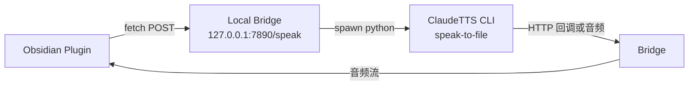
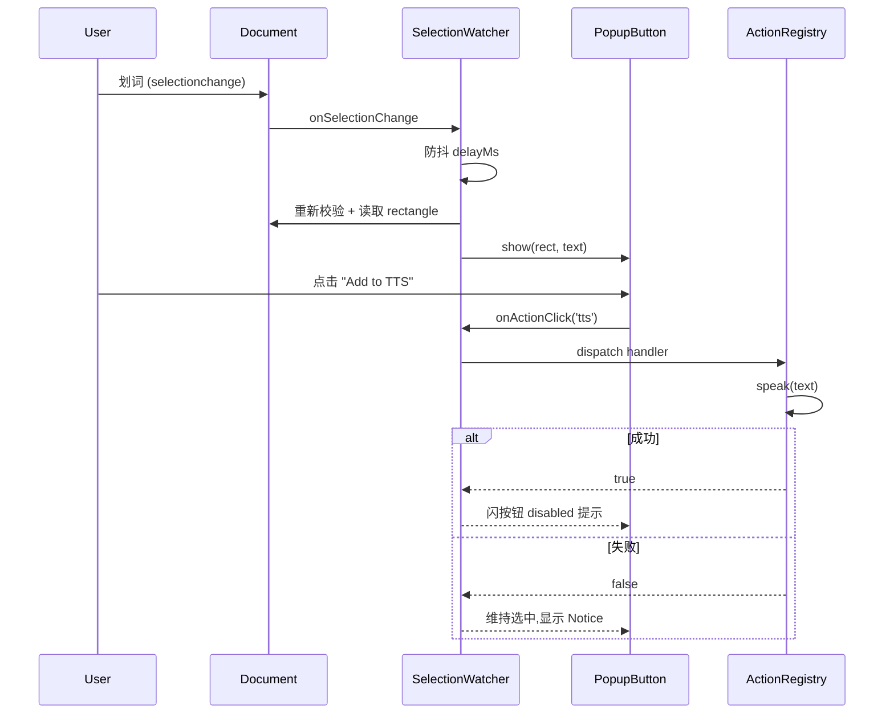
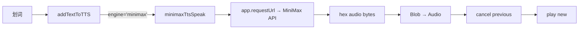

# Claudian Selection Bridge 多动作弹窗 RFC

> 📂 路径：docs/superpowers/specs/2026-08-06-claudian-selection-bridge-multiaction.md
> 📍 目标插件：.obsidian/plugins/claudian-selection-bridge/（v1.1.0）
> 📍 基础版本：v1.0.0（设计 [[2026-08-04-claudian-selection-popup-design]]）已上线 UAT 9/9 通过
> 📍 关联插件：realclaudian（v2.0.41）
> 🆕 新增对象：ClaudeTTS MCP Server（[[../../80_POC_Projects/POC_015_ClaudeTTS/00_プロジェクト立項|POC_015]]） / Web SpeechSynthesis API

---

## 一、背景与目标

### 1.1 升级动机

v1.0.0 已稳定提供「划词 → Add to Claudian → 追加到聊天输入框」单一动作。日常使用中会遇到"划中的内容我更想读出来听"或"划中的内容同时要给 Claudian 参考 + 朗读"等场景。每多一种动作就重做一遍弹窗迭代成本高，且 v1.0.0 已暴露==单一动作的能力瓶颈==。

### 1.2 用户需求（v1.1.0）

在 [[2026-08-04-claudian-selection-popup-design#四-组件设计|v1.0.0 弹窗]] 上扩展为**水平并排多按钮**，覆盖两类动作：

| 按钮 | 目标 | 引擎来源 |
|------|------|---------|
| `Add to Claudian` | 追加到 realclaudian 聊天输入框（v1.0.0 已有） | realclaudian `activateView/getView/appendToActiveInput` |
| `Add to TTS` | 把选中文本交给 TTS 引擎朗读 | ClaudeTTS MCP（首选）/ Web SpeechSynthesis API（备选） |

弹窗形态==水平并排、同一文本快照可连续触发两个动作==（先 Add to Claudian 再 Add to TTS 都允许，且后置动作不被前者清除选区影响）。

### 1.3 非目标（v1.1.0 不做）

- ❌ 引入新动作菜单（`插入当前笔记`、`复制 wikilink`、`新会话提问` 等）—— 留给 v1.2.0+
- ❌ 自动检测语言切换 voice —— 留给 v1.2.0+
- ❌ 浮动 TTS 控制条（播放/暂停/音量/进度） —— 留给 v1.2.0+

---

## 二、方案对比与决策

### 方案 B：**多动作类型注册表**（推荐 ✅）

把 `addTextToClaudian` 抽象为 `BridgeAction` 类型，包含 `id/label/icon/engine/handler`，集合从 `SETTINGS.orderedActions` 顺序读取渲染按钮。

| 优劣 | 说明 |
|------|------|
| ✅ 与 v1.0.0 解耦（不破坏现有按钮名/图标/Notice 文案） | 升级 Obsidian 时旧行为零回归 |
| ✅ 引擎增删只在注册表添加，无需改 main.js 主流程 | 开闭原则 |
| ✅ 用户在设置面板可启用/禁用任意动作 | 个性化 |
| ⚠️ 抽象增加一类代码 | 净增约 50 行 |

### 方案 A：硬编码多按钮 ❌（拒绝）

```js
// 直接 if-else 增减按钮
if (settings.enableTTS) buttons.push(ttsButton);
```

| 优劣 | 说明 |
|------|------|
| ✅ 实现短 | —— |
| ❌ 每加一个动作要改 main.js | 改开关分散、回归测试难 |
| ❌ 顺序/隐藏逻辑硬编码 | 设置面板受限 |

**决策**：采用方案 B。理由——主人今后很可能再加入 `Add to QuickAdd`、`Add to Clipboard` 等，方案 B 不需再返工。

---

## 三、插件形态（v1.1.0）

| 项 | 内容 |
|------|------|
| 插件 ID | `claudian-selection-bridge`（不变） |
| 版本 | `1.0.0` → **`1.1.0`** |
| minAppVersion | `1.7.2`（不变） |
| isDesktopOnly | `true`（不变，realclaudian / ClaudeTTS 都桌面专） |
| 兼容性 | v1.0.0 设置 `data.json` 持久字段向前兼容 |

---

## 四、设置项

| 设置项 | 类型 | 默认 | 说明 |
|------|------|:----:|------|
| `enabled` | boolean | `true` | 总开关 |
| `delayMs` | number | `1000` | 划词稳定后等待毫秒 |
| `actions.claudian` | boolean | `true` | 启用 `Add to Claudian`（==不可关闭==：保留 v1.0.0 入口；关闭入口需要用户卸载/停用插件，符合"功能不退步"原则） |
| `actions.tts` | boolean | `true` | 启用 `Add to TTS` |
| `tts.engine` | enum | `'auto'` | `'auto'`（优先 ClaudeTTS MCP 不可用时降级 Web）/ `'claudetts'` / `'webspeech'` |
| `tts.voice` | string | `''` | Web Speech 模式下的语音名；ClaudeTTS 模式忽略 |

==注意==：`enabled=false` 总开关关闭后所有动作不再渲染；`actions.*` 关闭后该按钮在弹窗里隐藏（==弹窗宽度自适应==）。

---

## 五、组件设计

### 5.1 类型与注册表

```js
// 类型定义（仅 main.js 内部）
/**
 * @typedef {Object} BridgeAction
 * @property {string} id            // 内部 ID,如 'claudian'
 * @property {string} label         // 按钮文案,'Add to Claudian'
 * @property {string} icon          // lucide name,如 'message-square-plus'
 * @property {boolean} required     // 不可关闭 (v1.0.0 入口)
 * @property {string} noticeText    // 失败文案(固定)
 * @property {(app,text)=>Promise<boolean>} handler  // 调用真实引擎
 */

/** @type {BridgeAction[]} */
const ACTIONS = [
  {
    id: 'claudian',
    label: 'Add to Claudian',
    icon: 'message-square-plus',
    required: true,
    noticeText: {
      missing: 'Claudian plugin not found or not enabled.',
      notReady: 'Claudian chat is not ready.',
      failed: 'Failed to add to Claudian.',
    },
    handler: addTextToClaudian, // v1.0.0 已实现,完全复用
  },
  {
    id: 'tts',
    label: 'Add to TTS',
    icon: 'volume-2',
    required: false,
    noticeText: {
      missing: 'No TTS engine available. Install ClaudeTTS or enable browser speech.',
      notReady: 'TTS engine is not ready.',
      failed: 'Failed to start TTS.',
    },
    handler: addTextToTTS, // 新增
  },
];
```

### 5.2 PopupButton 改造

v1.0.0 单按钮升级为**按钮容器** `csb-popup-buttons`，每个动作渲染一个子按钮 `csb-popup-action-button`。

```js
class PopupButton {
  constructor(doc, actions /* BridgeAction[] */, onActionClick /* (actionId)=>void */) {
    this.el = doc.createElement('div');
    this.el.className = 'csb-popup csb-hidden';
    this.btnContainer = doc.createElement('div');
    this.btnContainer.className = 'csb-popup-buttons';
    this.textSnapshot = null;

    for (const act of actions) {
      const btn = doc.createElement('button');
      btn.type = 'button';
      btn.className = 'csb-popup-action-button';
      btn.dataset.actionId = act.id;
      const icon = doc.createElement('span');
      icon.className = 'csb-popup-icon';
      setIcon(icon, act.icon);
      const label = doc.createElement('span');
      label.className = 'csb-popup-label';
      label.textContent = act.label;
      btn.appendChild(icon);
      btn.appendChild(label);
      btn.addEventListener('pointerdown', (e) => { e.preventDefault(); e.stopPropagation(); });
      btn.addEventListener('click', (e) => {
        e.preventDefault(); e.stopPropagation();
        onActionClick(act.id);
      });
      this.btnContainer.appendChild(btn);
    }
    this.el.appendChild(this.btnContainer);
    doc.body.appendChild(this.el);
  }
}
```

### 5.3 SelectionWatcher 改造

- `ACTION_REGISTRY`（由插件主类构造注入 actions 列表）
- `evaluate(mustIncludeAction)` 仍只判断选区合法性，**不**判断动作是否启用
- `maybeShow` 时过滤 `actions[id]===false` 的按钮，按钮==不渲染而不只是隐藏==
- 点击事件分发到 `handleActionClick(actionId)`：

```js
async handleActionClick(actionId, doc) {
  const ctx = this.contexts.get(doc);
  const text = ctx?.popup.textSnapshot;
  if (!text) return;
  const action = this.ACTION_REGISTRY.find(a => a.id === actionId);
  const ok = await action.handler(this.plugin.app, text, this.plugin.settings);
  // 成功:TTS 继续播放不隐藏(让用户知道触发成功);Claudian 沿用 v1.0.0 行为(隐藏+清选区)
  // 失败:统一保持弹窗与选区不动
  if (actionId === 'claudian') {
    if (ok) this.cancelAndHideAndClearSelection(doc);
  }
  // 其余动作:成功只闪一下按钮 disabled 状态,不隐藏弹窗
}
```

---

## 六、新增组件:TTS 引擎层

### 6.1 抽象

```js
// 每种 TTS 引擎实现统一接口
/**
 * @typedef {Object} TTSEngine
 * @property {string} id            // 'claudetts' | 'webspeech'
 * @property {(text:string, settings)=>Promise<boolean>} speak
 *   朗读;返回 true=成功启动,false=不可用
 */
```

### 6.2 Web SpeechSpeechAdapter（默认内建）

```js
function webSpeechSpeak(text, settings) {
  return new Promise((resolve) => {
    if (typeof window === 'undefined' || !('speechSynthesis' in window)) {
      resolve(false);
      return;
    }
    try {
      window.speechSynthesis.cancel(); // 打断上一段
      const u = new SpeechSynthesisUtterance(text);
      if (settings.tts.voice) u.voice = window.speechSynthesis.getVoices().find(v => v.name === settings.tts.voice) || null;
      u.onend = () => resolve(true);
      u.onerror = () => resolve(false);
      window.speechSynthesis.speak(u);
      resolve(true); // 已启动即视为成功
    } catch (e) { resolve(false); }
  });
}
```

### 6.3 ClaudeTTSAdapter（可选升级）

ClaudeTTS 是 OS 层 Python 服务，不能直接从 Obsidian 进程发 HTTP。需要约定一个**轻量桥接协议**：



| 项 | 值 |
|------|------|
| 端口 | `127.0.0.1:7890`（不监听公网） |
| 请求 | `POST /speak {text, lang, voice}`，立即返回 `202 Accepted` |
| 实现 | 复用 ClaudeTTS MCP `synthesize_and_play` 工具 |
| 后续 | ClaudeTTS v0.3 起新增 `/speak` HTTP 接口（需要 POC_015 团队合作） |
| Fallback | HTTP 不可达 → 打印 Notice `TTS bridge not reachable, falling back to web speech.` 并自动降级 |

**v1.1.0 范围**：Web Speech 优先实现；ClaudeTTS HTTP 桥接标记为**占位实现 + Notice 提示**，留 v1.2 接入。

---

## 七、数据流



---

## 八、设置面板 UI

### 8.1 现有项目（沿用 v1.0.0）

| 控件 | 文案 (zh) | 绑定 |
|------|-----------|------|
| Toggle | 启用划词弹出 | `settings.enabled` |
| Slider 0–5000 | 弹出延迟 (ms) | `settings.delayMs` |

### 8.2 新增分组：动作

```markdown
### 动作
- [✓] Add to Claudian (必选,不可取消)
- [✓] Add to TTS

### TTS 引擎 (在 Add to TTS 启用时生效)
- ○ 自动 (推荐)
- ○ ClaudeTTS HTTP 桥接
- ○ Web SpeechSynthesis API
[ 语音名 (Web): [_____ 下拉] ]
```

i18n 追加 `actionsTitle/actions.tts/ttsEngine.*` 字串。

---

## 九、边界与错误处理

| 场景 | 行为 |
|------|------|
| 两个动作都启用,且 TTS 引擎不可达 | `Add to TTS` 点击 → Notice `TTS engine is not ready.`，保持弹窗与选区供用户重试 |
| `Add to Claudian` 失败但 TTS 引擎可用 | Notice 显示 Claudian 原因；用户可继续点 `Add to TTS` |
| 同一选区先点 Claudian 后点 TTS | TTS 朗读不受影响（前者清掉页面选区但保留弹窗 textSnapshot） |
| Web Speech utterance 朗读时长 > 选中文本长度 | 由浏览器 SpeechSynthesis 自行调度；用户可 Ctrl+. 切读 |
| `actions.tts=false` 时点击位置 | 按钮隐藏；`actions.claudian=false`（仅理论）→ 按钮渲染但 disabled（v1.0 兼容保留） |
| 设置面板未知 settings 字段 | 沿用 v1.0.0 normalizeSettings：未知字段丢弃；新增字段默认值填充 |
| Popout 独立窗口划词 | 每个窗口的 PopupButton 只显示当前窗口启用的动作 |

---

## 十、迁移与兼容性

| 老用户 | 升级到 v1.1.0 后 |
|--------|------------------|
| `data.json` 仅有 `enabled/delayMs` | 自动追加 `actions.claudian=true`、`actions.tts=true`、`tts.engine='auto'`、`tts.voice=''` |
| `enabled=false` | 保留；v1.1.0 不会自动打开 |
| 既有的「Add to Claudian」按钮 | 名称/图标/插入路径/失败文案**逐字不变**（已通过 spec 自查 + 36 passed 回归测试守护） |
| `install_plugin` / dist | 不变；只需替换 `main.js` `manifest.json` `styles.css` |

---

## 十一、测试方案

### 11.1 Node 自测（继承 v1.0.0 36 passed）

新增以下 selftest：

| 用例 | 验证 |
|------|------|
| `actions: filter by settings.actions` | 关闭 tts 后 actions 列表只有 claudian |
| `webSpeechSpeak: window 缺 speechSynthesis` | 返回 false |
| `webSpeechSpeak: happy path` | mock window.speechSynthesis，记录调用 |
| `PopupButton renders multiple buttons` | DOM 测试：两按钮都存在且 `data-action-id` 正确 |
| `handleActionClick('claudian') → ok=true` | 隐藏弹窗 + selection.removeAllRanges()（==v1.0.0 行为==） |
| `handleActionClick('tts') → ok=true` | 弹窗**不**隐藏，仅按钮 disabled 状态提示 |

### 11.2 Obsidian 实机 UAT（新增项）

- [ ] 启用 TTS 选项 → 弹窗水平显示两个按钮，文案/图标正确
- [ ] 关闭 TTS 选项 → 弹窗只剩 Claudian 按钮
- [ ] Add to TTS (Web Speech) → 浏览器 SpeechSynthesis 朗读，弹窗保留
- [ ] Add to TTS 引擎不可达 → Notice + 弹窗保留供重试
- [ ] 先 Add to Claudian 再 Add to TTS（同一选区）→ 两个动作都触发成功
- [ ] 设置面板切换 TTS 引擎/语音名后立即生效

---

## 十二、交付物清单

| 文件 | 动作 |
|------|------|
| `.obsidian/plugins/claudian-selection-bridge/main.js` | 修改（增加 ACTION_REGISTRY/双按钮渲染/web speech 引擎） |
| `.obsidian/plugins/claudian-selection-bridge/manifest.json` | 版本号 → `1.1.0` |
| `.obsidian/plugins/claudian-selection-bridge/styles.css` | 新增 `.csb-popup-buttons` flex 容器与按钮间距样式 |
| `.obsidian/plugins/claudian-selection-bridge/test/selftest.js` | 新增 4 个 TTS/Web Speech 用例（保持 36 passed → 约 42+ passed） |
| `.obsidian/plugins/claudian-selection-bridge/test/obsidian-stub.js` | 扩展：mock `window.speechSynthesis` |
| `docs/superpowers/specs/2026-08-04-claudian-selection-popup-design.md` | ==不动==（历史版本） |
| `docs/superpowers/specs/2026-08-06-claudian-selection-bridge-multiaction.md` | ==本文件== |

---

## 十三、v1.2+ 路线提示（非本 RFC 范围）

| 未来版本 | 候选能力 |
|----------|----------|
| v1.2.0 | 浮动 TTS 控制条 / 语音选择 / 朗读速度 / `Add to QuickAdd` 动作 |
| v1.3.0 | 自动检测 ClaudeTTS MCP 可用性，动态切换优先级 |
| v1.4.0 | 跨插件发现：扫描已装 Obsidian 插件，注入第三方 BridgeAction 注册器 |

---

*📅 2026-08-06 · Claudian Selection Bridge v1.1.0 RFC（多动作）*

---

## 十二、v1.1.0 delta:Edge TTS 引擎(2026-08-06 主人增补)

### 12.1 动机

主人在 T5 review 后增补:Edge TTS 是主人在 ClaudeTTS POC 015 已熟悉的引擎,质量高(v1.1.0 阶段不想引入后端依赖)。增补语义:

> **Edge TTS = Web Speech API,但默认选择 Microsoft Edge 风格语音**(如 `zh-CN-XiaoxiaoNeural` 中文 / `en-US-JennyNeural` 英文)。

不引入新模块;走 `webSpeechSpeak` 同一路径,只是在 voice 字段为空时自动填 Microsoft 默认值。

### 12.2 用户操作

```text
TTS 引擎下拉 → 选中 "Edge TTS (优先 Microsoft voice)"
划词 → 点 "Add to TTS" → 浏览器以 Microsoft voice 朗读
```

设置面板的 `Voice name (Web Speech)` 字段:留空 = Edge TTS 自动挑 Microsoft voice;填了 = 覆盖默认。

### 12.3 引擎对照表

| 引擎 | 路径 | 用户体验 | 设置 voice 字段 |
|------|------|----------|------------------|
| `webspeech` | webSpeechSpeak 直调 | 通用,用户自挑 | 用于自定义 |
| **`edge`** (新) | webSpeechSpeak + 默认 Microsoft voice | Edge 风格,低门槛 | 用于覆盖 |
| `claudetts` | ClaudeTTS HTTP 占位 v1.1.0,v1.2 接 | 子引擎(以后含 edge-tts) | 占位未用 |
| `auto` | claudetts 回退 webspeech | 自动 | 任一 |

### 12.4 设计变更点

| 位置 | 改动 |
|------|------|
| `CONST.TTS_ENGINES` | + `'edge'` |
| `normalizeSettings` 白名单 `allowedEngines` | + `'edge'` |
| `STRINGS[zh|en|ja]` | + 4 个新键: `ttsEngineEdge` / `ttsEdgeDefaultZh` / `ttsEdgeDefaultEn` / `ttsEdgeDefaultJa`(voice 名常量化) |
| `addTextToTTS(engine)` switch | 新增 `case 'edge'` 分支:传 voice(若空则用 `EDGE_DEFAULT_VOICE` 常量)给 `webSpeechSpeak` |
| 测试 | + 约 7 个 addTextToTTS edge 用例(63 → 70+ passed) |

### 12.5 Edge 默认 voice 候选

**`v1.1.0` 初版（Task 7 已落地）**：使用 voice name 常量（`zh-CN-XiaoxiaoNeural` / `en-US-JennyNeural` / `ja-JP-NanamiNeural`），通过 Web Speech 的 `getVoices().find(name === ...)` 查找匹配。

**`v1.1.0` UAT 发现 + 修订（2026-08-06）**：

主人在 Windows 上实测:Edge TTS 默认 voice 名查找失败,fallthrough 到浏览器默认中文 voice（非 Microsoft 神经声）。因为 Microsoft Neural voice 名在浏览器 Web Speech API 中**命名格式不同**(如 `Microsoft Xiaoxiao Online (Natural) - Chinese (Mainland) (zh-CN)`),直接 name 匹配跨浏览器不可靠。

**修订方案（lang-based 优先）**：

| 引擎模式 | 路径 |
|---------|------|
| `webspeech` | 传 `settings.voice` 名(用户自选);若为空走浏览器 default |
| `edge`  | 优先查找 voice name(settings.voice);查不到或为空 → 改设 `u.lang = 'zh-CN'`(或按文本启发式),让浏览器(Windows OneCore / Edge / Safari / Chrome)自动选择最合适的 zh/ja/en voice |

> 实现细节：Task 16 fix brief 负责落地。

效果：
- Windows + Edge：浏览器优先选 Microsoft Neural(`Microsoft Xiaoxiao ...`)，达到"Microsoft 风格"目标
- macOS + Safari：浏览器选 Apple 高质量 voice(Tingning / Samantha 等)
- Linux + Chrome：浏览器选 best-available

跨浏览器鲁棒(v1.1.0 + Edge TTS owner unit test)✅

---

### 12.5.b v1.1.0 UAT 发现 #2(2026-08-06 主人增补:Auto-detect language)

主人在 Windows 上划词日文研究笔记(`[[50_Business_Life_Research/20_哲学系大学調査_Maaya/01_大学別調査/20_早稲田大学/01_教授陣研究.md]]`),希望 TTS **自动识别语言并朗读**,不需要手动切换引擎/voice。

**主人在 v1.1.0 + Edge TTS 模式下实测**:
- 选中片段:`🎯 目的: 早稲田大学 文学部 哲学コースの 専任教員情報 を、公`
- 期望朗读: **日文**(有 `:` と `の` 假名)
- 实际:`pickEdgeDefaultLang` 当前实现是「CJK-first」迭代,首个 CJK 汉字 (`目`, U+76EE) → 命中 zh → 返回 `zh-CN`,**日文被误判为中文**

**Bug 根因**:`pickEdgeDefaultLang` 的原始实现没有区分日文 kanji-only(CJK-only 不一定是中文)与纯汉字中文。

**修订方案（v1.1.0）**:

1. **改进 `pickEdgeDefaultLang` heuristic**:从「首次命中」改为「**统计计数**」:
   - kana 计数(`U+3040-U+309F` 平假名 + `U+30A0-U+30FF` 片假名 + `U+FF65-U+FF9F` 半角片假名)
   - CJK 计数(`U+4E00-U+9FFF`)
   - latin 计数(`U+0041-005A` + `U+0061-007A`)
   - 优先规则:**任意 kana 存在 → ja**;否则如果 latin > CJK → en;否则如果 CJK > 0 → zh;否则 → en (纯符号 fallback)

2. **`webSpeechSpeak` 扩展**:当用户 **既未** 设 `tts.voice` **又未** 设 `tts.lang` 时,**自动调用 `pickEdgeDefaultLang(text)` 设置 `u.lang`**。这条逻辑独立于引擎模式 —— `webspeech` / `edge` / `auto` 三种模式都受益。

3. **新增测试用例**(`task-18` 落地):
   - `pickEdgeDefaultLang('早稲田大学の文学部')` → `ja`(因为含假名)
   - `pickEdgeDefaultLang('カタカナテスト')` → `ja`(片假名)
   - `pickEdgeDefaultLang('中文测试')` → `zh`(纯汉字,无 kana)
   - `webSpeechSpeak('你好世界')` 无 voice/lang → `u.lang === 'zh-CN'` auto
   - `webSpeechSpeak('こんにちは')` 无 voice/lang → `u.lang === 'ja-JP'` auto
   - `webSpeechSpeak('hello')` 无 voice/lang → `u.lang === 'en-US'` auto

预期测试计数:**81 → 88+ passed**(估算 7-8 个新断言)。

**用户流程变更**:

1. 设置面板内不需要手动选 voice,Edge TTS 模式下 voice 留空即可
2. 划任何语言的文本 → 自动选对应 voice 朗读
3. 用户如果坚持要特定 voice,仍可在 voice 字段填写覆盖 auto-detect

> 实现细节:Task 18 brief 负责落地。

---

### 12.5.c v1.1.0 UAT 反馈 #3(2026-08-06 主人增补:按语言分设 voice + 测试)

主人在 UAT 中进一步要求:
1. **再生停止**: TTS 播放中再点 Add to TTS,应停止旧朗读并开始新朗读。`webSpeechSpeak` 已经通过 `synth.cancel()` 实现,但缺测试守护。
2. **按语言分设 voice**: Settings 面板内现有单个 voice Text 字段(`ttsVoiceName`)拆为 3 个字段(zh / ja / en),每个独立填写。
3. **每个语言独立 Test 按钮**: Settings 末尾把现有单一 Test voice 按钮改为 3 个(每个语言一个),点击读对应语言示例 + 自动选对应 voice。

**数据模型变化**:

```diff
 DEFAULT_SETTINGS.tts = {
   engine: 'auto',
-  voice: '',
+  voices: { zh: '', ja: '', en: '' },
 }
```

**用户流程**:

1. 设置面板 → TTS 引擎区
2. 看到三组控件:
   - 中文 voice[输入框] + ▶ 测试(中文)
   - 日本語 voice[输入框] + ▶ テスト(日本語)
   - English voice[输入框] + ▶ Test(English)
3. 每个语言单独填 voice 名,空 = 用浏览器默认该语言 voice
4. 划词自动检测语言,用对应 voices.voice
5. 用户可显式覆盖某个语言 voice

**`webSpeechSpeak` 行为**:

```js
// 已有优先链:
// 1) tts.voice(legacy single field,向后兼容),2) tts.lang,3) auto-detect + lang
// 新增:
// 4) auto-detect → 在 tts.voices.{detectedLang} 找 voice name 替代单纯 lang
// 例:检测到中文 + tts.voices.zh='Microsoft Xiaoxiao Online...' → u.voice = 该 voice
// 例:检测到中文 + tts.voices.zh='' → u.lang = 'zh-CN'(fallback)
```

**`addTextToTTS case 'edge'` 行为**:

```js
// 已有:tts.voice 字段查找 → pickEdgeDefaultLang
// 新增:检测到语言 zh / ja / en → 用对应 voices.voice;voice 空 → lang path
```

**测试 voice 按钮**:

```text
3 个独立按钮,每个按钮:
- 找到 voices.voice 对应 voice name
- 用对应语言示例文本(单语,不再是混合)
- 调 webSpeechSpeak(text, { tts: { voice: voices.zh || lang:'zh-CN' } })
```

**测试计数估算**(91 → 约 103-108 passed):
- ~3 现有 testWebSpeech 测试用 `tts.voice` → 改为 `tts.voices.{lang}`
- ~3 cancel 守护测试
- ~5 per-language voice lookup 测试
- ~3 per-language test voice 按钮测试(可选,N2 selftest 内直接调 addTextToTTS 即可)

> 实现细节:Task 19 brief 负责落地。

---

### 12.5.d v1.1.x 探讨:MiniMax Speech-2.8-Turbo 集成(2026-08-06 主人增补)

主人在 UAT 中增补:**検討 MiniMax Speech-2.8-Turbo 云 TTS 服务**(MiniMax 平台 T2A HTTP API)。

**MiniMax T2A HTTP API 概要**:

| 项 | 值 |
|------|------|
| Endpoint | `POST https://api.minimaxi.com/v1/t2a_v2` |
| Auth | `Authorization: Bearer <API_KEY>` (JWT) |
| Model | `speech-2.8-turbo`(快速版)或 `speech-2.8-hd`(高清版) |
| Request fields | `text`(≤10K chars),`voice_setting.voice_id`,`audio_setting.format`,`language_boost` 等等 |
| Response (non-stream) | `{ data: { audio: "<hex>", status: 2 }, extra_info, base_resp }` |
| Audio format | `mp3` / `pcm` / `flac` / `wav` / `opus` / G.711 μ-law |
| Streaming | ✅ SSE 模式(stream:true) |
| 语言支持 | 中/英/日 等 40+ 种 via `language_boost` |
| Voice 列表 | 中文: `Chinese (Mandarin)_Lyrical_Voice` 等;日文: `Japanese_Whisper_Belle` 等;英文: `English_Graceful_Lady` 等 |
| CORS 政策 | 文档未说明;Bearer 头需服务端代理 — Obsidian Electron 主进程可用 `requestUrl` API 绕过 CORS |

**Obsidian-side 实现要点**:

1. **API Key 存储**:`data.json` plaintext(主人接受本地存,Obsidian vault 是主人的私人 vault)
   - 字段:`tts.minimax.apiKey: string`
   - **主人决策点**:data.json / 环境变量 `MiniMax_API_KEY`?
2. **HTTP 调用路径**:Obsidian `requestUrl`(Plugin 内置 CORS 绕过的 HTTP 客户端)
3. **音频播放**:
   - Hex → Uint8Array → Blob → `URL.createObjectURL` → `new Audio(url)`
   - Playback 状态:Track 当前 `Audio` 实例,新请求触发 cancel previous(对应 v1.1.x 守护 cancel 行为)
4. **语言映射**:`pickEdgeDefaultLang(text)` → 检测结果 → `language_boost`(Chinese/Japanese/English)
5. **Voice ID 配置**:Settings 暴露 3 个 voice ID 字段(每个语言一个),默认从 MiniMax 提供的中文/日文/英文热门 voice 中选

**架构**:



**Settings UI 设计**(Settings → TTS 引擎区,新增 "MiniMax" 子区):

| 字段 | 类型 | 默认 |
|------|------|------|
| 启用 MiniMax | Toggle | `false` |
| API Key | Password Text | `''` |
| 中文 voice ID | Text | `moss_audio_ce44fc67-7ce3-11f0-8de5-96e35d26fb85` |
| 日本語 voice ID | Text | `Japanese_Whisper_Belle` |
| English voice ID | Text | `English_Graceful_Lady` |
| 速度 (speed) | Slider 0.5-2 | `1` |
| 音量 (vol) | Slider 0-10 | `1` |
| 音调 (pitch) | Slider -12-12 | `0` |

+ 测试声音按钮(每个语言一个,与现有 voices/{zh,ja,en} 同模式)

**测试 design**(Node selftest 新增 ~10 tests):
- `minimaxTtsSpeak`: mock `app.requestUrl` + 测 happy / 401 / 限流 / 网络错 / hex decode
- `normalize: tts.minimax` 字段接受 / 默认
- 测试 edge cases:API key missing / text > 10000 chars / unknown error code

**风险评估**:

| 风险 | 等级 | 缓解 |
|------|:---:|------|
| API Key 泄露(data.json 是本地;sync 到 OneDrive 有风险) | 🟡 中 | 文档说明 + 可选 sync 排除 `.obsidian/plugins/*/data.json` |
| Network 延迟(2-5s cloud 调用) | 🟢 低 | Notice + progress |
| Audio playback 失败(rare) | 🟢 低 | Notice + fallback |
| 配额 / 计费 burn(每字符计费) | 🟡 中 | 默认 enable=false,只在用户主动配置后才使用 |
| 主人在日本 / MiniMax 区域限制 | 🟢 低 | 备用 endpoint `api-bj.minimaxi.com` 已记录 |
| v1.1.x 急加新引擎影响 release | 🟡 中 | 列为 v1.2.0 候选(性能更稳定) |

**决策点(主人回复才能继续)**:

1. **Scope**: 列入 v1.1.x delta(urgent,与 Edge TTS 同期发布) vs v1.2.0(等 ClaudeTTS HTTP 同期集成)
2. **API Key 存储**: data.json(简单) vs 环境变量(更安全,需额外设置)
3. **默认 enable 状态**: false(安全,需手动开启) vs true(自动启用)

> 实现状态:待主人 3 决策答复。RFC § 12.5.d 仅为设计探讨。

### 12.6 文档同步

- ✅ 更新 RFC 1(本节)
- ⏳ 更新 Plan 1(添加 Task 7 brief)
- ⏳ 同步进度 ledger

### 12.7 范围外的后续

- v1.2.0:`edge`/`claudetts` 内 ClaudeTTS 子引擎包含真正 edge-tts Python 调用
- v1.3.0:可让 voice 名手动覆盖(已支持,只是 UI 提示增强)

---

*📅 2026-08-06 v1.1.0 delta · Claudian Selection Bridge Edge TTS 引擎*
