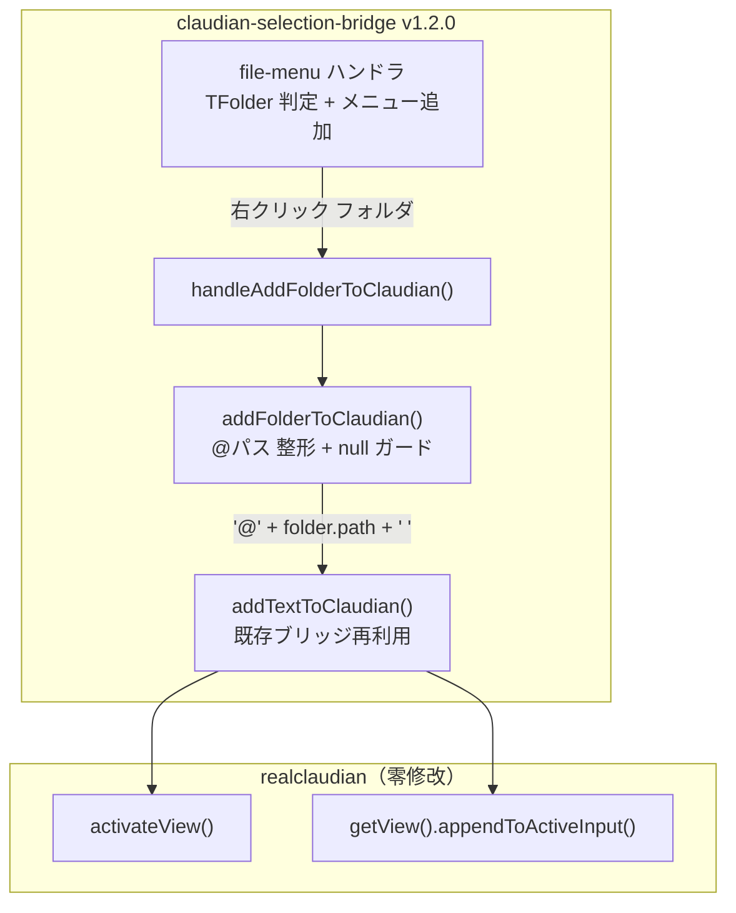

# フォルダ対応「Add to Claudian」設計書（Claudian Selection Bridge v1.2.0）

> 📂 路径：`docs/superpowers/specs/2026-08-09-claudian-selection-bridge-folder-support-design.md`
> 📍 目标插件：`.obsidian/plugins/claudian-selection-bridge/`
> 📍 关联插件：`.obsidian/plugins/realclaudian/`（==零修改==）
> 📍 前作规格：[[2026-08-04-claudian-selection-popup-design]]

---

## 一、背景与目标

### 1.1 用户需求

> **「Add to Claudian」はフォルダに対しても有効にしてほしい**

文件管理器（File Explorer）中右键**文件夹**时，应显示「Add to Claudian」菜单项，点击后将文件夹以 `@フォルダパス ` 形式插入 Claudian 聊天输入框 —— 与既有**文件**行为完全一致。

### 1.2 现状分析

| 现有资产 | 状态 | 说明 |
|------|------|------|
| realclaudian 文件菜单「Add to Claudian」 | ✅ TFile のみ | `bSe()` 内 `n instanceof Wx.TFile`，フォルダ除外 |
| 用户既有 TFolder 补丁（2026-08-04） | ❌ 已丢失 | realclaudian 08-06 更新で main.js 上書き |
| 备份 `main.js.bak_v2.0.41` | ✅ 存在 | プリスティン版（パッチ未適用） |
| claudian-selection-bridge（補助プラグイン） | ✅ v1.1.0 | `addTextToClaudian()` ブリッジ完備、realclaudian 零修改設計 |

### 1.3 メンション解決の確認（重要）

realclaudian の送信時メンション解析（`zD` / `aK` / `jyt` 関数）は：

- `@` が単語境界（行頭 or 空白直後）で始まるパスを解決
- フォルダ用キャッシュ `loadFolders()` が `TFolder` を収集
- 解決結果は `<context_file path="..." />` としてエージェントへ送信

→ **`@フォルダパス ` の挿入は送信時にコンテキストディレクトリとして正しく解決される** ✅

---

## 二、方案决策

| 方案 | 内容 | 判断 |
|------|------|------|
| A. 補助プラグインに実装 | claudian-selection-bridge に `file-menu` ハンドラ追加 | ✅ **采用**（用户选定） |
| B. realclaudian 直接パッチ | `bSe()` を `TFile \|\| TFolder` に拡張 | ❌ 次回更新で消失リスク |
| C. 両方対応 | ファイル＋フォルダを補助側で一本化 | ❌ realclaudian のメニューと二重化 |

**採用理由：** 前作（v1.0.0）で確立した「realclaudian 零修改」方針に沿い、Claudian のバージョンアップで機能が失われない。

---

## 三、设计详细

### 3.1 组件与数据流



### 3.2 変更ファイル

| 文件 | 動作 | 内容 |
|------|:--:|------|
| `main.js` | 変更 | `TFolder` import 追加 + `file-menu` ハンドラ登録 + `addFolderToClaudian()` / `handleAddFolderToClaudian()` 追加 |
| `manifest.json` | 変更 | version `1.1.0` → `1.2.0`、description にフォルダ対応追記 |
| `realclaudian/*` | ==未触碰== | 零修改 |
| `test/selftest.js` | 変更 | folder テスト追加（14 件） |
| `test/obsidian-stub.js` | 変更 | `TFolder` 追加 |

### 3.3 コード設計

#### import 追加

```js
const { Plugin, PluginSettingTab, Setting, Notice, setIcon, TFolder } = require('obsidian');
```

#### 插件 `onload` に登録

```js
this.registerEvent(
  this.app.workspace.on('file-menu', (menu, file) => {
    if (this.settings.enabled && file instanceof TFolder) {
      menu.addItem((item) => item
        .setTitle('Add to Claudian')
        .setIcon('message-square-plus')
        .onClick(() => this.handleAddFolderToClaudian(file)));
    }
  })
);
```

#### 新規メソッド

```js
async handleAddFolderToClaudian(folder) {
  await addFolderToClaudian(this.app, folder);
  // 成功: 明示的な Notice なし（ファイルと同一 UX、入力欄で視認可能）
  // 失敗: addFolderToClaudian → addTextToClaudian 内で Notice 表示（弹窗は関係なし）
}
```

> 実装は null ガード＋DRY のため `addFolderToClaudian(app, folder, noticeFn)` 経由に改良（plan Task 2 Step 2 準拠）。

`addTextToClaudian(app, text, noticeFn)` は既存実装を完全再利用：

- realclaudian プラグイン未ロード → `'Claudian plugin not found or not enabled.'`
- `activateView()` → `getView().appendToActiveInput(text)`
- 入力欄未就緒 → `'Claudian chat is not ready.'`
- 例外 → `'Failed to add to Claudian.'`

---

## 四、设计判断

| 項目 | 決定 | 理由 |
|------|------|------|
| 実装場所 | 補助プラグイン | realclaudian 零修改方針（用户选定） |
| 挿入形式 | `@フォルダパス ` | ファイルと同一（`LD()` と同一形式）。メンション解決でコンテキスト化 |
| 表示条件 | `settings.enabled === true` かつ `TFolder` | プラグイン無効時はメニュー非表示 |
| 設定トグル | ==追加しない== | YAGNI。要求は「有効化」のみ |
| メニュー表記 | `Add to Claudian`（英語固定） | realclaudian のファイル項目と同一 UX |
| 対象フォルダ | 全フォルダ（`.obsidian` 等含む） | ファイル側と同一挙動。過剰フィルタはしない |
| 成功 Notice | なし | ファイル挿入と同一（入力欄に反映され視認可能） |
| 競合 | なし | realclaudian は TFile のみ、本機能は TFolder のみ → 二重表示なし |

---

## 五、测试计划

### 5.1 純関数テスト（test/selftest.js に追加）

| テスト | 断言 |
|------|------|
| フォルダパス整形 | `'@' + '80_POC_Projects/foo' + ' '` → `'@80_POC_Projects/foo '` |
| パスに空白/日本語含む | `'@' + '01_需求文档' + ' '` → `'@01_需求文档 '`（エスケープ不要） |
| 末尾スラッシュ | パスは Obsidian 正規化済み（末尾 `/` なし）を前提 → そのまま連結 |

### 5.2 静的検証

```bash
node --check ".obsidian/plugins/claudian-selection-bridge/main.js"
```

### 5.3 実機 UAT

- [ ] ファイルエクスプローラでフォルダ右クリック → 「Add to Claudian」表示
- [ ] クリック → Claudian 入力欄に `@フォルダパス ` 挿入、カーソル末尾
- [ ] 送信 → エージェントがフォルダをコンテキストとして認識
- [ ] ファイル右クリック → realclaudian の項目のみ表示（二重なし）
- [ ] プラグイン無効時 → フォルダメニュー非表示
- [ ] realclaudian 無効時 → クリックで Notice、フォルダメニューは表示される

---

## 六、已知限制

| 限制 | 说明 | 缓解 |
|------|------|------|
| realclaudian 内部 API 依存 | `activateView` / `getView` / `appendToActiveInput` は既存依存のまま | 升级 realclaudian 後 grep 复核（既知の運用） |
| メンション解決は realclaudian 実装依存 | `@フォルダパス` のコンテキスト化は realclaudian の解析ロジック次第 | 実機 UAT で確認。失敗時はパスが素の文字列として残る |

---

## 七、参照文献

| # | 種別 | 参照元 |
|:--:|:----:|------|
| 1 | Vault MD | [[2026-08-04-claudian-selection-popup-design]] |
| 2 | Vault MD | `2026-08-04-claudian-selection-bridge`（plan・削除予定のため平文化） |
| 3 | Vault MD | [[00_Vault管理/_設定ファイル/2026-08-04_Claudian划词桥_実装報告.md]] |

---

*🐾 Claudian Selection Bridge v1.2.0 設計書 · 2026-08-09 · brainstorming プロセス*
