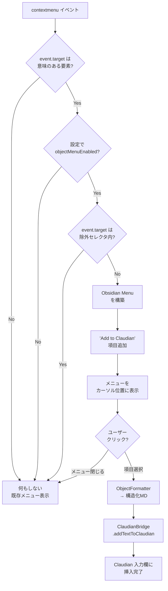

# Claudian Bridge オブジェクトコンテキストメニュー設計

> 📂 路径：docs/superpowers/specs/2026-08-11-claudian-bridge-object-context-menu-design.md
> 📍 目標プラグイン：`.obsidian/plugins/claudian-bridge/`
> 📍 関連プラグイン：`.obsidian/plugins/realclaudian/`（Claudian v2.1.2）

---

## 一、背景与目标

### 1.1 用户需求

Obsidian 標準 UI（リボンアイコン、サイドバータブ、設定項目、コマンドパレット項目など）上のオブジェクト/パーツを**右クリック**した際に、ネイティブ context menu に「Add to Claudian」項目を追加する。クリックすると、オブジェクト指定情報（名前、種類、場所、セレクタ）を**構造化マークダウン**として Claudian チャット入力欄にコピーする。

### 1.2 现状分析

| 现有资产 | 位置 | 说明 |
|---------|------|------|
| 划词 popup 「Add to Claudian」 | `claudian-bridge/main.js` `Ct()` | テキスト選択時、ボタン 2 つ（Claudian / TTS）表示 |
| ファイル menu「Add to Claudian」 | `realclaudian/main.js` `bSe()` | `workspace.on('file-menu')` で `@path ` 挿入 |
| 挿入 API `appendToActiveInput(text)` | `realclaudian` ビュー | 既存と同じ呼び出し経路を再利用 |
| Obsidian `Menu` クラス | `obsidian` モジュール | ネイティブ風メニュー構築 |

### 1.3 目标成果

- Obsidian 標準 UI 上のオブジェクトを右クリック → ネイティブ context menu に「Add to Claudian」が追加される
- クリックすると `{name, type, selector, path, context}` を含む構造化マークダウンが Claudian 入力欄に挿入される
- 設定画面 (テキスト挿入タブ) で有効/無効を切替可能

---

## 二、插件影响范围

| 项目 | 内容 |
|------|------|
| 目标插件 | `.obsidian/plugins/claudian-bridge/` |
| 改动文件 | `main.js`、`data.json` (settings)、`styles.css` (轻量微调) |
| 不改动 | `realclaudian/main.js`、Obsidian 核心 |
| minAppVersion | `1.7.2`（不变） |
| 插件版本 | `0.1.0` → `0.2.0`（次要功能追加） |

---

## 三、组件设计

| 组件 | 职责 | 关键实现 |
|------|------|---------|
| `ObjectInspector` | 要素が「意味のあるオブジェクト」か判定 | `getMeaningfulInfo(el)` 関数：aria-label / data-tooltip-position / title / role / unique id のいずれか存在すれば true |
| `ObjectContextMenu` | グローバル contextmenu 监听 + Obsidian Menu 構築 | `registerDomEvent(document, 'contextmenu', handler)`；`new Menu()` で項目追加 |
| `ObjectFormatter` | 要素情報 → 構造化マークダウン変換 | `formatObject(info)` 関数 |
| `ObjectSettings` | 設定タブへの UI 統合 | 既存 `Pe` クラスに object サブセクション追加 |

### 3.1 判定フロー



### 3.2 意味のあるオブジェクトの判定

`ObjectInspector.getMeaningfulInfo(el)` は以下の優先順位で情報を抽出:

| 優先度 | 情報源 | 例 |
|--------|--------|-----|
| 1 | `aria-label` | `.ribbon-item[aria-label="Open Claudian"]` |
| 2 | `data-tooltip-position` (Obsidian 独自) | リボン / ステータスバー要素 |
| 3 | `title` 属性 | 任意の `<button title="...">` |
| 4 | `role` が button / menuitem / tab / switch / slider 等 | `<div role="tab">` |
| 5 | `id` 属性（且つ一意） | `#vault-settings` |
| 6 | `placeholder` 属性 | 入力欄 |

6 つとも無ければ「意味なし」と判定 → 何もしない。

### 3.3 context 推論（祖先遡行）

祖先を遡って最も近い意味的コンテナを `context` として記録:

| 祖先セレクタ | context |
|--------------|---------|
| `.workspace-ribbon` | `ribbon` |
| `.workspace-sidedock` | `sidebar` |
| `.modal` | `modal` |
| `.setting-item` | `settings` |
| `.menu` | `menu` |
| `.workspace` | `workspace` |

---

## 四、数据契约

### 4.1 ObjectInfo

```typescript
type ObjectInfo = {
  name: string;          // 人間可読名（aria-label / title / textContent）
  type: string;          // 'button' | 'input' | 'menuitem' | 'tab' | 'icon' | 'element'
  selector: string;      // 一意セレクタ（getUniqueSelector で生成）
  path: string;          // 祖先を > で連結したパス
  context: string;       // ribbon / sidebar / modal / settings / menu / workspace
  attributes?: Record<string, string>;  // その他の意味的属性
};
```

### 4.2 出力フォーマット (構造化マークダウン)

**シンプル形式** (デフォルト):

```markdown
@object[button]
name: Open Claudian
type: button
context: ribbon
selector: .ribbon-item[aria-label='Open Claudian']
path: .workspace-ribbon > div > .ribbon-item-group > .ribbon-item
```

**会話形式** (オプション toggle):

```markdown
[UI要素] Open Claudian (ボタン / ribbon)
→ 場所: リボン
→ セレクタ: .ribbon-item[aria-label='Open Claudian']
```

→ 初期リリースは **シンプル形式** のみ。会話形式は将来拡張。

### 4.3 getUniqueSelector 規則

1. 要素に `id` があれば `#id` で確定
2. なければ `tag.class[aria-label="..."]` のように生成
3. 祖先で重複しない最小パスを採用（最大 5 階層）

---

## 五、设置设计

### 5.1 設定スキーマ追加

`data.json` の `selection` 配下に追加:

```json
{
  "selection": {
    "enabled": true,
    "folderEnabled": true,
    "delayMs": 300,
    "objectMenuEnabled": true,
    "objectMenuExcludeSelectors": [
      ".cb-popup",
      ".claudian-popup",
      ".menu",
      ".suggestion-container"
    ]
  }
}
```

### 5.2 設定 UI

テキスト挿入タブ (`tabSelection`) の「Selection popup」セクション**末尾**に新サブセクション「Object context menu」を追加:

| 控件 | 默认 | 说明 |
|------|------|------|
| Toggle: `objectMenuEnabled` | `true` | 右クリックメニュー機能の ON/OFF |
| Text + Add button: `objectMenuExcludeSelectors` | 4 個初期値 | 除外する CSS セレクタのリスト |

設定は即時反映（再起動不要）。

---

## 六、エラーハンドリング

| 场景 | 行动 |
|------|------|
| realclaudian 未インストール | Notice "⚠️ Claudian プラグインが見つかりません" (既存 Notice 文言と統一) |
| Claudian チャット未起動 | `activateView()` で自動起動 (既存パターン踏襲) |
| `appendToActiveInput` 失敗 | Notice "⚠️ Claudian チャットが準備できていません" |
| contextmenu 中に例外 | 静かに握り潰し、既存メニューは表示継続 (UX 優先) |

---

## 七、テスト方針

### 7.1 手動 UAT (Obsidian 実機)

- [ ] リボンアイコン「Open Claudian」を右クリック → 「Add to Claudian」表示
- [ ] 同アイコンをクリック → Claudian 入力欄に `@object[button] ...` 挿入
- [ ] 設定 OFF → 項目表示されない
- [ ] 設定 ON で除外セレクタ追加 → 該当要素では項目表示されない
- [ ] テキスト選択 popup との同時利用で干渉なし
- [ ] ファイル menu「Add to Claudian」と重複しない

### 7.2 構文チェック

- `node --check .obsidian/plugins/claudian-bridge/main.js` 毎回編集後
- DevTools Console で `registerDomEvent` リスナー登録エラーが出ていないか確認

---

## 八、既知の制限 (v1 接受)

- 動的に生成された同一セレクタの要素（リスト項目など）はパス生成が不正確になる可能性
- Shadow DOM 内の要素は対象外 (Obsidian 標準 UI に Shadow DOM はほぼ使われない)
- iframe (web viewer 等) 内は対象外

---

## 九、ファイル変更一覧

| 文件 | 変更 | サイズ見積 |
|------|------|-----------|
| `.obsidian/plugins/claudian-bridge/main.js` | 4 関数追加 + 設定 UI 1 セクション追加 | +200 行 (minify 済と仮定し、生 JS は +600 行) |
| `.obsidian/plugins/claudian-bridge/styles.css` | 必要に応じて Menu スタイル微調整 | ±20 行 |
| `.obsidian/plugins/claudian-bridge/manifest.json` | バージョン 0.1.0 → 0.2.0 | +0 行 (1 数字) |
| `.obsidian/plugins/claudian-bridge/data.json` | デフォルト値追加 | +10 行 |

---

*📅 2026-08-11 · Claudian Bridge v0.2.0 機能追加設計*