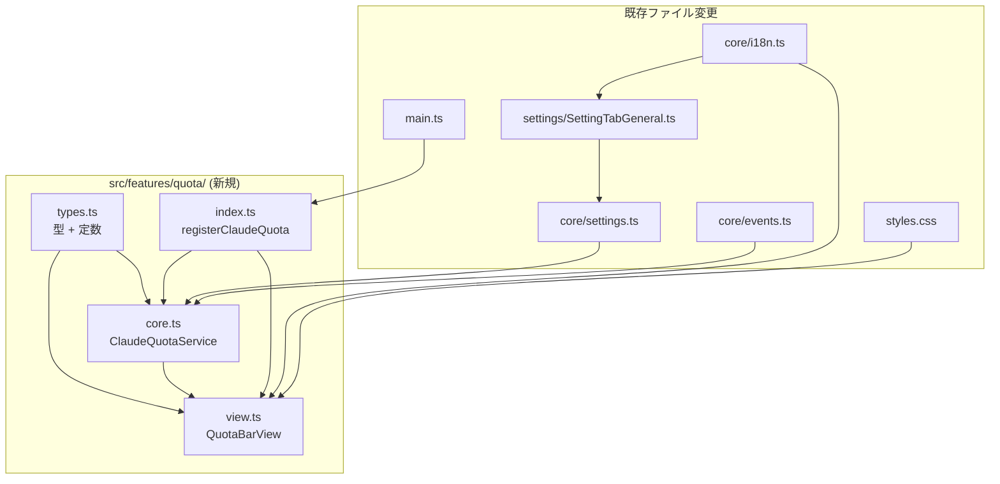
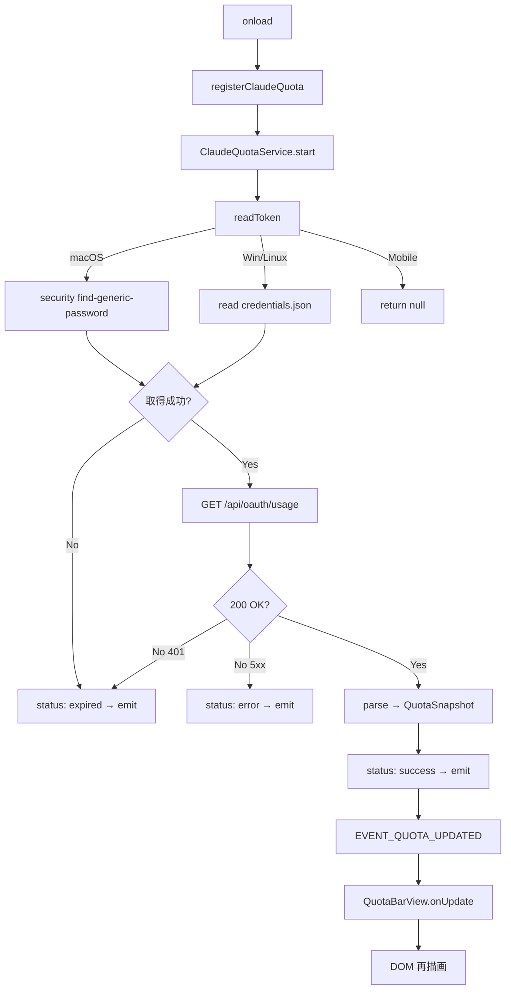
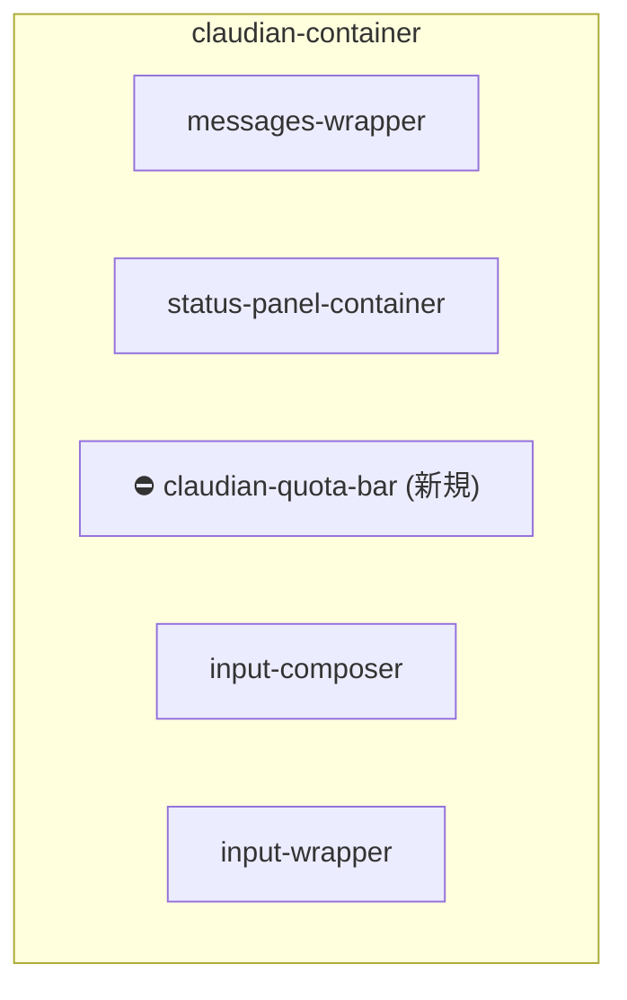

# Claudian Bridge LLM 残量検知 設計（原本）

> 📂 路径：docs/superpowers/specs/2026-08-11-claudian-quota-detection-design.md
> 📍 目標プラグイン：`.obsidian/plugins/claudian-bridge/`
> 📍 関連プラグイン：`.obsidian/plugins/realclaudian/`（Claudian v2.1.2）
> 🔗 参考実装：CC Switch v3.16.0（farion1231/cc-switch）

> ⚠️ **本ファイルは原本（Superpower brainstorming 出力）** です。
> ✅ **正規 SSOT**: `80_POC_Projects/POC_017_ClaudianBridge/02_設計文書/11_LLM残量検知設計.md`

---

## 一、背景と目標

### 1.1 ユーザーニーズ

Claudian Chat 利用中に **自分の Claude サブスクリプション残量**（5 時間ウィンドウ・7 日ウィンドウ）を即座に確認したい。CC Switch 同様、入力欄の直上にステータスバーを表示し、利用率が閾値を超えると色分けで警告する。

### 1.2 現状分析

| 既存資産 | 位置 | 説明 |
|---------|------|------|
| 設定画面 一般タブ | `claudian-bridge/src/settings/SettingTabGeneral.ts` | `renderGeneralTab` が toggle UI を提供 |
| ConfigStore | `claudian-bridge/src/core/settings.ts` | `normalizeClaudianBridgeSettings` で永続化 |
| realclaudian ビュー API | `realclaudian/main.js` | `getInputWrapper()` / `getStatusPanel()` を提供 |
| CC Switch OAuth 実装 | `cc-switch/src-tauri/src/services/subscription.rs` | `/api/oauth/usage` 呼び出しの参考実装 |

### 1.3 目標成果

- ✅ Claudian Bridge 設定「一般」タブに「Claude 残量検出」トグルが追加される
- ✅ トグル ON 時、Claudian Chat 入力欄直上にステータスバー（5h / 7d 残量 + 残時間）が表示される
- ✅ 利用率に応じて <70% 緑 / 70–89% 橙 / ≥90% 赤 で色分け表示される
- ✅ 60 秒間隔で自動更新される（ローカルカウントダウンは 60 秒ごとに再描画）
- ✅ Mobile（iOS / Android）では自動的に無効化される（デスクトップ専用機能）

### 1.4 非目標

- ❌ 複数 Claude アカウント対応（単一 OAuth セッションのみ）
- ❌ 7-day Opus / 7-day Sonnet 個別ウィンドウの常時表示
- ❌ アラート通知（閾値超過時にシステム通知を送らない）
- ❌ 過去履歴のグラフ表示

---

## 二、アーキテクチャ & データフロー

### 2.1 モジュール構成



### 2.2 データフロー



---

## 三、コンポーネント設計

### 3.1 ファイル詳細

| ファイル | 役割 | 行数目安 |
|---------|------|----------|
| `src/features/quota/types.ts` | 全型定義 + 定数 + イベント名 | ~60 |
| `src/features/quota/core.ts` | `ClaudeQuotaService` クラス | ~220 |
| `src/features/quota/view.ts` | `QuotaBarView` クラス | ~150 |
| `src/features/quota/index.ts` | 公開 API | ~50 |

### 3.2 型定義（`types.ts`）

```typescript
export interface QuotaWindow {
  utilization: number | null;
  resetsAt: string | null;
}

export interface ExtraUsage {
  isEnabled: boolean;
  utilization: number | null;
  resetsAt: string | null;
}

export interface QuotaSnapshot {
  status: QuotaStatus;
  windows: {
    fiveHour: QuotaWindow;
    sevenDay: QuotaWindow;
    sevenDayOpus?: QuotaWindow;
    sevenDaySonnet?: QuotaWindow;
  };
  extraUsage: ExtraUsage | null;
  fetchedAt: number;
  error?: string;
  tokenSource: 'keychain' | 'file' | 'none';
}

export type QuotaStatus =
  | 'idle'
  | 'fetching'
  | 'success'
  | 'expired'
  | 'error'
  | 'unsupported';

export const EVENT_QUOTA_UPDATED = 'claudian-quota-updated';
export const DEFAULT_QUOTA_REFRESH_SEC = 60;
export const QUOTA_REFRESH_MIN_SEC = 10;
export const QUOTA_REFRESH_MAX_SEC = 600;
```

### 3.3 `ClaudeQuotaService` クラス

```typescript
export class ClaudeQuotaService {
  constructor(opts: ClaudeQuotaServiceOptions);
  start(): Promise<void>;
  stop(): Promise<void>;
  forceRefresh(): Promise<QuotaSnapshot>;
  getSnapshot(): QuotaSnapshot;
  onUpdate(cb: (snap: QuotaSnapshot) => void): () => void;
}

let _instance: ClaudeQuotaService | null = null;
export function getClaudeQuotaService(): ClaudeQuotaService | null;
```

### 3.4 `QuotaBarView` クラス

```typescript
export class QuotaBarView {
  mount(anchor: HTMLElement): void;
  unmount(): void;
  render(snap: QuotaSnapshot): void;
}

export function colorFor(util: number | null): 'green' | 'orange' | 'red' | 'gray';
export function formatCountdown(resetsAt: string | null): string;
```

---

## 四、Claude OAuth Usage API

| 項目 | 値 |
|------|---|
| URL | `https://api.anthropic.com/api/oauth/usage` |
| メソッド | `GET` |
| ヘッダー | `Authorization: Bearer <accessToken>`<br/>`anthropic-beta: oauth-2025-04-20`<br/>`User-Agent: claudian-bridge/1.0` |

### 4.1 レスポンス例

```json
{
  "five_hour": {
    "utilization": 62.0,
    "resets_at": "2026-08-11T19:30:00Z"
  },
  "seven_day": {
    "utilization": 23.0,
    "resets_at": "2026-08-14T11:00:00Z"
  },
  "seven_day_opus": {
    "utilization": 5.0,
    "resets_at": "2026-08-14T11:00:00Z"
  },
  "seven_day_sonnet": null,
  "extra_usage": {
    "is_enabled": false,
    "utilization": null,
    "resets_at": null
  }
}
```

### 4.2 エラーレスポンス対応表

| HTTP ステータス | 内部 status | UI 挙動 |
|:---------------:|:-----------:|---------|
| 200 | `success` | 正常表示 |
| 401 | `expired` | 「未ログイン」表示 |
| 403 | `expired` | 同上 |
| 429 | `success`（前回値保持） | 変更なし |
| 5xx | `error` | 「取得失敗」表示 |
| タイムアウト | `error` | 同上 |
| JSON 解析失敗 | `error` | 同上 |

---

## 五、設定スキーマ & i18n

### 5.1 設定スキーマ追加

```typescript
export interface ClaudianBridgeGeneralSettings {
  enabled: boolean;
  migratedFrom: MigrationSource | null;
  migrationResetAvailable: boolean;
  quotaEnabled: boolean;        // デフォルト false
  quotaRefreshSec: number;      // デフォルト 60、範囲 10–600
}

export const DEFAULT_CLAUDIAN_BRIDGE_SETTINGS = {
  general: {
    enabled: true,
    migratedFrom: null,
    migrationResetAvailable: true,
    quotaEnabled: false,
    quotaRefreshSec: 60,
  },
};
```

### 5.2 i18n 文案（11 キー）

| key | ja | en | zh |
|-----|----|----|-----|
| `quotaEnabled` | Claude 残量検出 | Claude quota detection | Claude 残量检测 |
| `quotaEnabledDesc` | Claude Code の OAuth 利用状況を表示（デスクトップのみ） | Show Claude Code OAuth usage (desktop only) | 显示 Claude Code OAuth 使用情况（仅桌面端） |
| `quotaRefreshSec` | 更新間隔（秒） | Refresh interval (sec) | 刷新间隔（秒） |
| `quotaRefreshSecDesc` | 10〜600。0 で無効化 | 10–600 seconds. 0 disables. | 10–600 秒范围，0 表示禁用 |
| `quotaFetching` | 読み込み中… | Fetching… | 加载中… |
| `quotaNotLoggedIn` | Claude Code に未ログイン | Not logged in to Claude Code | 未登录 Claude Code |
| `quotaError` | 残量取得失敗 | Failed to fetch quota | 获取额度失败 |
| `quotaUnsupportedMobile` | デスクトップのみ | Quota detection is desktop-only | 残量检测仅在桌面端可用 |
| `quotaRefresh` | 残量を更新 | Refresh quota | 刷新额度 |
| `quotaWindow5h` | 5時間 | 5h | 5小时 |
| `quotaWindow7d` | 7日間 | 7d | 7天 |

---

## 六、UI レンダリング

### 6.1 配置



### 6.2 カラー閾値

| 範囲 | カラー | 意味 |
|------|--------|------|
| `< 70%` | 緑 `#4caf50` | 健康 |
| `70–89%` | 橙 `#ff9800` | 警告 |
| `≥ 90%` | 赤 `#f44336` | 危険 |
| `null` | 灰 `#9e9e9e` | 不明 |

### 6.3 カウントダウン書式

| 残り時間 | 表示 |
|----------|------|
| `>= 1 日` | `3d 4h` |
| `>= 1 時間` | `2h45m` |
| `< 1 時間` | `47m` |
| `負数` | `0m` |

---

## 七、エラー状態

| status | トリガー条件 | DOM 反映 | i18n key |
|--------|-------------|----------|----------|
| `idle` | 起動直後フェッチ未完了 | DOM 未マウント | — |
| `fetching` | HTTP リクエスト送信中 | 円グレー + パルスアニメ | `quotaFetching` |
| `success` | 直近成功 | 円カラー + 数値 + カウントダウン | — |
| `expired` | Token null / 401 / 403 | 円グレー + ⚠ + 「未ログイン」 | `quotaNotLoggedIn` |
| `error` | 5xx / タイムアウト / JSON 解析失敗 | 円赤 + ❌ + 「取得失敗」 | `quotaError` |
| `unsupported` | `Platform.isMobile === true` | DOM 未マウント | `quotaUnsupportedMobile` |

---

## 八、エッジケース & 互換性

| シナリオ | 処理方式 |
|----------|----------|
| realclaudian 未有効 | Service 起動するが `mount()` で getView null → 静かにスキップ |
| Chat タブ切替 | active tab 変更を検知し DOM 移動 |
| Obsidian Mobile | Service・DOM 共に起動せず、Settings にグレーアウト表示 |
| quotaEnabled トグル OFF | `stop()` + `unmount()`、DOM 即座消滅 |
| 複数 Chat タブ | 各タブが独立 View、Service はシングルトン |
| カウントダウン 0 到達 | `success` 状態維持、表示は `0m` |
| テスト環境（Token なし） | expired 状態 + 例外スロー無し |
| realclaudian バージョンアップで DOM 変更 | API → CSS クラスの二段フォールバック |
| 同時多発フェッチ | 進行中フラグで抑止 |
| `fetch` 未定義 | チェック → `error` 状態 |

---

## 九、セキュリティ設計

| # | 検証項目 | 合格条件 |
|:--:|----------|----------|
| 1 | Token が data.json に書き込まれない | grep で `accessToken` フィールド無し |
| 2 | Token が DOM / React に渡らない | DevTools Elements で "Bearer" 検索 → ヒット無し |
| 3 | HTTPS のみ | Network に `http://` → api.anthropic.com 無し |
| 4 | Token はメモリ内のみ存在 | `getSnapshot()` 戻り値に token 無し |
| 5 | 全 async 境界 try/catch | unhandled promise rejection 無し |

---

## 十、テスト戦略

### 10.1 Unit テスト

| ファイル | 対象 | ケース数 |
|----------|------|:--------:|
| `core.test.ts` | ClaudeQuotaService 全分岐 | ~12 |
| `view.test.ts` | QuotaBarView.render + 色 + カウントダウン | ~8 |
| `types.test.ts` | 型ガード関数 | ~3 |
| `index.test.ts` | registerClaudeQuota 起動 / 解除 | ~4 |

### 10.2 Integration テスト

| # | シナリオ | 検証点 |
|:--:|----------|--------|
| 1 | フルライフサイクル | onload → start → emit → render → onunload → stop |
| 2 | Settings 変更伝播 | quotaEnabled false → true で Service 自動 start |
| 3 | 複数 View 購読 | 同一 Service に 2 View、両 View DOM 更新 |
| 4 | Settings バリデーション | quotaRefreshSec 欠損 → デフォルト 60 注入 |

### 10.3 カバレッジ目標

| ファイル | 行カバレッジ | 分岐カバレッジ |
|---------|:------------:|:--------------:|
| `core.ts` | ≥ 90% | ≥ 85% |
| `view.ts` | ≥ 80% | ≥ 75% |
| `types.ts` | 100% | 100% |
| `index.ts` | ≥ 85% | ≥ 80% |

---

## 十一、受入チェックリスト

### 11.1 インストール & 設定（5 項目）

| # | 検証項目 | 合格条件 |
|:--:|----------|----------|
| 1 | Plugin ロード時エラーなし | Console error 無し |
| 2 | Settings → 一般タブに「Claude 残量検出」表示 | トグル可視・操作可 |
| 3 | トグル初期値 = OFF | 初回インストール後 false |
| 4 | トグル ON で「更新間隔（秒）」入力欄表示 | 数字入力欄可視、デフォルト 60 |
| 5 | 間隔範囲 10–600 | 境界値でクランプ動作 |

### 11.2 表示（6 項目）

| # | 検証項目 | 合格条件 |
|:--:|----------|----------|
| 6 | ON 後 realclaudian ChatView 顶部にステータスバー | DOM に `.claudian-quota-bar` 存在 |
| 7 | 利用率 <70% → 緑、70–89% → 橙、≥90% → 赤 | 目視確認 |
| 8 | カウントダウン 60 秒毎再描画 | 60s 経過で "2h45m" → "2h44m" |
| 9 | 7日間指標 hover 展開 | ホバーで表示、非ホバーで畳まれる |
| 10 | リフレッシュボタン押下で即時フェッチ | fetch 1 回発火 |
| 11 | 複数 Chat タブが独立表示 | 各タブに 1 個ずつバー |

### 11.3 エラー状態（4 項目）

| # | 検証項目 | 合格条件 |
|:--:|----------|----------|
| 12 | 未ログイン → 灰円 + 「未ログイン」 | credentials.json 削除後 expired 表示 |
| 13 | ネットワーク断 → 赤円 + 「取得失敗」 | 60s 以内に error 表示 |
| 14 | Token 期限切れ → 401 後 expired | accessToken 改竄で再現 |
| 15 | Mobile で DOM 非マウント | iOS / Android 模擬で `.claudian-quota-bar` 無し |

### 11.4 i18n & 互換性（5 項目）

| # | 検証項目 | 合格条件 |
|:--:|----------|----------|
| 16 | Obsidian 言語切替（ja / en / zh）で文言変化 | 3 言語切替検証 |
| 17 | カウントダウン数字はロケール非依存 | 全言語で "2h45m" 形式 |
| 18 | realclaudian DOM クラス変更後でもマウント可 | mock で getInputWrapper null → CSS fallback |
| 19 | 既存 feature と同時有効で競合なし | Console error 無し |
| 20 | Plugin アンロードで全リソース解放 | onunload 後 60s で fetch / console 出力なし |

### 11.5 性能 & セキュリティ

| 指標 | 目標値 |
|------|--------|
| Service 起動 → 初回 emit | < 2s |
| Bundle 増加量 | < 15KB (gzipped) |
| アイドル時メモリ | < 2MB |
| セキュリティ検証 | 5 項目全合格 |

---

## 十二、ファイル変更一覧

| 種別 | パス | 変更概要 |
|------|------|----------|
| 🆕 | `src/features/quota/types.ts` | 全型 + 定数 |
| 🆕 | `src/features/quota/core.ts` | `ClaudeQuotaService` |
| 🆕 | `src/features/quota/view.ts` | `QuotaBarView` |
| 🆕 | `src/features/quota/index.ts` | 公開 API |
| ✏️ | `src/settings/SettingTabGeneral.ts` | quota トグル + 間隔入力追加 |
| ✏️ | `src/core/settings.ts` | `general.quotaEnabled` + `quotaRefreshSec` |
| ✏️ | `src/core/i18n.ts` | 11 キー追加 |
| ✏️ | `src/core/events.ts` | `EVENT_QUOTA_UPDATED` 定数追加 |
| ✏️ | `src/main.ts` | `onload` で `registerClaudeQuota` |
| ✏️ | `styles.css` | `.claudian-quota-bar` スタイル追加 |
| 🆕 | `tests/features/quota/*.test.ts` | 4 ファイル新規 |
| ✏️ | `tests/mocks/obsidian.ts` | mock 拡張 |

**合計**：新規 8 + 修正 7 = 15 ファイル

---

## 十三、既知の制限

| 制限 | 理由 | 将来の対応案 |
|------|------|--------------|
| 単一 Claude アカウントのみ | OAuth トークン保存先が単一 | v2 でマルチアカウント対応検討 |
| Mobile プラットフォーム非対応 | Keychain / ファイルアクセス不可 | ブラウザ OAuth + Web API 検討 |
| 7d_opus / 7d_sonnet 個別表示なし | API レスポンスに含むが UI 枠未確定 | 利用統計取ってから判断 |
| カウントダウン 60 秒粒度 | サーバー再フェッチ間隔と同じ | 30 秒に短縮可能だが CPU 負荷増 |
| アラート通知機能なし | ステータスバー色変化のみ | デスクトップ通知プラグイン統合は別タスク |

---

*🎯 Claudian Bridge LLM 残量検知 設計原本 v1.0.0 · MiuMiu 🐾 · 2026-08-11*