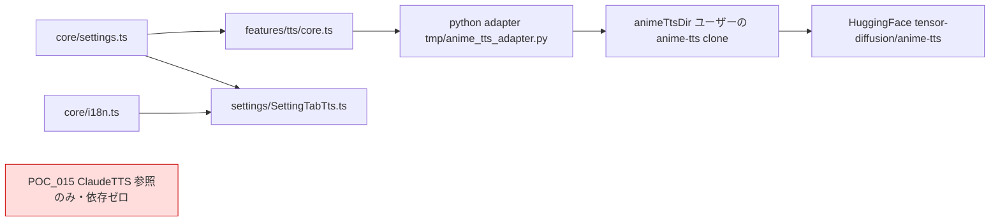
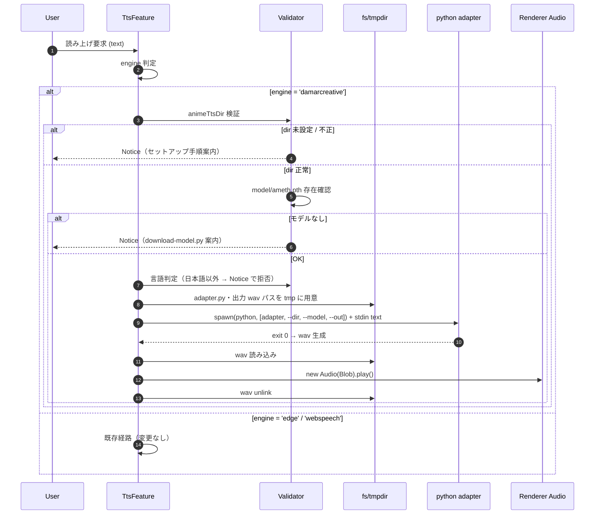

# 🎙️ POC_017 Claudian Bridge — anime-tts (Damarcreative) エンジン追加設計

> 📂 路径：`80_POC_Projects/POC_017_ClaudianBridge/02_設計文書/_superpowers原本/2026-08-13-tts-anime-tts-addition-design.md`
> 📍 関連プロジェクト：[[80_POC_Projects/POC_017_ClaudianBridge/README]]
> 📍 上流リポジトリ：[Damarcreative/anime-tts](https://github.com/Damarcreative/anime-tts)
> 📍 前版設計：[[2026-08-13-tts-settings-simplification-design]]（v0.6.0）

---

## 📑 目次

1. [[#1. 概要|概要]]
2. [[#2. 動機・背景|動機・背景]]
3. [[#3. 目標・非目標|目標・非目標]]
4. [[#4. アーキテクチャ|アーキテクチャ]]
5. [[#5. データモデル|データモデル]]
6. [[#6. 実行フロー|実行フロー]]
7. [[#7. UI 設計|UI 設計]]
8. [[#8. エラー処理|エラー処理]]
9. [[#9. ユーザーセットアップ手順|ユーザーセットアップ手順]]
10. [[#10. テスト方針|テスト方針]]
11. [[#11. 影響範囲|影響範囲]]
12. [[#12. チェックリスト|チェックリスト]]

---

## 1. 概要

POC_017 Claudian Bridge の「テキスト読み上げ」に、第 3 のエンジンとして **[Damarcreative/anime-tts](https://github.com/Damarcreative/anime-tts)**（VITS ベース・日本語専用・アニメ声 38 モデル・完全ローカル）を追加する。

ユーザー承認済みの方針：

| 方針 | 内容 |
|------|------|
| セットアップ | **オプショナル・手動**（プラグインは自動インストールしない） |
| 新規設定項目 | **`animeTtsDir` 1 項目のみ** |
| UI 配置 | エンジン選択と同列（damarcreative 選択時のみ表示） |
| データ移行 | **不要**（既存キーは不変、新規キーは defaults で補完） |

バージョンは manifest `0.6.0 → 0.7.0`。

---

## 2. 動機・背景

### 2.1 目的

- edge-TTS（クラウド高品質）・WebSpeech（ブラウザ標準）に加え、**オフラインで動作するアニメ声 TTS** を選択肢として提供する
- ユーザーの主要用途は日本語読み上げであり、anime-tts の「日本語専用」制約は実用上許容できる

### 2.2 上流リポジトリ調査結果（実装前提事実）

| # | 調査項目 | 結果 | 設計への影響 |
|:-:|----------|------|--------------|
| F1 | `main.py` の形式 | **argparse を持たないノートブック式スクリプト**。Colab パス（`/content/drive/MyDrive/vit/...`）直書き | **直接 spawn 不可** → プラグイン側にアダプタスクリプトを用意（§4.3） |
| F2 | モデル取得 | `download-model.py` が HuggingFace `tensor-diffusion/anime-tts` から **38 個の `.pth`** を `./model/` に保存 | モデルはユーザーが手動ダウンロード（§9） |
| F3 | 依存パッケージ | `torch==1.13.1`, `librosa==0.9.1`, `pyopenjtalk` 等（計 2〜3GB） | 自動インストール非現実 → **手動セットアップ**（承認済み） |
| F4 | 対応言語 | **日本語のみ**（pyopenjtalk 音素化） | zh/en テキストはエラー通知（§8 E7） |
| F5 | 出力 | 推論結果を `output.wav`（working directory）に書き出す | アダプタは `--out` で一時ファイルに出力 → プラグインが再生 |
| F6 | 設定ファイル | `configs/config-single-speaker.json` を参照 | アダプタは `<animeTtsDir>/configs/config-single-speaker.json` を既定とする |

### 2.3 リスク評価（承認時に提示済み）

| リスク | 内容 | 対応 |
|--------|------|------|
| R1 | 上流は 14 スターの個人 fork、メンテナンス性低 | オプショナル扱い・コア機能と疎結合 |
| R2 | torch 1.13.1 固定・Python 3.11+ ではビルド困難な可能性 | セットアップ手順で Python 3.10 推奨を明記（§9） |
| R3 | 依存 2〜3GB をプラグインに同梱不可 | 同梱しない（手動セットアップ） |

---

## 3. 目標・非目標

### 3.1 目標（Goals）

- **G1**: `tts.engine` に `'damarcreative'` を追加し、edge / webspeech と同列に選択可能にする
- **G2**: 新規設定は `tts.animeTtsDir`（オプション・空文字既定）**1 項目のみ**
- **G3**: Python アダプタはプラグイン本体（main.js）に埋め込み、実行時に一時ファイルへ書き出して spawn する（**モデル・Python 環境は同梱しない**）
- **G4**: POC_015 ClaudeTTS とのコード・import 共有は引き続き**ゼロ**
- **G5**: 未セットアップ時はエラーではなく**セットアップ手順を案内する Notice** で graceful に終了する

### 3.2 非目標（Non-Goals）

- Python 環境・依存パッケージ・モデルの自動インストール
- 38 モデルの音色選択 UI（v0.7.0 は既定モデル `ameth.pth` 固定。将来タスク）
- zh / en テキストの damarcreative 読み上げ（上流が日本語専用のため不可）
- 既存 data.json のマイグレーション（新規キーは defaults 補完のみ）
- Web SpeechSynthesis・edge-TTS 経路の変更

---

## 4. アーキテクチャ

### 4.1 コンポーネントと責務

| ファイル | 責務 | 変更 |
|----------|------|:----:|
| `src/core/settings.ts` | `TtsEngine` union に `'damarcreative'` 追加、`TtsSettings.animeTtsDir?: string` 追加、validate 更新 | 🔧 |
| `src/features/tts/core.ts` | `damarcreativeSpeak()` 新規追加（アダプタ埋め込み・spawn・wav 再生）、dispatcher に 3 番目の分岐 | 🔧 |
| `src/settings/SettingTabTts.ts` | エンジン dropdown を 3 択化、damarcreative 選択時に animeTtsDir 入力＋案内＋テストボタンを表示 | 🔧 |
| `src/core/i18n.ts` | `ttsEngineDamarcreative`・`ttsAnimeTtsDir*` 等を ja/zh/en に追加 | 🔧 |
| `src/manifest.json` | version 0.6.0 → 0.7.0 | 🔧 |

### 4.2 依存方向



**POC_017 → POC_015 の import 矢印は存在しない**（v0.6.0 からの不変条件を維持）。

### 4.3 アダプタスクリプト方式（重要設計判断）

調査結果 F1 により、上流 `main.py` は CLI 引数を受け付けない。よって：

| 項目 | 方式 |
|------|------|
| 配置 | TypeScript 文字列定数 `ANIME_TTS_ADAPTER_PY` として `features/tts/core.ts`（または `adapter-py.ts`）に埋め込み、esbuild で main.js に同梱 |
| 展開 | 実行時に `os.tmpdir()/anime_tts_adapter.py` へ書き出し（既存があれば上書き） |
| 呼出 | `spawn(python, [adapterPath, '--dir', animeTtsDir, '--model', model, '--out', wavPath])`、テキストは **stdin** 経由 |
| 動作 | `sys.path.insert(0, --dir)` → 上流 `models.py` / `utils.py` を import → 推論 → `--out` に wav 書き出し |

アダプタ骨格（上流 `main.py` の推論フローを踏襲し、Colab パスを引数化）：

```python
import argparse, os, sys
p = argparse.ArgumentParser()
p.add_argument('--dir', required=True)
p.add_argument('--model', default='ameth.pth')
p.add_argument('--config', default='configs/config-single-speaker.json')
p.add_argument('--out', required=True)
a = p.parse_args()
sys.path.insert(0, a.dir)
os.chdir(a.dir)
text = sys.stdin.read()
# hps 読込 → SynthesizerTrn 構築 → load_checkpoint(model/ameth.pth)
# text_to_sequence → net_g.infer → scipy.io.wavfile.write(a.out, ...)
```

### 4.4 wav 再生方式

edge 経路は POC_015 側が再生まで行うが、damarcreative 経路はプラグイン自身が再生する：

| 項目 | 方式 |
|------|------|
| 再生 | wav バイトを読み込み、`new Audio(URL.createObjectURL(new Blob([bytes])))` で再生（Obsidian = Electron レンダラのため追加プロセス不要） |
| 一時ファイル | 再生完了後（`onended` / `onerror`）に wav・adapter を削除せず tmp 任せ（OS が掃除）。**追記：wav は再生後に unlink する** |

---

## 5. データモデル

### 5.1 スキーマ差分（v0.6.0 → v0.7.0）

```typescript
// Before (v0.6.0)
type TtsEngine = 'edge' | 'webspeech'

// After (v0.7.0)
type TtsEngine = 'edge' | 'webspeech' | 'damarcreative'

interface TtsSettings {
  enabled: boolean
  engine: TtsEngine
  voices: {
    edge:      EngineVoices
    webspeech: EngineVoices
  }
  animeTtsDir?: string   // ← 新規・オプション。空文字/undefined = 未セットアップ
}
```

### 5.2 フィールド移行表

| フィールド | 旧 | 新 | 移行時動作 |
|:----------:|:--:|:--:|-----------|
| `tts.engine` | `'edge' \| 'webspeech'` | `+ 'damarcreative'` | 既存値維持。validate の許容リストに追加 |
| `tts.animeTtsDir` | なし | `''`（既定） | normalize が `undefined → ''` で補完。**Notice・saveData を伴う移行は実施しない** |
| `tts.enabled` / `tts.voices.*` | 変更なし | 変更なし | 維持 |

### 5.3 既定モデル定数

| 定数 | 値 | 根拠 |
|------|------|------|
| `DAMARCREATIVE_DEFAULT_MODEL` | `'ameth.pth'` | 上流 `main.py` が使用するサンプルモデル |
| `DAMARCREATIVE_DEFAULT_CONFIG` | `'configs/config-single-speaker.json'` | 上流 `main.py` が参照する設定 |

---

## 6. 実行フロー



### 6.1 Python 実行ファイル解決順

| 順 | 候補 | 備考 |
|:--:|------|------|
| 1 | `py` | Windows Python Launcher（本環境の主経路） |
| 2 | `python3` | macOS / Linux |
| 3 | `python` | 汎用フォールバック |

---

## 7. UI 設計

### 7.1 タブ「テキスト読み上げ」差分

| 領域 | v0.6.0 | v0.7.0 |
|------|--------|--------|
| エンジン dropdown | edge-TTS / WebSpeech の 2 択 | **+ anime-tts (Damarcreative) の 3 択** |
| 音色 dropdown × 3 | 常時表示（選択エンジンに従属） | damarcreative 選択時は**非表示**（音色選択は将来タスク） |
| animeTtsDir 入力 | なし | **damarcreative 選択時のみ表示**：テキスト入力＋説明文（セットアップ手順リンク）＋ ▶ テストボタン |
| minimax 削除注意文 | 表示 | 維持 |

### 7.2 damarcreative 選択時の UI 構成

```typescript
if (cfg.tts.engine === 'damarcreative') {
  new Setting(containerEl)
    .setName(t('ttsAnimeTtsDir'))            // '📁 anime-tts ディレクトリ'
    .setDesc(t('ttsAnimeTtsDirDesc'))        // 'git clone した anime-tts のパス。日本語のみ・要手動セットアップ'
    .addText((tx) => tx
      .setPlaceholder('D:\\tools\\anime-tts')
      .setValue(cfg.tts.animeTtsDir ?? '')
      .onChange(async (v) => { cfg.tts.animeTtsDir = v.trim(); await save(); }));

  new Setting(containerEl)
    .setName(t('ttsAnimeTtsTest'))           // '▶ テスト読み上げ（日本語）'
    .setDesc(t('ttsAnimeTtsTestDesc'))       // '未セットアップ時は案内 Notice が出ます'
    .addButton((b) => b.setButtonText('▶')
      .onClick(() => this.plugin.ttsFeature.addTextToTTS(SAMPLE_TEXT.ja)));
}
```

---

## 8. エラー処理

| # | シナリオ | 期待挙動 | 影響度 |
|:-:|----------|----------|:------:|
| E1 | `animeTtsDir` 空 / undefined | Notice「anime-tts は手動セットアップが必要です」（手順概要＋設定画面誘導）、**false 返却・spawn しない** | 🟢 低 |
| E2 | `animeTtsDir` が存在しない / `models.py` 不在 | Notice「ディレクトリが anime-tts の clone ではありません」 | 🟢 低 |
| E3 | `model/ameth.pth` 不在 | Notice「モデルがありません。`python download-model.py` を実行してください」 | 🟢 低 |
| E4 | python 未検出（py / python3 / python 全滅） | Notice「Python が見つかりません」 | 🟡 中 |
| E5 | 依存不足（adapter が ImportError で exit≠0） | stderr 末尾を保持し Notice「依存パッケージ不足の可能性。`pip install -r requirements.txt`」 | 🟡 中 |
| E6 | 推論失敗（exit≠0、ImportError 以外） | Notice「anime-tts 失敗 (exit N)」＋ stderr 末尾を console.error | 🟡 中 |
| E7 | zh / en テキストを damarcreative で読み上げ | Notice「anime-tts は日本語のみ対応」、false 返却 | 🟢 低 |
| E8 | spawn 自体が error イベント | edge 経路と同型のハンドリング（false ＋ Notice） | 🟢 低 |
| E9 | wav 生成されず exit 0 | ファイル存在確認で検出 → Notice「音声生成に失敗しました」 | 🟢 低 |

---

## 9. ユーザーセットアップ手順

設定画面の説明文および Notice から参照する手順（ドキュメントは [[80_POC_Projects/POC_017_ClaudianBridge/03_開発文書/_環境配置/]] に配置予定）：

```bash
# 1. clone（例: D:\tools）
git clone https://github.com/Damarcreative/anime-tts.git
cd anime-tts

# 2. Python 仮想環境（Python 3.10 推奨: torch 1.13.1 / librosa 0.9.1 の互換性のため）
py -3.10 -m venv .venv
.venv\Scripts\activate

# 3. 依存インストール（2〜3GB・時間注意）
pip install -r requirements.txt

# 4. モデルダウンロード（38 モデル全量、または必要なものだけ ./model/ に配置）
python download-model.py

# 5. monotonic_align のビルド（上流 VITS 手順に従う）
cd monotonic_align && python setup.py build_ext --inplace && cd ..
```

| 注意 | 内容 |
|------|------|
| 容量 | 依存 2〜3GB ＋ モデル（1 個あたり数百 MB × 38） |
| 言語 | 日本語テキストのみ読み上げ可能 |
| プラグイン側設定 | 上記 clone 先パスを `animeTtsDir` に入力するだけ |

---

## 10. テスト方針

### 10.1 単体テスト（Vitest・既存 315 件に追加）

| ID | シナリオ | 期待結果 |
|:--:|----------|----------|
| **TC-A01** | defaults に `animeTtsDir: ''` が存在 | 型・値ともに補完される |
| **TC-A02** | validate が `'damarcreative'` を許容 | engine 不正値扱いされない |
| **TC-A03** | `animeTtsDir` 未設定で `addTextToTTS` | spawn されず false＋案内 Notice（E1） |
| **TC-A04** | dir 正常・spawn 成功 | 引数 `[adapter, '--dir', dir, '--model', 'ameth.pth', '--out', ...]`・stdin にテキスト |
| **TC-A05** | spawn exit≠0 | false＋Notice（E6） |
| **TC-A06** | zh テキストを damarcreative で | spawn されず false＋日本語限定 Notice（E7） |
| **TC-A07** | i18n：`ttsEngineDamarcreative` / `ttsAnimeTtsDir*` が ja/zh/en に存在 | 全言語で非空 |

### 10.2 手動 UAT（実機）

| ID | 確認項目 |
|:--:|----------|
| **UAT-1** | エンジン dropdown が 3 択表示 |
| **UAT-2** | damarcreative 選択で音色行が消え、animeTtsDir 入力が出る |
| **UAT-3** | 未セットアップで ▶ テスト → 案内 Notice（クラッシュしない） |
| **UAT-4** | セットアップ済み環境で日本語テキスト読み上げ成功 |

---

## 11. 影響範囲

### 11.1 変更対象ファイル一覧

| 区分 | パス | 変更種別 |
|:----:|------|:--------:|
| 🔧 実装 | `D:\AI-Agent\ClaudianBridge\src\core\settings.ts` | engine union・animeTtsDir |
| 🔧 実装 | `D:\AI-Agent\ClaudianBridge\src\features\tts\core.ts` | damarcreativeSpeak・adapter 埋め込み |
| 🔧 実装 | `D:\AI-Agent\ClaudianBridge\src\settings\SettingTabTts.ts` | 3 択化・条件表示 |
| 🔧 実装 | `D:\AI-Agent\ClaudianBridge\src\core\i18n.ts` | 新規キー（ja/zh/en） |
| 🔧 実装 | `D:\AI-Agent\ClaudianBridge\src\manifest.json` | 0.7.0 |
| 🔧 テスト | `tests/features/tts/core.test.ts` ほか | TC-A01〜A07 |
| 📘 設計書 | [[80_POC_Projects/POC_017_ClaudianBridge/02_設計文書/05_設定画面設計]] | タブ項目表に damarcreative 行追加 |
| 📘 設計書 | [[80_POC_Projects/POC_017_ClaudianBridge/02_設計文書/01_クラス設計]] | tts ブロック更新 |
| 📘 要件 | [[80_POC_Projects/POC_017_ClaudianBridge/01_要件定義/01_機能要件]] | F002 更新 |
| 📘 環境 | `80_POC_Projects/POC_017_ClaudianBridge/03_開発文書/_環境配置/` | anime-tts セットアップ手順書（新規） |
| 📘 CHANGELOG | [[80_POC_Projects/POC_017_ClaudianBridge/CHANGELOG]] | v0.7.0 エントリ |

### 11.2 触らないファイル

- `80_POC_Projects/POC_015_ClaudeTTS/**`（**全ファイル**）
- `tts.voices.*`・edge / webspeech 経路の実装
- `quota.*` 等 TTS 無関係の設定

---

## 12. チェックリスト

```markdown
- [ ] POC_015 のコードを一切 import していない（grep で確認）
- [ ] engine union が 'edge' | 'webspeech' | 'damarcreative' の 3 択
- [ ] animeTtsDir 未設定時に spawn せず案内 Notice が出る
- [ ] adapter が tmp に展開され、--dir/--model/--out 引数で spawn される
- [ ] モデル不在時に download-model.py を案内する Notice が出る
- [ ] zh/en テキストが damarcreative では拒否される
- [ ] damarcreative 選択時に音色 dropdown が非表示になる
- [ ] 新規 i18n キーが ja/zh/en の 3 言語で定義されている
- [ ] vitest 全件グリーン（既存 315 + 新規）
- [ ] モデル・Python 環境・依存をプラグインに同梱していない
- [ ] 関連ドキュメント 5 本（設定画面設計・クラス設計・機能要件・環境配置・CHANGELOG）が同期されている
```

---

## 📚 参照文献

| # | 種別 | 参照元 |
|:-:|------|--------|
| 1 | Web | https://github.com/Damarcreative/anime-tts |
| 2 | Web | https://raw.githubusercontent.com/Damarcreative/anime-tts/main/main.py |
| 3 | Web | https://raw.githubusercontent.com/Damarcreative/anime-tts/main/download-model.py |
| 4 | Web | https://raw.githubusercontent.com/Damarcreative/anime-tts/main/requirements.txt |
| 5 | Web | https://huggingface.co/tensor-diffusion/anime-tts |
| 6 | Web | https://github.com/jaywalnut310/vits （上流 VITS） |
| 7 | Vault MD | [[2026-08-13-tts-settings-simplification-design]]（v0.6.0 設計） |
| 8 | Vault MD | [[80_POC_Projects/POC_017_ClaudianBridge/02_設計文書/05_設定画面設計]] |
| 9 | LLM | Claude Sonnet 4.5 (claude.ai/code) |

---

## 📝 更新履歴

| バージョン | 日付 | 修正内容 | 修正者 |
|:----:|------|---------|--------|
| v1.0.0 | 2026-08-13 | 初版（承認済み設計を文書化） | MiuMiu 🐾 |
