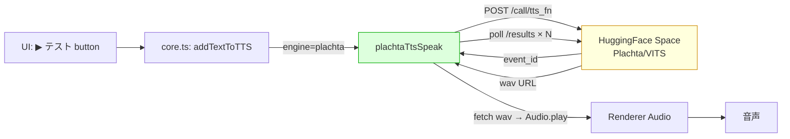
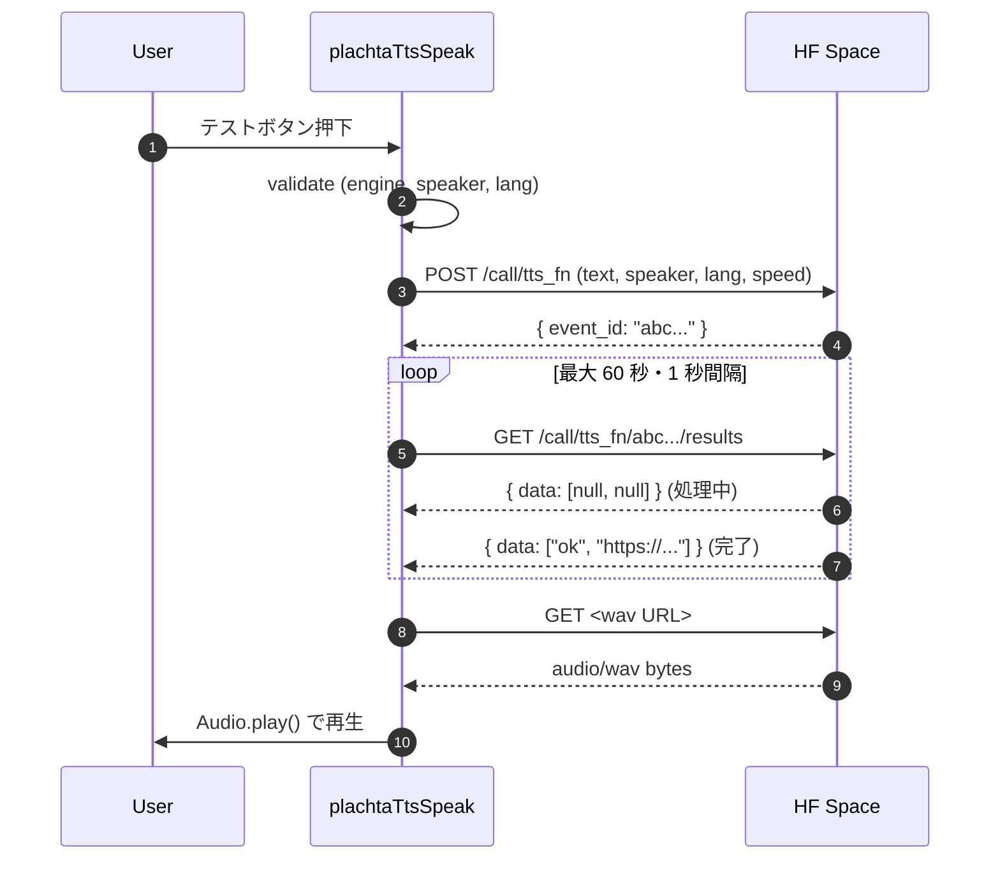

# ☁️ POC_017 Claudian Bridge — TTS Plachta Cloud エンジン置換設計

> 📂 路径：`80_POC_Projects/POC_017_ClaudianBridge/02_設計文書/_superpowers原本/2026-08-13-tts-plachta-cloud-design.md`
> 📍 関連プロジェクト：[[80_POC_Projects/POC_017_ClaudianBridge/README]]
> 📍 先行設計：[[2026-08-13-tts-anime-tts-addition-design]]（v0.7.0 で採用・今回置換）
> 📍 Space: https://huggingface.co/spaces/Plachta/VITS-Umamusume-voice-synthesizer

---

## 📑 目次

1. [概要](#概要)
2. [動機・背景](#動機背景)
3. [目標・非目標](#目標非目標)
4. [アーキテクチャ](#アーキテクチャ)
5. [コンポーネント](#コンポーネント)
6. [データモデル](#データモデル)
7. [実行フロー](#実行フロー)
8. [UI 設計](#ui-設計)
9. [エラー処理](#エラー処理)
10. [テスト方針](#テスト方針)
11. [影響範囲](#影響範囲)
12. [チェックリスト](#チェックリスト)

---

## 1. 概要

POC_017 Claudian Bridge の TTS で採用した **Damarcreative/anime-tts（VITS ローカル推論）を完全削除**し、**Plachta/VITS-Umamusume-voice-synthesizer（HuggingFace Space のクラウド API）に置換**する。

### 置換理由（v0.7.0 ローカル実装で実証した課題）

| # | 問題 | 根本原因 |
|:--:|------|------|
| RC1〜RC6 | `.venv` 構築・`.cuda()` 削除・import 修正など多数バグ | ローカル依存（torch 2〜3GB）が複雑 |
| RC7 | stdin デッドロック（Electron renderer の spawn 環境） | `spawn` + `stdin.write` の相性 |
| RC8 | numba DEBUG ログが stderr を 322KB 埋め、64KB pipe buffer 詰まり | `spawn.stderr` の pipe buffer 上限 |

Iron Law「3回以上の修正で毎回新問題が出る」 → クラウド化により **spawn 依存を完全に排除**。

### 採用方針（ご主人様承認済み）

| 方針 | 内容 |
|------|------|
| ローカル anime-tts | **完全削除**（エンジン dropdown から外す） |
| 通信方式 | **HTTP 直接 + ポーリング**（`gradio_client` 不要、依存追加ゼロ） |
| キャラクター選択 | 3 言語 × 3 ジャンルの **9 プリセット + カスタム 200 種** |
| 言語判定 | 既存 `pickWebSpeechLang` と同じ仕組み（ひらがな/カタカナ/CJK/ラテン） |

バージョンは manifest `0.7.x → 0.8.0`（minor bump: 機能置換）。

---

## 2. 動機・背景

### 2.1 ユーザー承認済み動機

- ローカル anime-tts は「理論上動く（CLI で 3 秒で wav 生成成功）」が、**Obsidian/Electron の spawn 環境と相性問題が多発**し、ご主人様に何度も再起動・再読込・ボタン押し・確認を強いた
- Plachta Space は **200 種以上のキャラクター**（ウマ娘・原神・サノバウィッチ等）＋ **多言語対応** を提供しており、ローカルの「ameth.pth 1 個・日本語のみ」をはるかに凌駕
- API は **Gradio 標準 HTTP** で公開されているため、Python クライアント不要・依存追加 0KB

### 2.2 リスク評価

| リスク | 内容 | 対応 |
|------|------|------|
| R1 | HuggingFace Space の可用性（ダウン・スリープ） | poll タイムアウト 60 秒 + 明確な Notice |
| R2 | コールドスタート遅延（p50=4.1秒, p90=11.4秒） | Notice で「生成中…」を案内 |
| R3 | テキスト長が長いと生成失敗 | 文字数チェック（1000 文字超で警告） |
| R4 | API 仕様変更（パラメータ名変更等） | 設計 §11 で影響範囲を限定・settings と adapter を分離 |

---

## 3. 目標・非目標

### 3.1 目標（Goals）

- **G1**: ローカル anime-tts（`damarcreative` エンジン）を完全削除し、`'plachta'` に置換
- **G2**: **Python 依存ゼロ・spawn 依存ゼロ**でクラウド API 呼び出し
- **G3**: 200 種以上のキャラクターから **プリセット + カスタム** で選択可能
- **G4**: 既存の edge / webspeech 経路は不変（リグレッションなし）
- **G5**: オフライン時・API 障害時は Notice で graceful に案内

### 3.2 非目標（Non-Goals）

- Python ヘルパースクリプト（`_plachta_tts.py` 等）の追加 → 採用しない
- 1 つのキャラクター内での multi-speaker 切替（将来タスク）
- Plachta Space の `/to_symbol_fn` 系エンドポイント対応（`/tts_fn` のみで十分）
- HuggingFace Token 認証（パブリック Space のため不要）
- 既存 edge / webspeech 経路の変更

---

## 4. アーキテクチャ



### 4.2 通信シーケンス



---

## 5. コンポーネント

| ファイル | 責務 | 変更種別 |
|------|------|:---:|
| `src/core/settings.ts` | `TtsEngine` から `'damarcreative'` 削除、`'plachta'` 追加、`PlachtaSettings` 型追加 | 🔧 |
| `src/features/tts/plachta-tts.ts`（新設） | `plachtaTtsSpeak()` 実装（HTTP fetch + poll + Audio 再生） | ➕ |
| `src/features/tts/anime-tts-adapter.ts` | **削除**（TS ソース + adapter 文字列） | ➖ |
| `src/features/tts/anime-tts-adapter.test.ts` | **削除**（削除対象） | ➖ |
| `src/features/tts/core.ts` | dispatcher から `damarcreative` 分岐を削除、`plachta` 分岐を追加 | 🔧 |
| `src/features/tts/plachta-tts.test.ts`（新設） | TC-P01〜P08 の単体テスト | ➕ |
| `src/settings/SettingTabTts.ts` | エンジン dropdown を 3 択化、plachta 選択時のみ speaker/language UI 表示 | 🔧 |
| `src/core/i18n.ts` | `ttsEnginePlachta`・`ttsPlachtaSpeaker`・`ttsPlachtaLanguage` 等のキー追加（ja/zh/en） | 🔧 |
| `src/manifest.json` | version 0.7.x → 0.8.0 | 🔧 |
| `80_POC_Projects/POC_017_ClaudianBridge/CHANGELOG.md` | v0.8.0 エントリ追加（anime-tts 削除・plachta 置換） | 🔧 |
| `80_POC_Projects/POC_017_ClaudianBridge/02_設計文書/05_設定画面設計.md` | タブ項目表を 3 エンジンに | 🔧 |
| `80_POC_Projects/POC_017_ClaudianBridge/01_要件定義書/01_機能要件.md` | F002 を plachta に更新 | 🔧 |

---

## 6. データ模型

### 6.1 スキーマ差分

```typescript
// Before (v0.7.x)
type TtsEngine = 'edge' | 'webspeech' | 'damarcreative';
interface TtsSettings {
  engine: TtsEngine;
  voices: {
    edge:      { zh: string; ja: string; en: string };
    webspeech: { zh: string; ja: string; en: string };
  };
  animeTtsDir?: string;
}

// After (v0.8.0)
type TtsEngine = 'edge' | 'webspeech' | 'plachta';
interface TtsSettings {
  engine: TtsEngine;
  voices: {
    edge:      { zh: string; ja: string; en: string };
    webspeech: { zh: string; ja: string; en: string };
  };
  // Plachta 用（オプショナル・未設定時は defaults で補完）
  plachta?: {
    speaker: string;   // 200 種以上のキャラクター名（Plachta API と完全一致）
    language: '日本語' | '简体中文' | 'English' | 'Mix';
    speed: number;     // 0.5〜2.0、デフォルト 1.0
  };
  // animeTtsDir は完全削除
}
```

### 6.2 マイグレーション

| 旧 | 新 | 動作 |
|:--:|:--:|------|
| `tts.engine === 'damarcreative'` | `'plachta'` に書き換え | validate で実行 |
| `tts.animeTtsDir` | 削除 | validate で実行（読み込み時の normalize で除去） |
| `tts.plachta` | defaults で補完 | `speaker: '特别周 Special Week (Umamusume Pretty Derby)'`, `language: '日本語'`, `speed: 1` |

**Notice**: 🗑️「anime-tts (Damarcreative) は削除されました。代わりに Plachta VITS (Cloud) を利用できます」を 1 回のみ表示（既存 `ttsMigrationNotified` フラグの流用 or 新フラグ `plachtaMigrationNotified`）

---

## 7. 実行フロー

### 7.1 validate

| 順 | チェック | 失敗時 |
|:--:|------|------|
| 1 | `engine === 'plachta'` | false 返却 |
| 2 | `settings.plachta` が存在 | defaults で補完 |
| 3 | `speaker` が空文字でない | defaults で補完 |
| 4 | `language` が 4 つの enum のいずれか | defaults で補完 |
| 5 | `speed` が 0.5〜2.0 の範囲 | 1.0 でクランプ |
| 6 | `text` が空でない | false ＋ Notice |
| 7 | `text` の文字数が 1000 以下 | false ＋ Notice（生成失敗リスク） |

### 7.2 HTTP 呼び出し

```
POST https://plachta-vits-umamusume-voice-synthesizer.hf.space/call/tts_fn
Content-Type: application/json
{
  "data": [text, speaker, language, speed, false]
}
→ { "event_id": "abc..." }

GET https://plachta-vits-umamusume-voice-synthesizer.hf.space/call/tts_fn/abc.../results
→ { "data": [null, null] }          // 処理中
→ { "data": ["ok", "https://..."] } // 完了
```

### 7.3 ポーリング

- 間隔: 1 秒
- タイムアウト: 60 秒（60 回まで）
- 各 poll 後に `data[0]` が `null` ではなく、かつ `data[1]` が wav URL なら完了
- テキストが空文字で開始・スペースのみなどはバリデーションで先に弾く

### 7.4 音声再生

```typescript
const audio = new Audio();
audio.src = URL.createObjectURL(new Blob([wavBytes], { type: 'audio/wav' }));
audio.onended = () => resolve(true);
audio.onerror = () => resolve(false);
audio.play();
```

---

## 8. UI 設計

### 8.1 タブ「テキスト読み上げ」

| 領域 | v0.7.x | v0.8.0 |
|------|--------|--------|
| エンジン dropdown | 4 択（edge-TTS / WebSpeech / anime-tts） | **3 択（edge-TTS / WebSpeech / Plachta VITS）** |
| 音色 dropdown × 3 | 常時表示 | edge / webspeech 選択時のみ表示 |
| **plachta 専用 UI** | なし | plachta 選択時のみ表示：プリセット 9 個 + カスタム dropdown + language dropdown + speed slider |
| minimax 削除注意文 | 表示 | 維持 |

### 8.2 plachta 選択時の UI 構成

```
▼ テキスト読み上げ
  ◯ 機能 ON/OFF

  [エンジン]
  [Plachta VITS (Umamusume Pretty Derby)        ▼]   ← dropdown

  ▼ Plachta 専用設定 (plachta 選択時のみ表示)
    キャラクター選 クイック選択（9 プリセット）
    [🐴 ウマ娘・日本語 (特別周)        ▼]   ← プリセット dropdown
       ※ これを選ぶと speaker/language/speed が自動セット

    キャラクター選 詳細（カスタム）
    [dropdown: 200 種から自由選択]

    言語: [日本語 ▼]
    速度: [━━●━━] 1.0
    ▶ テスト読み上げ（日本語）
```

### 8.3 プリセット一覧（9 個）

| プリセット | speaker | language |
|------|------|------|
| 🐴 ウマ娘・日本語 | 特别周 Special Week | 日本語 |
| 🐴 ウマ娘・中文 | 特别周 Special Week | 简体中文 |
| 🐴 ウマ娘・English | 特别周 Special Week | English |
| 🌸 原神・日本語 | 芭芭拉 Barbara | 日本語 |
| 🌸 原神・中文 | 芭芭拉 Barbara | 简体中文 |
| 🌸 原神・English | 芭芭拉 Barbara | English |
| 💜 サノバウィッチ・日本語 | 綾地 寧々 Ayachi Nene | 日本語 |
| 💜 サノバウィッチ・中文 | 綾地 寧々 Ayachi Nene | 简体中文 |
| 💜 サノバウィッチ・English | 綾地 寧々 Ayachi Nene | English |

### 8.4 i18n キー（追加）

| キー | ja | zh | en |
|------|----|----|----|
| `ttsEnginePlachta` | Plachta VITS（クラウド） | Plachta VITS（云端） | Plachta VITS (Cloud) |
| `ttsPlachtaPreset` | クイック選択 | 快速选择 | Quick Preset |
| `ttsPlachtaSpeaker` | キャラクター | 角色 | Character |
| `ttsPlachtaLanguage` | 言語 | 语言 | Language |
| `ttsPlachtaSpeed` | 速度 | 速度 | Speed |
| `ttsPlachtaTest` | ▶ テスト読み上げ（Plachta） | ▶ 测试朗读（Plachta） | ▶ Test reading (Plachta) |
| `ttsPlachtaDir` | Plachta はクラウドのためディレクトリ不要 | Plachta 是云端，无需目录 | Plachta is cloud, no dir needed |
| `ttsPlachtaOffline` | ⚠️ ネット接続を確認してください | ⚠️ 请检查网络连接 | ⚠️ Check network |
| `ttsPlachtaTimeout` | ⚠️ タイムアウト（60秒） | ⚠️ 超时（60秒） | ⚠️ Timeout (60s) |
| `ttsPlachtaSleeping` | ⚠️ HuggingFace Space がスリープ中 | ⚠️ HuggingFace Space 正在休眠 | ⚠️ HF Space sleeping |
| `ttsPlachtaTooLong` | ⚠️ テキストが長すぎます（1000 文字以下推奨） | ⚠️ 文本过长（建议 1000 字以内） | ⚠️ Text too long (1000 chars max) |
| `ttsPlachtaLangUnsupported` | ⚠️ このキャラクターは XX に対応していません | ⚠️ 该角色不支持 XX | ⚠️ Character doesn't support XX |

---

## 9. エラー処理

| # | シナリオ | 期待挙動 | Notice |
|:-:|------|------|:--:|
| E1 | `engine !== 'plachta'` | 即座に false | （この関数に来ない） |
| E2 | `text` 空 | 即座に false | 「⚠️ テキストが空です」 |
| E3 | `text` > 1000 文字 | 即座に false | 「⚠️ テキストが長すぎます」 |
| E4 | 言語とキャラクターの不一致 | 即座に false | 「⚠️ このキャラクターは XX に対応していません」 |
| E5 | ネット未接続（fetch 失敗・TypeError） | 即座に false | 「⚠️ ネット接続を確認してください」 |
| E6 | POST /call/tts_fn が HTTP 500 | 即座に false | 「⚠️ Plachta API 失敗 (HTTP 500)」 |
| E7 | poll 60 回タイムアウト | 即座に false | 「⚠️ タイムアウト（60秒）。HF Space がスリープ中」 |
| E8 | poll レスポンスが `["error", "..."]` | 即座に false | 「⚠️ Plachta API エラー: ...」 |
| E9 | wav URL が `null` or 空 | 即座に false | 「⚠️ 音声生成に失敗しました」 |
| E10 | wav fetch 失敗 | 即座に false | 「⚠️ 音声ファイル取得失敗」 |
| E11 | Audio.play() が reject | 即座に false | 「⚠️ 再生失敗: ...」 |

---

## 10. テスト方針

### 10.1 単体テスト（Vitest）

| ID | シナリオ | 期待結果 |
|:--:|------|------|
| **TC-P01** | fetch 成功: event_id 取得 → poll → wav URL → fetch → Blob | resolve(true) |
| **TC-P02** | poll が `[null, null]` を返す間ループ継続 | poll 3 回以上 |
| **TC-P03** | poll 60 回で完了しない | resolve(false) + Timeout Notice |
| **TC-P04** | POST fetch が HTTP 500 | resolve(false) + HTTP 500 Notice |
| **TC-P05** | fetch が TypeError（ネット断） | resolve(false) + Offline Notice |
| **TC-P06** | text が空 | resolve(false) + empty Notice |
| **TC-P07** | text が 1001 文字 | resolve(false) + too-long Notice |
| **TC-P08** | speaker が空文字 | defaults で補完され resolve(true) |
| **TC-P09** | speed が範囲外 | 1.0 にクランプされ resolve(true) |
| **TC-P10** | i18n: `ttsEnginePlachta` 等が ja/zh/en に存在 | 全言語で非空 |
| **TC-P11** | dispatcher: `engine === 'plachta'` → `plachtaTtsSpeak` 呼び出し | spy 確認 |

### 10.2 手動 UAT

| ID | 確認項目 |
|:--:|------|
| UAT-1 | エンジン dropdown が 3 択表示（anime-tts が消えている） |
| UAT-2 | plachta 選択時、プリセット dropdown とキャラ dropdown が出現 |
| UAT-3 | プリセット「ウマ娘・日本語」選択で日本語音声が再生 |
| UAT-4 | カスタムで「芭芭拉 Barbara」選択 → 中文で再生 |
| UAT-5 | ネット切断時に Offline Notice |
| UAT-6 | 60 秒タイムアウト時に Timeout Notice |
| UAT-7 | 既存 edge / webspeech 経路に影響なし |

---

## 11. 影響範囲

### 11.1 変更対象

| 区分 | パス | 変更種別 |
|:--:|------|:---:|
| 🔧 実装 | `D:\AI-Agent\ClaudianBridge\src\core\settings.ts` | engine union・`PlachtaSettings` |
| ➕ 実装 | `D:\AI-Agent\ClaudianBridge\src\features\tts\plachta-tts.ts` | 新規 |
| ➖ 削除 | `D:\AI-Agent\ClaudianBridge\src\features\tts\anime-tts-adapter.ts` | 削除 |
| ➖ 削除 | `D:\AI-Agent\ClaudianBridge\src\features\tts\anime-tts-adapter.test.ts` | 削除 |
| 🔧 実装 | `D:\AI-Agent\ClaudianBridge\src\features\tts\core.ts` | dispatcher 分岐 |
| ➕ テスト | `D:\AI-Agent\ClaudianBridge\src\features\tts\plachta-tts.test.ts` | 新規 |
| 🔧 実装 | `D:\AI-Agent\ClaudianBridge\src\settings\SettingTabTts.ts` | 3 択・plachta UI |
| 🔧 実装 | `D:\AI-Agent\ClaudianBridge\src\core\i18n.ts` | 新規キー 3 言語 |
| 🔧 マニフェスト | `D:\AI-Agent\ClaudianBridge\src\manifest.json` | 0.8.0 |
| 📘 CHANGELOG | [[80_POC_Projects/POC_017_ClaudianBridge/CHANGELOG]] | v0.8.0 エントリ |
| 📘 設計書 | [[80_POC_Projects/POC_017_ClaudianBridge/02_設計文書/05_設定画面設計]] | 3 エンジン化 |
| 📘 設計書 | [[80_POC_Projects/POC_017_ClaudianBridge/02_設計文書/01_クラス設計]] | tts ブロック更新 |
| 📘 要件 | [[80_POC_Projects/POC_017_ClaudianBridge/01_要件定義/01_機能要件]] | F002 更新 |
| 📘 環境 | `80_POC_Projects/POC_017_ClaudianBridge/03_開発文書/_環境配置/` | anime-tts 手順書を「（削除予定）」に注記 |

### 11.2 触らないファイル

- `80_POC_Projects/POC_015_ClaudeTTS/**`（全ファイル）
- 既存 edge / webspeech 経路の実装
- 選択 / office / quota / chroma / whitelist タブ

### 11.3 ユーザー側で確認

- `C:\Users\superlambkin\anime-tts\` ディレクトリは **ユーザーが任意で削除**（MiuMiu は削除しない）
- `C:\Users\superlambkin\anime-tts\.venv.bak_3.14_*` も同様

---

## 12. チェックリスト

```markdown
- [ ] `TtsEngine` から `'damarcreative'` 削除、`'plachta'` 追加
- [ ] `PlachtaSettings` 型が設定に追加されている
- [ ] `animeTtsDir` が settings から完全削除されている
- [ ] `anime-tts-adapter.ts` が削除されている
- [ ] `plachta-tts.ts` が新規作成され、`fetch` + poll + Audio.play を実装
- [ ] dispatcher 分岐が 3 択になっている
- [ ] エンジン dropdown の UI が 3 択表示
- [ ] plachta 選択時のみ speaker/language/speed UI が表示される
- [ ] 9 プリセット dropdown で speaker/language/speed が自動セットされる
- [ ] 200 種カスタム dropdown が機能する
- [ ] 言語不一致・空文字・1001 文字超・空ネットで Notice が出る
- [ ] poll 60 回でタイムアウト Notice が出る
- [ ] wav 取得失敗時に Notice が出る
- [ ] Audio.play() 失敗時に Notice が出る
- [ ] i18n キーが ja/zh/en で定義されている
- [ ] vitest 全件グリーン（既存 11 + 新規 11 = 22）
- [ ] 関連ドキュメント（CHANGELOG/設計書/要件書）同期
- [ ] anime-tts 手順書が「（削除）」注記付き
```

---

## 📚 参照文献

| # | 種別 | 参照元 |
|:-:|------|------|
| 1 | Web | https://huggingface.co/spaces/Plachta/VITS-Umamusume-voice-synthesizer |
| 2 | Web | https://gradio.app/guides/querying-gradio-apps-with-curl |
| 3 | Web | https://www.freddyboulton.com/blog/gradio-curl |
| 4 | Vault MD | [[2026-08-13-tts-anime-tts-addition-design]]（v0.7.0 設計・置換対象） |
| 5 | Vault MD | [[80_POC_Projects/POC_017_ClaudianBridge/README]] |

---

## 📝 更新履歴

| バージョン | 日付 | 修正内容 | 修正者 |
|:----:|------|--------|--------|
| v1.0.0 | 2026-08-13 | 初版（ご主人様承認済み設計） | MiuMiu 🐾 |