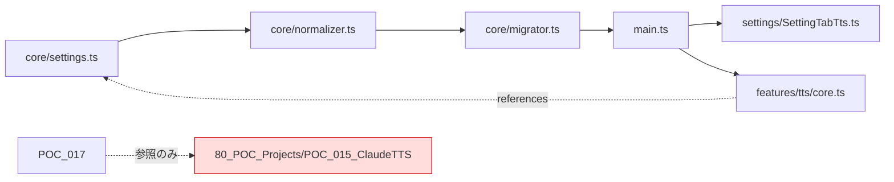
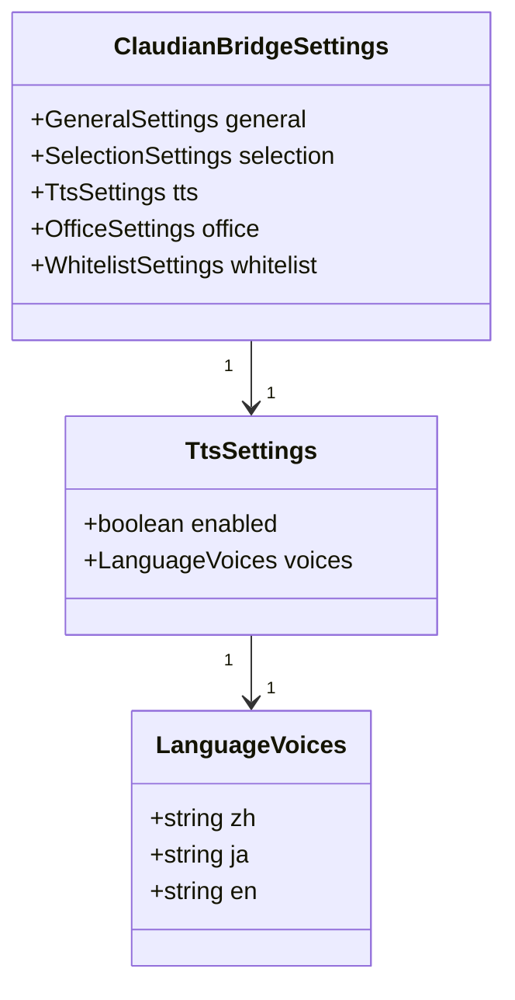
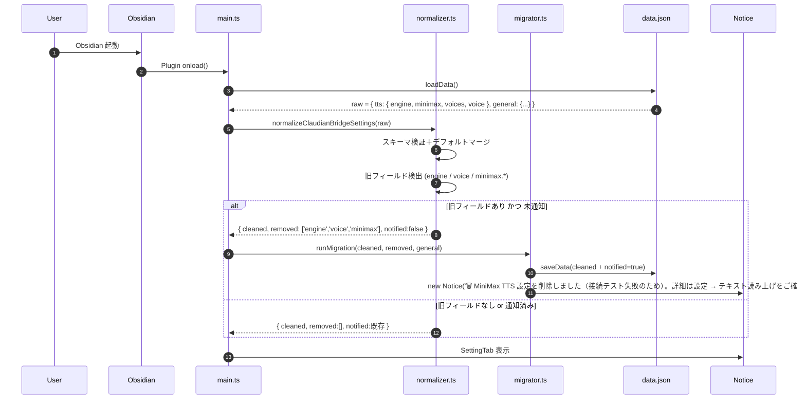

# 🎙️ POC_017 Claudian Bridge — TTS 設定簡素化設計

> 📂 路径：`80_POC_Projects/POC_017_ClaudianBridge/02_設計文書/_superpowers原本/2026-08-13-tts-settings-simplification-design.md`
> 📍 関連プロジェクト：[[80_POC_Projects/POC_017_ClaudianBridge/README]]
> 📍 関連プロジェクト：[[80_POC_Projects/POC_015_ClaudeTTS/README]]（**参照のみ・依存ゼロ**）

---

## 📑 目次

1. [概要](#概要)
2. [動機・背景](#動機背景)
3. [目標・非目標](#目標非目標)
4. [アーキテクチャ](#アーキテクチャ)
5. [データモデル](#データモデル)
6. [マイグレーションフロー](#マイグレーションフロー)
7. [UI 設計](#ui-設計)
8. [エラー処理](#エラー処理)
9. [テスト方針](#テスト方針)
10. [影響範囲](#影響範囲)
11. [チェックリスト](#チェックリスト)

---

## 1. 概要

POC_017 Claudian Bridge の「テキスト読み上げ」設定を、**edge-tts メイン運用**に最適化する。設定項目に並ぶ未使用候補（`minimax` ブロック 10 項目、`voice` 単一フィールド等）を**削除**し、UI を「エッジ TTS 固定ラベル + 3 言語音色 + テスト読みボタン」の最小構成に縮約する。

### 1.1 スコープ外（厳格遵守）

| 項目 | 扱い |
|------|------|
| POC_015 ClaudeTTS のソース・設定・hooks | **触らない** |
| POC_017 と POC_015 の import / require 共有 | **禁止** |
| UI 多言語 i18n（ja/zh/en）テーブル | 既存維持（変更なし） |

---

## 2. 動機・背景

### 2.1 現状の問題

| # | 問題 | 影響 |
|:--:|------|------|
| P1 | `tts.minimax` ブロック（10 項目）に API キーが保存されているが、MiniMax 音声合成 API への**接続テストが失敗** | セキュリティリスク（漏洩 API キー残置）／UI が誤解を招く |
| P2 | `tts.engine = 'edge'` 固定だが UI 上は dropdown に並ぶ選択肢がなく冗長 | ユーザーの混乱 |
| P3 | `tts.voice` (空文字) と `tts.voices.{zh,ja,en}` (空文字) の両方が存在し使われ方が不明確 | スキーマの不整合 |
| P4 | 設定画面「テキスト読み上げ」タブの設計が POC_017 内に複数バージョン混在 | 保守性低下 |

### 2.2 なぜ今

- MiniMax の API への接続テストが失敗し、運用上 edge-tts のみが信頼できる
- 設定 UI の選択肢は実運用に対し過多
- POC_017 と POC_015 は別系統のプラグインであり、POC_017 側で TTS をスリム化する方が独立性強化につながる

---

## 3. 目標・非目標

### 3.1 目標（Goals）

- **G1**: TTS 設定から未使用候補を排除し、edge-tts 運用に最適化する
- **G2**: 既存ユーザの data.json に残った `minimax.*` を**安全削除**し、Notice で通知
- **G3**: UI を「エッジ TTS 固定ラベル + 3 言語 × 音色 + テストボタン」へ縮約
- **G4**: POC_015 ClaudeTTS とコード・import の共有を**ゼロ**に保つ
- **G5**: 設定ホットリロード機能（F014）は維持

### 3.2 非目標（Non-Goals）

- 新しい TTS エンジンの追加
- 多言語 i18n ラベルの刷新
- audio_format, speed, vol, pitch 等の調整 UI 化（将来必要なら別タスク）
- POC_015 ClaudeTTS のリファクタリング・機能変更

---

## 4. アーキテクチャ

### 4.1 コンポーネントと責務

| ファイル | 責務 | 変更 |
|----------|------|:----:|
| `core/settings.ts` | `ClaudianBridgeSettings` 型・`DEFAULT_CLAUDIAN_BRIDGE_SETTINGS` 定義 | 🔧 スキーマ簡素化 |
| `core/normalizer.ts` | `normalizeClaudianBridgeSettings()` — 入力検証＋defaults マージ＋旧値削除 | 🔧 旧値検出・除去ロジック追加 |
| `core/migrator.ts` | `runMigration()` — 旧キー発見時に saveData + Notice | 🔧 通知フラグ管理 |
| `settings/SettingTabTts.ts` | 「テキスト読み上げ」タブ UI | 🔧 minimax UI / engine dropdown 削除、テストボタン追加 |
| `features/tts/core.ts` | `TtsFeature.addTextToTTS / claudettsHttpSpeak` — 合成ロジック | 🔧 minimax 分岐削除、edge 経路のみ |
| `main.ts` | プラグイン初期化 | 🔧 `runMigration()` 呼び出し |
| `.obsidian/plugins/claudian-bridge/data.json` | ユーザ設定ファイル | 🔧 正規化後クリーン化（自動） |

### 4.2 依存方向



**POC_017 → POC_015 の import 矢印は存在しない**（設計上の不変条件）。

---

## 5. データモデル

### 5.1 Before（現状）

```typescript
interface TtsSettings {
  enabled: boolean
  engine: 'edge'
  voices: {
    zh: string
    ja: string
    en: string
  }
  minimax: {                                // ← 削除対象
    enabled: boolean
    showInEngineList: boolean
    apiKey: string
    voiceIdZh: string
    voiceIdJa: string
    voiceIdEn: string
    speed: number
    vol: number
    pitch: number
    audioFormat: 'mp3' | 'wav'
  }
  voice: string                             // ← 削除対象
}
```

### 5.2 After（簡素化後）

```typescript
type TtsEngine = 'edge' | 'webspeech'

interface EngineVoices {
  zh: string
  ja: string
  en: string
}

interface TtsSettings {
  enabled: boolean
  engine: TtsEngine                           // ← dropdown で切替
  voices: {
    edge:      EngineVoices
    webspeech: EngineVoices
  }
}

const DEFAULT_TTS: TtsSettings = {
  enabled: true,
  engine: 'edge',
  voices: {
    edge:      { zh: 'xiaoxiao', ja: 'nanami', en: 'aria' },
    webspeech: { zh: '',         ja: '',       en: '' },  // 空文字 = ブラウザ標準
  },
}
```

### 5.3 フィールド移行表

| フィールド | 旧 | 新 | 移行時動作 |
|:----------:|:--:|:--:|-----------|
| `tts.enabled` | ✅ | ✅ | 維持 |
| `tts.engine` | `'edge'` | `'edge' \| 'webspeech'` | 既存 `'edge'` 維持・未設定時 `'edge'` で補完 |
| `tts.voices.{zh,ja,en}`（平型） | `''` 空文字 | ❌ 平型廃止 | 旧 `voices.zh` → `voices.edge.zh` に移動 |
| `tts.voices.edge.{zh,ja,en}`（新ネスト） | 新規 | ✅ | defaults `xiaoxiao / nanami / aria` |
| `tts.voices.webspeech.{zh,ja,en}`（新ネスト） | 新規 | ✅ | defaults 空文字（ブラウザ標準） |
| `tts.voice` | `''` | ❌ 削除 | 旧値除去 |
| `tts.minimax.*`（10 項目） | 全部 | ❌ 削除 | **旧値除去＋ Notice ログ＋ saveData** |
| マイグレーション完了フラグ | 新規 | ✅ | `general.ttsMigrationNotified: boolean` |

### 5.4 クラス図



---

## 6. マイグレーションフロー

### 6.1 初回起動時の処理



### 6.2 通知の冪等性

| 状態 | 通知 |
|------|:----:|
| 初回起動、旧フィールドあり、未通知 | ✅ |
| 2 回目以降（`notified=true` フラグ存在） | ❌ |
| 旧フィールドなし | ❌ |
| 旧フィールドあり + `notified` フラグ破損（`true` 以外） | ✅ |

---

## 7. UI 設計

### 7.1 タブ「テキスト読み上げ」レイアウト

```typescript
class SettingTabTts extends PluginSettingTab {
  display(): void {
    containerEl.empty();
    containerEl.createEl('h2', { text: '🎙️ Claudian Bridge — テキスト読み上げ' });

    // セクション 1: 有効化
    new Setting(containerEl)
      .setName('🌐 TTS 有効化')
      .setDesc('テキスト読み上げ機能の ON/OFF')
      .addToggle((t) => t.setValue(cfg.tts.enabled)
        .onChange(async (v) => { cfg.tts.enabled = v; await this.plugin.saveData(cfg); }));

    // セクション 2: エンジン（dropdown）
    const ENGINE_OPTIONS: Array<{ label: string; value: 'edge' | 'webspeech' }> = [
      { label: 'edge-TTS（クラウド・高品質）', value: 'edge' },
      { label: 'WebSpeech（ブラウザ標準）', value: 'webspeech' },
    ];
    new Setting(containerEl)
      .setName('🎙️ エンジン選択')
      .setDesc('音声合成エンジン。edge-TTS は高品質、WebSpeech はオフライン可。')
      .addDropdown((d) =>
        d
          .addOptions(ENGINE_OPTIONS)
          .setValue(cfg.tts.engine)
          .onChange(async (v) => {
            cfg.tts.engine = v as 'edge' | 'webspeech';
            await this.plugin.saveData(cfg);
            this.display();  // 音色ドロップダウンを engine に合わせて再描画
          })
      );

    // セクション 3: 言語別音色
    const VOICE_PRESETS = ['xiaoxiao','yunxi','yunyang','aria','guy','jenny','nanami','keita'];

    // サンプルテキスト（テスト読み用・各言語対応）
    const SAMPLE_TEXT: Record<'zh' | 'ja' | 'en', string> = {
      zh: '你好，这是一段测试文本。',
      ja: 'こんにちは、テスト読みです。',
      en: 'Hello, this is a test reading.',
    };

    const renderVoiceRow = (langKey: 'zh' | 'ja' | 'en', label: string) => {
      new Setting(containerEl)
        .setName(`🗣️ ${label}`)
        .addDropdown((d) => d
          .addOptions(VOICE_PRESETS.map((v) => ({ label: v, value: v })))
          .setValue(cfg.tts.voices[langKey])
          .onChange(async (v) => { cfg.tts.voices[langKey] = v; await this.plugin.saveData(cfg); })
        )
        .addButton((b) => b.setButtonText('▶ テスト').onClick(async () => {
          await this.plugin.ttsFeature.claudettsHttpSpeak(SAMPLE_TEXT[langKey], cfg.tts, new Notice(''));
        }));
    };
    renderVoiceRow('zh', '中国語 (zh)');
    renderVoiceRow('ja', '日本語 (ja)');
    renderVoiceRow('en', '英語 (en)');

    // セクション 4: 注意文（旧 minimax 説明）
    containerEl.createDiv({ cls: 'setting-item-description' }).createEl('p', {
      text: 'ℹ️ 旧バージョンに存在した MiniMax 接続設定は、接続テスト失敗のため本バージョンから削除されました。',
    });
  }
}
```

### 7.2 UI 削減まとめ

| 削除 | 残す |
|------|------|
| ❌ 旧 5 エンジンの自由選択 | ✅ **エンジン dropdown（edge-tts / webspeech 2 択）** |
| ❌ minimax 有効化トグル | ✅ TTS 有効化トグル |
| ❌ minimax showInEngineList | ✅ 言語別音色 dropdown × 3（選択中エンジンに従属） |
| ❌ minimax API キー入力欄 | ✅ テスト読みボタン × 3（選択中エンジンで再生） |
| ❌ minimax 言語別 voiceId 入力 × 3 | ✅ minimax 削除注意文 |
| ❌ minimax speed / vol / pitch / audioFormat | ✅ 「エンジン切替で音色・テストボタンが切り替わる」注意文 |

---

## 8. エラー処理

| # | シナリオ | 期待挙動 | 影響度 |
|:--:|----------|----------|:------:|
| E1 | `data.json` 破損 | defaults 適用＋ Notice「設定ファイルを読み込めず初期化しました」 | 🟡 中 |
| E2 | `voices.{zh,ja,en}` が空文字 | 既定値（`xiaoxiao` / `nanami` / `aria`）で補完 | 🟢 低 |
| E3 | `voices.{zh,ja,en}` に未知の音色キー | **変更なし**（将来 edge-tts が新しい音色を出す前提で reject しない） | 🟢 低 |
| E4 | 既存 `minimax.apiKey` が残る | 削除＋ Notice（**API キー残置リスク回避**） | 🔴 高 |
| E5 | `notified` フラグ破損 | `true` 以外なら通知実行（冪等性より安全側） | 🟢 低 |
| E6 | `tts` セクション全体が `null`/`undefined` | 全体 defaults で上書き | 🟡 中 |
| E7 | edge-tts 通信失敗（既存ロジック） | TtsFeature 既存のエラーハンドリングに委譲（**今回の変更範囲外**） | 🟢 低 |

---

## 9. テスト方針

### 9.1 テストケース一覧

| ID | シナリオ | 期待結果 |
|:--:|----------|----------|
| **TC-T01** | `minimax.*` 含む data → 正規化 | `minimax` ブロック消失・**Notice 1 回** |
| **TC-T02** | `voice=''` 含む data → 正規化 | `voice` フィールド消失 |
| **TC-T03** | `engine='edge'` 含む data → 正規化 | `engine` フィールド消失 |
| **TC-T04** | `voices.zh=''` → 正規化 | `'xiaoxiao'` で補完 |
| **TC-T05** | 正常 data → 正規化 | 通知なし・返却データ一致 |
| **TC-T06** | 二回目起動（notified=true） | Notice 呼ばれず冪等 |
| **TC-T07** | `data.json` 破損（壊れた JSON） | defaults 適用＋ E1 通知 |
| **TC-T08** | `tts=null` | 全体 defaults で上書き |
| **TC-T09** | UI: SettingTabTts 表示 → DOM に "MiniMax" 文字列なし | 確認 |
| **TC-T10** | UI: テストボタンクリック → TtsFeature.claudettsHttpSpeak 呼び出し | 各言語の `SAMPLE_TEXT` が引数に渡されることをモックで確認 |

### 9.2 テスト実装場所

- 単体：Vitest + happy-dom（`tests/unit/normalizer.test.ts` 等）
- UI スモーク：実 Obsidian 起動時の DOM 確認（手動 UAT または Playwright）

---

## 10. 影響範囲

### 10.1 変更対象ファイル一覧

| 区分 | パス | 変更種別 |
|:----:|------|:--------:|
| 🔧 実装 | `.obsidian/plugins/claudian-bridge/main.js` | ビルド成果物・手動再生成 |
| 🔧 実装 | `.obsidian/plugins/claudian-bridge/data.json` | ユーザの既存値を normalize 後に保存 |
| 📘 設計書 | [[80_POC_Projects/POC_017_ClaudianBridge/02_設計文書/05_設定画面設計]] | 「テキスト読み上げ」タブ項目表を新スキーマへ |
| 📘 設計書 | [[80_POC_Projects/POC_017_ClaudianBridge/02_設計文書/01_クラス設計]] | `DEFAULT_CLAUDIAN_BRIDGE_SETTINGS.tts` を新形状に |
| 📘 要件 | [[80_POC_Projects/POC_017_ClaudianBridge/01_要件定義/01_機能要件]] (F-002 関連) | 不要となった項目を `🗑️ 削除` フラグで残し、差分を管理 |
| 📘 CHANGELOG | [[80_POC_Projects/POC_017_ClaudianBridge/CHANGELOG]] | v0.6.0 エントリ追加 |

### 10.2 触らないファイル

- `80_POC_Projects/POC_017_ClaudianBridge/02_設計文書/_superpowers原本/2026-08-11-claudian-bridge-object-context-menu-design.md`（無関係）
- `80_POC_Projects/POC_015_ClaudeTTS/**`（**全ファイル**）

---

## 11. チェックリスト

```markdown
- [ ] POC_015 のコードを一切 import していない（grep で確認）
- [ ] data.json の minimax ブロックが初回起動後に消えている
- [ ] Notice「🗑️ MiniMax TTS 設定を削除しました」が 1 回だけ出る
- [ ] SettingTabTts に minimax UI が一切表示されない
- [ ] エンジンドロップダウンが edge-TTS / WebSpeech の 2 択になっている
- [ ] エンジン切替で音色ドロップダウンとテストボタンが切り替わる
- [ ] テストボタン 3 個（zh/ja/en）が各エンジンで機能する
- [ ] voices が engine ごとにネスト化されている（`voices.edge.*`, `voices.webspeech.*`）
- [ ] voices.edge.{zh,ja,en} が空文字でも既定値で初期化される
- [ ] voices.webspeech.{zh,ja,en} は空文字のまま defaults から補完される
- [ ] data.json が破損してもプラグインはクラッシュせず defaults で起動
- [ ] 関連ドキュメント 4 本（設定画面設計・クラス設計・機能要件・CHANGELOG）が同期されている
- [ ] 関連ドキュメントに minimax への参照が残っていない
```

---

## 📚 参照文献

| # | 種別 | 参照元 |
|:--:|:----:|------|
| 1 | Vault MD | [[80_POC_Projects/POC_017_ClaudianBridge/02_設計文書/05_設定画面設計]] |
| 2 | Vault MD | [[80_POC_Projects/POC_017_ClaudianBridge/02_設計文書/01_クラス設計]] |
| 3 | Vault MD | [[80_POC_Projects/POC_017_ClaudianBridge/01_要件定義/01_機能要件]] |
| 4 | Vault MD | [[80_POC_Projects/POC_017_ClaudianBridge/.obsidian/plugins/claudian-bridge/data.json]] |
| 5 | Vault MD | [[80_POC_Projects/POC_015_ClaudeTTS/installer/staging/tts_core/engines.py]]（参照のみ） |
| 6 | LLM | Claude Sonnet 4.5 (claude.ai/code) |

---

## 📝 更新履歴

| バージョン | 日付 | 修正内容 | 修正者 |
|:----:|------|---------|--------|
| v1.0.0 | 2026-08-13 | 初版 | MiuMiu 🐾 |
