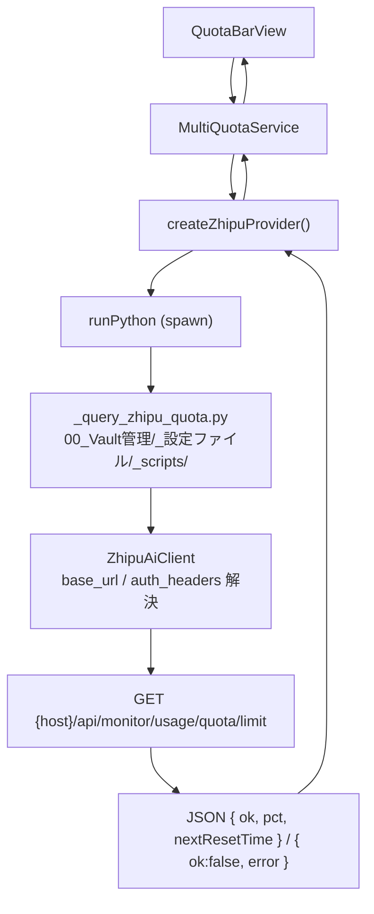
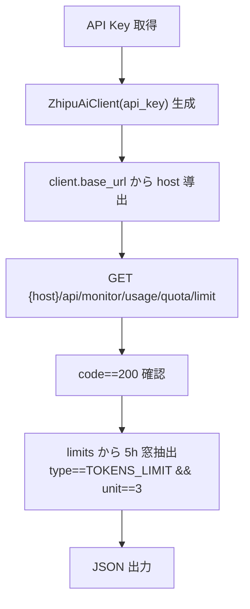

# Claudian Bridge 智谱（Zhipu）LLM 残量プロバイダ追加 設計書

> 📂 パス：80_POC_Projects/POC_017_ClaudianBridge/02_設計文書/_superpowers原本/2026-08-15-zhipu-quota-provider-design.md
> 📍 ソース：D:/AI-Agent/ClaudianBridge（v0.15.0 ベース）
> 📍 対象機能：src/features/quota/（マルチプロバイダ残量検知 v0.4.0〜）
> 🆕 追加対象：智谱（Zhipu / GLM）プロバイダ

---

## 一、背景と目的

Claudian Bridge の LLM 残量インジケータは現在 **Claude / DeepSeek / Kimi / MiniMax** の 4 プロバイダをサポートしている。ユーザーが智谱（Zhipu / GLM Coding Plan）を Claude Code のプロバイダとして利用するケースに対応するため、**智谱を LLM 残量プロバイダとして追加**する。

### 1.1 ユーザー要求

| 項目 | 内容 |
|------|------|
| 追加対象 | LLM 残量プロバイダ（`src/features/quota/`） |
| 表示データ | **GLM Coding Plan の 5 時間窓使用率 %** |
| 実装方式 | **Python（`zai-sdk`）方式** — `ZhipuAiClient` を auth 解決に使用 |
| 表示パターン | Kimi / MiniMax と同じ「使用率 %」 |

### 1.2 非目標

- ❌ 知識庫 capacity（`llm-application/open/knowledge/capacity`）の表示 — 知識庫ストレージ容量であり「LLM 残量」ではないため対象外
- ❌ `zai` SDK の費用明細ファイル解析（`glm-4-alltools`）の統合 — 手動解析向きで自動更新インジケータに不向き
- ❌ 国際版 Z.ai（`api.z.ai`）の個別設定 UI — 環境変数で切替可能にするが UI は最小限

---

## 二、重要な制約（調査結果）

`zai-sdk`（`ZhipuAiClient`）を実機調査した結果、**残高・クォータ取得メソッドは SDK に存在しない**。

| SDK 提供リソース | 残高/クォータ API |
|------------------|------------------|
| chat / files / embeddings / web_search / web_reader / agents / assistant / images / audio / videos / tools / voice / ocr / batch | ❌ 無し |

GLM Coding Plan の使用率は専用エンドポイント `GET {host}/api/monitor/usage/quota/limit` で取得する（SDK 未対応の内部 API）。

> **結論**: 「zai SDK 方式」＝ Python スクリプト内で `ZhipuAiClient` を生成し、**base_url 導出・auth_headers・API キー解決**に使い、クォータ取得は同じクライアントから導出した URL へ直接 HTTP リクエストする構成とする。

---

## 三、データソース

### 3.1 エンドポイント

| 項目 | 内容 |
|------|------|
| URL | `https://open.bigmodel.cn/api/monitor/usage/quota/limit`（メインランド）/ `https://api.z.ai/api/monitor/usage/quota/limit`（国際） |
| Method | GET |
| Auth | `Authorization: Bearer <API Key>` + `Accept-Language: en-US,en` + `Content-Type: application/json` |
| 応答 | `{ code: 200, data: { limits: [{ type, unit, percentage, nextResetTime }] } }` |

### 3.2 抽出ロジック

| 条件 | 意味 |
|------|------|
| `type === 'TOKENS_LIMIT' && unit === 3` | **5 時間窓**（表示対象） |
| `type === 'TOKENS_LIMIT' && unit === 6` | 週間窓（表示対象外） |

- 5 時間窓の `percentage`（使用率 %）を丸めて表示
- `nextResetTime` は詳細情報として利用可能

---

## 四、アーキテクチャ



### 4.1 データフロー

| 段階 | 処理 |
|------|------|
| 1 | `MultiQuotaService.refreshAll()` が全プロバイダの `fetch()` を並列実行 |
| 2 | `createZhipuProvider.fetch()` が `runPython` で Python スクリプトを spawn |
| 3 | スクリプトが `ZhipuAiClient(api_key)` を生成 → `client.base_url` からモニター URL を導出 → `client.auth_headers` で GET |
| 4 | 5 時間窓 `percentage` を JSON エンベロープで出力 |
| 5 | `fetch()` が JSON をパースし `ProviderQuota`（status/value/pct）を返す |

---

## 五、変更ファイル

### 5.1 新規作成

| ファイル | 内容 |
|----------|------|
| `src/features/quota/providers/zhipu.ts` | `createZhipuProvider()` — Python spawn + JSON パース + `ProviderQuota` 変換 |
| `00_Vault管理/_設定ファイル/_scripts/_query_zhipu_quota.py` | `ZhipuAiClient` で auth 解決 → クォータ取得 → JSON 出力 |
| `src/features/quota/python.ts` | 最小 Python spawn ヘルパー（`runPython` + `parseJsonOutput`、chroma 版と同等の安全設計） |
| `tests/features/quota/providers/zhipu.test.ts` | プロバイダ単体テスト |

> ℹ️ **`python.ts` について**: 既存の chroma `runPython` は `src/features/chroma/` 配下にあり、quota → chroma の跨 feature 依存を避けるため、quota 配下に最小実装を追加する（office / chroma と同様の重複パターンを踏襲）。

### 5.2 変更

| ファイル | 変更内容 |
|----------|----------|
| `src/features/quota/types.ts` | `ProviderId` に `'zhipu'` 追加 |
| `src/features/quota/llm-info.ts` | `LlmProviderId` に `'zhipu'`、`detectProviderFromBaseUrl()` に `bigmodel` / `z.ai` 判定追加 |
| `src/features/quota/service.ts` | `createZhipuProvider` を登録（API キー / Python パス / Vault ルートを注入） |
| `src/core/settings.ts` | `QuotaSettings` に `zhipuApiKey` / `zhipuPythonPath`、`QuotaDisplayFlags` に `zhipu`、デフォルト・正規化・検証を追加 |
| `src/core/i18n.ts` | `quotaZhipuApiKey` / `quotaZhipuValue` / `quotaDisplayZhipu` 等（ja / en / zh） |
| `src/settings/SettingTabQuota.ts` | 表示モデル個別 ON/OFF・API キー入力・接続テストに智谱を追加 |
| `tests/features/quota/service.test.ts` | `displayModels` に `zhipu` を追加しテスト維持 |
| `tests/features/quota/llm-info.test.ts` | 智谱 base_url 検出テスト追加 |
| `tests/core/settings.test.ts` | `zhipuApiKey` / `zhipuPythonPath` 正規化テスト追加 |

### 5.3 設定スキーマ

```typescript
export interface QuotaDisplayFlags {
  claude: boolean;
  deepseek: boolean;
  kimi: boolean;
  minimax: boolean;
  zhipu: boolean;      // 追加
}

export interface QuotaSettings {
  claudeSettingsPath: string;
  deepseekApiKey: string;
  kimiApiKey: string;
  minimaxApiKey: string;
  zhipuApiKey: string;       // 追加
  zhipuPythonPath: string;   // 追加（既定 'py' / 'python3'）
  displayModels: QuotaDisplayFlags;
}
```

---

## 六、Python スクリプト仕様

### 6.1 引数と出力

| 項目 | 内容 |
|------|------|
| 引数 | 第 1 引数: API Key（未指定時 `ZHIPU_API_KEY` / `ZAI_API_KEY` 環境変数） |
| 出力 | UTF-8 JSON（1 行）: `{"ok": true, "pct": <int>, "nextResetTime": <str|null>}` または `{"ok": false, "error": "<msg>"}` |

### 6.2 処理フロー



### 6.3 エラー応答

| 状況 | 出力 |
|------|------|
| キー未指定 | `{"ok": false, "error": "no key"}` |
| `zai-sdk` 未導入 | `{"ok": false, "error": "zai-sdk not installed..."}` |
| HTTP 非 200 / `code != 200` | `{"ok": false, "error": "HTTP <status>"}` / `{"ok": false, "error": "code <code>"}` |
| 5h 窓が見つからない | `{"ok": false, "error": "5h limit not found"}` |
| 通信例外 | `{"ok": false, "error": "<message>"}` |

---

## 七、エラーハンドリング（TS 側）

| 状況 | 挙動 |
|------|------|
| API キー未設定 | `isConfigured() = false` → 非表示 |
| Python 未解決 / spawn 失敗 | `status: 'error'` → 非表示（設定タブの接続テストで原因表示） |
| HTTP 401 / 403 | `status: 'expired'` → ⚠ 表示 |
| 5h 窓なし・通信失敗 | `status: 'error'` → 非表示 |

---

## 八、テスト計画

| テスト | 内容 |
|--------|------|
| `zhipu.test.ts` | キー未設定 / 成功（5h % 抽出）/ 401 expired / 500 error / Python 不在 |
| `service.test.ts` | `zhipu` の `displayModels` 個別 ON/OFF 反映 |
| `llm-info.test.ts` | `open.bigmodel.cn` / `api.z.ai` を含む base_url → `zhipu` 検出 |
| `settings.test.ts` | `zhipuApiKey` / `zhipuPythonPath` のデフォルト・正規化・検証 |

---

## 九、決定事項

| 論点 | 決定 |
|------|------|
| 表示データ | GLM Coding Plan 5 時間窓使用率 %（Kimi と同パターン） |
| 実装方式 | Python（`zai-sdk`）方式 — `ZhipuAiClient` を auth 解決に使用 |
| Python パス設定 | 新設 `quota.zhipuPythonPath`（Chroma の `chroma.pythonPath` と同流儀） |
| 更新コスト | spawn 毎回実行（`refreshSec` 既定 60 秒）。シンプル優先、必要なら後から TTL キャッシュ |
| 表示ラベル | `Zhipu`（i18n 表示は「智谱」） |
| API キー環境変数 | `ZHIPU_API_KEY`（フォールバック `ZAI_API_KEY`） |
| 接続テスト | 設定タブの「接続テスト」で Python スクリプトを実行し残量表示 |

---

## 十、実装時の注意点

- `zai-sdk` の導入が必要（`pip install zai-sdk`）。未導入時はスクリプトが明確なエラーを返す
- `Authorization` ヘッダー形式は `Bearer <key>` を基本とし、実機で 401 が返る場合はヘッダー形式を調整（`cc-zhipu-hud` 実装ではクォータ API が `Bearer` なしで成功する例あり）
- Windows の Python パイプは GBK/cp936 のため、`PYTHONIOENCODING=utf-8` を必ず設定（既存の学習記録 2026-08-15 に従う）
- `runPython` は `shell: false` + args 配列 + 明示 timeout（30 秒）で spawn（インジェクション防止）
