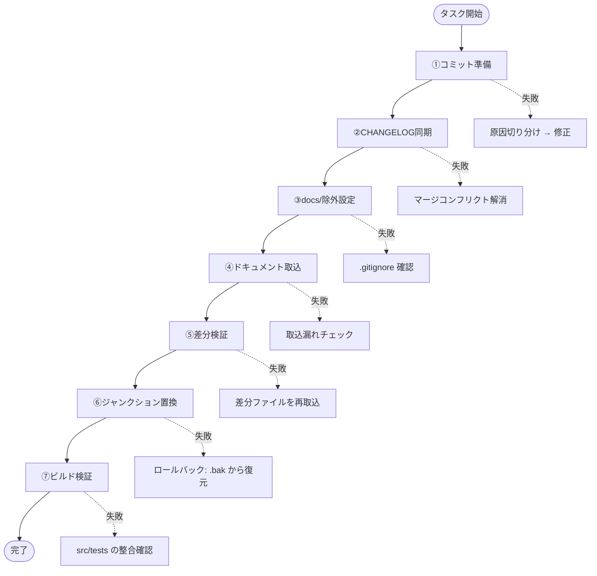
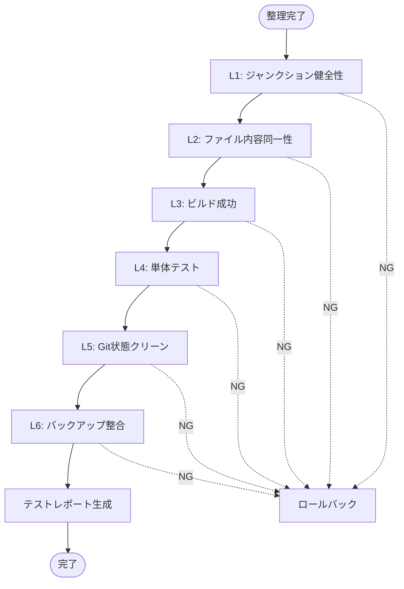

# ClaudianBridge ドキュメント集約 デザイン仕様書

> 🏷️ バージョン: v1.0
> 📂 テンプレートパス: 80_POC_Projects/POC_017_ClaudianBridge/.superpowers/specs/
> 📅 作成日: 2026-09-03
> 👤 作成者: MiuMiu 🐾 (Claude Code)

---

## 目次

1. [概要](#概要)
2. [背景と問題](#背景と問題)
3. [目標と非目標](#目標と非目標)
4. [アーキテクチャ](#アーキテクチャ)
5. [コンポーネント](#コンポーネント)
6. [データフロー](#データフロー)
7. [エラーハンドリング・ロールバック](#エラーハンドリングロールバック)
8. [テスト戦略](#テスト戦略)
9. [完了基準](#完了基準)
10. [リスクと対策](#リスクと対策)
11. [参考資料](#参考資料)

---

## 概要

`D:\AI-Agent\ClaudianBridge`（ソースリポジトリ）と `80_POC_Projects/POC_017_ClaudianBridge`（Vault ドキュメント）の二重管理を解消する。技術ドキュメントを Vault に集約し、ソースリポジトリ側は Windows ジャンクションで Vault ドキュメントを参照する構成に移行する。

**スコープ**: Windows 環境のみ。スコープ外: macOS / Linux。

---

## 背景と問題

### 現状

| 項目 | `D:\AI-Agent\ClaudianBridge`（ソース） | `POC_017_ClaudianBridge`（Vault） |
|------|--------------------------------------|----------------------------------|
| 役割 | ソースコードリポジトリ（Node.js + TS） | ドキュメント Vault（Obsidian） |
| 最新バージョン | v0.32.9（2026-09-03） | v0.30.2（2026-08-31） |
| 技術ドキュメント | 00_*, 01_*, ..., 09_* 配下 | 同じ構造 |
| `docs/superpowers/` | 3 specs + 2 plans | なし |
| 未コミット | `tests/features/tts/core.test.ts` (M) | `01_移行ガイド.md` (M) + 新規 6 ファイル |
| CHANGELOG サイズ | 30 KB（Sep 3） | 21 KB（Aug 31） |

### 問題の本質

1. **二重管理**: ソースと Vault が同じ技術ドキュメントを独立編集
2. **内容の不一致**: 同一ファイル名で別内容（00_使用ガイド、02_設計文書/*、03_開発文書/*、08_説明書/* など多数）
3. **片側のみのファイル**: ソース側にしかない v0.31.0〜v0.32.9 系ドキュメント、Vault 側にしかない v0.30.2 系の設計書（**v0.33 系は除外**）
4. **同期ズレ**: ソース側で開発が進むが Vault への反映が手動運用

---

## 目標と非目標

### 目標

1. **SSOT 確立**: `POC_017_ClaudianBridge` を技術ドキュメントの唯一の真実とする
2. **二重管理解消**: ソースリポジトリのドキュメントはジャンクションで Vault 参照
3. **v0.32.9 統一**: メインのバージョンを **v0.32.9** に統一。ソース側の v0.31.0〜v0.32.9 リリース情報を Vault にマージ（v0.33 系は除外）
4. **ソースコード保持**: ソース側の v0.33 系コード（`src/`, `tests/`）はそのまま開発継続
5. **運用継続性**: ビルド・テスト・Git 操作に影響なし

### 非目標

1. ソースコード（`src/`, `tests/`）のリファクタリング
2. macOS / Linux 対応（Windows 環境のみ）
3. CI / CD パイプラインの変更
4. プラグインとしての機能追加・変更
5. v0.33 系ドキュメントの Vault 取り込み（除外）

---

## アーキテクチャ

### ソース側 `D:\AI-Agent\ClaudianBridge`（整理後）

```text
D:\AI-Agent\ClaudianBridge\
├── .git/
├── .gitignore                  # ← docs/ を追加（変更）
├── .superpowers/
├── .worktrees/
├── 00_プロジェクト立項.md       # ← 🔗 ジャンクション
├── 00_使用ガイド.md             # ← 🔗 ジャンクション
├── 01_移行ガイド.md             # ← 🔗 ジャンクション
├── 01_要件定義/                 # ← 🔗 ジャンクション
├── 02_設計文書/                 # ← 🔗 ジャンクション
├── 03_開発文書/                 # ← 🔗 ジャンクション
├── 04_テスト文書/               # ← 🔗 ジャンクション
├── 05_デプロイ運用/             # ← 🔗 ジャンクション
├── 06_振り返り/                 # ← 🔗 ジャンクション
├── 08_説明書/                   # ← 🔗 ジャンクション
├── 09_対話まとめ/               # ← 🔗 ジャンクション
├── CHANGELOG.md                # ← 🔗 ジャンクション
├── README.md                   # ← 🔗 ジャンクション
├── THIRD_PARTY_NOTICES.md      # ← 🔗 ジャンクション
├── MyPOC開発/                  # ← 🔗 ジャンクション
├── data.json
├── esbuild.config.mjs
├── main.js
├── node_modules/
├── package-lock.json
├── package.json
├── scripts/
├── src/
├── styles.css
├── tests/
├── tsconfig.json
├── versions.json
├── vitest.config.ts
└── py/
```

### Vault 側 `POC_017_ClaudianBridge`（更新後）

```text
POC_017_ClaudianBridge\
├── .git/
├── .gitignore
├── .superpowers/               # ← specs/ を追加（spec 配置先）
│   ├── sdd/
│   └── specs/                 # 新規ディレクトリ
├── 00_プロジェクト立項.md       # ← 真（SSOT）
├── 00_使用ガイド.md             # ← 真
├── 01_移行ガイド.md             # ← 真
├── 01_要件定義/                 # ← 真
├── 02_設計文書/                 # ← 真（v0.31〜v0.33 取込後）
├── 03_開発文書/                 # ← 真
├── 04_テスト文書/               # ← 真
├── 05_デプロイ運用/             # ← 真
├── 06_振り返り/                 # ← 真
├── 08_説明書/                   # ← 真
├── 09_対話まとめ/               # ← 真
├── CHANGELOG.md                # ← 真（v0.31〜v0.33 マージ後）
├── README.md                   # ← 真
├── THIRD_PARTY_NOTICES.md      # ← 真
└── MyPOC開発/                  # ← 真
```

### 設計上のポイント

- **ジャンクションは「ソース側の入口」として機能**。ソース側でファイルを開くと Vault 側の実体に透過的にアクセス
- **`docs/superpowers/` はソース側の `.gitignore` に追加**（ファイル自体は残置、Git 管理外）
- **Vault 側が SSOT（Single Source of Truth）**。ソース側でドキュメントを編集しない運用

---

## コンポーネント

| コンポーネント | 種類 | 役割 | 作成方法 |
|-------------|------|------|---------|
| **ドキュメント・ファイルジャンクション** | Windows Junction | ソース側の `*.md` ファイル → Vault 側ファイル | `mklink /J` または `New-Item -ItemType Junction` |
| **ディレクトリジャンクション** | Windows Junction | ソース側のディレクトリ → Vault 側ディレクトリ | `mklink /J /D` または `New-Item -ItemType Junction` |
| **.gitignore 更新** | テキスト | ソース側 `.gitignore` に `docs/` 追加 | Edit ツール |
| **コミットランナー** | Bash スクリプト | Vault 側 / ソース側の未コミット変更を順次コミット | bash + git |
| **バックアップ** | `.bak/` ディレクトリ | ジャンクション化前の原本保存 | `cp -r` |

### ジャンクション作成コマンド例

```bash
# PowerShell
New-Item -ItemType Junction -Path "D:\AI-Agent\ClaudianBridge\CHANGELOG.md" -Target "C:\Users\superlambkin\OneDrive\Edge\Obsidian Vault\80_POC_Projects\POC_017_ClaudianBridge\CHANGELOG.md"

# コマンドプロンプト
mklink /J "D:\AI-Agent\ClaudianBridge\CHANGELOG.md" "C:\Users\superlambkin\OneDrive\Edge\Obsidian Vault\80_POC_Projects\POC_017_ClaudianBridge\CHANGELOG.md"
```

> ⚠️ **注意**: ファイルジャンクション作成時は既存の同名ファイルを削除してから実施する。

### ジャンクション対象（15 項目）

| ソース側 | Vault 側（リンク先） |
|---------|-------------------|
| `00_プロジェクト立項.md` | `POC_017/00_プロジェクト立項.md` |
| `00_使用ガイド.md` | `POC_017/00_使用ガイド.md` |
| `01_移行ガイド.md` | `POC_017/01_移行ガイド.md` |
| `01_要件定義/` | `POC_017/01_要件定義/` |
| `02_設計文書/` | `POC_017/02_設計文書/` |
| `03_開発文書/` | `POC_017/03_開発文書/` |
| `04_テスト文書/` | `POC_017/04_テスト文書/` |
| `05_デプロイ運用/` | `POC_017/05_デプロイ運用/` |
| `06_振り返り/` | `POC_017/06_振り返り/` |
| `08_説明書/` | `POC_017/08_説明書/` |
| `09_対話まとめ/` | `POC_017/09_対話まとめ/` |
| `CHANGELOG.md` | `POC_017/CHANGELOG.md` |
| `README.md` | `POC_017/README.md` |
| `THIRD_PARTY_NOTICES.md` | `POC_017/THIRD_PARTY_NOTICES.md` |
| `MyPOC開発/` | `POC_017/MyPOC開発/` |

---

## データフロー

### 全体フロー



### フェーズ詳細

#### ① コミット準備

- Vault 側で未コミットファイルを検出・コミット
  - `01_移行ガイド.md` (M)
  - `02_設計文書/2026-09-01-token-rate-display-select-design.md` (新規)
  - `02_設計文書/2026-09-01-token-rate-interval-setting-design.md` (新規)
  - `03_開発文書/2026-08-30-token-rate-display-plan.md` (新規)
  - `03_開発文書/21_トークン速度表示機能実装計画.md` (新規)
  - `03_開発文書/22_トークン速度更新周期設定実装計画.md` (新規)
  - `08_説明書/04_トークン速度の更新手順_中学生向け解説.md` (新規)
- ソース側で `tests/features/tts/core.test.ts` をコミット
- 両側 `git status` で clean を確認

#### ② CHANGELOG / README 同期（v0.31.0〜v0.32.9）

- ソース側 `git log --oneline` で **v0.31.0〜v0.32.9** のコミット ID 一覧を取得（**v0.33 系は除外**）
- 各バージョンのエントリ（タイトル + 概要）をソース CHANGELOG から抽出
- Vault 側 `CHANGELOG.md` の末尾に v0.31.0〜v0.32.9 を追記（**v0.33 系は追加しない**）
- `README.md` も同様にソース側の最新版を Vault 側にコピー
- 差分検証: 追加項目のみ反映されたか確認

#### ③ docs/ 除外設定

- ソース側 `.gitignore` に `docs/` を追加（既存の場合は変更不要）
- `git status` で docs/ 配下が untracked になることを確認
- 既存追跡ファイルがあれば `git rm --cached` で追跡解除

#### ④ ドキュメント取込（v0.31.0〜v0.32.9）

- ソース側で **v0.31.0〜v0.32.9** 系の設計書・計画書・説明書を抽出（**v0.33 系は除外**）
- 該当ファイルを Vault 側の対応フォルダにコピー
- `git add` + コミット
- 該当ファイルがない場合はスキップ

#### ⑤ 差分検証

- 両側で `diff -rq 00_プロジェクト立項.md 00_使用ガイド.md ...` を実行
- CHANGELOG.md, README.md, 11 ディレクトリ全てで diff を確認
- 差分があれば⑥に進めず④に戻る

#### ⑥ ジャンクション置換

- バックアップ作成（`.bak/2026-09-03-pre-junction/` に元のファイルをコピー）
- ジャンクション作成スクリプトを実行
- 各ジャンクションのリンク先を `dir /AL` で確認

#### ⑦ ビルド検証

- `npm install` で依存関係を最新化
- `npm run build` で main.js 生成
- `npm test` で全テスト実行
- `git status` で main.js の差分を確認（あれば再コミット）

---

## エラーハンドリング・ロールバック

### 想定される失敗モード

| ID | フェーズ | 失敗シナリオ | 影響範囲 | 重要度 |
|----|---------|------------|---------|-------|
| F1 | ① | 未コミットファイル検出漏れ | ジャンクション化後にソース側で編集分が消失 | 🔴 High |
| F2 | ② | CHANGELOG マージで行重複/欠落 | リリース履歴の不正確 | 🟡 Medium |
| F3 | ③ | `docs/` の `.gitignore` 設定で既存追跡ファイル残存 | コミット時に docs/ が混入 | 🟡 Medium |
| F4 | ④ | ソース側の重要ドキュメント取込漏れ | Vault 側で該当機能の説明不在 | 🟡 Medium |
| F5 | ⑤ | 差分検証で diff が発生 | ジャンクション不一致 | 🟡 Medium |
| F6 | ⑥ | ジャンクション作成時の権限エラー | 整理作業停止 | 🔴 High |
| F7 | ⑥ | 既存ファイル削除に失敗（読み取り専用など） | ジャンクション作成不可 | 🔴 High |
| F8 | ⑦ | ビルド/テスト失敗 | 整理作業の妥当性破綻 | 🔴 High |
| F9 | 全般 | ジャンクション化後に参照切れ | ソース側ドキュメント閲覧不可 | 🔴 Critical |

### ロールバック判断基準

| 失敗内容 | ロールバック | 対応 |
|---------|------------|------|
| ジャンクション作成自体が失敗 | 不要 | スクリプト修正して再実行 |
| ジャンクションは作成できたがビルド失敗 | **必要** | src/ または tests/ の問題。再度コミットログを確認 |
| ビルドは成功したがテスト失敗 | **必要** | テスト環境を確認 |
| ビルド・テスト成功したが差分検出 | 不要 | Vault 側で修正後にコミット |

### バックアップ戦略

```text
D:\AI-Agent\ClaudianBridge\.bak\
├── 2026-09-03-pre-junction\    # ジャンクション化前の原本
│   ├── 00_プロジェクト立項.md
│   ├── 00_使用ガイド.md
│   ├── CHANGELOG.md
│   ├── README.md
│   ├── 02_設計文書\
│   └── ...
└── 2026-09-03-diff-report.txt  # 差分レポート
```

- バックアップは `.gitignore` に追加（Git 管理外）
- ジャンクション化が安定したら `.bak/` を削除可能

---

## テスト戦略

### テストレベル

| レベル | 範囲 | ツール | 合格基準 |
|--------|------|--------|---------|
| **L1: ジャンクション健全性** | 全 15 ジャンクション | `dir /AL` (Windows) | 全ジャンクションのリンク先が表示される |
| **L2: ファイル内容同一性** | 両側からの同一性 | `diff -rq` | 全ファイルで差分ゼロ |
| **L3: ビルド成功** | main.js 生成 | `npm run build` | ビルド完了・成果物生成 |
| **L4: 単体テスト** | Vitest | `npm test` | 全テスト PASS |
| **L5: Git 状態クリーン** | 両側リポジトリ | `git status` | clean |
| **L6: バックアップ整合** | `.bak/` ディレクトリ | ファイル数チェック | ジャンクション化前と同数のファイル |

### テスト実行順序



---

## 完了基準

| # | 条件 |
|---|------|
| 1 | ジャンクション成立：ソース側で技術ドキュメントが Vault と同じ内容を表示する |
| 2 | Git 状態クリーン：ソース側・Vault 側ともに `git status` が clean |
| 3 | ビルド成功：`npm run build` で main.js 生成成功 |
| 4 | テスト成功：`npm test` で全テストパス |
| 5 | 差分ゼロ：ジャンクション先のファイルがソース・Vault 両側からアクセス可能で、内容が同一 |
| 6 | **v0.32.9 統一**: Vault 側 CHANGELOG の最新エントリが v0.32.9、v0.33 系のドキュメントが Vault に取り込まれていない |

---

## リスクと対策

| リスク | 対策 |
|--------|------|
| ジャンクション設定ミスで参照切れる | ジャンクション作成後すぐに `dir /AL` で確認 |
| CHANGELOG マージ時の衝突 | マージ前にソース側 CHANGELOG から未取込リリースのコミット ID 一覧を抽出してマージ範囲を限定 |
| ジャンクション非対応環境（Mac/Linux） | Windows 限定スコープとして明示 |
| ビルド成果物（main.js）の不整合 | ジャンクション化後に `npm run build` で再生成、`git status` で main.js の変更を確認 |
| バックアップの肥大化 | ジャンクション化成功後に `.bak/` を削除可能（Git 管理外なので安全） |
| ジャンクションの OS 依存性 | `.gitignore` に `*.lnk` や `desktop.ini` などの Windows 固有ファイルも登録 |

---

## 参考資料

### Vault ドキュメント

- [[../../../80_POC_Projects/POC_017_ClaudianBridge/00_プロジェクト立項.md|プロジェクト立項]]
- [[../../../80_POC_Projects/POC_017_ClaudianBridge/00_使用ガイド.md|使用ガイド]]
- [[../../../80_POC_Projects/POC_017_ClaudianBridge/CHANGELOG.md|CHANGELOG]]
- [[../../../80_POC_Projects/POC_017_ClaudianBridge/README.md|README]]

### 関連リンク

- [[../../../00_Vault管理/構成説明.md#POC プロジェクトパス対応規約（SSOT）|POC プロジェクトパス対応規約 SSOT]]
- [[../../../00_Vault管理/方法論/POC開発メタプロセス|POC 開発メタプロセス]]

### 外部リンク

- [Windows のシンボリック リンクとジャンクション](https://learn.microsoft.com/ja-jp/windows/win32/fileio/symbolic-links)
- [mklink コマンドリファレンス](https://learn.microsoft.com/ja-jp/windows-server/administration/windows-commands/mklink)

---

*📚 デザイン仕様書 v1.0 · MiuMiu 🐾 · 2026-09-03*
