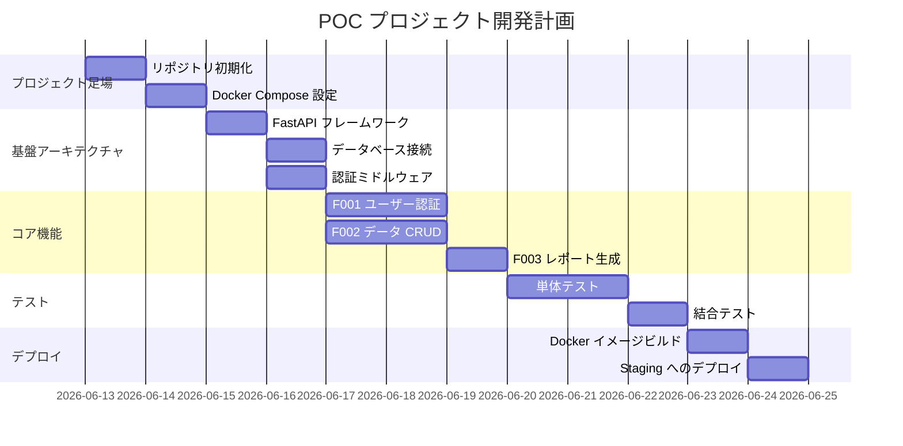

> 📂 **パス**: `80_POC_Projects/POC_XXX/03_開発文書/00_開発計画.md`
> 📌 **フェーズ**: フェーズ3 · 開発実装
> 🎯 **用途**: WBS タスク分解 + Gantt タイムライン

# 📅 開発計画

> **関連プロジェクト**: [[../README|フェーズインデックス]] | [[../02_設計文書/00_アーキテクチャ総覧|アーキテクチャ概要]]

---

## 🎯 目標

| 目標 | 衡量 |
|------|------|
| すべての F-番号機能を完了 | 100% |
| 単体テストカバレッジ率 | ≥ 80% |
| 結合テスト合格 | 100% |
| ドキュメント同期更新 | 100% |

---

## 📋 WBS タスク分解

| WBS | タスク | 担当者 | 工期 | 依存 | ステータス |
|:---:|------|--------|:----:|------|:----:|
| 1.0 | **プロジェクト足場** | MiuMiu 🐾 | 1d | — | ⬜ |
| 1.1 | リポジトリ初期化 | MiuMiu 🐾 | 0.5d | — | ⬜ |
| 1.2 | Docker Compose 設定 | MiuMiu 🐾 | 0.5d | 1.1 | ⬜ |
| 2.0 | **基盤アーキテクチャ** | MiuMiu 🐾 | 3d | 1.0 | ⬜ |
| 2.1 | FastAPI フレームワーク | MiuMiu 🐾 | 1d | 1.0 | ⬜ |
| 2.2 | データベース接続 | MiuMiu 🐾 | 1d | 2.1 | ⬜ |
| 2.3 | 認証ミドルウェア | MiuMiu 🐾 | 1d | 2.1 | ⬜ |
| 3.5 | **コア機能 F001-F003** | MiuMiu 🐾 | 5d | 2.0 | ⬜ |
| 3.5 | F001 ユーザー認証 | MiuMiu 🐾 | 2d | 2.3 | ⬜ |
| 3.2 | F002 データ CRUD | MiuMiu 🐾 | 2d | 2.2 | ⬜ |
| 3.3 | F003 レポート生成 | MiuMiu 🐾 | 1d | 3.2 | ⬜ |
| 4.0 | **テスト** | MiuMiu 🐾 | 3d | 3.5 | ⬜ |
| 4.1 | 単体テスト | MiuMiu 🐾 | 2d | 3.5 | ⬜ |
| 4.2 | 結合テスト | MiuMiu 🐾 | 1d | 4.1 | ⬜ |
| 5.0 | **デプロイ** | MiuMiu 🐾 | 1d | 4.0 | ⬜ |
| 5.1 | Docker イメージビルド | MiuMiu 🐾 | 0.5d | 4.2 | ⬜ |
| 5.2 | Staging へのデプロイ | MiuMiu 🐾 | 0.5d | 5.1 | ⬜ |

**総工期**: 13 日

---

## 📊 ガントチャート(Gantt)

---

## ⚠️ リスクと依存

| リスク | 影響 | 緩和 |
|------|------|------|
| サードパーティ API 不安定 | 中 | mock を準備 |
| 人員不足 | 高 | 非コア機能を削減 |
| パフォーマンス不達 | 中 | 最適化時間を確保 |

---

## 🔗 関連ドキュメント

- [[05_進捗ボード|進捗カンバンボード]]
- [[01_環境設定|環境設定]]
- [[../02_設計文書/00_アーキテクチャ総覧|アーキテクチャ概要]]

---

*📅 開発計画 v2.0.0 · WBS + Gantt · MiuMiu 🐾*
