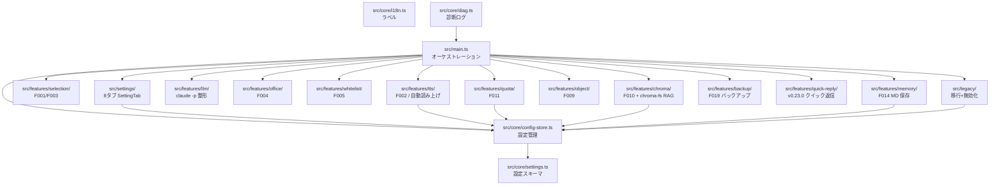

> 📂 **パス**: `80_POC_Projects/POC_017_ClaudianBridge/03_開発文書/03_ソース構造.md`
> 📌 **フェーズ**: フェーズ3 · 開発実装（P2 コア機能移行〜P5）
> 🎯 **用途**: Claudian Bridge プラグインのソース目次構造（v0.22.0 実態）

# 📂 ソース構造

> **関連プロジェクト**: [[../README|フェーズインデックス]] | [[00_P2_実装計画|P2 実装計画]] | [[../02_設計文書/00_アーキテクチャ総覧|アーキテクチャ概要]]

---

## 🌳 目次ツリー（`D:\AI-Agent\ClaudianBridge\`）

```
claudian-bridge/
├── src/
│   ├── main.ts                    # エントリポイント（オーケストレーション）
│   ├── manifest.json              # プラグイン定義（id: claudian-bridge）
│   ├── core/                      # 設定・共通基盤（UI 非依存）
│   │   ├── settings.ts           # ClaudianBridgeSettings 型 + normalize + validate
│   │   ├── config-store.ts       # ConfigStore（load/save/watch/close + onSave）
│   │   ├── migrator.ts           # v0.6.0 TTS 簡素化マイグレーション
│   │   ├── i18n.ts               # 3言語ラベル（ja/zh/en）
│   │   ├── events.ts             # イベント基盤
│   │   └── diag.ts               # 診断ログ（cb-diag / グローバルエラーハンドラ）
│   ├── settings/                  # 設定画面（1 ページ / 内部タブ）
│   │   ├── ClaudianBridgeSettingTab.ts # タブ定義・描画オーケストレーション（8タブ）
│   │   ├── SettingTabGeneral.ts  # 一般（有効化 + 移行状態 + リセット + コードコピーフェンス）
│   │   ├── SettingTabSelection.ts# テキスト挿入
│   │   ├── SettingTabTts.ts      # テキスト読み上げ
│   │   ├── SettingTabOffice.ts   # ファイル変換
│   │   ├── SettingTabWhitelist.ts# 拡張子フィルタ
│   │   ├── SettingTabQuota.ts    # 残量検知
│   │   └── SettingTabMemory.ts   # MD 保存（v0.17.0）
│   ├── features/
│   │   ├── selection/            # F001/F003 テキスト・フォルダ挿入
│   │   │   ├── core.ts           # addTextToClaudian / addFolderToClaudian
│   │   │   ├── watcher.ts        # 選択監視 + 遅延ポップアップ
│   │   │   └── popup.ts          # フローティングボタン UI
│   │   ├── tts/                  # F002 テキスト読み上げ
│   │   │   ├── core.ts           # エンジン別ディスパッチ + addTextToTTS
│   │   │   ├── speak.ts          # 統合 speakText エントリポイント（v0.17.0）
│   │   │   ├── speak-coordinator.ts # latest-wins 直列化コーディネータ
│   │   │   ├── chunking.ts       # エンジン別チャンキング（v0.10.0 / v0.18.0）
│   │   │   ├── speech-filter.ts  # 8項目タイプ別読み上げフィルタ（v0.17.0）
│   │   │   ├── auto-read.ts      # タスク終了時自動読み上げ（v0.11.0 / v0.19.0 最終回答ゲート）
│   │   │   ├── extract-report.ts # 📢 報告抽出 + 思考/ツール除外（v0.13.0〜）
│   │   │   ├── toolbar-buttons.ts # ツールバー操作ボタン（ミュート + 📖全文 + 📝保存）
│   │   │   ├── message-read-button.ts # v0.14.0 メッセージ結果欄の読上げボタン
│   │   │   ├── input-ai-read-button.ts # v0.16.0 ✨AI読み上げボタン
│   │   │   ├── md-file-read.ts   # v0.17.0 MD ファイル右クリック「Add to TTS」
│   │   │   ├── plachta-tts.ts    # Plachta Cloud VITS（HF Space / SSE）
│   │   │   ├── playback-registry.ts # 再生停止ハンドル一元管理
│   │   │   └── voice-config-sync.ts # ClaudeTTS voice-config.json 双方向同期
│   │   ├── llm/                  # v0.16.0 LLM 呼び出し（UI 非依存）
│   │   │   └── claude-cli.ts     # claude -p 実行 + polishInstruction
│   │   ├── office/               # F004 Office 変換
│   │   │   ├── converter.ts      # 変換オーケストレーション
│   │   │   ├── markitdown.ts     # Python markitdown spawn
│   │   │   ├── splitter.ts       # 変換 + 分割
│   │   │   ├── frontmatter.ts    # 変換 MD の frontmatter テンプレート
│   │   │   ├── path.ts           # 出力パス解決
│   │   │   ├── progress-modal.ts # 進捗モーダル
│   │   │   ├── summary.ts        # ConversionSummary
│   │   │   └── menu.ts           # ファイル/複数選択メニュー登録
│   │   ├── whitelist/            # F005 拡張子フィルタ
│   │   │   ├── presets.ts        # プリセット 5 種
│   │   │   ├── css-builder.ts    # 絞り込み CSS 生成
│   │   │   └── injector.ts       # CSS 注入/除去
│   │   ├── quota/                # F011 LLM 残量検知（v0.5.0〜）
│   │   │   ├── index.ts          # 登録/解除（registerClaudeQuota）
│   │   │   ├── core.ts           # 残量判定 + 自動切替
│   │   │   ├── service.ts        # 集計サービス
│   │   │   ├── http.ts           # HTTP 通信
│   │   │   ├── python.ts         # Python spawn ヘルパ
│   │   │   ├── llm-info.ts       # プロバイダ情報
│   │   │   ├── view.ts           # 信号色インジケータ UI
│   │   │   ├── types.ts          # 型定義
│   │   │   └── providers/        # プロバイダ実装
│   │   │       ├── deepseek.ts   # DeepSeek
│   │   │       ├── kimi.ts       # Moonshot Kimi
│   │   │       ├── minimax.ts    # MiniMax
│   │   │       └── zhipu.ts      # Zhipu（智譜）GLM
│   │   ├── chroma/               # F010 Chroma DB ブラウザ
│   │   │   ├── defaults.ts       # クエリ結果数等のデフォルト
│   │   │   ├── types.ts          # 型定義
│   │   │   ├── settings/ChromaSettingsTab.ts # Chroma 設定タブ
│   │   │   ├── chroma/           # Chroma サービス
│   │   │   │   ├── ChromaService.ts
│   │   │   │   ├── FilterBuilder.ts
│   │   │   │   ├── RawSqlService.ts
│   │   │   │   ├── ResultNormalizer.ts
│   │   │   │   └── chroma-runner.ts
│   │   │   ├── util/{app,path}.ts
│   │   │   └── views/            # サイドバービュー群
│   │   │       ├── DatabaseBrowserView.ts
│   │   │       ├── ChromaMenuRegistrar.ts
│   │   │       ├── CollectionList.ts
│   │   │       ├── SearchPanel.ts
│   │   │       ├── RecordCardView.ts
│   │   │       ├── RawSqlModal.ts
│   │   │       └── ProgressModal.ts
│   │   ├── chroma-fs/            # v0.20.0 Chroma 仮想フォルダ + RAG 検索
│   │   │   ├── hide-internal.ts  # chroma_db 内部フォルダ非表示 CSS
│   │   │   ├── rag-menu.ts       # 右クリック RAG 検索メニュー
│   │   │   ├── rag-query.ts      # word-pdf-rag query.py --json 実行
│   │   │   └── question-modal.ts # RAG 質問モーダル
│   │   ├── object/               # F009 オブジェクトコンテキストメニュー
│   │   │   ├── index.ts          # registerObjectContextMenu
│   │   │   ├── context-menu.ts   # 右クリックメニュー登録
│   │   │   ├── formatter.ts      # @object[type] フォーマット
│   │   │   └── inspector.ts      # 要素情報取得
│   │   ├── memory/               # F014 MD 保存ボタン（v0.17.0）
│   │   │   ├── md-save-button.ts # ツールバー保存ボタン
│   │   │   ├── message-md-save-button.ts # 回答ブロック保存ボタン
│   │   │   ├── extract.ts        # ブロック本文抽出
│   │   │   ├── serialize.ts      # Markdown シリアライズ
│   │   │   ├── save.ts           # ファイル保存 + 衝突処理
│   │   │   └── constants.ts      # 定数
│   │   ├── code-copy-fence/      # v0.9.0 コードコピー時フェンス付与
│   │   │   └── index.ts          # realclaudian コピーを capture 横取り
│   │   ├── backup/               # v0.21.0 右クリックバックアップ
│   │   │   ├── backup-menu-registrar.ts # 右クリックメニュー登録
│   │   │   └── backup-runner.ts  # fs.promises.cp によるコピー実行
│   │   └── quick-reply/          # v0.23.0 クイック返信ボタン（実装済み・次期リリース）
│   │       ├── core.ts           # sendToClaudian 直接送信ヘルパー
│   │       ├── recommend-detector.ts # 推奨方案検出 + ハイライト連携
│   │       └── toolbar-buttons.ts # ツールバーへのボタン注入
│   └── legacy/                    # 旧プラグイン移行・無効化
│       ├── read-legacy.ts        # 旧 data.json 安全読み取り
│       ├── convert-csb.ts        # claudian-selection-bridge → 新形式
│       ├── convert-ew.ts         # extension-whitelist → 新形式
│       ├── convert-vob.ts        # vault-office-bridge → 新形式
│       ├── convert-chroma.ts     # chroma-inspector → 新形式
│       ├── migration.ts          # migrateFromLegacy オーケストレーション
│       └── disable-legacy.ts     # disableLegacyPluginsOnce（フラグ1度だけ）
├── tests/                         # vitest（src/ とミラー構成・72 ファイル）
│   ├── core/                     # settings / config-store / i18n
│   ├── features/{selection,tts,llm,office,whitelist,quota,chroma,chroma-fs,object,memory,code-copy-fence,backup,quick-reply}/
│   ├── legacy/                   # read-legacy / convert-* / migration / disable-legacy
│   ├── integration/              # quota 統合テスト
│   └── mocks/obsidian.ts         # obsidian モジュールの vitest alias スタブ
├── scripts/
│   └── deploy.mjs                # 共有デプロイスクリプトの薄いラッパー
├── esbuild.config.mjs             # entry src/main.ts → main.js（CJS・minify・dev watch）
├── vitest.config.ts               # tests/**/*.test.ts を Node 環境で実行
├── tsconfig.json                  # strict mode / ES2022
├── package.json                   # scripts（build/dev/test/deploy/typecheck）
├── styles.css                     # cb-* クラス（ポップアップ / タブ / ボタン等）
├── main.js                        # ビルド成果物（deploy 元）
└── versions.json                  # minAppVersion 互換表
```

---

## 📦 パッケージ図



---

## 🏛️ モジュール職責

| モジュール | パス | 職責 |
|------|------|------|
| **エントリ** | `src/main.ts` | onload で全機能・タブ・移行・無効化を配線 |
| **Core 層** | `src/core/` | 設定スキーマ・ConfigStore・マイグレータ・i18n・診断（UI 非依存） |
| **Settings 層** | `src/settings/` | 8タブの `PluginSettingTab`（Chroma タブは `features/chroma/settings/`） |
| **Selection** | `src/features/selection/` | 選択テキスト→Claudian / フォルダ参照挿入 + ポップアップ |
| **TTS** | `src/features/tts/` | 3 エンジン再生・自動読み上げ・ツールバー/読上げボタン・チャンキング・音声フィルタ |
| **LLM** | `src/features/llm/` | Claude Code CLI（`claude -p`）実行 + 入力文整形 |
| **Office** | `src/features/office/` | markitdown 変換・分割・frontmatter・進捗モーダル |
| **Whitelist** | `src/features/whitelist/` | 拡張子絞り込み CSS 生成/注入 |
| **Quota** | `src/features/quota/` | 5 プロバイダ残量検知 + 信号色インジケータ |
| **Chroma** | `src/features/chroma/` | Chroma DB ブラウザ + 検索 + Raw SQL |
| **Chroma-fs** | `src/features/chroma-fs/` | 仮想フォルダ非表示 CSS + 右クリック RAG 検索 |
| **Object** | `src/features/object/` | UI 要素右クリック → `@object[type]` 挿入 |
| **Memory** | `src/features/memory/` | MD 保存ボタン（回答ブロック + ツールバー） |
| **Code Copy Fence** | `src/features/code-copy-fence/` | コードコピー時 ``` フェンス付与 |
| **Backup** | `src/features/backup/` | 右クリックバックアップ（メニュー登録 + コピー実行） |
| **Quick Reply** | `src/features/quick-reply/` | クイック返信ボタン（直接送信・推奨方案ハイライト・動的表示）※ v0.23.0 予定 |
| **Legacy 層** | `src/legacy/` | 旧 data.json 読み取り→変換→移行、旧プラグイン無効化 |
| **Tests** | `tests/` | vitest ユニットテスト（72 ファイル） |

---

## 🔗 関連ドキュメント

- [[00_P2_実装計画|P2 実装計画（各 Task のファイル対応）]]
- [[02_コード規約|コーディング規約]]
- [[01_環境設定|環境設定]]
- [[../02_設計文書/00_アーキテクチャ総覧|アーキテクチャ概要]]

---

## 📝 更新履歴

| バージョン | 日付 | 修正内容 | 修正者 |
|------|------|---------|--------|
| v1.4.0 | 2026-08-18 | **v0.22.0 実態へ更新**：backup / quick-reply モジュール追記・テスト 72 ファイル反映・v0.19.0→v0.22.0 | MiuMiu 🐾 |
| v1.3.0 | 2026-08-17 | **v0.19.0 実態へ更新**：chroma-fs / memory / quota(providers/zhipu) / object / tts 新モジュール追記・設定タブ 5→8 に修正 | MiuMiu 🐾 |
| v1.2.0 | 2026-08-16 | P2〜P4 実態に合わせ更新 | MiuMiu 🐾 |

---

*📂 ソース構造 v1.4.0 · POC_017 Claudian Bridge · MiuMiu 🐾*
