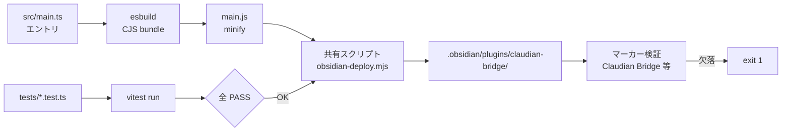

> 📂 **パス**: `80_POC_Projects/POC_017_ClaudianBridge/03_開発文書/06_ビルド設定.md`
> 📍 **ソース**: `D:\AI-Agent\ClaudianBridge\`
> 🎯 **目的**: Claudian Bridge プラグインのビルド・テスト・デプロイ設定

---

## 📐 概要

TypeScript + esbuild で `src/main.ts` を単一 `main.js`（CJS）にバンドルし、
`scripts/deploy.mjs` で Obsidian のプラグインフォルダへコピーする。
テストは vitest（Node 環境）で実行する。

> 🔧 **v1.2.0（2026-08-15）**: デプロイを共有スクリプト `D:\AI-Agent\_devtools\obsidian-deploy.mjs` に統一。
> `npm run build` にデプロイ + 文字列マーカー検証を統合し、**古い main.js の誤デプロイを防止**。

---

## 🛠️ ビルド環境

| 項目 | ツール | バージョン |
|------|------|------|
| **言語** | TypeScript | 5.x |
| **バンドラー** | esbuild | 0.24+ |
| **テスト** | vitest | 2.x |
| **ランタイム** | Node.js | 20+ |
| **対象 API** | Obsidian | 1.7.2+ |

---

## ⚙️ npm スクリプト

| タスク | コマンド | 説明 |
|------|------|------|
| **ビルド+デプロイ** | `npm run build` | esbuild production → `main.js`（minify）→ 共有スクリプトでデプロイ + マーカー検証 |
| **開発ビルド** | `npm run dev` | esbuild watch（minify なし）+ ビルド成功ごとに自動デプロイ + マーカー検証 |
| **テスト** | `npm test` | vitest 全テスト実行 |
| **デプロイのみ** | `npm run deploy` | 共有スクリプトでビルド済み成果物を `.obsidian/plugins/claudian-bridge/` へコピー |
| **型チェック** | `npm run typecheck` | `tsc -noEmit` |

---

## 📦 ビルドフロー

> `npm run build` で `C → D → E → F` まで一気通貫。デプロイ忘れや「ビルドは通ったが中身が古い」を防止する。

> **開発時**: `npm run dev` で esbuild watch が起動し、ファイル保存のたびに再ビルド → 共有スクリプトで自動デプロイ。
> ビルドエラー時はデプロイをスキップ（stale main.js 誤デプロイ防止）。**Hot-Reload プラグイン**（`.obsidian/plugins/hot-reload/`）有効時は
> Obsidian 側も自動リロードされ、「保存 → ビルド → デプロイ → リロード」が完結する。

---

## 🔧 ビルド設定の要点

### esbuild.config.mjs

- entry: `src/main.ts`、outfile: `main.js`
- `external: ['obsidian', 'electron', ...builtin-modules]`
- `format: 'cjs'`、`target: 'es2022'`、`sourcemap: 'inline'`、`minify: prod`
- dev（watch）時は plugin `build.onEnd` でビルド成功ごとに `scripts/deploy.mjs` を自動実行（エラー時はスキップ）

### scripts/deploy.mjs（共有スクリプト呼び出し）

- `D:\AI-Agent\_devtools\obsidian-deploy.mjs` を spawnSync で呼び出す薄いラッパー
- コピー対象: `main.js` / `manifest.json` / `styles.css` / `versions.json`
- コピー先: `C:\Users\superlambkin\OneDrive\Edge\Obsidian Vault\.obsidian\plugins\claudian-bridge\`
- Vault パスは環境変数 `OBSIDIAN_VAULT_PATH` で上書き可（詳細は `_devtools/README.md` 参照）

### manifest.json（src/manifest.json）

- `id: "claudian-bridge"`、`name: "Claudian Bridge"`、`isDesktopOnly: true`、`minAppVersion: "1.7.2"`
- `version: "0.22.0"`（v0.22.0 時点。設定画面のバージョン表示は `Plugin.manifest.version` から参照）
- デプロイ先: `C:\Users\superlambkin\OneDrive\Edge\Obsidian Vault\.obsidian\plugins\claudian-bridge\manifest.json`

> ⚠️ `main.js` は **minify されるため関数名はリネームされる**。
> デプロイ検証は文字列マーカー（`Claudian Bridge` / `claudian-bridge`）で確認する。
> 共有スクリプトがデプロイ後に自動検証し、欠落時は `exit 1` で失敗させる。

---

## 📋 リリース Checklist

### ビルド前

- [ ] `npm run typecheck` がエラーなし
- [ ] `npm test` が全 PASS（**592 passed / 1 skipped**・65 テストファイル）
- [ ] バージョン番号を `package.json` / `src/manifest.json` で更新

### ビルド後

- [ ] `main.js` が生成済み
- [ ] `npm run deploy` で 4 ファイル（`main.js` / `manifest.json` / `styles.css` / `versions.json`）が `.obsidian/plugins/claudian-bridge/` に反映
- [ ] Obsidian でプラグイン再読み込みし動作確認

---

## 🔗 関連リンク

- [[01_環境設定|環境設定]]
- [[02_コード規約|コード規約]]
- [[../05_デプロイ運用/00_デプロイアーキテクチャ|デプロイアーキテクチャ]]

---

## 📝 更新履歴

| バージョン | 日付 | 修正内容 | 修正者 |
|------|------|---------|--------|
| v1.4.1 | 2026-08-18 | manifest.json バージョンを v0.22.0 に修正・テスト件数 592→740 反映 | MiuMiu 🐾 |
| v1.4.0 | 2026-08-17 | **v0.19.0 実態へ更新**：テスト件数 29→592 passed・デプロイ 4 ファイル・manifest.json 実 URL 追記 | MiuMiu 🐾 |
| v1.3.0 | 2026-08-15 | dev watch に自動デプロイ統合・Hot-Reload 併用手順追記 | MiuMiu 🐾 |
| v1.2.0 | 2026-08-15 | 共有デプロイスクリプト導入・build に deploy 統合・マーカー検証追加 | MiuMiu 🐾 |
| v1.1.0 | 2026-08-10 | P2 実装に合わせて実際のビルド設定に更新 | MiuMiu 🐾 |

---

*⚙️ ビルド設定 v1.4.1 · esbuild + vitest · POC_017 Claudian Bridge · MiuMiu 🐾*
