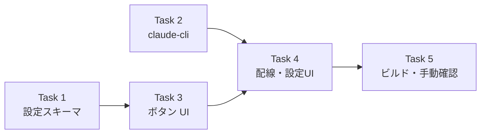

# AI読み上げボタン 実装計画

> **For agentic workers:** REQUIRED SUB-SKILL: Use superpowers:subagent-driven-development (recommended) or superpowers:executing-plans to implement this plan task-by-task. Steps use checkbox (`- [ ]`) syntax for tracking.

> 📂 パス：`80_POC_Projects/POC_017_ClaudianBridge/03_開発文書/16_AI読み上げボタン実装計画.md`
> 📅 作成日：2026-08-16
> 🐕 担当：MiuMiu 🐾
> 🔗 設計書：[[../02_設計文書/2026-08-16-input-ai-read-button-design|AI読み上げボタン設計]]

**Goal:** ClaudianChat 入力欄ツールバー右端に ✨AI読み上げボタンを追加し、入力文を Claude Code CLI で指令文に整形 → 入力欄上書き → 既存 TTS パイプラインで読み上げる。

**Architecture:** 新規 `features/llm/claude-cli.ts`（`claude -p` 呼び出し・UI 非依存）と `features/tts/input-ai-read-button.ts`（UI 注入）に分離。既存 `addTextToTTS` にそのまま繋ぎ、`toolbar-buttons.ts` 等の既存モジュールには触れない。設定は `tts.inputAi.enabled`（デフォルト true）で無効化。

**Tech Stack:** TypeScript (strict), Obsidian API, Node child_process (spawn), vitest (Node + jsdom)

## Global Constraints

- リポジトリ: `D:/AI-Agent/ClaudianBridge`（git あり・main ブランチで直接コミット運用）
- テストランナー: `npx vitest run`（リポジトリルートで実行）
- 型チェック: `npm run typecheck`（tsc -noEmit・必ずエラー 0）
- ビルド: `npm run build`（esbuild + deploy.mjs で vault へ自動デプロイ）
- 設計書の決定事項を厳守: 失敗時は**元文を保持して元文を読み上げる**／整形後言語は**入力と同一言語**／上書き後は**Notice で元文を表示**
- 既存ファイルへの修正は指定箇所のみ（surgical）。`toolbar-buttons.ts` は修正禁止
- Node の Windows 教訓: `spawn` の ENOENT は cwd 不存在の誤報が多い／`shell: true` へ args 配列は渡さない（DEP0190）

---

### Task 1: 設定スキーマ — `tts.inputAi`

**Files:**
- Modify: `src/core/settings.ts`（interface 372-387 行付近・DEFAULT 414-425 行付近・normalize 509-563 行付近・validate 570-604 行付近）
- Test: `tests/core/settings.test.ts`（末尾に describe 追加）

**Interfaces:**
- Produces: `ClaudianBridgeSettings['tts']['inputAi']: { enabled: boolean }`（optional・正規化後は必ず存在）。以降のタスクは `cfg.tts.inputAi?.enabled !== false` で判定する（undefined は有効扱い）

- [ ] **Step 1: 失敗テストを書く**

`tests/core/settings.test.ts` 末尾に追加:

```typescript
describe('tts.inputAi (v0.16 AI読み上げボタン)', () => {
  it('未設定時はデフォルト { enabled: true } を補完する', () => {
    const cfg = normalizeClaudianBridgeSettings({ tts: { enabled: true, engine: 'edge' } });
    expect(cfg.tts.inputAi).toEqual({ enabled: true });
  });

  it('enabled=false を保持する', () => {
    const cfg = normalizeClaudianBridgeSettings({
      tts: { enabled: true, engine: 'edge', inputAi: { enabled: false } },
    });
    expect(cfg.tts.inputAi).toEqual({ enabled: false });
  });

  it('型が不正な値はデフォルトへフォールバックする', () => {
    const cfg = normalizeClaudianBridgeSettings({
      tts: { enabled: true, engine: 'edge', inputAi: { enabled: 'yes' } as never },
    });
    expect(cfg.tts.inputAi).toEqual({ enabled: true });
  });

  it('validate が inputAi.enabled の型を検証する', () => {
    const bad = normalizeClaudianBridgeSettings({});
    (bad.tts.inputAi as { enabled: unknown }).enabled = 1;
    expect(validateClaudianBridgeSettings(bad)).toContain('tts.inputAi.enabled');
  });
});
```

※ 既存 describe と同名インポート（`normalizeClaudianBridgeSettings`, `validateClaudianBridgeSettings`）が既にあるはず。無ければ import 文に追加。

- [ ] **Step 2: テストを実行して失敗を確認**

Run: `npx vitest run tests/core/settings.test.ts`
Expected: FAIL（`cfg.tts.inputAi` が `undefined` / プロパティが存在しない）

- [ ] **Step 3: 実装（最小限）**

`src/core/settings.ts` の 4 箇所:

(a) interface の `tts` ブロック（`excludeCallouts?: boolean;` の直後）:

```typescript
    /** v0.16.0: AI読み上げボタン（入力文をAIで整形して読み上げ）。 */
    inputAi?: { enabled: boolean };
```

(b) `DEFAULT_CLAUDIAN_BRIDGE_SETTINGS.tts`（`excludeCallouts: true,` の直後）:

```typescript
    inputAi: { enabled: true },
```

(c) `normalizeClaudianBridgeSettings` の `tts` ブロック（`excludeCallouts: ...,` の直後）:

```typescript
      inputAi: {
        enabled: typeof r.tts?.inputAi?.enabled === 'boolean' ? r.tts.inputAi.enabled : true,
      },
```

※ interface に `inputAi?: { enabled: boolean }` を追加した後なら (a) のキャスト不要でそのまま型が通る。raw の不正値（`enabled: 'yes'` 等）は typeof ガードでデフォルトへフォールバックする。

(d) `validateClaudianBridgeSettings`（`tts.autoRead` ブロック 602-605 行の閉じ `}` の直後）:

```typescript
  if (cfg.tts.inputAi !== undefined && typeof cfg.tts.inputAi.enabled !== 'boolean') return 'tts.inputAi.enabled は boolean である必要があります';
```

- [ ] **Step 4: テスト通過を確認**

Run: `npx vitest run tests/core/settings.test.ts`
Expected: PASS（全件）

- [ ] **Step 5: コミット**

```bash
cd D:/AI-Agent/ClaudianBridge
git add src/core/settings.ts tests/core/settings.test.ts
git commit -m "feat(tts): add tts.inputAi settings schema for AI read-aloud button"
```

---

### Task 2: Claude CLI 呼び出しモジュール — `features/llm/claude-cli.ts`

**Files:**
- Create: `src/features/llm/claude-cli.ts`
- Test: `tests/features/llm/claude-cli.test.ts`（新規・`tests/features/llm/` ディレクトリも作成）

**Interfaces:**
- Produces（Task 3 が消費）:
  - `runClaudePrompt(prompt: string, opts?: ClaudeCliOptions): Promise<string | null>` — 成功時 stdout（trim 済み）、失敗・タイムアウト・空応答時 `null`
  - `polishInstruction(text: string, opts?: ClaudeCliOptions): Promise<string | null>`
  - `buildPolishPrompt(text: string): string`
  - `interface ClaudeCliOptions { timeoutMs?: number }`

- [ ] **Step 1: 失敗テストを書く**

`tests/features/llm/claude-cli.test.ts` を新規作成:

```typescript
import { describe, it, expect, vi, beforeEach } from 'vitest';

// child_process をモック（spawn 相当のフェイクを返す）
const spawnMock = vi.fn();
vi.mock('child_process', async (importOriginal) => {
  const orig = await importOriginal<typeof import('child_process')>();
  return { ...orig, spawn: (...a: unknown[]) => spawnMock(...a) };
});

import { runClaudePrompt, polishInstruction, buildPolishPrompt } from '../../../src/features/llm/claude-cli';

/** exit 0 で stdout に応答を返すフェイク child */
function fakeChild(stdout: string, code = 0) {
  const listeners: Record<string, ((...a: unknown[]) => void)[]> = {};
  return {
    pid: 1234,
    on: (ev: string, fn: (...a: unknown[]) => void) => { (listeners[ev] ??= []).push(fn); },
    stdout: { on: (ev: string, fn: (d: Buffer) => void) => { if (ev === 'data' && stdout) fn(Buffer.from(stdout)); } },
    stderr: { on: () => { /* noop */ } },
    stdin: { write: vi.fn(), end: vi.fn() },
    kill: vi.fn(),
    _emit: (ev: string, ...a: unknown[]) => (listeners[ev] ?? []).forEach((fn) => fn(...a)),
  };
}

describe('buildPolishPrompt', () => {
  it('同一言語維持・整形文のみ出力の指示と入力文を含む', () => {
    const p = buildPolishPrompt('あれやっといて');
    expect(p).toContain('あれやっといて');
    expect(p).toContain('同じ言語');
  });
});

describe('runClaudePrompt', () => {
  beforeEach(() => { spawnMock.mockReset(); });

  it('成功時は trim 済み stdout を返す', async () => {
    spawnMock.mockReturnValue(fakeChild('  整形文です  \n'));
    const r = await runClaudePrompt('test', { timeoutMs: 5000 });
    expect(r).toBe('整形文です');
    expect(spawnMock).toHaveBeenCalledTimes(1);
  });

  it('prompt を stdin に書き込み -p フラグで起動する', async () => {
    const child = fakeChild('ok');
    spawnMock.mockReturnValue(child);
    await runClaudePrompt('プロンプト', { timeoutMs: 5000 });
    const [cmd, args] = spawnMock.mock.calls[0];
    expect(String(cmd)).toMatch(/claude/i);
    expect(args).toContain('-p');
    expect(child.stdin.write).toHaveBeenCalledWith('プロンプト');
    expect(child.stdin.end).toHaveBeenCalled();
  });

  it('空応答は null を返す', async () => {
    spawnMock.mockReturnValue(fakeChild('   \n'));
    expect(await runClaudePrompt('t', { timeoutMs: 5000 })).toBeNull();
  });

  it('spawn error は null を返す（例外を投げない）', async () => {
    const child = fakeChild('ok');
    spawnMock.mockReturnValue(child);
    const p = runClaudePrompt('t', { timeoutMs: 5000 });
    child._emit('error', new Error('ENOENT'));
    expect(await p).toBeNull();
  });

  it('exit code != 0 は null を返す', async () => {
    const child = fakeChild('out');
    spawnMock.mockReturnValue(child);
    const p = runClaudePrompt('t', { timeoutMs: 5000 });
    child._emit('close', 1);
    expect(await p).toBeNull();
  });

  it('タイムアウトで kill して null を返す', async () => {
    vi.useFakeTimers();
    try {
      const child = fakeChild('', 0); // close を発火させない
      spawnMock.mockReturnValue(child);
      const p = runClaudePrompt('t', { timeoutMs: 100 });
      vi.advanceTimersByTime(200);
      expect(child.kill).toHaveBeenCalled();
      child._emit('close', null);
      expect(await p).toBeNull();
    } finally {
      vi.useRealTimers();
    }
  });
});

describe('polishInstruction', () => {
  beforeEach(() => { spawnMock.mockReset(); });

  it('buildPolishPrompt の結果を stdin に渡し応答を返す', async () => {
    spawnMock.mockReturnValue(fakeChild('それをやっておいてください。'));
    const r = await polishInstruction('あれやっといて', { timeoutMs: 5000 });
    expect(r).toBe('それをやっておいてください。');
    const child = spawnMock.mock.results[0].value as { stdin: { write: vi.Mock } };
    expect(child.stdin.write).toHaveBeenCalledWith(buildPolishPrompt('あれやっといて'));
  });

  it('CLI 失敗時は null を返す', async () => {
    spawnMock.mockReturnValue(fakeChild('ok'));
    const child = spawnMock.mock.results?.[0]?.value;
    const p = polishInstruction('x', { timeoutMs: 5000 });
    (spawnMock.mock.results[0].value as ReturnType<typeof fakeChild>)._emit('error', new Error('boom'));
    expect(await p).toBeNull();
  });
});
```

- [ ] **Step 2: テストを実行して失敗を確認**

Run: `npx vitest run tests/features/llm/claude-cli.test.ts`
Expected: FAIL（モジュール `src/features/llm/claude-cli` が存在しない）

- [ ] **Step 3: 実装**

`src/features/llm/claude-cli.ts` を新規作成:

```typescript
/**
 * v0.16.0: Claude Code CLI（claude -p）実行モジュール。
 * AI読み上げボタンの「入力文 → 指令文整形」に使用。UI 非依存。
 *
 * プロンプトはコマンドライン引数ではなく stdin へ渡す
 * （CJK を含む引数の shell クォート問題・コマンドライン長制限を回避）。
 * Windows では spawn が .cmd を PATH 解決しないため `where` で解決する
 * （shell:true + args 配列は DEP0190 ため使用しない）。
 */
import { spawn, execFileSync } from 'child_process';

export interface ClaudeCliOptions {
  /** タイムアウト（ms）。既定 30000。超過で kill して null を返す */
  timeoutMs?: number;
}

const DEFAULT_TIMEOUT_MS = 30000;

/** Windows で claude コマンドのフルパスを解決（失敗時は 'claude' のまま shell フォールバック相当） */
function resolveClaudeCommand(): string {
  if (process.platform !== 'win32') return 'claude';
  try {
    const out = execFileSync('where', ['claude'], { encoding: 'utf-8', stdio: ['ignore', 'pipe', 'ignore'] }) as string;
    const first = out.split(/\r?\n/).map((l) => l.trim()).find((l) => l !== '');
    return first ?? 'claude';
  } catch {
    return 'claude';
  }
}

/** claude -p を実行し stdout を返す。失敗・タイムアウト・空応答は null */
export async function runClaudePrompt(prompt: string, opts?: ClaudeCliOptions): Promise<string | null> {
  const timeoutMs = opts?.timeoutMs ?? DEFAULT_TIMEOUT_MS;
  return new Promise((resolve) => {
    let settled = false;
    let out = '';
    let child: ReturnType<typeof spawn>;
    const settle = (v: string | null): void => {
      if (settled) return;
      settled = true;
      clearTimeout(timer);
      resolve(v);
    };

    let timer: ReturnType<typeof setTimeout>;
    try {
      child = spawn(resolveClaudeCommand(), ['-p'], { windowsHide: true });
    } catch (e) {
      console.warn('[cb-claude-cli] spawn threw:', e);
      resolve(null);
      return;
    }

    timer = setTimeout(() => {
      try { child.kill(); } catch { /* ignore */ }
      // kill により close が発火するのを待つ（settled ガードで二重解決なし）
    }, timeoutMs);

    child.stdout?.on('data', (d) => (out += d.toString()));
    child.stderr?.on('data', (d) => console.warn('[cb-claude-cli] stderr:', d.toString().slice(0, 200)));
    child.on('error', (e) => {
      console.warn('[cb-claude-cli] error:', e.message);
      settle(null);
    });
    child.on('close', (code) => {
      if (code === 0) {
        const trimmed = out.trim();
        settle(trimmed === '' ? null : trimmed);
      } else {
        console.warn('[cb-claude-cli] exit code:', code);
        settle(null);
      }
    });

    child.stdin?.write(prompt);
    child.stdin?.end();
  });
}

/** 整形用プロンプトを構築（設計書 3.2 節の固定テンプレート） */
export function buildPolishPrompt(text: string): string {
  return [
    'あなたは文章整形アシスタントです。以下のユーザー入力文の意図を解釈し、明確で分かりやすい指示文に整形してください。',
    '・入力文と同じ言語で出力すること',
    '・応答は整形した指示文のみ。説明・前置き・引用符・箇条書き記号を含めない',
    '',
    '--- 入力文 ---',
    text,
  ].join('\n');
}

/** 入力文を指令文に整形する。失敗時 null */
export async function polishInstruction(text: string, opts?: ClaudeCliOptions): Promise<string | null> {
  const r = await runClaudePrompt(buildPolishPrompt(text), opts);
  if (r === null) return null;
  // 応答がマークダウンコードフェンスで囲まれることがあるため剥がす
  const unfenced = r.replace(/^```[a-zA-Z]*\n([\s\S]*?)\n?```$/, '$1').trim();
  return unfenced === '' ? null : unfenced;
}
```

- [ ] **Step 4: テスト通過を確認**

Run: `npx vitest run tests/features/llm/claude-cli.test.ts`
Expected: PASS（全件）

- [ ] **Step 5: コミット**

```bash
cd D:/AI-Agent/ClaudianBridge
git add src/features/llm/claude-cli.ts tests/features/llm/claude-cli.test.ts
git commit -m "feat(llm): add claude -p CLI runner with polishInstruction for input text"
```

---

### Task 3: ✨AI読み上げボタン UI — `features/tts/input-ai-read-button.ts`

**Files:**
- Create: `src/features/tts/input-ai-read-button.ts`
- Test: `tests/features/tts/input-ai-read-button.test.ts`（新規）

**Interfaces:**
- Consumes: `polishInstruction(text: string, opts?: ClaudeCliOptions): Promise<string | null>`（Task 2）／`cfg.tts.inputAi?.enabled`（Task 1）
- Produces: `setupInputAiReadButton(deps: InputAiReadDeps): () => void`（Task 4 の main.ts が消費）
  - `interface InputAiReadDeps { store: ConfigStore; polish: (text: string) => Promise<string | null>; speak: (text: string) => Promise<boolean>; noticeFn?: (m: string) => void }`
- realclaudian DOM 実測（`main.js` 解析済み）: `.claudian-input-composer` 配下の `.claudian-input-wrapper` 内が textarea（`tab.dom.inputEl`）。realclaudian は `input` イベントをリッスンするため、上書き後に `dispatchEvent(new Event('input', { bubbles: true }))` が必要

- [ ] **Step 1: 失敗テストを書く**

`tests/features/tts/input-ai-read-button.test.ts` を新規作成:

```typescript
// @vitest-environment jsdom
import { describe, it, expect, vi, beforeEach } from 'vitest';
import { setupInputAiReadButton } from '../../../src/features/tts/input-ai-read-button';
import type { ConfigStore } from '../../../src/core/config-store';

/** .claudian-input-composer 構造を模倣（realclaudian main.js 実測に基づく） */
function makeComposer(text = ''): { toolbar: HTMLElement; textarea: HTMLTextAreaElement } {
  const composer = document.createElement('div');
  composer.className = 'claudian-input-composer';
  const wrapper = document.createElement('div');
  wrapper.className = 'claudian-input-wrapper';
  const textarea = document.createElement('textarea');
  textarea.value = text;
  wrapper.appendChild(textarea);
  const toolbar = document.createElement('div');
  toolbar.className = 'claudian-input-toolbar';
  composer.appendChild(wrapper);
  composer.appendChild(toolbar);
  document.body.appendChild(composer);
  return { toolbar, textarea };
}

function makeStore(opts?: { enabled?: boolean; inputAi?: boolean }) {
  let cfg = {
    tts: {
      enabled: opts?.enabled ?? true,
      engine: 'edge',
      voices: { edge: { zh: 'x', ja: 'n', en: 'a' } },
      inputAi: { enabled: opts?.inputAi ?? true },
    },
  };
  return {
    load: () => cfg,
    save: (c: typeof cfg) => { cfg = c; },
    onSave: () => () => { /* noop */ },
  } as unknown as ConfigStore;
}

describe('setupInputAiReadButton', () => {
  beforeEach(() => { document.body.innerHTML = ''; });

  it('ツールバーへボタンを 1 つ注入し、cleanup で削除する', () => {
    const { toolbar } = makeComposer('テスト');
    const cleanup = setupInputAiReadButton({ store: makeStore(), polish: vi.fn(), speak: vi.fn() });
    const btn = toolbar.querySelector('[data-cb-input-ai]');
    expect(btn).not.toBeNull();
    expect(toolbar.querySelectorAll('[data-cb-input-ai]').length).toBe(1);
    cleanup();
    expect(toolbar.querySelectorAll('[data-cb-input-ai]').length).toBe(0);
  });

  it('inputAi.enabled=false では注入しない', () => {
    const { toolbar } = makeComposer('テスト');
    setupInputAiReadButton({ store: makeStore({ inputAi: false }), polish: vi.fn(), speak: vi.fn() });
    expect(toolbar.querySelector('[data-cb-input-ai]')).toBeNull();
  });

  it('成功時: 整形文で入力欄を上書き + 元文 Notice + 整形文を読み上げ', async () => {
    const { textarea } = makeComposer('あれやっといて');
    const polish = vi.fn(async () => 'それを実行しておいてください。');
    const speak = vi.fn(async () => true);
    const noticeFn = vi.fn();
    setupInputAiReadButton({ store: makeStore(), polish, speak, noticeFn });
    (document.querySelector('[data-cb-input-ai]') as HTMLElement).click();
    await vi.waitFor(() => expect(speak).toHaveBeenCalledTimes(1));
    expect(textarea.value).toBe('それを実行しておいてください。');
    expect(speak.mock.calls[0][0]).toBe('それを実行しておいてください。');
    expect(noticeFn).toHaveBeenCalledWith(expect.stringContaining('あれやっといて'));
  });

  it('上書き時に input イベントが dispatch される（realclaudian 状態同期）', async () => {
    const { textarea } = makeComposer('x');
    const onInput = vi.fn();
    textarea.addEventListener('input', onInput);
    setupInputAiReadButton({ store: makeStore(), polish: vi.fn(async () => '整形済'), speak: vi.fn(async () => true), noticeFn: vi.fn() });
    (document.querySelector('[data-cb-input-ai]') as HTMLElement).click();
    await vi.waitFor(() => expect(onInput).toHaveBeenCalledTimes(1));
  });

  it('失敗時: 入力欄を上書きせず元文を読み上げる', async () => {
    const { textarea } = makeComposer('元の文章');
    const speak = vi.fn(async () => true);
    const noticeFn = vi.fn();
    setupInputAiReadButton({ store: makeStore(), polish: vi.fn(async () => null), speak, noticeFn });
    (document.querySelector('[data-cb-input-ai]') as HTMLElement).click();
    await vi.waitFor(() => expect(speak).toHaveBeenCalledTimes(1));
    expect(textarea.value).toBe('元の文章');
    expect(speak.mock.calls[0][0]).toBe('元の文章');
    expect(noticeFn).toHaveBeenCalledWith(expect.stringContaining('整形'));
  });

  it('空入力・ミュート中は読み上げない', async () => {
    const empty = makeComposer('   ');
    const speak = vi.fn(async () => true);
    const noticeFn = vi.fn();
    setupInputAiReadButton({ store: makeStore(), polish: vi.fn(), speak, noticeFn });
    (empty.toolbar.querySelector('[data-cb-input-ai]') as HTMLElement).click();
    expect(speak).not.toHaveBeenCalled();

    document.body.innerHTML = '';
    const muted = makeComposer('ある');
    setupInputAiReadButton({ store: makeStore({ enabled: false }), polish: vi.fn(), speak, noticeFn });
    (muted.toolbar.querySelector('[data-cb-input-ai]') as HTMLElement).click();
    expect(speak).not.toHaveBeenCalled();
    expect(noticeFn).toHaveBeenCalled();
  });

  it('実行中はボタンが disabled（二重クリックガード）', async () => {
    let resolvePolish!: (v: string | null) => void;
    const polish = vi.fn(() => new Promise<string | null>((r) => { resolvePolish = r; }));
    makeComposer('text');
    setupInputAiReadButton({ store: makeStore(), polish, speak: vi.fn(async () => true), noticeFn: vi.fn() });
    const btn = document.querySelector('[data-cb-input-ai]') as HTMLButtonElement;
    btn.click();
    expect(btn.disabled).toBe(true);
    resolvePolish('ok');
    await vi.waitFor(() => expect(btn.disabled).toBe(false));
  });
});
```

※ Step 1 のテスト内 `polishInstruction 失敗` 相当のテストは Task 2 で実施済みのため、ここでは `polish` dep を mock して UI フローのみ検証する。

- [ ] **Step 2: テストを実行して失敗を確認**

Run: `npx vitest run tests/features/tts/input-ai-read-button.test.ts`
Expected: FAIL（モジュールが存在しない）

- [ ] **Step 3: 実装**

`src/features/tts/input-ai-read-button.ts` を新規作成:

```typescript
/**
 * v0.16.0: ClaudianChat 入力ツールバー右端への ✨AI読み上げボタン。
 * クリックで: 入力文 → deps.polish（claude -p で指令文整形）→ 入力欄上書き
 * → deps.speak（addTextToTTS）で読み上げ。失敗時は元文のまま読み上げる。
 *
 * realclaudian 構造（main.js 実測）:
 *   .claudian-input-composer
 *     ├── .claudian-input-wrapper
 *     │     └── textarea          ← tab.dom.inputEl（input イベントで状態同期）
 *     └── .claudian-input-toolbar ← ミュート🔊 / 📖全文 / ✨(本ボタン) が並ぶ
 */
import { Notice } from 'obsidian';
import type { ConfigStore } from '../../core/config-store';

const TOOLBAR_SELECTOR = '.claudian-input-toolbar';
const INPUT_MARK = 'data-cb-input-ai';
const COMPOSER_SELECTOR = '.claudian-input-composer';

export interface InputAiReadDeps {
  store: ConfigStore;
  /** 入力文 → 整形文（失敗 null）。main.ts では polishInstruction を渡す */
  polish: (text: string) => Promise<string | null>;
  /** 読み上げ（main.ts では addTextToTTS wrapper を渡す） */
  speak: (text: string) => Promise<boolean>;
  noticeFn?: (m: string) => void;
}

/** ツールバーが属するチャット入力 textarea を取得 */
export function findClaudianInput(toolbar: Element): HTMLTextAreaElement | null {
  const composer = toolbar.closest(COMPOSER_SELECTOR) ?? document.querySelector(COMPOSER_SELECTOR);
  return (composer?.querySelector('textarea') as HTMLTextAreaElement | null) ?? null;
}

export function setupInputAiReadButton(deps: InputAiReadDeps): () => void {
  const notice = deps.noticeFn ?? ((m: string) => { new Notice(m); });

  const handleClick = async (btn: HTMLButtonElement): Promise<void> => {
    const cfg = deps.store.load();
    const input = findClaudianInput(btn);
    const original = (input?.value ?? '').trim();

    if (!cfg.tts.enabled) { notice('🔇 ミュート中です'); return; }
    if (!original) { notice('入力がありません'); return; }

    btn.disabled = true;
    btn.textContent = '⏳';
    try {
      const polished = await deps.polish(original);
      if (polished && input) {
        input.value = polished;
        // realclaudian は input イベントで内部状態（送信テキスト等）を同期する
        input.dispatchEvent(new Event('input', { bubbles: true }));
        notice(`元文: ${original}`);
        await deps.speak(polished);
      } else {
        notice('⚠️ 整形に失敗したため元文を読み上げます');
        await deps.speak(original);
      }
    } catch (e) {
      console.warn('[cb-input-ai] failed:', e);
      notice('⚠️ 整形に失敗したため元文を読み上げます');
      try { await deps.speak(original); } catch { /* ignore */ }
    } finally {
      btn.disabled = false;
      btn.textContent = '✨';
    }
  };

  const inject = (toolbar: Element): void => {
    if (deps.store.load().tts.inputAi?.enabled === false) return;
    if (toolbar.querySelector(`[${INPUT_MARK}]`)) return;
    const btn = document.createElement('button');
    btn.classList.add('claudian-action-btn', 'cb-input-ai-btn');
    btn.setAttribute(INPUT_MARK, 'true');
    btn.textContent = '✨';
    btn.title = 'AI読み上げ：入力文を整形して読み上げます';
    btn.addEventListener('click', () => { void handleClick(btn); });
    toolbar.appendChild(btn);
  };

  const scan = (): void => {
    document.querySelectorAll(TOOLBAR_SELECTOR).forEach(inject);
  };
  scan();

  const observer = new MutationObserver((mutations) => {
    let shouldScan = false;
    for (const m of mutations) {
      if (m.type !== 'childList') continue;
      for (const node of Array.from(m.addedNodes)) {
        if (node instanceof HTMLElement && (node.matches(TOOLBAR_SELECTOR) || node.querySelector(TOOLBAR_SELECTOR))) {
          shouldScan = true;
          break;
        }
      }
      if (shouldScan) break;
    }
    if (shouldScan) scan();
  });
  observer.observe(document.body, { childList: true, subtree: true });

  // 設定変更で表示/非表示を即時反映
  const offSave = deps.store.onSave(() => {
    if (deps.store.load().tts.inputAi?.enabled === false) {
      document.querySelectorAll(`[${INPUT_MARK}]`).forEach((el) => el.remove());
    } else {
      scan();
    }
  });

  return () => {
    offSave();
    observer.disconnect();
    document.querySelectorAll(`[${INPUT_MARK}]`).forEach((el) => el.remove());
  };
}
```

- [ ] **Step 4: テスト通過を確認**

Run: `npx vitest run tests/features/tts/input-ai-read-button.test.ts`
Expected: PASS（全件）

- [ ] **Step 5: コミット**

```bash
cd D:/AI-Agent/ClaudianBridge
git add src/features/tts/input-ai-read-button.ts tests/features/tts/input-ai-read-button.test.ts
git commit -m "feat(tts): add AI read-aloud button to ClaudianChat input toolbar"
```

---

### Task 4: 配線と設定 UI（i18n・設定タブ・main.ts・styles.css）

**Files:**
- Modify: `src/core/i18n.ts`（interface 94-98 行付近 + ja 321-325 行付近 + en 544-548 行付近 + zh 766 行付近の各 locale ブロック）
- Modify: `src/settings/SettingTabTts.ts`（autoRead セクション直後・272 行「6.」の直前）
- Modify: `src/main.ts`（221 行 `diag('message read button registered');` の直後）
- Modify: `styles.css`（末尾）
- Test: `npx vitest run` 全件 + `npm run typecheck`

**Interfaces:**
- Consumes: `setupInputAiReadButton(deps: InputAiReadDeps)`（Task 3）／`polishInstruction`（Task 2）／`cfg.tts.inputAi.enabled`（Task 1）

- [ ] **Step 1: i18n キーを追加**

`src/core/i18n.ts` の interface（`ttsFullTextBtnOff: string;` の直後）:

```typescript
  // v0.16.0: AI読み上げボタン
  ttsInputAiEnabled: string;
  ttsInputAiEnabledDesc: string;
```

各 locale ブロック（grep `ttsFullTextBtnOff` で 3 箇所: ja ≒325 行・en ≒548 行・zh ≒766 行）の `ttsFullTextBtnOff` 行の直後に:

ja:
```typescript
    ttsInputAiEnabled: 'AI読み上げボタン',
    ttsInputAiEnabledDesc: 'チャット入力欄の✨ボタン:入力文をAIで指令文に整形し、入力欄を上書きして読み上げます',
```

en:
```typescript
    ttsInputAiEnabled: 'AI read-aloud button',
    ttsInputAiEnabledDesc: '✨ button in the chat input toolbar: polishes your input into a clear instruction, overwrites the input, and reads it aloud',
```

zh:
```typescript
    ttsInputAiEnabled: 'AI朗读按钮',
    ttsInputAiEnabledDesc: '聊天输入栏的✨按钮：用AI将输入整理为清晰指令，覆盖输入栏并朗读',
```

- [ ] **Step 2: 設定タブにトグルを追加**

`src/settings/SettingTabTts.ts` の 272 行 `// 6. v0.10.0: Claude Code CLI 用設定` の直前に挿入:

```typescript
      // 5.5 v0.16.0: AI読み上げボタン（✨ 入力文を整形して読み上げ）
      new Setting(containerEl)
        .setName(s.ttsInputAiEnabled)
        .setDesc(s.ttsInputAiEnabledDesc)
        .addToggle((t) => t
          .setValue(cfg.tts.inputAi?.enabled ?? true)
          .onChange((v) => {
            try {
              const latest = store.load();
              store.save({ ...latest, tts: { ...latest.tts, inputAi: { enabled: v } } });
            } catch (e) {
              new Notice(s.noticeSaveFailed.replace('{msg}', (e as Error).message));
            }
          }),
        );
```

※ 挿入位置の直前が autoRead セクションの閉じ `}` の場合は `{}` ブロックで囲まず `containerEl` 直付けでも可（周囲のコード構造に合わせる）。`cfg` は display() 冒頭で `store.load()` された既存変数をそのまま使用。

- [ ] **Step 3: main.ts に配線**

import（`setupMessageReadButtons` の import 直後）:

```typescript
import { setupInputAiReadButton } from './features/tts/input-ai-read-button';
import { polishInstruction } from './features/llm/claude-cli';
```

onload（`diag('message read button registered');` の直後）:

```typescript
      // ★ v0.16.0: AI読み上げボタン（✨ 入力文を整形して読み上げ）
      this.register(setupInputAiReadButton({
        store: this.store,
        polish: (text) => polishInstruction(text),
        speak: async (text) => {
          const cfg = this.store.load();
          if (!cfg.tts.enabled) return false;
          return addTextToTTS(this.app, text, cfg.tts);
        },
      }));
      diag('input-ai-read button registered');
```

- [ ] **Step 4: styles.css にボタンスタイルを追加**

`styles.css` 末尾に:

```css
/* v0.16.0: AI読み上げボタン（ツールバー右端） */
.claudian-input-toolbar .cb-input-ai-btn {
  margin-inline-start: auto;
}
```

- [ ] **Step 5: 全テスト・型チェックで検証**

Run: `cd D:/AI-Agent/ClaudianBridge && npx vitest run && npm run typecheck`
Expected: 全テスト PASS・tsc エラー 0（既存テストの回帰なし）

- [ ] **Step 6: コミット**

```bash
cd D:/AI-Agent/ClaudianBridge
git add src/core/i18n.ts src/settings/SettingTabTts.ts src/main.ts styles.css
git commit -m "feat(tts): wire AI read-aloud button into settings tab, i18n and main.ts"
```

---

### Task 5: ビルド・デプロイ・手動確認

**Files:**
- 修正なし（ビルドと実機確認のみ）

**Interfaces:**
- Consumes: 全タスクの成果物

- [ ] **Step 1: ビルド + vault へデプロイ**

Run: `cd D:/AI-Agent/ClaudianBridge && npm run build`
Expected: esbuild 成功 + deploy.mjs のマーカー検証 OK（exit 0）。hot-reload により Obsidian が自動リロード

- [ ] **Step 2: 実機手動確認（UAT）**

Obsidian の ClaudianChat で以下を確認:

| # | 確認項目 | 期待結果 |
|:-:|----------|----------|
| 1 | 入力ツールバー右端に ✨ ボタン表示 | 🔊/📖 の右側・右端寄せで表示 |
| 2 | 「あれやっといて」入力 → ✨ クリック | ⏳ 表示 → 数秒後入力欄が整形文に上書き + 元文 Notice + 読み上げ |
| 3 | 読み上げ音声 | 設定の TTS エンジン（edge/webspeech/plachta）に従う |
| 4 | 設定タブでトグル OFF | ✨ ボタンが即時消える |
| 5 | トグル ON に戻す | ✨ ボタンが復活 |
| 6 | 入力欄が空で ✨ クリック | 「入力がありません」Notice・読み上げなし |
| 7 | ミュート中に ✨ クリック | 「🔇 ミュート中です」Notice・読み上げなし |
| 8 | 整形後、Enter で送信 | 上書きされた整形文が送信される（input イベント同期の確認） |

- [ ] **Step 3: リリースノート更新**

`80_POC_Projects/POC_017_ClaudianBridge/08_説明書/03_リリースノート/リリースノート.md` に v0.16.0 エントリを追加（AI読み上げボタン機能）

- [ ] **Step 4: 最終コミット**

```bash
cd D:/AI-Agent/ClaudianBridge
git status   # main.js が更新されているはず（gitignore 対象外）
git add -A
git commit -m "chore(release): build v0.16.0 with AI read-aloud button"
```

---

## 📋 タスク間依存



---

*📅 2026-08-16 · MiuMiu 🐾 · [[../02_設計文書/2026-08-16-input-ai-read-button-design|設計書]]に基づく実装計画*
