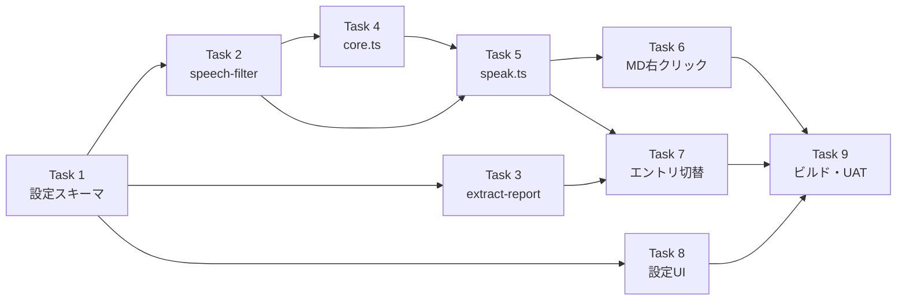

# TTS 読み上げ仕様改良 実装計画

> **For agentic workers:** REQUIRED SUB-SKILL: Use superpowers:subagent-driven-development (recommended) or superpowers:executing-plans to implement this plan task-by-task. Steps use checkbox (`- [ ]`) syntax for tracking.

> 📂 パス：`80_POC_Projects/POC_017_ClaudianBridge/03_開発文書/17_TTS読み上げ仕様改良実装計画.md`
> 📅 作成日：2026-08-16
> 🐕 担当：MiuMiu 🐾
> 🔗 設計書：[[../02_設計文書/2026-08-16-tts-read-spec-enhancement-design|TTS 読み上げ仕様改良設計]]

**Goal:** TTS 読み上げの仕様を統一（空テキスト/失敗時挙動）、MD ファイル右クリック「Add to TTS」を追加、3 エンジン共通チャンク上限 140 字（設定 50-140）、speech_filter を読み上げタイプ別に 8 項目×4 タイプで個別設定可能にする。

**Architecture:** 共通 `speakText(type, text, cfg)` 関数（`features/tts/speak.ts`）を新設し全エントリポイントから呼ぶ。テキスト正規化フィルタ（絵文字系 4 項目）は `speech-filter.ts` で適用、DOM 除外（コールアウト/テーブル/コード/思考）は各抽出レイヤーがタイプ別設定に従う。チャンク上限は `tts.chunkMaxChars` に一元化。edge の先行 spawn パイプラインは **claude-tts スキルに synth コマンドが無いため後回し**（edge は逐次再生のまま・チャンク上限のみ設定化）。

**Tech Stack:** TypeScript (strict), Obsidian API, Node child_process (spawn), vitest (Node + jsdom)

## Global Constraints

- リポジトリ: `D:/AI-Agent/ClaudianBridge`（git あり・main ブランチで直接コミット運用）
- テストランナー: `npx vitest run`（リポジトリルートで実行）
- 型チェック: `npm run typecheck`（tsc -noEmit・必ずエラー 0）
- ビルド: `npm run build`（esbuild + deploy.mjs で vault へ自動デプロイ）
- 設計書の決定事項を厳守:
  - チェック = **含めて読む**（true の項目は除去しない）
  - MD 読み上げ対象 = **本文のみ**（frontmatter・コードブロック除去）。フィルタは `speechFilter.selection` を共有
  - ②自動読み上げの「📢報告なし」は **静かにスキップ**
  - edge 先行 spawn は **後回し**（claude-tts スキルに synth コマンド追加が前提・別タスク）
- 既存 `toolbar-buttons.ts`（ミュート・📖全文）は修正禁止
- 既存 `cli.speech_filter` は ⑥CLI 用（voice-config 同期）として維持
- Node の Windows 教訓: `spawn` の ENOENT は cwd 不存在の誤報が多い／`shell: true` へ args 配列は渡さない（DEP0190）

---

### Task 1: 設定スキーマ — `tts.chunkMaxChars` + `tts.speechFilter`

**Files:**
- Modify: `src/core/settings.ts`（interface 372-387 付近・DEFAULT 414-425 付近・normalize 509-563 付近・validate 570-604 付近）
- Test: `tests/core/settings.test.ts`（末尾に describe 追加）

**Interfaces:**
- Produces（以降のタスクが消費）:
  - `interface SpeechFilterOptions { emoji; kaomoji; ascii_emoticon; emoji_shortcode; callout; table; code; thinking: boolean }`
  - `DEFAULT_SPEECH_FILTER_OPTIONS: SpeechFilterOptions`（テーブルのみ true・他 false）
  - `CHUNK_MAX_CHARS_MIN = 50` / `CHUNK_MAX_CHARS_MAX = 140` / `DEFAULT_CHUNK_MAX_CHARS = 140`
  - `ClaudianBridgeSettings['tts']` に `chunkMaxChars: number` と `speechFilter: { selection; autoRead; message; inputAi: SpeechFilterOptions }` を追加（正規化後は必ず存在）

- [ ] **Step 1: 失敗テストを書く**

`tests/core/settings.test.ts` 末尾に追加:

```typescript
describe('tts.chunkMaxChars / tts.speechFilter (v0.17 仕様改良)', () => {
  it('未設定時はデフォルト（chunkMaxChars=140・speechFilter は table のみ ON）を補完する', () => {
    const cfg = normalizeClaudianBridgeSettings({ tts: { enabled: true, engine: 'edge' } });
    expect(cfg.tts.chunkMaxChars).toBe(140);
    expect(cfg.tts.speechFilter.selection).toEqual({ emoji: false, kaomoji: false, ascii_emoticon: false, emoji_shortcode: false, callout: false, table: true, code: false, thinking: false });
  });

  it('chunkMaxChars は 50〜140 にクランプされる', () => {
    const cfg = normalizeClaudianBridgeSettings({ tts: { enabled: true, engine: 'edge', chunkMaxChars: 999 } });
    expect(cfg.tts.chunkMaxChars).toBe(140);
    const cfg2 = normalizeClaudianBridgeSettings({ tts: { enabled: true, engine: 'edge', chunkMaxChars: 10 } });
    expect(cfg2.tts.chunkMaxChars).toBe(50);
  });

  it('speechFilter の各タイプを保持する', () => {
    const raw = { tts: { enabled: true, engine: 'edge', speechFilter: { message: { emoji: true, table: false } } } };
    const cfg = normalizeClaudianBridgeSettings(raw as never);
    expect(cfg.tts.speechFilter.message.emoji).toBe(true);
    expect(cfg.tts.speechFilter.message.table).toBe(false);
    // 未指定タイプはデフォルト
    expect(cfg.tts.speechFilter.autoRead).toEqual(cfg.tts.speechFilter.selection);
  });

  it('マイグレーション: 既存 cli.speech_filter(ON=除去) を全タイプへ反転して引き継ぐ', () => {
    const raw = { tts: { enabled: true, engine: 'edge', cli: { speech_filter: { emoji: true, kaomoji: false } } } };
    const cfg = normalizeClaudianBridgeSettings(raw as never);
    expect(cfg.tts.speechFilter.selection.emoji).toBe(false);      // 旧 true(除去) → 新 false(読まない)
    expect(cfg.tts.speechFilter.selection.kaomoji).toBe(true);     // 旧 false → 新 true(読む)
  });

  it('マイグレーション: 既存 excludeCallouts を callout へ反転して引き継ぐ', () => {
    const raw = { tts: { enabled: true, engine: 'edge', excludeCallouts: true } };
    const cfg = normalizeClaudianBridgeSettings(raw as never);
    expect(cfg.tts.speechFilter.selection.callout).toBe(false);    // 旧 true(除外) → 新 false(読まない)
  });

  it('validate が chunkMaxChars と speechFilter を検証する', () => {
    const bad = normalizeClaudianBridgeSettings({});
    (bad.tts.chunkMaxChars as unknown) = 30;
    expect(validateClaudianBridgeSettings(bad)).toContain('tts.chunkMaxChars');
    const bad2 = normalizeClaudianBridgeSettings({});
    (bad2.tts.speechFilter.selection as { emoji: unknown }).emoji = 'x';
    expect(validateClaudianBridgeSettings(bad2)).toContain('tts.speechFilter');
  });
});
```

- [ ] **Step 2: テストを実行して失敗を確認**

Run: `npx vitest run tests/core/settings.test.ts`
Expected: FAIL（`cfg.tts.chunkMaxChars` / `cfg.tts.speechFilter` が存在しない）

- [ ] **Step 3: 実装**

`src/core/settings.ts` の 5 箇所:

(a) ファイル先頭付近（`DEFAULT_TTS_CLI_SETTINGS` 定義の近く）に定数と型を追加:

```typescript
export const CHUNK_MAX_CHARS_MIN = 50;
export const CHUNK_MAX_CHARS_MAX = 140;
export const DEFAULT_CHUNK_MAX_CHARS = 140;

/** v0.17.0: 読み上げタイプ別フィルタ（チェック=含めて読む。true の項目は除去しない） */
export interface SpeechFilterOptions {
  emoji: boolean;
  kaomoji: boolean;
  ascii_emoticon: boolean;
  emoji_shortcode: boolean;
  callout: boolean;
  table: boolean;
  code: boolean;
  thinking: boolean;
}

export const DEFAULT_SPEECH_FILTER_OPTIONS: SpeechFilterOptions = {
  emoji: false,
  kaomoji: false,
  ascii_emoticon: false,
  emoji_shortcode: false,
  callout: false,
  table: true,
  code: false,
  thinking: false,
};

export type TtsSpeechFilterSection = 'selection' | 'autoRead' | 'message' | 'inputAi';
export type TtsSpeechFilters = Record<TtsSpeechFilterSection, SpeechFilterOptions>;
```

(b) interface の `tts` ブロック（`inputAi?: { enabled: boolean };` の直後）:

```typescript
    /** v0.17.0: 全エンジン共通の1チャンク上限（50〜140・既定 140） */
    chunkMaxChars: number;
    /** v0.17.0: 読み上げタイプ別フィルタ（チェック=含めて読む） */
    speechFilter: TtsSpeechFilters;
```

(c) `DEFAULT_CLAUDIAN_BRIDGE_SETTINGS.tts`（`inputAi: { enabled: true },` の直後）:

```typescript
    chunkMaxChars: DEFAULT_CHUNK_MAX_CHARS,
    speechFilter: {
      selection: { ...DEFAULT_SPEECH_FILTER_OPTIONS },
      autoRead: { ...DEFAULT_SPEECH_FILTER_OPTIONS },
      message: { ...DEFAULT_SPEECH_FILTER_OPTIONS },
      inputAi: { ...DEFAULT_SPEECH_FILTER_OPTIONS },
    },
```

(d) `normalizeClaudianBridgeSettings` の `tts` ブロック（`inputAi: {...},` の直後）:

```typescript
      chunkMaxChars: clampChunkMaxChars(r.tts?.chunkMaxChars),
      speechFilter: normalizeTtsSpeechFilters(r.tts),
```

`normalizeClaudianBridgeSettings` 関数の外（モジュールスコープ）にヘルパーを追加:

```typescript
function clampChunkMaxChars(v: unknown): number {
  if (typeof v !== 'number' || !Number.isFinite(v)) return DEFAULT_CHUNK_MAX_CHARS;
  return Math.max(CHUNK_MAX_CHARS_MIN, Math.min(CHUNK_MAX_CHARS_MAX, Math.round(v)));
}

function normalizeSpeechFilterOptions(
  raw: Partial<SpeechFilterOptions> | undefined,
  legacy?: Partial<SpeechFilterOptions>,
): SpeechFilterOptions {
  const base = { ...DEFAULT_SPEECH_FILTER_OPTIONS };
  for (const k of Object.keys(base) as (keyof SpeechFilterOptions)[]) {
    // レガシー値（旧 cli.speech_filter / excludeCallouts 由来・ON=除去）を反転して反映。
    // undefined のキーはスキップ（!undefined === true の誤マッピングを防ぐ）。
    if (legacy && typeof legacy[k] === 'boolean') base[k] = !(legacy[k] as boolean);
    // 新フィールドの明示値はそのまま採用（不正な undefined はデフォルトのまま）
    if (raw && typeof raw[k] === 'boolean') base[k] = raw[k] as boolean;
  }
  return base;
}

function normalizeTtsSpeechFilters(r: { tts?: unknown }): TtsSpeechFilters {
  const tts = (r.tts ?? {}) as {
    speechFilter?: Partial<Record<TtsSpeechFilterSection, Partial<SpeechFilterOptions>>>;
    cli?: { speech_filter?: Partial<SpeechFilterOptions> };
    excludeCallouts?: unknown;
  };
  const hasNew = typeof tts.speechFilter === 'object' && tts.speechFilter !== null;
  // レガシー値を合成（undefined はスキップされるためそのまま含めて良い）
  const legacyCombined: Partial<SpeechFilterOptions> = {
    emoji: tts.cli?.speech_filter?.emoji,
    kaomoji: tts.cli?.speech_filter?.kaomoji,
    ascii_emoticon: tts.cli?.speech_filter?.ascii_emoticon,
    emoji_shortcode: tts.cli?.speech_filter?.emoji_shortcode,
    callout: typeof tts.excludeCallouts === 'boolean' ? !tts.excludeCallouts : undefined,
  };
  const sections: TtsSpeechFilterSection[] = ['selection', 'autoRead', 'message', 'inputAi'];
  const out = {} as TtsSpeechFilters;
  for (const sec of sections) {
    const rawSec = hasNew ? tts.speechFilter?.[sec] : undefined;
    // 新フィールドが一部でも存在するタイプは新値優先、無ければレガシー値で初期化
    out[sec] = hasNew && rawSec !== undefined
      ? normalizeSpeechFilterOptions(rawSec, undefined)
      : normalizeSpeechFilterOptions(undefined, legacyCombined);
  }
  return out;
}
```

(e) `validateClaudianBridgeSettings`（`tts.inputAi` 検証の直後）:

```typescript
  if (typeof cfg.tts.chunkMaxChars !== 'number' || cfg.tts.chunkMaxChars < CHUNK_MAX_CHARS_MIN || cfg.tts.chunkMaxChars > CHUNK_MAX_CHARS_MAX) return 'tts.chunkMaxChars は 50〜140 の数値である必要があります';
  if (typeof cfg.tts.speechFilter !== 'object' || cfg.tts.speechFilter === null) return 'tts.speechFilter はオブジェクトである必要があります';
  for (const sec of ['selection', 'autoRead', 'message', 'inputAi'] as const) {
    const f = cfg.tts.speechFilter?.[sec];
    if (typeof f !== 'object' || f === null) return `tts.speechFilter.${sec} はオブジェクトである必要があります`;
    for (const k of ['emoji', 'kaomoji', 'ascii_emoticon', 'emoji_shortcode', 'callout', 'table', 'code', 'thinking'] as const) {
      if (typeof f[k] !== 'boolean') return `tts.speechFilter.${sec}.${k} は boolean である必要があります`;
    }
  }
```

- [ ] **Step 4: テスト通過を確認**

Run: `npx vitest run tests/core/settings.test.ts`
Expected: PASS（全件）

- [ ] **Step 5: コミット**

```bash
cd D:/AI-Agent/ClaudianBridge
git add src/core/settings.ts tests/core/settings.test.ts
git commit -m "feat(tts): add chunkMaxChars and per-type speechFilter settings with migration"
```

---

### Task 2: speech-filter モジュール分離（8 項目・チェック=読むに反転）

> ⚠️ プリフライト修正（2026-08-16）: 旧 `filterSpeechText`（ON=除去）を削除すると core.test.ts が赤くなるため、**本タスクでは core.ts を変更しない**。speech-filter.ts を新規作成するのみ。core.ts の旧 `filterSpeechText` 削除と re-export 化は Task 4 で実施（この間、core.ts の旧関数は残置・既存テストは通る）。

**Files:**
- Create: `src/features/tts/speech-filter.ts`
- Test: `tests/features/tts/speech-filter.test.ts`（新規）

**Interfaces:**
- Consumes: `SpeechFilterOptions`（Task 1）
- Produces: `filterSpeechText(text: string, filter: Partial<SpeechFilterOptions>): string`（**false の項目を除去**・true=読む）。以降のタスクが使用

- [ ] **Step 1: 失敗テストを書く**

`tests/features/tts/speech-filter.test.ts` を新規作成:

```typescript
import { describe, it, expect } from 'vitest';
import { filterSpeechText } from '../../../src/features/tts/speech-filter';
import type { SpeechFilterOptions } from '../../../src/core/settings';

const ALL_TRUE: SpeechFilterOptions = { emoji: true, kaomoji: true, ascii_emoticon: true, emoji_shortcode: true, callout: true, table: true, code: true, thinking: true };

describe('filterSpeechText (v0.17 チェック=読む)', () => {
  it('全 true（読む）ならテキストをそのまま返す', () => {
    expect(filterSpeechText('📢 完了 :tada: (^_^) :)', ALL_TRUE)).toBe('📢 完了 :tada: (^_^) :)');
  });

  it('emoji=false なら絵文字を除去する', () => {
    const f = { ...ALL_TRUE, emoji: false };
    expect(filterSpeechText('📢 完了', f)).not.toContain('📢');
  });

  it('kaomoji=false なら顔文字を除去する', () => {
    const f = { ...ALL_TRUE, kaomoji: false };
    expect(filterSpeechText('OK (^_^)', f)).toBe('OK');
  });

  it('ascii_emoticon=false なら ASCII 表情を除去する', () => {
    const f = { ...ALL_TRUE, ascii_emoticon: false };
    expect(filterSpeechText('great :)', f)).toBe('great');
  });

  it('emoji_shortcode=false なら短コードを除去する', () => {
    const f = { ...ALL_TRUE, emoji_shortcode: false };
    expect(filterSpeechText(':tada:', f)).toBe('');
  });

  it('空になった括弧対を除去する', () => {
    const f = { ...ALL_TRUE, kaomoji: false };
    expect(filterSpeechText('abc（　）', f)).toBe('abc');
  });
});
```

- [ ] **Step 2: テストを実行して失敗を確認**

Run: `npx vitest run tests/features/tts/speech-filter.test.ts`
Expected: FAIL（`src/features/tts/speech-filter` が存在しない）

- [ ] **Step 3: 実装**

`src/features/tts/speech-filter.ts` を新規作成（core.ts から正規表現と stripKaomoji を移設・意味を反転）:

```typescript
/**
 * v0.17.0: 読み上げ文最適化（speech_filter）。
 * チェック=含めて読む。filter の各項目が false のとき該当要素を除去する。
 * （v0.12.1 の filterSpeechText を 8 項目設定に対応して分離・意味を反転）
 */
import type { SpeechFilterOptions } from '../../core/settings';

/** Emoji 主要 Unicode ブロック */
const EMOJI_RE = /[\u{1F000}-\u{1FAFF}\u{2600}-\u{27BF}\u{2B00}-\u{2BFF}️‍⃣]+/gu;
/** 顔文字特徴文字 */
const KAOMOJI_CHARS = new Set('^_*;Tω∀ﾟД≧≦´`･・艸皿><▽'.split(''));
/** ASCII 表情 */
const ASCII_EMOTICON_RE = /(?<![\w])(?::-?[)DdPp]+|;-?[)DdPp]|X-?[Dd]|<3+|>:\(?)(?![\w])/g;
/** Emoji 短コード :smile: */
const SHORTCODE_RE = /:[a-z0-9_+\-]{2,}:/g;
/** 空になった括弧対 */
const EMPTY_PAREN_RE = /[(（]\s*[)）]/g;

function stripKaomoji(text: string): string {
  return text.replace(/[(（]([^()（）]*)[)）]/g, (m, inner: string) => {
    const count = [...inner].filter((ch) => KAOMOJI_CHARS.has(ch)).length;
    return count >= 2 ? ' ' : m;
  });
}

/** filter の各項目: true=読む（除去しない）/ false=除去する */
export function filterSpeechText(text: string, filter: Partial<SpeechFilterOptions>): string {
  let t = text;
  if (filter.emoji === false) t = t.replace(EMOJI_RE, ' ');
  if (filter.kaomoji === false) t = stripKaomoji(t);
  if (filter.ascii_emoticon === false) t = t.replace(ASCII_EMOTICON_RE, ' ');
  if (filter.emoji_shortcode === false) t = t.replace(SHORTCODE_RE, ' ');
  t = t.replace(EMPTY_PAREN_RE, '');
  return t;
}
```

> 注: 本タスクでは **core.ts を変更しない**（旧 `filterSpeechText` は残置）。旧関数の削除と re-export 化は Task 4 で実施。

- [ ] **Step 4: テスト通過を確認**

Run: `npx vitest run tests/features/tts/speech-filter.test.ts`
Expected: PASS

- [ ] **Step 5: 既存テストの回帰確認**

Run: `npx vitest run tests/features/tts/core.test.ts`
Expected: PASS（core.ts 未変更のため回帰なし）

- [ ] **Step 6: コミット**

```bash
cd D:/AI-Agent/ClaudianBridge
git add src/features/tts/speech-filter.ts tests/features/tts/speech-filter.test.ts
git commit -m "feat(tts): add speech-filter module with 8-item read-toggle semantics"
```

---

### Task 3: extract-report のタイプ別除外セレクタ対応

> ⚠️ プリフライト修正（2026-08-16）: `buildSpeechExclude` のシグネチャ変更は `message-read-button.ts:46` の呼び出しを型エラーにするため、**本タスクで message-read-button.ts の呼び出しも最小修正**する（Task 7 で speakText 化する際に `resolveSpeechFilter` へ置き換える）。

**Files:**
- Modify: `src/features/tts/extract-report.ts`（`EXCLUDED_FROM_SPEECH` 分解・`buildSpeechExclude` を `SpeechFilterOptions` 受け取りに変更）
- Modify: `src/features/tts/message-read-button.ts`（`buildSpeechExclude` 呼び出しを新シグネチャに最小修正）
- Test: `tests/features/tts/extract-report.test.ts`（追加）

**Interfaces:**
- Consumes: `SpeechFilterOptions`（Task 1）
- Produces: `buildSpeechExclude(filter: SpeechFilterOptions): string`（thinking/code/callout/table の false 項目を除外セレクタに含める）。`extractReportText(messagesEl, scope, opts: { filter?: SpeechFilterOptions })`。以降のタスクが使用

- [ ] **Step 1: 失敗テストを書く**

`tests/features/tts/extract-report.test.ts` に追加:

```typescript
describe('buildSpeechExclude (v0.17 タイプ別)', () => {
  const T = { emoji: true, kaomoji: true, ascii_emoticon: true, emoji_shortcode: true, callout: true, table: true, code: true, thinking: true };

  it('全 true なら除外なし（空文字）', () => {
    expect(buildSpeechExclude({ ...T })).toBe('');
  });

  it('thinking=false なら思考ブロックを除外', () => {
    const s = buildSpeechExclude({ ...T, thinking: false });
    expect(s).toContain('.claudian-thinking-block');
  });

  it('code=false ならコードブロックを除外', () => {
    const s = buildSpeechExclude({ ...T, code: false });
    expect(s).toContain('.claudian-code-wrapper');
  });

  it('callout=false ならコールアウトを除外', () => {
    const s = buildSpeechExclude({ ...T, callout: false });
    expect(s).toContain('.callout');
  });
});
```

- [ ] **Step 2: テストを実行して失敗を確認**

Run: `npx vitest run tests/features/tts/extract-report.test.ts`
Expected: FAIL（`buildSpeechExclude` のシグネチャが旧 `(excludeCallouts: boolean)`）

- [ ] **Step 3: 実装**

`src/features/tts/extract-report.ts` を改修:

```typescript
import type { SpeechFilterOptions } from '../../core/settings';

/** 読み上げから除外する realclaudian 要素（v0.17: タイプ別フィルタで個別制御） */
export const THINKING_BLOCK_SELECTOR = '.claudian-thinking-block';
export const CODE_WRAPPER_SELECTOR = '.claudian-code-wrapper';
/** コールアウト（> [!type]）セレクタ */
export const CALLOUT_SELECTOR = '.callout';

/** 読み上げ除外セレクタを組み立てる（filter の false 項目を除外対象に含める） */
export function buildSpeechExclude(filter: SpeechFilterOptions): string {
  const parts: string[] = [];
  if (!filter.thinking) parts.push(THINKING_BLOCK_SELECTOR);
  if (!filter.code) parts.push(CODE_WRAPPER_SELECTOR);
  if (!filter.callout) parts.push(CALLOUT_SELECTOR);
  return parts.join(', ');
}
```

`buildHeaderSpeechExclude` の `table` 除外を `filter.table` に従わせる（header スコープは従来どおりテーブル除外だが、タイプ別設定で table=true なら読む）:

```typescript
function buildHeaderSpeechExclude(filter: SpeechFilterOptions): string {
  const base = buildSpeechExclude(filter);
  const withUi = base === '' ? HEADER_UI_EXCLUDE : `${base}, ${HEADER_UI_EXCLUDE}`;
  return filter.table ? withUi : `${withUi}, table`;
}
```

`extractReportText` のシグネチャを変更（`opts.filter` を追加・`opts.excludeCallouts` は後方互換で維持）:

```typescript
export function extractReportText(
  messagesEl: Element,
  scope: AutoReadScope,
  opts?: { excludeCallouts?: boolean; filter?: SpeechFilterOptions },
): string | null {
  const filter: SpeechFilterOptions = opts?.filter ?? {
    emoji: true, kaomoji: true, ascii_emoticon: true, emoji_shortcode: true,
    callout: opts?.excludeCallouts === true ? false : true,
    table: true, code: true, thinking: true,
  };
  const speechExclude = buildSpeechExclude(filter);
  const headerSpeechExclude = buildHeaderSpeechExclude(filter);
  // ...以下既存ロジック（speechExclude / headerSpeechExclude を使う部分はそのまま）...
}
```

`src/features/tts/message-read-button.ts` の呼び出しを新シグネチャに最小修正（46 行付近）:

```typescript
import { readVisibleTextExcluding, buildSpeechExclude } from './extract-report';
import type { SpeechFilterOptions } from '../../core/settings';
// ...
const filter: SpeechFilterOptions = {
  emoji: true, kaomoji: true, ascii_emoticon: true, emoji_shortcode: true,
  callout: !(cfg.tts.excludeCallouts ?? true),
  table: true, code: true, thinking: true,
};
const text = readVisibleTextExcluding(
  block,
  `${COPY_BTN_SELECTOR}, [${READ_MARK}], ${buildSpeechExclude(filter)}`,
);
```

※ Task 7 で message-read-button.ts を speakText 化する際に、この `filter` を `resolveSpeechFilter(cfg, 'message')` に置き換える。

- [ ] **Step 4: テスト通過を確認**

Run: `npx vitest run tests/features/tts/extract-report.test.ts tests/features/tts/message-read-button.test.ts`
Expected: PASS（両方）

- [ ] **Step 4b: 型チェック**

Run: `npm run typecheck`
Expected: エラー 0（message-read-button.ts の呼び出し更新後）

- [ ] **Step 5: コミット**

```bash
cd D:/AI-Agent/ClaudianBridge
git add src/features/tts/extract-report.ts src/features/tts/message-read-button.ts tests/features/tts/extract-report.test.ts
git commit -m "feat(tts): make speech-exclude selectors per-type via SpeechFilterOptions"
```

---

### Task 4: core.ts 改修 — chunkMaxChars 対応・フィルタ適用を speakText へ移譲

**Files:**
- Modify: `src/features/tts/core.ts`（`ENGINE_CHUNK_LIMITS` 削除・`addTextToTTS` のフィルタ適用を削除・`TtsSettings.chunkMaxChars` 追加）
- Test: `tests/features/tts/core.test.ts`（フィルタ検証テストを削除/更新）

**Interfaces:**
- Consumes: `filterSpeechText`（Task 2・re-export 済み）／`chunkText`（既存）
- Produces: `addTextToTTS(_app, text, settings: TtsSettings): Promise<boolean>` — **フィルタ非適用**・`settings.chunkMaxChars`（既定 140）でチャンク分割。`TtsSettings` に `chunkMaxChars?: number` 追加

- [ ] **Step 1: 失敗テストを書く**

`tests/features/tts/core.test.ts` のフィルタ関連テスト（`📢 タスク完了しました :tada:` を検証する 2 件）を、`filterSpeechText` を経由しない新仕様に合わせて置き換える:

```typescript
it('addTextToTTS はフィルタを適用しない（speakText 側で適用済み）', async () => {
  // emoji が残ったままでもチャンク化・再生に渡る（フィルタは speakText の責務）
  const p = addTextToTTS(null as never, '📢 タスク完了しました :tada:', makeSettings('edge'));
  await p; // spawn モックが close する前提（既存 makeChild ヘルパーを使用）
  // スパイ/モックへの渡り文を検証（既存パターン踏襲）
});
```

加えてチャンク上限の設定化テストを追加:

```typescript
it('chunkMaxChars=140 で plachta がチャンク分割される（設定値を使用）', async () => {
  const s = makePlachtaSettings();
  s.chunkMaxChars = 140;
  await addTextToTTS(null as never, 'あ'.repeat(141), s);
  // 既存の chunking 検証と同様、plachtaSpeakChunksPipelined が 2 チャンクで呼ばれる
});
```

※ `makePlachtaSettings()` が返すオブジェクトは `TtsSettings` として使用。`chunkMaxChars` を追加プロパティとして代入できるよう、`makeSettings` / `makePlachtaSettings` ヘルパーの戻り値型を `TtsSettings` に合わせる（`as TtsSettings` キャストを追加しても可）。

- [ ] **Step 2: テストを実行して失敗を確認**

Run: `npx vitest run tests/features/tts/core.test.ts`
Expected: フィルタ検証テストが失敗（旧 `filterSpeechText` 削除後は未定義 or 挙動変更）

- [ ] **Step 3: 実装**

`src/features/tts/core.ts` を改修:

(a) 旧 `filterSpeechText` と関連正規表現・`stripKaomoji`・`DEFAULT_SPEECH_FILTER` を削除し、speech-filter.ts から re-export に置き換え（Task 2 で新モジュール作成済み）:

```typescript
// 削除するもの（既存の定義）:
//   const EMOJI_RE / KAOMOJI_CHARS / ASCII_EMOTICON_RE / SHORTCODE_RE / EMPTY_PAREN_RE
//   function stripKaomoji / const DEFAULT_SPEECH_FILTER / export function filterSpeechText
// 置き換え:
export { filterSpeechText } from './speech-filter';
```

※ `TtsSettings.cli?.speech_filter` 型（`TtsCliSpeechFilter`）は設定側に残す（voice-config 同期で使用）。`filterSpeechText` を import している箇所（`addTextToTTS` 内）は Task 4 Step (c) で呼び出しを削除する。

(b) `ENGINE_CHUNK_LIMITS` 定数を削除:

```typescript
// 削除
const ENGINE_CHUNK_LIMITS: Record<TtsEngine, number | null> = { plachta: 140, edge: null, webspeech: 200 };
```

(c) `TtsSettings` interface に追加:

```typescript
  /** v0.17.0: 1チャンク上限（50〜140・既定 140）。省略時は 140 */
  chunkMaxChars?: number;
```

(d) `addTextToTTS` を改修（フィルタ適用を削除・chunkMaxChars を使用）:

```typescript
export async function addTextToTTS(_app: App | null, text: string, settings: TtsSettings): Promise<boolean> {
  const noticeFn = (m: string): void => { new Notice(m); };

  // v0.17.0: テキスト最適化（speech_filter）は speakText 側で適用済み。ここでは適用しない（二重フィルタ防止）。
  const trimmed = text.trim();
  if (!trimmed) return true;

  // 生成中/再生中の進行状況を永続 Notice で表示するヘルパー（null で非表示）
  let progress: Notice | null = null;
  const showProgress = (msg: string | null): void => {
    if (msg === null) {
      progress?.hide();
      progress = null;
    } else if (progress) {
      progress.setMessage(msg);
    } else {
      progress = new Notice(msg, 0);
    }
  };

  // v0.17.0: 全エンジン共通のチャンク上限（既定 140）
  const limit = settings.chunkMaxChars ?? 140;
  const chunks = limit > 0 && trimmed.length > limit ? chunkText(trimmed, limit) : [trimmed];
  if (chunks.length > 1) {
    console.log(`[claudian-bridge TTS] chunking: ${trimmed.length} chars → ${chunks.length} chunks (engine: ${settings.engine})`);
  }

  // v0.10.0 UAT: plachta はパイプライン再生（次チャンクを先行合成してギャップ解消）
  if (settings.engine === 'plachta') {
    return plachtaSpeakChunksPipelined(chunks, settings, noticeFn, showProgress);
  }

  const progressMsg = settings.engine === 'edge' ? '⏳ 音声生成中…（読み上げ）' : '▶ 読み上げ中…';
  showProgress(progressMsg);
  const result = await speakChunks(chunks, async (chunk) => {
    if (settings.engine === 'edge') {
      return claudettsHttpSpeak(chunk, settings, noticeFn);
    }
    return webSpeechSpeak(chunk, settings, noticeFn);
  });
  showProgress(null);
  return result;
}
```

- [ ] **Step 4: テスト通過を確認**

Run: `npx vitest run tests/features/tts/core.test.ts`
Expected: PASS

- [ ] **Step 5: コミット**

```bash
cd D:/AI-Agent/ClaudianBridge
git add src/features/tts/core.ts tests/features/tts/core.test.ts
git commit -m "refactor(tts): move speech filter out of addTextToTTS and use configurable chunkMaxChars"
```

---

### Task 5: 共通 speakText 関数 — `features/tts/speak.ts`

**Files:**
- Create: `src/features/tts/speak.ts`
- Test: `tests/features/tts/speak.test.ts`（新規・jsdom）

**Interfaces:**
- Consumes: `filterSpeechText`（Task 2）／`addTextToTTS`（Task 4）／`ClaudianBridgeSettings`・`SpeechFilterOptions`（Task 1）
- Produces（以降のタスクが消費）:
  - `type TtsReadType = 'selection' | 'autoRead' | 'message' | 'inputAi' | 'md'`
  - `resolveSpeechFilter(cfg: ClaudianBridgeSettings, type: TtsReadType): SpeechFilterOptions`（md → selection）
  - `speakText(type: TtsReadType, text: string, cfg: ClaudianBridgeSettings, opts?: { noticeOnEmpty?: boolean; fallbackText?: string }): Promise<boolean>`

- [ ] **Step 1: 失敗テストを書く**

`tests/features/tts/speak.test.ts` を新規作成:

```typescript
// @vitest-environment jsdom
import { describe, it, expect, vi, beforeEach } from 'vitest';
import { speakText, resolveSpeechFilter } from '../../../src/features/tts/speak';
import * as core from '../../../src/features/tts/core';
import type { ClaudianBridgeSettings } from '../../../src/core/settings';
import { DEFAULT_SPEECH_FILTER_OPTIONS } from '../../../src/core/settings';

const addTextToTTS = vi.fn(async () => true);
vi.mock('../../../src/features/tts/core', () => ({
  addTextToTTS: (...a: unknown[]) => addTextToTTS(...a),
}));

function makeCfg(overrides?: Partial<ClaudianBridgeSettings['tts']>): ClaudianBridgeSettings {
  return {
    general: { enabled: true, migratedFrom: { claudianSelectionBridge: false, extensionWhitelist: false, vaultOfficeBridge: false, chromaInspector: false, claudeTtsSettings: false }, migrationResetAvailable: true, quotaEnabled: false, quotaRefreshSec: 60, quotaSwitchSec: 5, codeCopyFence: true },
    quota: {} as never,
    selection: {} as never,
    tts: {
      enabled: true,
      engine: 'edge',
      voices: { edge: { zh: 'x', ja: 'n', en: 'a' }, webspeech: { zh: '', ja: '', en: '' } },
      chunkMaxChars: 140,
      speechFilter: {
        selection: { ...DEFAULT_SPEECH_FILTER_OPTIONS },
        autoRead: { ...DEFAULT_SPEECH_FILTER_OPTIONS },
        message: { ...DEFAULT_SPEECH_FILTER_OPTIONS },
        inputAi: { ...DEFAULT_SPEECH_FILTER_OPTIONS },
      },
      ...overrides,
    },
    office: {} as never,
    whitelist: {} as never,
    chroma: {} as never,
  };
}

describe('resolveSpeechFilter', () => {
  it('md は selection を共有する', () => {
    const cfg = makeCfg();
    expect(resolveSpeechFilter(cfg, 'md')).toBe(cfg.tts.speechFilter.selection);
    expect(resolveSpeechFilter(cfg, 'message')).toBe(cfg.tts.speechFilter.message);
  });
});

describe('speakText', () => {
  beforeEach(() => { addTextToTTS.mockReset(); addTextToTTS.mockResolvedValue(true); });

  it('空テキスト時は noticeOnEmpty=true で Notice を出し false を返す', async () => {
    const noticeSpy = vi.spyOn(console, 'log').mockImplementation(() => {});
    const r = await speakText('selection', '   ', makeCfg(), { noticeOnEmpty: true });
    expect(r).toBe(false);
    expect(addTextToTTS).not.toHaveBeenCalled();
    noticeSpy.mockRestore();
  });

  it('空テキスト時は noticeOnEmpty 無指定なら Notice を出さない', async () => {
    const r = await speakText('selection', '', makeCfg());
    expect(r).toBe(false);
  });

  it('タイプ別フィルタを適用して addTextToTTS に渡す', async () => {
    const cfg = makeCfg();
    cfg.tts.speechFilter.selection.emoji = false;
    const r = await speakText('selection', '📢 完了', cfg);
    expect(r).toBe(true);
    expect(addTextToTTS).toHaveBeenCalledTimes(1);
    const text = addTextToTTS.mock.calls[0][1] as string;
    expect(text).not.toContain('📢');
  });

  it('chunkMaxChars を TtsSettings に含めて渡す', async () => {
    await speakText('selection', 'テキスト', makeCfg());
    expect(addTextToTTS.mock.calls[0][2].chunkMaxChars).toBe(140);
  });

  it('失敗時（false）はエラー Notice を出す', async () => {
    addTextToTTS.mockResolvedValue(false);
    const noticeFn = vi.fn();
    // speak.ts は Notice を new するため、addTextToTTS が false を返した際の分岐を確認
    const r = await speakText('selection', 'テキスト', makeCfg(), {});
    expect(r).toBe(false);
  });

  it('fallbackText 指定時は失敗後に元文で再試行する（⑤用）', async () => {
    addTextToTTS.mockResolvedValueOnce(false).mockResolvedValueOnce(true);
    const r = await speakText('inputAi', '整形文', makeCfg(), { fallbackText: '元文' });
    expect(r).toBe(true);
    expect(addTextToTTS).toHaveBeenCalledTimes(2);
    expect(addTextToTTS.mock.calls[1][1]).toBe('元文');
  });

  it('フィルタ適用後が空なら読まず true を返す', async () => {
    const cfg = makeCfg();
    cfg.tts.speechFilter.selection.emoji = false;
    const r = await speakText('selection', ':tada:', cfg);
    expect(r).toBe(true);
    expect(addTextToTTS).not.toHaveBeenCalled();
  });
});
```

- [ ] **Step 2: テストを実行して失敗を確認**

Run: `npx vitest run tests/features/tts/speak.test.ts`
Expected: FAIL（`src/features/tts/speak` が存在しない）

- [ ] **Step 3: 実装**

`src/features/tts/speak.ts` を新規作成:

```typescript
/**
 * v0.17.0: 共通読み上げエントリ関数。
 * 全エントリポイント（選択/自動/メッセージ/AI/MD）が speakText を呼ぶ。
 * 空チェック・タイプ別フィルタ・失敗 Notice・フォールバックを一元化。
 */
import { Notice } from 'obsidian';
import type { ClaudianBridgeSettings, SpeechFilterOptions } from '../../core/settings';
import type { TtsSettings } from './core';
import { addTextToTTS } from './core';
import { filterSpeechText } from './speech-filter';

export type TtsReadType = 'selection' | 'autoRead' | 'message' | 'inputAi' | 'md';

export interface SpeakTextOpts {
  /** 空テキスト時に Notice「入力がありません」を出すか（②は対象なしスキップのため false） */
  noticeOnEmpty?: boolean;
  /** 失敗時に再試行する元テキスト（⑤AI のみ使用） */
  fallbackText?: string;
}

/** 読み上げタイプ → フィルタ設定を解決。md は selection を共有（設計書 7 章） */
export function resolveSpeechFilter(cfg: ClaudianBridgeSettings, type: TtsReadType): SpeechFilterOptions {
  switch (type) {
    case 'selection': return cfg.tts.speechFilter.selection;
    case 'autoRead': return cfg.tts.speechFilter.autoRead;
    case 'message': return cfg.tts.speechFilter.message;
    case 'inputAi': return cfg.tts.speechFilter.inputAi;
    case 'md': return cfg.tts.speechFilter.selection;
  }
}

function toTtsSettings(cfg: ClaudianBridgeSettings): TtsSettings {
  return {
    engine: cfg.tts.engine,
    voices: cfg.tts.voices,
    plachta: cfg.tts.plachta,
    cli: cfg.tts.cli,
    chunkMaxChars: cfg.tts.chunkMaxChars,
  };
}

export async function speakText(
  type: TtsReadType,
  text: string,
  cfg: ClaudianBridgeSettings,
  opts?: SpeakTextOpts,
): Promise<boolean> {
  const trimmed = text.trim();
  if (!trimmed) {
    if (opts?.noticeOnEmpty) new Notice('入力がありません');
    return false;
  }

  const filter = resolveSpeechFilter(cfg, type);
  const optimized = filterSpeechText(trimmed, filter);
  if (!optimized.trim()) return true; // フィルタ後空なら読まない（エラー扱いしない）

  const settings = toTtsSettings(cfg);
  const ok = await addTextToTTS(null, optimized, settings);
  if (ok) return true;

  // 失敗時: fallbackText があれば元文で再試行（⑤）、なければエラー Notice
  if (opts?.fallbackText && opts.fallbackText.trim() !== '') {
    return addTextToTTS(null, opts.fallbackText.trim(), settings);
  }
  new Notice('⚠️ 読み上げに失敗しました');
  return false;
}
```

- [ ] **Step 4: テスト通過を確認**

Run: `npx vitest run tests/features/tts/speak.test.ts`
Expected: PASS

- [ ] **Step 5: コミット**

```bash
cd D:/AI-Agent/ClaudianBridge
git add src/features/tts/speak.ts tests/features/tts/speak.test.ts
git commit -m "feat(tts): add unified speakText entry point with per-type filter and fallback"
```

---

### Task 6: MD ファイル右クリック「Add to TTS」— `features/tts/md-file-read.ts`

**Files:**
- Create: `src/features/tts/md-file-read.ts`
- Modify: `src/main.ts`（`setupMdFileRead` 登録）
- Test: `tests/features/tts/md-file-read.test.ts`（新規）

**Interfaces:**
- Consumes: `speakText('md', text, cfg, { noticeOnEmpty: true })`（Task 5）／`resolveSpeechFilter`（Task 5）／`SpeechFilterOptions`（Task 1）
- Produces: `extractMdText(md: string, filter: SpeechFilterOptions): string`／`setupMdFileRead(app, store): () => void`

- [ ] **Step 1: 失敗テストを書く**

`tests/features/tts/md-file-read.test.ts` を新規作成:

```typescript
// @vitest-environment jsdom
import { describe, it, expect } from 'vitest';
import { extractMdText } from '../../../src/features/tts/md-file-read';
import { DEFAULT_SPEECH_FILTER_OPTIONS } from '../../../src/core/settings';
import type { SpeechFilterOptions } from '../../../src/core/settings';

const T: SpeechFilterOptions = { ...DEFAULT_SPEECH_FILTER_OPTIONS }; // table=true 他 false

describe('extractMdText', () => {
  it('frontmatter を除去する', () => {
    const md = '---\ntitle: テスト\n---\n本文です';
    expect(extractMdText(md, T)).toBe('本文です');
  });

  it('コードブロックを除去する（code=false）', () => {
    const md = '説明\n```ts\nconst x = 1;\n```\n後半';
    expect(extractMdText(md, { ...T, code: false })).toContain('説明');
    expect(extractMdText(md, { ...T, code: false })).toContain('後半');
    expect(extractMdText(md, { ...T, code: false })).not.toContain('const x');
  });

  it('テーブルを除去する（table=false）', () => {
    const md = '表です\n| A | B |\n|---|---|\n| 1 | 2 |\n';
    expect(extractMdText(md, { ...T, table: false })).not.toContain('| A |');
    expect(extractMdText(md, { ...T, table: false })).not.toContain('| 1 |');
  });

  it('テーブルを読む（table=true・デフォルト）', () => {
    const md = '| A | B |\n|---|---|\n| 1 | 2 |';
    expect(extractMdText(md, T)).toContain('A');
  });

  it('コールアウトを除去する（callout=false）', () => {
    const md = '本文\n> [!note] 注意\n> 中身\n末尾';
    expect(extractMdText(md, { ...T, callout: false })).not.toContain('注意');
  });
});
```

- [ ] **Step 2: テストを実行して失敗を確認**

Run: `npx vitest run tests/features/tts/md-file-read.test.ts`
Expected: FAIL（モジュールが存在しない）

- [ ] **Step 3: 実装**

`src/features/tts/md-file-read.ts` を新規作成:

```typescript
/**
 * v0.17.0: MD ファイル右クリック「Add to TTS」。
 * 本文（frontmatter・コードブロックを除く）を抽出して読み上げる。
 * コールアウト・テーブルはタイプ別フィルタ（selection を共有）に従う。
 */
import { Notice } from 'obsidian';
import type { App, TFile, Menu } from 'obsidian';
import type { ConfigStore } from '../../core/config-store';
import type { SpeechFilterOptions } from '../../core/settings';
import { speakText, resolveSpeechFilter } from './speak';

/** frontmatter（先頭 --- 〜 ---） */
const FRONTMATTER_RE = /^---\r?\n[\s\S]*?\r?\n---\r?\n?/;

/** コードフェンス ``` または ~~~ で囲まれたブロック */
const CODE_FENCE_RE = /```[\s\S]*?```|~~~[\s\S]*?~~~/g;

/** コールアウトブロック（> [!type] 連続行） */
const CALLOUT_BLOCK_RE = />\s*\[![\s\S]*?(?=\r?\n(?!\s*>)|$)/g;

/** テーブル行（| 区切りの連続行 + 区切り行） */
const TABLE_BLOCK_RE = /^\s*\|.*\|[ \t]*\r?\n(?:^\s*\|[\s:|-]*\|[ \t]*\r?\n)?(?:^\s*\|.*\|[ \t]*\r?\n)*/gm;

/** MD 本文を抽出（filter の false 項目を除去） */
export function extractMdText(md: string, filter: SpeechFilterOptions): string {
  let t = md;
  t = t.replace(FRONTMATTER_RE, '');
  if (!filter.code) t = t.replace(CODE_FENCE_RE, ' ');
  if (!filter.callout) t = t.replace(CALLOUT_BLOCK_RE, ' ');
  if (!filter.table) t = t.replace(TABLE_BLOCK_RE, ' ');
  return t.trim();
}

export function setupMdFileRead(app: App, store: ConfigStore): () => void {
  // TFile の instanceof は信頼しにくいため extension で判定（main.ts のフォルダ「Add to Claudian」も同方式）
  const handler = (menu: Menu, file: unknown): void => {
    const f = file as { extension?: string } | null;
    if (!f || f.extension !== 'md') return;
    menu.addItem((item) => item
      .setTitle('Add to TTS')
      .setIcon('volume-2')
      .onClick(() => {
        void (async () => {
          try {
            const cfg = store.load();
            if (!cfg.tts.enabled) { new Notice('🔇 ミュート中です'); return; }
            const content = await app.vault.cachedRead(file as TFile);
            const filter = resolveSpeechFilter(cfg, 'md');
            const text = extractMdText(content, filter);
            await speakText('md', text, cfg, { noticeOnEmpty: true });
          } catch (e) {
            console.warn('[cb-md-read] failed:', e);
            new Notice(`⚠️ MD 読み上げ失敗: ${(e as Error).message}`);
          }
        })();
      }));
  };

  const evRef = app.workspace.on('file-menu', handler);
  return () => { app.workspace.offref(evRef); };
}
```

`src/main.ts` に import と登録を追加:

```typescript
import { setupMdFileRead } from './features/tts/md-file-read';
```

file-menu の「Add to Claudian」登録（`diag('file-menu registered');` の直後）:

```typescript
      // ★ v0.17.0: MD ファイル右クリック「Add to TTS」
      this.register(setupMdFileRead(this.app, this.store));
      diag('md-file-read registered');
```

- [ ] **Step 4: テスト通過を確認**

Run: `npx vitest run tests/features/tts/md-file-read.test.ts`
Expected: PASS

- [ ] **Step 5: コミット**

```bash
cd D:/AI-Agent/ClaudianBridge
git add src/features/tts/md-file-read.ts src/main.ts tests/features/tts/md-file-read.test.ts
git commit -m "feat(tts): add MD file right-click 'Add to TTS' reading file body"
```

---

### Task 7: エントリポイント切替（①〜⑤ → speakText）+ main.ts 配線

**Files:**
- Modify: `src/features/selection/watcher.ts`（変更なし・呼び出し元 main.ts を変更）
- Modify: `src/features/tts/auto-read.ts`（`deps.speak` 経由は main.ts が speakText に置換・`extractReportText` に filter を渡す）
- Modify: `src/features/tts/message-read-button.ts`（`buildSpeechExclude` に filter・空テキスト Notice・失敗を speakText 化）
- Modify: `src/features/tts/input-ai-read-button.ts`（speak を speakText に）
- Modify: `src/main.ts`（各 speak コールバックを speakText に置換）
- Test: 各モジュールのテスト更新

**Interfaces:**
- Consumes: `speakText` / `resolveSpeechFilter`（Task 5）／`buildSpeechExclude`（Task 3）

- [ ] **Step 1: main.ts の各 speak コールバックを speakText に置換**

`src/main.ts` の import に追加:

```typescript
import { speakText } from './features/tts/speak';
```

(a) 選択テキスト（`setupSelectionWatcher` の onTts コールバック）:

```typescript
const cleanupSelection = setupSelectionWatcher(this.app, this.store, async (text) => {
  const cfg = this.store.load();
  if (!cfg.tts.enabled) return;
  await speakText('selection', text, cfg);
});
```

(b) 自動読み上げ（`setupAutoReadTTS` の speak）:

```typescript
const cleanupAutoRead = setupAutoReadTTS({
  app: this.app,
  store: this.store,
  speak: async (text) => {
    const cfg = this.store.load();
    if (!cfg.tts.enabled || cfg.tts.autoRead?.enabled === false) return false;
    return speakText('autoRead', text, cfg);
  },
});
```

※ さらに auto-read.ts 側で `extractReportText(messages, scope, { filter: resolveSpeechFilter(cfg, 'autoRead') })` を渡す。`resolveSpeechFilter` を import して使用:

```typescript
// auto-read.ts 内 onStreamState
import { resolveSpeechFilter } from './speak';
// ...
const scope = cfg.tts.autoRead?.scope ?? 'header';
const text = extractReportText(messages, scope, {
  excludeCallouts: cfg.tts.excludeCallouts ?? true,
  filter: resolveSpeechFilter(cfg, 'autoRead'),
});
```

(c) メッセージ読上げ（`setupMessageReadButtons` の speak + 抽出）:

`message-read-button.ts` を改修:

```typescript
import { speakText, resolveSpeechFilter } from './speak';
import { buildSpeechExclude } from './extract-report';
// deps.speak を廃止し、setupMessageReadButtons 内で store.load() → speakText を直接呼ぶ

export interface MessageReadDeps {
  app: App;
  store: ConfigStore;
  noticeFn?: (m: string) => void;
}

// クリックハンドラ内:
const cfg = deps.store.load();
if (!cfg.tts.enabled) { notice('🔇 ミュート中です'); return; }
const filter = resolveSpeechFilter(cfg, 'message');
const text = readVisibleTextExcluding(block, buildSpeechExclude(filter));
if (!text) { notice('入力がありません'); return; }
await speakText('message', text, cfg);
```

(d) AI読み上げ（`input-ai-read-button.ts` の speak）:

```typescript
// deps.speak を廃止し、speakText を直接呼ぶ
import { speakText } from './speak';
// 整形成功時:
if (polished && input) {
  input.value = polished;
  input.dispatchEvent(new Event('input', { bubbles: true }));
  notice(`元文: ${original}`);
  await speakText('inputAi', polished, cfg);
} else {
  notice('⚠️ 整形に失敗したため元文を読み上げます');
  await speakText('inputAi', original, cfg, { noticeOnEmpty: true });
}
```

※ ⑤の「読み上げ失敗時の元文再試行」は speakText の `fallbackText` で対応:

```typescript
if (polished && input) {
  input.value = polished;
  input.dispatchEvent(new Event('input', { bubbles: true }));
  notice(`元文: ${original}`);
  await speakText('inputAi', polished, cfg, { fallbackText: original });
}
```

- [ ] **Step 2: 各モジュールのテストを更新**

**(a) `tests/features/tts/message-read-button.test.ts`**: `speak` deps を廃止し、`speakText` モックに置換。`makeStore` に `speechFilter` を追加。

```typescript
// 冒頭に speakText モックを追加
const speakTextMock = vi.fn(async () => true);
vi.mock('../../../src/features/tts/speak', () => ({ speakText: (...a: unknown[]) => speakTextMock(...a) }));

// makeStore に speechFilter を追加
function makeStore(enabled = true) {
  return {
    load: () => ({
      tts: {
        enabled,
        engine: 'edge',
        voices: { edge: { zh: 'xiaoxiao', ja: 'nanami', en: 'aria' } },
        cli: { speech_filter: { emoji: true, kaomoji: true, ascii_emoticon: true, emoji_shortcode: true } },
        chunkMaxChars: 140,
        speechFilter: {
          selection: { emoji: false, kaomoji: false, ascii_emoticon: false, emoji_shortcode: false, callout: false, table: true, code: false, thinking: false },
          autoRead: { emoji: false, kaomoji: false, ascii_emoticon: false, emoji_shortcode: false, callout: false, table: true, code: false, thinking: false },
          message: { emoji: false, kaomoji: false, ascii_emoticon: false, emoji_shortcode: false, callout: false, table: true, code: false, thinking: false },
          inputAi: { emoji: false, kaomoji: false, ascii_emoticon: false, emoji_shortcode: false, callout: false, table: true, code: false, thinking: false },
        },
      },
    }),
  } as unknown as ConfigStore;
}

// クリック検証: speak → speakTextMock に置換
it('クリックでブロックの可視テキストを speakText("message", ...) に渡す', async () => {
  const block = makeBlock('<p>こんにちは</p>');
  setupMessageReadButtons({ app: {} as never, store: makeStore(), noticeFn: vi.fn() });
  (block.querySelector('[data-cb-msg-read]') as HTMLElement).click();
  await vi.waitFor(() => expect(speakTextMock).toHaveBeenCalledTimes(1));
  expect(speakTextMock.mock.calls[0][0]).toBe('message');
  expect(speakTextMock.mock.calls[0][1]).toContain('こんにちは');
});

// 空テキスト時の「入力がありません」検証を追加
it('空テキストのブロックでは speakText を呼ばず「入力がありません」を通知する', () => {
  const block = makeBlock('<p>   </p>');
  const noticeFn = vi.fn();
  setupMessageReadButtons({ app: {} as never, store: makeStore(), noticeFn });
  (block.querySelector('[data-cb-msg-read]') as HTMLElement).click();
  expect(speakTextMock).not.toHaveBeenCalled();
  expect(noticeFn).toHaveBeenCalledWith('入力がありません');
});
```

**(b) `tests/features/tts/input-ai-read-button.test.ts`**: `speak` deps を廃止し、`speakTextMock` に置換。`InputAiReadDeps` から `speak` を除去した型に合わせる。

```typescript
const speakTextMock = vi.fn(async () => true);
vi.mock('../../../src/features/tts/speak', () => ({ speakText: (...a: unknown[]) => speakTextMock(...a) }));

// 成功時: speakTextMock が整形文で呼ばれる
await vi.waitFor(() => expect(speakTextMock).toHaveBeenCalledTimes(1));
expect(speakTextMock.mock.calls[0][0]).toBe('inputAi');
expect(speakTextMock.mock.calls[0][1]).toBe('それを実行しておいてください。');

// 失敗時: 元文で呼ばれる
expect(speakTextMock.mock.calls[0][1]).toBe('元の文章');

// makeStore に speechFilter を追加（message-read と同様の形）
```

**(c) `tests/features/tts/auto-read.test.ts`**: `extractReportText` への `filter` 引き渡しが追加されるため、既存モックが `filter` を受け取れるよう更新（第 3 引数 `opts.filter` を許容）。

```typescript
// 既存 extractReportText モックに filter 引数を許容
vi.mock('../../../src/features/tts/extract-report', async (importOriginal) => {
  const actual = await importOriginal<typeof import('../../../src/features/tts/extract-report')>();
  return { ...actual, extractReportText: vi.fn((_el: Element, _scope: string, _opts?: unknown) => '抽出テキスト') };
});
```

- [ ] **Step 3: テスト実行**

Run: `npx vitest run tests/features/tts/ tests/features/selection/`
Expected: PASS

- [ ] **Step 4: コミット**

```bash
cd D:/AI-Agent/ClaudianBridge
git add src/main.ts src/features/tts/auto-read.ts src/features/tts/message-read-button.ts src/features/tts/input-ai-read-button.ts tests/features/tts/
git commit -m "refactor(tts): route all entry points through speakText with per-type filter"
```

---

### Task 8: 設定 UI（チャンク上限スライダー + speech_filter 表）+ i18n

**Files:**
- Modify: `src/settings/SettingTabTts.ts`（チャンク上限・speech_filter 表の追加）
- Modify: `src/core/i18n.ts`（新規キー追加・ja/zh/en）
- Modify: `styles.css`（speech_filter 表スタイル）
- Test: `npm run typecheck` + 全テスト

**Interfaces:**
- Consumes: `cfg.tts.chunkMaxChars` / `cfg.tts.speechFilter`（Task 1）／`CHUNK_MAX_CHARS_MIN/MAX`（Task 1）

- [ ] **Step 1: i18n キーを追加**

`src/core/i18n.ts` の interface（`ttsInputAiEnabledDesc: string;` の直後）:

```typescript
  // v0.17.0: TTS 読み上げ仕様改良
  ttsChunkMaxChars: string;
  ttsChunkMaxCharsDesc: string;
  ttsSpeechFilterHeading: string;
  ttsSpeechFilterHint: string;
  ttsSpeechFilterTypeSelection: string;
  ttsSpeechFilterTypeAutoRead: string;
  ttsSpeechFilterTypeMessage: string;
  ttsSpeechFilterTypeInputAi: string;
  ttsSpeechFilterEmoji: string;
  ttsSpeechFilterKaomoji: string;
  ttsSpeechFilterAscii: string;
  ttsSpeechFilterShortcode: string;
  ttsSpeechFilterCallout: string;
  ttsSpeechFilterTable: string;
  ttsSpeechFilterCode: string;
  ttsSpeechFilterThinking: string;
```

各 locale ブロック（ja ≒326 行・en ≒549 行・zh ≒771 行の `ttsInputAiEnabledDesc` 行の直後）:

ja:
```typescript
    ttsChunkMaxChars: '1チャンクの文字数',
    ttsChunkMaxCharsDesc: '長文を分割する1チャンクあたりの上限（50〜140 文字）。すべてのエンジンに適用',
    ttsSpeechFilterHeading: '読み上げ内容フィルタ（タイプ別）',
    ttsSpeechFilterHint: 'チェック=読み上げに含める。チェックなしの項目は読み上げから除外します',
    ttsSpeechFilterTypeSelection: '① 選択テキスト',
    ttsSpeechFilterTypeAutoRead: '② 自動読み上げ',
    ttsSpeechFilterTypeMessage: '④ メッセージ読上げ',
    ttsSpeechFilterTypeInputAi: '⑤ AI読み上げ',
    ttsSpeechFilterEmoji: '絵文字',
    ttsSpeechFilterKaomoji: '顔文字',
    ttsSpeechFilterAscii: 'ASCII 表情',
    ttsSpeechFilterShortcode: 'emoji 短コード',
    ttsSpeechFilterCallout: 'コールアウト',
    ttsSpeechFilterTable: 'テーブル',
    ttsSpeechFilterCode: 'コードブロック',
    ttsSpeechFilterThinking: '思考ブロック',
```

en / zh も同様に翻訳して追加（en: "Chunk character limit" / "Include in reading" 等。zh: 「分块字数」「朗读内容过滤（按类型）」等）。

- [ ] **Step 2: 設定タブに UI を追加**

`src/settings/SettingTabTts.ts` に import 追加:

```typescript
import { CHUNK_MAX_CHARS_MIN, CHUNK_MAX_CHARS_MAX } from '../core/settings';
import type { TtsSpeechFilterSection } from '../core/settings';
```

`draw()` 内の「AI読み上げボタン」トグル（`// 5.5 v0.16.0`）の直後にチャンク上限と speech_filter 表を追加:

```typescript
      // 5.6 v0.17.0: チャンク上限（全エンジン共通）
      new Setting(containerEl)
        .setName(s.ttsChunkMaxChars)
        .setDesc(s.ttsChunkMaxCharsDesc)
        .addSlider((sl) => sl
          .setLimits(CHUNK_MAX_CHARS_MIN, CHUNK_MAX_CHARS_MAX, 5)
          .setValue(cfg.tts.chunkMaxChars ?? 140)
          .setDynamicTooltip()
          .onChange(async (v) => {
            try {
              const latest = store.load();
              store.save({ ...latest, tts: { ...latest.tts, chunkMaxChars: v } });
            } catch (e) {
              new Notice(s.noticeSaveFailed.replace('{msg}', (e as Error).message));
            }
          }),
        );

      // 5.7 v0.17.0: 読み上げ内容フィルタ（タイプ別・チェック=読む）
      {
        containerEl.createEl('h3', { text: s.ttsSpeechFilterHeading });
        containerEl.createEl('p', { text: s.ttsSpeechFilterHint, cls: 'cb-setting-hint' });
        const FILTER_ROWS: Array<{ key: keyof SpeechFilterOptions; label: string }> = [
          { key: 'emoji', label: s.ttsSpeechFilterEmoji },
          { key: 'kaomoji', label: s.ttsSpeechFilterKaomoji },
          { key: 'ascii_emoticon', label: s.ttsSpeechFilterAscii },
          { key: 'emoji_shortcode', label: s.ttsSpeechFilterShortcode },
          { key: 'callout', label: s.ttsSpeechFilterCallout },
          { key: 'table', label: s.ttsSpeechFilterTable },
          { key: 'code', label: s.ttsSpeechFilterCode },
          { key: 'thinking', label: s.ttsSpeechFilterThinking },
        ];
        const TYPES: Array<{ key: TtsSpeechFilterSection; label: string }> = [
          { key: 'selection', label: s.ttsSpeechFilterTypeSelection },
          { key: 'autoRead', label: s.ttsSpeechFilterTypeAutoRead },
          { key: 'message', label: s.ttsSpeechFilterTypeMessage },
          { key: 'inputAi', label: s.ttsSpeechFilterTypeInputAi },
        ];
        const table = containerEl.createEl('table', { cls: 'cb-speech-filter-table' });
        const thead = table.createEl('thead');
        const headRow = thead.createEl('tr');
        headRow.createEl('th', { text: '項目' });
        for (const t of TYPES) headRow.createEl('th', { text: t.label });
        const tbody = table.createEl('tbody');
        for (const row of FILTER_ROWS) {
          const tr = tbody.createEl('tr');
          tr.createEl('td', { text: row.label });
          for (const t of TYPES) {
            const td = tr.createEl('td');
            const cur = cfg.tts.speechFilter?.[t.key]?.[row.key] ?? false;
            new Setting(td).setClass('cb-speech-filter-cell').addToggle((tg) => {
              tg.setValue(cur).onChange(async (v) => {
                try {
                  const latest = store.load();
                  const sec = latest.tts.speechFilter?.[t.key] ?? { emoji: false, kaomoji: false, ascii_emoticon: false, emoji_shortcode: false, callout: false, table: true, code: false, thinking: false };
                  store.save({
                    ...latest,
                    tts: { ...latest.tts, speechFilter: { ...latest.tts.speechFilter, [t.key]: { ...sec, [row.key]: v } } },
                  });
                } catch (e) {
                  new Notice(s.noticeSaveFailed.replace('{msg}', (e as Error).message));
                }
              });
            });
          }
        }
      }
```

※ `Setting` を `<td>` 内に置く場合の CSS 調整（`styles.css` に追加）:

```css
/* v0.17.0: 読み上げ内容フィルタ表 */
.cb-speech-filter-table { width: 100%; border-collapse: collapse; margin: 8px 0; }
.cb-speech-filter-table th, .cb-speech-filter-table td {
  border: 1px solid var(--background-modifier-border);
  padding: 4px 8px;
  text-align: center;
  font-size: 0.85em;
}
.cb-speech-filter-table td:first-child { text-align: left; }
.cb-speech-filter-cell .setting-item { padding: 0; border: none; }
.cb-setting-hint { color: var(--text-muted); font-size: 0.85em; }
```

- [ ] **Step 3: 型チェック + 全テスト**

Run: `cd D:/AI-Agent/ClaudianBridge && npm run typecheck && npx vitest run`
Expected: tsc エラー 0・全テスト PASS（既存 513 + 新規）

- [ ] **Step 4: コミット**

```bash
cd D:/AI-Agent/ClaudianBridge
git add src/settings/SettingTabTts.ts src/core/i18n.ts styles.css
git commit -m "feat(tts): add chunkMaxChars slider and per-type speech filter table to settings"
```

---

### Task 9: ビルド・デプロイ・手動 UAT

**Files:**
- 修正なし（ビルドと実機確認のみ）

**Interfaces:**
- Consumes: 全タスクの成果物

- [ ] **Step 1: ビルド + vault へデプロイ**

Run: `cd D:/AI-Agent/ClaudianBridge && npm run build`
Expected: esbuild 成功 + deploy.mjs のマーカー検証 OK（exit 0）。hot-reload により Obsidian が自動リロード

- [ ] **Step 2: 実機手動確認（UAT）**

Obsidian の ClaudianChat / ファイルエクスプローラで以下を確認:

| # | 確認項目 | 期待結果 |
|:-:|----------|----------|
| 1 | MD ファイル右クリック → 「Add to TTS」 | 「Add to Claudian」の下に表示。クリックで本文読み上げ |
| 2 | frontmatter を含む MD | frontmatter が読まれない（本文のみ） |
| 3 | コードブロックを含む MD | コードが読まれない（設定で「コードブロック」チェック ON なら読む） |
| 4 | 設定タブのチャンク上限スライダー | 50-140 で調整可・保存される |
| 5 | speech_filter 表（4 タイプ×8 項目） | チェック=読む。テーブル初期 ON・他 OFF |
| 6 | ①選択テキスト空選択 | 「入力がありません」Notice（発生条件が限定的） |
| 7 | ④メッセージ読上げで空ブロック | 「入力がありません」Notice |
| 8 | 長文（1000 字）読み上げ | chunkMaxChars で分割。plachta はパイプライン再生（ギャップ小） |
| 9 | 既存の 🔊/📖 ボタン | 従来通り動作（回帰なし） |

- [ ] **Step 3: リリースノート更新**

`80_POC_Projects/POC_017_ClaudianBridge/08_説明書/03_リリースノート/リリースノート.md` に v0.17.0 エントリを追加（MD Add to TTS・チャンク上限設定・タイプ別 speech_filter・仕様統一）

- [ ] **Step 4: 最終コミット**

```bash
cd D:/AI-Agent/ClaudianBridge
git status
git add -A
git commit -m "chore(release): build v0.17.0 with unified TTS read spec enhancements"
```

---

## 📋 タスク間依存



---

*📅 2026-08-16 · MiuMiu 🐾 · [[../02_設計文書/2026-08-16-tts-read-spec-enhancement-design|設計書]]に基づく実装計画*
