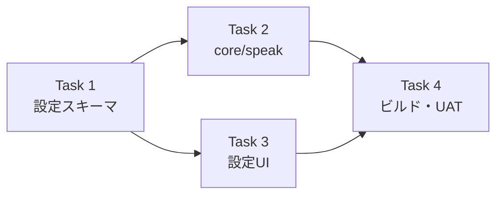

# EdgeTTS チャンク上限単独設定 実装計画

> **For agentic workers:** REQUIRED SUB-SKILL: Use superpowers:subagent-driven-development (recommended) or superpowers:executing-plans to implement this plan task-by-task. Steps use checkbox (`- [ ]`) syntax for tracking.

> 📂 パス：`80_POC_Projects/POC_017_ClaudianBridge/03_開発文書/18_EdgeTTSチャンク上限設定実装計画.md`
> 📅 作成日：2026-08-16
> 🐕 担当：MiuMiu 🐾
> 🔗 設計書：[[../02_設計文書/2026-08-16-edge-chunkmax-settings-design|EdgeTTS チャンク上限単独設定設計]]

**Goal:** `tts.chunkMaxChars` をエンジン別マップ `{ edge: 500, webspeech: 140, plachta: 140 }` に変更し、EdgeTTS のチャンク上限を単独設定（100〜2000・既定 500）できるようにする。

**Architecture:** `settings.ts` で `TtsChunkMaxChars` 型と normalize/validate を追加（既存 number からエンジン別へマイグレーション）。`core.ts` で `settings.chunkMaxChars[engine]` により limit を解決。`SettingTabTts.ts` で 3 スライダーに分割。`speak.ts` は `toTtsSettings` がエンジン別値をそのまま渡す。

**Tech Stack:** TypeScript (strict), Obsidian API, vitest (Node + jsdom)

## Global Constraints

- リポジトリ: `D:/AI-Agent/ClaudianBridge`（git あり・main ブランチで直接コミット運用）
- テストランナー: `npx vitest run`（リポジトリルートで実行）
- 型チェック: `npm run typecheck`（tsc -noEmit・必ずエラー 0）
- ビルド: `npm run build`（esbuild + deploy.mjs で vault へ自動デプロイ）
- 設計書の決定事項を厳守:
  - エンジン別マップ: `edge: 500` / `webspeech: 140` / `plachta: 140`
  - edge 範囲 **100〜2000**・webspeech/plachta は **50〜140**
  - マイグレーション: 既存 number は webspeech/plachta に引き継ぎ、**edge は 500 に初期化**
  - 設定 UI は **3 つ独立スライダー**
- 既存 `CHUNK_MAX_CHARS_MIN/MAX/DEFAULT` 定数は webspeech/plachta 用として維持（値は 50/140/140）
- 変更は指定ファイルのみ（surgical）

---

### Task 1: 設定スキーマ — `TtsChunkMaxChars` 型 + normalize/validate + マイグレーション

**Files:**
- Modify: `src/core/settings.ts`（定数 170-173 付近・interface 446-448 付近・DEFAULT 489-491 付近・normalize 640 付近・clamp 651-655 付近・validate 735 付近）
- Modify: `src/features/tts/voice-config-sync.ts`（72 行付近の `chunkMaxChars: DEFAULT_CHUNK_MAX_CHARS` をエンジン別オブジェクトに）
- Modify: `src/legacy/convert-csb.ts`（44 行付近の `chunkMaxChars: DEFAULT_CHUNK_MAX_CHARS` をエンジン別オブジェクトに）
- Test: `tests/core/settings.test.ts`（513-524 行の既存 chunkMaxChars テストを更新 + マイグレーションテスト追加）

**Interfaces:**
- Produces（以降のタスクが消費）:
  - `interface TtsChunkMaxChars { edge: number; webspeech: number; plachta: number }`
  - `EDGE_CHUNK_MAX_CHARS_MIN = 100` / `EDGE_CHUNK_MAX_CHARS_MAX = 2000` / `DEFAULT_EDGE_CHUNK_MAX_CHARS = 500`
  - `ClaudianBridgeSettings['tts']['chunkMaxChars']: TtsChunkMaxChars`（required・正規化後は必ず存在）

- [ ] **Step 1: 失敗テストを書く**

`tests/core/settings.test.ts` の既存 `describe('tts.chunkMaxChars / tts.speechFilter (v0.17 仕様改良)')` 内の chunkMaxChars テストを更新し、エンジン別マップのテストに置き換える:

```typescript
describe('tts.chunkMaxChars (v0.18 エンジン別マップ)', () => {
  it('未設定時はデフォルト（edge=500・webspeech=140・plachta=140）を補完する', () => {
    const cfg = normalizeClaudianBridgeSettings({ tts: { enabled: true, engine: 'edge' } });
    expect(cfg.tts.chunkMaxChars).toEqual({ edge: 500, webspeech: 140, plachta: 140 });
  });

  it('既存 number（v0.17）は webspeech/plachta に引き継ぎ・edge は 500 に初期化する', () => {
    const cfg = normalizeClaudianBridgeSettings({ tts: { enabled: true, engine: 'edge', chunkMaxChars: 100 } });
    expect(cfg.tts.chunkMaxChars).toEqual({ edge: 500, webspeech: 100, plachta: 100 });
  });

  it('エンジン別オブジェクトを保持する', () => {
    const cfg = normalizeClaudianBridgeSettings({
      tts: { enabled: true, engine: 'edge', chunkMaxChars: { edge: 800, webspeech: 100, plachta: 60 } },
    });
    expect(cfg.tts.chunkMaxChars).toEqual({ edge: 800, webspeech: 100, plachta: 60 });
  });

  it('edge は 100〜2000・他は 50〜140 にクランプされる', () => {
    const cfg = normalizeClaudianBridgeSettings({
      tts: { enabled: true, engine: 'edge', chunkMaxChars: { edge: 9999, webspeech: 10, plachta: 300 } },
    });
    expect(cfg.tts.chunkMaxChars).toEqual({ edge: 2000, webspeech: 50, plachta: 140 });
  });

  it('validate がエンジン別の値域を検証する', () => {
    const bad = normalizeClaudianBridgeSettings({});
    (bad.tts.chunkMaxChars as { edge: unknown }).edge = 50; // 100 未満
    expect(validateClaudianBridgeSettings(bad)).toContain('tts.chunkMaxChars.edge');
  });
});
```

※ 既存の `describe` 内の旧 chunkMaxChars テスト（`toBe(140)`・`toBe(50)` を検証するもの）は削除する。

- [ ] **Step 2: テストを実行して失敗を確認**

Run: `npx vitest run tests/core/settings.test.ts`
Expected: FAIL（`cfg.tts.chunkMaxChars` がオブジェクトでない・新テストが型エラー）

- [ ] **Step 3: 実装**

`src/core/settings.ts` の 6 箇所:

(a) 定数（`DEFAULT_CHUNK_MAX_CHARS = 140;` の直後）:

```typescript
export const EDGE_CHUNK_MAX_CHARS_MIN = 100;
export const EDGE_CHUNK_MAX_CHARS_MAX = 2000;
export const DEFAULT_EDGE_CHUNK_MAX_CHARS = 500;

/** v0.18.0: エンジン別チャンク上限（edge: 100〜2000 既定500 / webspeech・plachta: 50〜140 既定140） */
export interface TtsChunkMaxChars {
  edge: number;
  webspeech: number;
  plachta: number;
}
```

(b) interface の `tts` ブロック（`chunkMaxChars: number;` を置き換え）:

```typescript
    /** v0.18.0: エンジン別の1チャンク上限 */
    chunkMaxChars: TtsChunkMaxChars;
```

(c) `DEFAULT_CLAUDIAN_BRIDGE_SETTINGS.tts`（`chunkMaxChars: DEFAULT_CHUNK_MAX_CHARS,` を置き換え）:

```typescript
    chunkMaxChars: { edge: DEFAULT_EDGE_CHUNK_MAX_CHARS, webspeech: DEFAULT_CHUNK_MAX_CHARS, plachta: DEFAULT_CHUNK_MAX_CHARS },
```

(d) `normalizeClaudianBridgeSettings` の `tts` ブロック（`chunkMaxChars: clampChunkMaxChars(r.tts?.chunkMaxChars),` を置き換え）:

```typescript
      chunkMaxChars: normalizeTtsChunkMaxChars(r.tts?.chunkMaxChars),
```

(e) `clampChunkMaxChars` 関数を置き換え（ヘルパーを新設）:

```typescript
function clampNum(v: unknown, min: number, max: number, def: number): number {
  if (typeof v !== 'number' || !Number.isFinite(v)) return def;
  return Math.max(min, Math.min(max, Math.round(v)));
}

function normalizeTtsChunkMaxChars(raw: unknown): TtsChunkMaxChars {
  // v0.18.0: 既存 number（v0.17）は webspeech/plachta に引き継ぎ・edge は 500 に初期化
  // 注: legacy もクランプしてから使う（範囲外 legacy が validate を壊さないように）
  const legacy = typeof raw === 'number'
    ? clampNum(raw, CHUNK_MAX_CHARS_MIN, CHUNK_MAX_CHARS_MAX, DEFAULT_CHUNK_MAX_CHARS)
    : undefined;
  const obj = (typeof raw === 'object' && raw !== null) ? raw as Partial<TtsChunkMaxChars> : {};
  return {
    edge: clampNum(obj.edge, EDGE_CHUNK_MAX_CHARS_MIN, EDGE_CHUNK_MAX_CHARS_MAX, DEFAULT_EDGE_CHUNK_MAX_CHARS),
    webspeech: clampNum(obj.webspeech, CHUNK_MAX_CHARS_MIN, CHUNK_MAX_CHARS_MAX, legacy ?? DEFAULT_CHUNK_MAX_CHARS),
    plachta: clampNum(obj.plachta, CHUNK_MAX_CHARS_MIN, CHUNK_MAX_CHARS_MAX, legacy ?? DEFAULT_CHUNK_MAX_CHARS),
  };
}
```

(f) `validateClaudianBridgeSettings`（`chunkMaxChars` 検証行を置き換え）:

```typescript
  if (typeof cfg.tts.chunkMaxChars !== 'object' || cfg.tts.chunkMaxChars === null) return 'tts.chunkMaxChars はオブジェクトである必要があります';
  const chunkRanges: Record<keyof TtsChunkMaxChars, [number, number]> = {
    edge: [EDGE_CHUNK_MAX_CHARS_MIN, EDGE_CHUNK_MAX_CHARS_MAX],
    webspeech: [CHUNK_MAX_CHARS_MIN, CHUNK_MAX_CHARS_MAX],
    plachta: [CHUNK_MAX_CHARS_MIN, CHUNK_MAX_CHARS_MAX],
  };
  for (const k of ['edge', 'webspeech', 'plachta'] as const) {
    const [min, max] = chunkRanges[k];
    const v = cfg.tts.chunkMaxChars?.[k];
    if (typeof v !== 'number' || v < min || v > max) return `tts.chunkMaxChars.${k} は ${min}〜${max} の数値である必要があります`;
  }
```

(g) `voice-config-sync.ts` と `convert-csb.ts` の `chunkMaxChars: DEFAULT_CHUNK_MAX_CHARS`（number）をエンジン別オブジェクトに置き換え（型エラー回避）:

```typescript
// 両ファイル共通の置き換え
chunkMaxChars: { edge: DEFAULT_EDGE_CHUNK_MAX_CHARS, webspeech: DEFAULT_CHUNK_MAX_CHARS, plachta: DEFAULT_CHUNK_MAX_CHARS },
```

※ import に `DEFAULT_EDGE_CHUNK_MAX_CHARS` を追加すること。

- [ ] **Step 4: テスト通過を確認**

Run: `npx vitest run tests/core/settings.test.ts`
Expected: PASS（全件）

- [ ] **Step 4b: 型チェック**

Run: `npm run typecheck`
Expected: voice-config-sync.ts / convert-csb.ts の型エラーは解消。ただし **`speak.ts`(1) と `SettingTabTts.ts`(4) の型エラーは残る** — それぞれ E2（TtsSettings.chunkMaxChars 型変更）と E3（3 スライダー化）のスコープで解消するため、本タスクでは修正しない（surgical）。

- [ ] **Step 5: コミット**

```bash
cd D:/AI-Agent/ClaudianBridge
git add src/core/settings.ts src/features/tts/voice-config-sync.ts src/legacy/convert-csb.ts tests/core/settings.test.ts
git commit -m "feat(tts): make chunkMaxChars per-engine map (edge 500 / webspeech 140 / plachta 140)"
```

---

### Task 2: core.ts / speak.ts — エンジン別 limit 解決

**Files:**
- Modify: `src/features/tts/core.ts`（`TtsSettings.chunkMaxChars` 型変更・`addTextToTTS` の limit 解決）
- Modify: `src/features/tts/speak.ts`（`toTtsSettings` は型整合のみ・実質変更なし）
- Test: `tests/features/tts/core.test.ts`（TC-L03 と chunkMaxChars=100 テストを更新）・`tests/features/tts/speak.test.ts`（makeCfg 更新）・`tests/features/tts/input-ai-read-button.test.ts`・`tests/features/tts/message-read-button.test.ts`（makeStore の `chunkMaxChars: 140` をエンジン別オブジェクトに更新）

**Interfaces:**
- Consumes: `TtsChunkMaxChars` / `EDGE_CHUNK_MAX_CHARS_MIN/MAX` / `DEFAULT_EDGE_CHUNK_MAX_CHARS` / `DEFAULT_CHUNK_MAX_CHARS`（Task 1）
- Produces: `TtsSettings.chunkMaxChars?: Partial<TtsChunkMaxChars>`。`addTextToTTS` が `settings.chunkMaxChars?.[settings.engine] ?? (engine==='edge' ? 500 : 140)` で limit 解決

- [ ] **Step 1: 失敗テストを書く**

`tests/features/tts/core.test.ts` の既存テストを更新:

(a) TC-L03（`edge も chunkMaxChars（既定140）でチャンク分割される`）を、edge 既定 500 に合わせて更新:

```typescript
it('TC-L03: edge も chunkMaxChars（既定500）でチャンク分割される（v0.18.0）', async () => {
  const child = makeChild();
  spawnMock.mockReturnValue(child);
  const p = addTextToTTS(null as never, 'a'.repeat(501), makeSettings('edge'));
  child.emit('close', 0); // 1 チャンク目
  await vi.waitFor(() => expect(spawnMock).toHaveBeenCalledTimes(2));
  child.emit('close', 0); // 2 チャンク目
  await p;
  expect(spawnMock).toHaveBeenCalledTimes(2);
  expect(child.stdin.write).toHaveBeenNthCalledWith(1, 'a'.repeat(500));
  expect(child.stdin.write).toHaveBeenNthCalledWith(2, 'a');
});
```

(b) `chunkMaxChars=100（非デフォルト）` テストを、エンジン別オブジェクトに更新:

```typescript
it('chunkMaxChars.plachta=100（非デフォルト）で plachta がチャンク分割される（v0.18.0）', async () => {
  const s = makePlachtaSettings();
  s.chunkMaxChars = { ...s.chunkMaxChars, plachta: 100 };
  await addTextToTTS(null as never, 'あ'.repeat(141), s);
  expect(plachtaSpeakChunksPipelined).toHaveBeenCalledTimes(1);
  const chunks = vi.mocked(plachtaSpeakChunksPipelined).mock.calls[0][0];
  expect(chunks.length).toBe(2);
  expect(chunks[0].length).toBe(100);
});
```

`tests/features/tts/speak.test.ts` の更新:
- `makeCfg` の `chunkMaxChars: 140` を `chunkMaxChars: { edge: 500, webspeech: 140, plachta: 140 }` に変更
- `chunkMaxChars を TtsSettings に含めて渡す` テストを更新:

```typescript
it('chunkMaxChars を TtsSettings に含めて渡す（エンジン別オブジェクト）', async () => {
  await speakText('selection', 'テキスト', makeCfg());
  expect(addTextToTTS.mock.calls[0][2].chunkMaxChars).toEqual({ edge: 500, webspeech: 140, plachta: 140 });
});
```

- ※ 既存の `makeCfg({ chunkMaxChars: 100 })` を使うテストがあれば、`makeCfg({ chunkMaxChars: { edge: 500, webspeech: 140, plachta: 100 } })` に変更。

`tests/features/tts/input-ai-read-button.test.ts` と `tests/features/tts/message-read-button.test.ts` の `makeStore` の `chunkMaxChars: 140` をエンジン別オブジェクトに更新（型整合）:

```typescript
chunkMaxChars: { edge: 500, webspeech: 140, plachta: 140 },
```

- [ ] **Step 2: テストを実行して失敗を確認**

Run: `npx vitest run tests/features/tts/core.test.ts tests/features/tts/speak.test.ts`
Expected: FAIL（型エラー or 挙動変更）

- [ ] **Step 3: 実装**

`src/features/tts/core.ts` を改修:

(a) import に追加:

```typescript
import type { TtsChunkMaxChars } from '../../core/settings';
import { DEFAULT_CHUNK_MAX_CHARS, DEFAULT_EDGE_CHUNK_MAX_CHARS } from '../../core/settings';
```

(b) `TtsSettings.chunkMaxChars` の型を変更（34 行付近）:

```typescript
  /** v0.18.0: エンジン別チャンク上限（edge: 100〜2000 既定500 / webspeech・plachta: 50〜140 既定140） */
  chunkMaxChars?: Partial<TtsChunkMaxChars>;
```

(c) `addTextToTTS` の limit 解決（254 行付近）:

```typescript
  // v0.18.0: エンジン別のチャンク上限（edge は既定 500・他は 140）
  const engineDefault = settings.engine === 'edge' ? DEFAULT_EDGE_CHUNK_MAX_CHARS : DEFAULT_CHUNK_MAX_CHARS;
  const limit = settings.chunkMaxChars?.[settings.engine] ?? engineDefault;
  const chunks = limit > 0 && trimmed.length > limit ? chunkText(trimmed, limit) : [trimmed];
```

`src/features/tts/speak.ts`:
- `toTtsSettings` の `chunkMaxChars: cfg.tts.chunkMaxChars` はそのまま（`TtsSettings.chunkMaxChars` が `Partial<TtsChunkMaxChars>` なので `cfg.tts.chunkMaxChars`（`TtsChunkMaxChars`）は代入可能）。変更不要。

- [ ] **Step 4: テスト通過を確認**

Run: `npx vitest run tests/features/tts/core.test.ts tests/features/tts/speak.test.ts`
Expected: PASS

- [ ] **Step 5: コミット**

```bash
cd D:/AI-Agent/ClaudianBridge
git add src/features/tts/core.ts src/features/tts/speak.ts tests/features/tts/core.test.ts tests/features/tts/speak.test.ts tests/features/tts/input-ai-read-button.test.ts tests/features/tts/message-read-button.test.ts
git commit -m "feat(tts): resolve chunk limit per engine in addTextToTTS"
```

---

### Task 3: 設定 UI（3 スライダー）+ i18n

**Files:**
- Modify: `src/settings/SettingTabTts.ts`（5.6 チャンク上限スライダーを 3 つに分割）
- Modify: `src/core/i18n.ts`（ttsChunkMaxChars ラベルをエンジン別に更新・ja/zh/en）
- Test: `npm run typecheck` + 全テスト

**Interfaces:**
- Consumes: `TtsChunkMaxChars` / `EDGE_CHUNK_MAX_CHARS_MIN/MAX` / `DEFAULT_EDGE_CHUNK_MAX_CHARS` / `CHUNK_MAX_CHARS_MIN/MAX` / `DEFAULT_CHUNK_MAX_CHARS`（Task 1）

- [ ] **Step 1: i18n キーを更新**

`src/core/i18n.ts`:
- interface の `ttsChunkMaxChars: string;` / `ttsChunkMaxCharsDesc: string;` を以下の 3 組に置き換え:

```typescript
  ttsChunkMaxCharsEdge: string;
  ttsChunkMaxCharsEdgeDesc: string;
  ttsChunkMaxCharsWebspeech: string;
  ttsChunkMaxCharsWebspeechDesc: string;
  ttsChunkMaxCharsPlachta: string;
  ttsChunkMaxCharsPlachtaDesc: string;
```

- 3 言語ブロック（ja/en/zh）の `ttsChunkMaxChars` / `ttsChunkMaxCharsDesc` を置き換え:

ja:
```typescript
    ttsChunkMaxCharsEdge: 'EdgeTTS のチャンク文字数',
    ttsChunkMaxCharsEdgeDesc: 'EdgeTTS の1チャンク上限（100〜2000 文字）。既定 500',
    ttsChunkMaxCharsWebspeech: 'WebSpeech のチャンク文字数',
    ttsChunkMaxCharsWebspeechDesc: 'WebSpeech の1チャンク上限（50〜140 文字）。既定 140',
    ttsChunkMaxCharsPlachta: 'Plachta のチャンク文字数',
    ttsChunkMaxCharsPlachtaDesc: 'Plachta の1チャンク上限（50〜140 文字）。既定 140',
```

en:
```typescript
    ttsChunkMaxCharsEdge: 'EdgeTTS chunk character limit',
    ttsChunkMaxCharsEdgeDesc: 'Max characters per chunk for EdgeTTS (100-2000). Default 500',
    ttsChunkMaxCharsWebspeech: 'WebSpeech chunk character limit',
    ttsChunkMaxCharsWebspeechDesc: 'Max characters per chunk for WebSpeech (50-140). Default 140',
    ttsChunkMaxCharsPlachta: 'Plachta chunk character limit',
    ttsChunkMaxCharsPlachtaDesc: 'Max characters per chunk for Plachta (50-140). Default 140',
```

zh:
```typescript
    ttsChunkMaxCharsEdge: 'EdgeTTS 分块字数',
    ttsChunkMaxCharsEdgeDesc: 'EdgeTTS 每块最大字符数（100-2000）。默认 500',
    ttsChunkMaxCharsWebspeech: 'WebSpeech 分块字数',
    ttsChunkMaxCharsWebspeechDesc: 'WebSpeech 每块最大字符数（50-140）。默认 140',
    ttsChunkMaxCharsPlachta: 'Plachta 分块字数',
    ttsChunkMaxCharsPlachtaDesc: 'Plachta 每块最大字符数（50-140）。默认 140',
```

- [ ] **Step 2: SettingTabTts.ts のスライダーを 3 つに分割**

`src/settings/SettingTabTts.ts` に import 追加:

```typescript
import { CHUNK_MAX_CHARS_MIN, CHUNK_MAX_CHARS_MAX, DEFAULT_CHUNK_MAX_CHARS, EDGE_CHUNK_MAX_CHARS_MIN, EDGE_CHUNK_MAX_CHARS_MAX, DEFAULT_EDGE_CHUNK_MAX_CHARS } from '../core/settings';
import type { TtsChunkMaxChars } from '../core/settings';
```

既存の「5.6 v0.17.0: チャンク上限（全エンジン共通）」スライダー（290-305 行付近）を以下の 3 スライダーに置き換え:

```typescript
      // 5.6 v0.18.0: チャンク上限（エンジン別）
      {
        const chunkRows: Array<{ key: keyof TtsChunkMaxChars; label: string; desc: string; min: number; max: number; def: number; step: number }> = [
          { key: 'edge', label: s.ttsChunkMaxCharsEdge, desc: s.ttsChunkMaxCharsEdgeDesc, min: EDGE_CHUNK_MAX_CHARS_MIN, max: EDGE_CHUNK_MAX_CHARS_MAX, def: DEFAULT_EDGE_CHUNK_MAX_CHARS, step: 50 },
          { key: 'webspeech', label: s.ttsChunkMaxCharsWebspeech, desc: s.ttsChunkMaxCharsWebspeechDesc, min: CHUNK_MAX_CHARS_MIN, max: CHUNK_MAX_CHARS_MAX, def: DEFAULT_CHUNK_MAX_CHARS, step: 5 },
          { key: 'plachta', label: s.ttsChunkMaxCharsPlachta, desc: s.ttsChunkMaxCharsPlachtaDesc, min: CHUNK_MAX_CHARS_MIN, max: CHUNK_MAX_CHARS_MAX, def: DEFAULT_CHUNK_MAX_CHARS, step: 5 },
        ];
        for (const row of chunkRows) {
          new Setting(containerEl)
            .setName(row.label)
            .setDesc(row.desc)
            .addSlider((sl) => sl
              .setLimits(row.min, row.max, row.step)
              .setValue(cfg.tts.chunkMaxChars?.[row.key] ?? row.def)
              .setDynamicTooltip()
              .onChange(async (v) => {
                try {
                  const latest = store.load();
                  store.save({ ...latest, tts: { ...latest.tts, chunkMaxChars: { ...latest.tts.chunkMaxChars, [row.key]: v } } });
                } catch (e) {
                  new Notice(s.noticeSaveFailed.replace('{msg}', (e as Error).message));
                }
              }),
            );
        }
      }
```

- [ ] **Step 3: 型チェック + 全テスト**

Run: `cd D:/AI-Agent/ClaudianBridge && npm run typecheck && npx vitest run`
Expected: tsc エラー 0・全テスト PASS

- [ ] **Step 4: コミット**

```bash
cd D:/AI-Agent/ClaudianBridge
git add src/settings/SettingTabTts.ts src/core/i18n.ts
git commit -m "feat(tts): add per-engine chunk limit sliders to settings"
```

---

### Task 4: ビルド・デプロイ・リリースノート

**Files:**
- 修正なし（ビルド・バージョン bump・リリースノート）

**Interfaces:**
- Consumes: 全タスクの成果物

- [ ] **Step 1: バージョン bump（0.18.0）**

`package.json` / `src/manifest.json` / `versions.json` を 0.18.0 に更新（前回 v0.17.0 と同じ手順）。

- [ ] **Step 2: ビルド + vault へデプロイ**

Run: `cd D:/AI-Agent/ClaudianBridge && npm run build`
Expected: esbuild 成功 + deploy.mjs のマーカー検証 OK（exit 0）

- [ ] **Step 3: リリースノート更新**

`80_POC_Projects/POC_017_ClaudianBridge/08_説明書/03_リリースノート/リリースノート.md` に v0.18.0 エントリを追加（EdgeTTS チャンク上限単独設定・既定 500・エンジン別マップ化）

- [ ] **Step 4: 手動 UAT**

| # | 確認項目 | 期待結果 |
|:-:|----------|----------|
| 1 | 設定タブの 3 スライダー | EdgeTTS(100-2000)・WebSpeech(50-140)・Plachta(50-140) が表示・独立に保存 |
| 2 | EdgeTTS を 500 に設定し長文（600 字）読み上げ | 500 字 + 100 字の 2 チャンクで読み上げ |
| 3 | WebSpeech / Plachta は 140 のまま | 既存の分割挙動を維持 |
| 4 | 既存の 🔊/📖・✨・MD Add to TTS | 従来通り動作（回帰なし） |

- [ ] **Step 5: 最終コミット**

```bash
cd D:/AI-Agent/ClaudianBridge
git status
git add -A
git commit -m "chore(release): build v0.18.0 with per-engine chunk limit settings"
```

---

## 📋 タスク間依存



---

*📅 2026-08-16 · MiuMiu 🐾 · [[../02_設計文書/2026-08-16-edge-chunkmax-settings-design|設計書]]に基づく実装計画*
