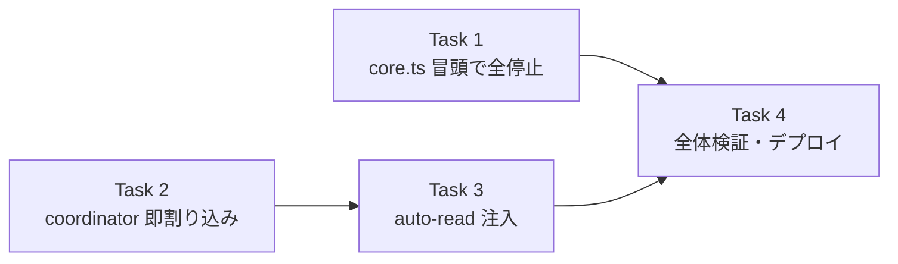

# TTS 重複読み防止（即割り込み）実装計画

> **For agentic workers:** REQUIRED SUB-SKILL: Use superpowers:subagent-driven-development (recommended) or superpowers:executing-plans to implement this plan task-by-task. Steps use checkbox (`- [ ]`) syntax for tracking.

> 📂 パス：`80_POC_Projects/POC_017_ClaudianBridge/03_開発文書/2026-08-16-tts-interrupt-playback-plan.md`
> 📅 作成日：2026-08-16
> 🐕 担当：MiuMiu 🐾
> 🔗 設計書：[[../02_設計文書/2026-08-16-tts-interrupt-playback-design|TTS 重複読み防止設計書]]

**Goal:** 読み上げ中に別タスクの読み上げが開始された場合、前の読み上げを即座に中断し、後の読み上げを開始する（重複読み防止・後勝ち）。

**Architecture:** 既存の `playback-registry.ts` の `stopAllPlayback()` を全読み上げの共通入口 `addTextToTTS` 冒頭で呼び、全てのエントリポイントで前再生を中断する。加えて `createLatestWinsSpeaker`（auto-read 用）を「キュー待機」→「世代カウンタ付き即割り込み」に変更し、自動読上げの連続報告でも後勝ちで即中断させる。

**Tech Stack:** TypeScript (strict), Obsidian API, Node child_process (spawn), vitest (Node + jsdom)

## Global Constraints

- リポジトリ: `D:/AI-Agent/ClaudianBridge`（git あり・main ブランチで直接コミット運用）
- テストランナー: `npx vitest run`（リポジトリルートで実行）
- 型チェック: `npm run typecheck`（tsc -noEmit・必ずエラー 0）
- ビルド: `npm run build`（esbuild + deploy.mjs で vault へ自動デプロイ）
- 設計書の決定事項を厳守:
  - **全タスク共通で後勝ち即割り込み**（auto-read 連続報告も即割り込み）
  - 既存 `playback-registry.ts` の `stopAllPlayback()` は**変更しない**（既に全エンジン停止可能）
  - 割り込みで旧再生が停止した際は `intentionalStop` 扱い → **エラー Notice を出さない**（既存の停止ハンドルが保証）
- 既存テスト 592 件の回帰なし

---

### Task 1: `addTextToTTS` 冒頭で `stopAllPlayback()` を実行（全エントリ共通の重複防止）

**Files:**
- Modify: `src/features/tts/core.ts`（import 行 10・`addTextToTTS` 冒頭 238-240 付近）
- Test: `tests/features/tts/core.test.ts`（import 行 8・`claudettsHttpSpeak (via addTextToTTS)` describe 内に追加）

**Interfaces:**
- Consumes: `stopAllPlayback(): number`（`./playback-registry`・既存・変更なし）
- Produces: `addTextToTTS` が冒頭で `stopAllPlayback()` を呼ぶ（戻り値変更なし `Promise<boolean>`）

- [ ] **Step 1: 失敗テストを書く**

`tests/features/tts/core.test.ts` の import（8 行目）を変更:

```typescript
import { isTtsPlaying, stopAllPlayback, resetPlaybackRegistry, registerPlayback } from '../../../src/features/tts/playback-registry';
```

`claudettsHttpSpeak (via addTextToTTS)` describe 内の末尾（`webspeech engine: Node 環境では...` テストの前）に追加:

```typescript
it('addTextToTTS は冒頭で stopAllPlayback を呼び既存再生を中断する（重複読み防止・後勝ち）', async () => {
  const child = makeChild();
  spawnMock.mockReturnValue(child);
  // 既に再生中の別タスクのハンドルを登録
  const stop = vi.fn();
  registerPlayback({ engine: 'edge', stop });
  expect(isTtsPlaying()).toBe(true);

  const p = addTextToTTS(null as never, 'こんにちは', makeSettings('edge'));

  // 新しい読み上げ開始前に既存再生が停止された
  expect(stop).toHaveBeenCalledTimes(1);

  child.emit('close', 0);
  await p;
});
```

- [ ] **Step 2: テストを実行して失敗を確認**

Run: `npx vitest run tests/features/tts/core.test.ts -t "stopAllPlayback を呼び既存再生を中断"`

Expected: FAIL（`stop` が呼ばれない。`toHaveBeenCalledTimes(1)` が 0 回と判定）

- [ ] **Step 3: 実装**

`src/features/tts/core.ts` の import（10 行目）を変更:

```typescript
import { registerPlayback, setEdgeChildPid, stopAllPlayback } from './playback-registry';
```

`addTextToTTS` の `if (!trimmed) return true;` 直後に追加:

```typescript
  // v0.18.1: 重複読み防止 — 新しい読み上げ開始前に既存の全再生を中断（後勝ち）
  stopAllPlayback();
```

- [ ] **Step 4: テスト通過を確認**

Run: `npx vitest run tests/features/tts/core.test.ts`

Expected: PASS（既存テストも全て通る）

- [ ] **Step 5: コミット**

```bash
cd D:/AI-Agent/ClaudianBridge
git add src/features/tts/core.ts tests/features/tts/core.test.ts
git commit -m "feat(tts): stop all playback before starting new read (duplicate prevention)"
```

---

### Task 2: `createLatestWinsSpeaker` を即割り込み型に変更（世代カウンタ）

**Files:**
- Modify: `src/features/tts/speak-coordinator.ts`（全文書き換え）
- Test: `tests/features/tts/speak-coordinator.test.ts`（全文書き換え）

**Interfaces:**
- Consumes: なし
- Produces: `createLatestWinsSpeaker(speak: SpeakFn, stop?: () => void): (text: string) => void` — 旧シグネチャに `stop` が追加。speaking 中の新テキスト到着時、`stop?.()` を呼び `speak(text)` を即時実行（後勝ち）。世代カウンタで旧 finally の誤解除を防止。

- [ ] **Step 1: 失敗テストを書く**

`tests/features/tts/speak-coordinator.test.ts` を全文書き換え:

```typescript
import { describe, it, expect, vi } from 'vitest';
import { createLatestWinsSpeaker } from '../../../src/features/tts/speak-coordinator';

function deferred<T>() {
  let resolve!: (v: T) => void;
  let reject!: (e: unknown) => void;
  const promise = new Promise<T>((res, rej) => { resolve = res; reject = rej; });
  return { promise, resolve, reject };
}

describe('createLatestWinsSpeaker', () => {
  it('idle 時は即座に speak を呼ぶ', async () => {
    const speak = vi.fn(() => Promise.resolve(true));
    const enqueue = createLatestWinsSpeaker(speak);
    enqueue('A');
    await Promise.resolve();
    expect(speak).toHaveBeenCalledWith('A');
    expect(speak).toHaveBeenCalledTimes(1);
  });

  it('speaking 中の新報告は旧スピーチを停止して即再生する（後勝ち）', async () => {
    const d1 = deferred<boolean>();
    const stop = vi.fn();
    const speak = vi.fn()
      .mockImplementationOnce(() => d1.promise)
      .mockImplementation(() => Promise.resolve(true));
    const enqueue = createLatestWinsSpeaker(speak, stop);

    enqueue('A');          // 読み上げ開始
    await Promise.resolve();
    expect(speak).toHaveBeenCalledTimes(1);

    enqueue('B');          // 割り込み: A 停止 + B 即再生
    expect(stop).toHaveBeenCalledTimes(1);
    expect(speak).toHaveBeenCalledTimes(2);
    expect(speak).toHaveBeenLastCalledWith('B');

    d1.resolve(true);      // A の後処理（世代不一致で何もしない）
    await vi.waitFor(() => expect(speak).toHaveBeenCalledTimes(2));
  });

  it('連続割り込み（A→B→C）では最終報告 C のみが発声される', async () => {
    const d1 = deferred<boolean>();
    const stop = vi.fn();
    const speak = vi.fn()
      .mockImplementationOnce(() => d1.promise)
      .mockImplementationOnce(() => Promise.resolve(true)) // B
      .mockImplementationOnce(() => Promise.resolve(true)); // C
    const enqueue = createLatestWinsSpeaker(speak, stop);

    enqueue('A');
    await Promise.resolve();
    enqueue('B');
    enqueue('C');

    expect(stop).toHaveBeenCalledTimes(2); // B と C の割り込みで stop が 2 回
    expect(speak).toHaveBeenCalledTimes(3);
    expect(speak).toHaveBeenLastCalledWith('C');

    d1.resolve(true);
    await vi.waitFor(() => expect(speak).toHaveBeenCalledTimes(3));
  });

  it('旧スピーチの finally は新スピーチの speaking を誤解除しない（世代ガード）', async () => {
    const d1 = deferred<boolean>();
    const d2 = deferred<boolean>();
    const stop = vi.fn();
    const speak = vi.fn()
      .mockImplementationOnce(() => d1.promise)  // A
      .mockImplementationOnce(() => d2.promise); // B
    const enqueue = createLatestWinsSpeaker(speak, stop);

    enqueue('A');
    await Promise.resolve();
    enqueue('B'); // 割り込み → B 開始（speaking は B の所有）
    expect(speak).toHaveBeenCalledTimes(2);

    d1.resolve(true); // A 完了 → 世代不一致のため speaking を解除しない
    await Promise.resolve();

    // まだ speaking 中のため、新たな割り込み C は B を停止して C を再生
    const d3 = deferred<boolean>();
    speak.mockImplementationOnce(() => d3.promise);
    enqueue('C');
    expect(stop).toHaveBeenCalledTimes(2);
    expect(speak).toHaveBeenLastCalledWith('C');

    d2.resolve(true);
    d3.resolve(true);
  });

  it('speak が reject しても例外で停止しない（割り込み後も動き続ける）', async () => {
    const d1 = deferred<boolean>();
    const stop = vi.fn();
    const speak = vi.fn()
      .mockImplementationOnce(() => d1.promise)
      .mockImplementationOnce(() => Promise.reject(new Error('tts failed')));
    const enqueue = createLatestWinsSpeaker(speak, stop);

    enqueue('A');
    await Promise.resolve();
    enqueue('B'); // 割り込み
    expect(speak).toHaveBeenCalledTimes(2);

    d1.reject(new Error('old failed'));
    await vi.waitFor(() => expect(speak).toHaveBeenCalledTimes(2));
  });
});
```

- [ ] **Step 2: テストを実行して失敗を確認**

Run: `npx vitest run tests/features/tts/speak-coordinator.test.ts`

Expected: FAIL（旧実装は `stop` を受け取れず・speaking 中は `speak` を 2 回呼ばない）

- [ ] **Step 3: 実装**

`src/features/tts/speak-coordinator.ts` を全文書き換え:

```typescript
/**
 * v0.18.1: 即割り込み型 latest-wins スピーカー。
 * 読み上げ中に新しいテキストが来たら、前の読み上げを停止して新しいテキストを即座に再生する（後勝ち）。
 * 世代カウンタで、旧スピーチの finally が新スピーチの speaking フラグを誤解除しないようにする。
 */
export type SpeakFn = (text: string) => Promise<boolean>;

export function createLatestWinsSpeaker(speak: SpeakFn, stop?: () => void): (text: string) => void {
  let speaking = false;
  let generation = 0;

  const run = (text: string): void => {
    if (speaking) {
      // 即割り込み: 前の読み上げを停止して新しいテキストを即座に開始（後勝ち）
      generation++;
      const gen = generation;
      stop?.();
      void speak(text)
        .catch(() => { /* 失敗 Notice は addTextToTTS 側の責務 */ })
        .finally(() => {
          if (gen === generation) speaking = false;
        });
      return;
    }
    speaking = true;
    generation++;
    const gen = generation;
    void speak(text)
      .catch(() => { /* 失敗 Notice は addTextToTTS 側の責務 */ })
      .finally(() => {
        if (gen === generation) speaking = false;
      });
  };

  return run;
}
```

- [ ] **Step 4: テスト通過を確認**

Run: `npx vitest run tests/features/tts/speak-coordinator.test.ts`

Expected: PASS（全 5 件）

- [ ] **Step 5: コミット**

```bash
cd D:/AI-Agent/ClaudianBridge
git add src/features/tts/speak-coordinator.ts tests/features/tts/speak-coordinator.test.ts
git commit -m "feat(tts): make latest-wins speaker interrupt current playback immediately"
```

---

### Task 3: auto-read に `stopAllPlayback` を注入

**Files:**
- Modify: `src/features/tts/auto-read.ts`（import 6-7 行目付近・`const enqueue` 50 行目）
- Test: `tests/features/tts/auto-read.test.ts`（変更不要 — coordinator に依存しないため回帰なし）

**Interfaces:**
- Consumes: `createLatestWinsSpeaker(speak, stop?)`（Task 2）／`stopAllPlayback(): number`（`./playback-registry`）
- Produces: 変更なし（`setupAutoReadTTS(deps): () => void`）

- [ ] **Step 1: 実装**

`src/features/tts/auto-read.ts` の import に追加（6 行目の次）:

```typescript
import { stopAllPlayback } from './playback-registry';
```

50 行目を変更:

```typescript
  const enqueue = createLatestWinsSpeaker(deps.speak, stopAllPlayback);
```

- [ ] **Step 2: 型チェック + テスト**

Run: `cd D:/AI-Agent/ClaudianBridge && npm run typecheck && npx vitest run tests/features/tts/auto-read.test.ts`

Expected: tsc エラー 0・auto-read テスト PASS（17 件）

- [ ] **Step 3: コミット**

```bash
cd D:/AI-Agent/ClaudianBridge
git add src/features/tts/auto-read.ts
git commit -m "feat(tts): inject stopAllPlayback into auto-read latest-wins speaker"
```

---

### Task 4: 全体検証・ビルド・デプロイ

**Files:**
- 修正なし（ビルドと検証のみ）

**Interfaces:**
- Consumes: Task 1〜3 の成果物

- [ ] **Step 1: 全テスト実行**

Run: `cd D:/AI-Agent/ClaudianBridge && npx vitest run`

Expected: 全テスト PASS（既存 592 + 追加分。speak-coordinator は 5 件、core は +1 件）

- [ ] **Step 2: 型チェック + ビルド + デプロイ**

Run: `cd D:/AI-Agent/ClaudianBridge && npm run typecheck && npm run build`

Expected: tsc エラー 0・esbuild 成功 + deploy.mjs のマーカー検証 OK（exit 0）。hot-reload により Obsidian が自動リロード

- [ ] **Step 3: 実機 UAT**

Obsidian の ClaudianChat で以下を確認:

| # | 確認項目 | 期待結果 |
|:-:|----------|----------|
| 1 | edge 読上げ中に別メッセージ読上げ | 前の音声が即停止し、新しい音声のみ再生（重複なし） |
| 2 | auto-read 連続報告 | 最新報告のみ発声（前の報告は中断） |
| 3 | ミュートボタンで停止 | 従来通り動作（回帰なし） |

- [ ] **Step 4: 最終コミット（残りがあれば）**

Run: `cd D:/AI-Agent/ClaudianBridge && git status`

Expected: 全変更がコミット済み（clean）。未コミットがあれば `git add -A && git commit -m "chore(release): build v0.18.1 with interrupt playback"`

---

## 📋 タスク間依存



---

*📅 2026-08-16 · MiuMiu 🐾 · [[../02_設計文書/2026-08-16-tts-interrupt-playback-design|設計書]]に基づく実装計画*
