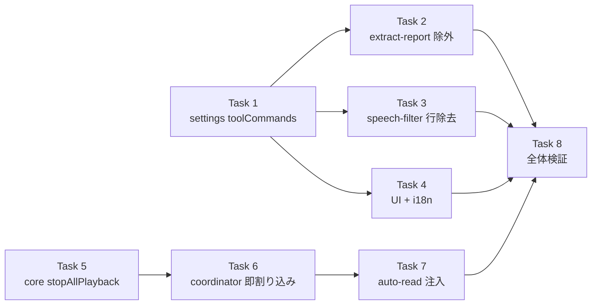

# TTS 読み上げ拡張まとめ実装計画（ツール呼び出し除外 + 重複読み防止）

> **For agentic workers:** REQUIRED SUB-SKILL: Use superpowers:subagent-driven-development (recommended) or superpowers:executing-plans to implement this plan task-by-task. Steps use checkbox (`- [ ]`) syntax for tracking.

> 📂 パス：`80_POC_Projects/POC_017_ClaudianBridge/03_開発文書/2026-08-16-tts-read-combined-plan.md`
> 📅 作成日：2026-08-16
> 🐕 担当：MiuMiu 🐾
> 🔗 設計書①：[[../02_設計文書/2026-08-16-tts-tool-call-exclude-design|ツール呼び出し除外設計書]]
> 🔗 設計書②：[[../02_設計文書/2026-08-16-tts-interrupt-playback-design|重複読み防止設計書]]
> 🔗 旧計画：[[2026-08-16-tts-interrupt-playback-plan|重複読み防止 単独計画（本計画に統合）]]

**Goal:** ①読み上げからツール呼び出し（`.claudian-tool-call`）を除外する ②読み上げ中に別タスクの読み上げが開始されたら前の読み上げを中断して後勝ちで開始する。両方を1つの計画で実装する。

**Architecture:**
- **①ツール呼び出し除外**: `SpeechFilterOptions` に `toolCommands`（デフォルト false=除外）を追加。`buildSpeechExclude` が `.claudian-tool-call` を除外セレクタに含める。`filterSpeechText` に `[Tool ...]` 行除去の保険 regex を追加。設定 UI・i18n に項目追加。
- **②重複読み防止**: 全読み上げの共通入口 `addTextToTTS` 冒頭で `stopAllPlayback()` を呼び、前再生を中断。auto-read 用 `createLatestWinsSpeaker` を「キュー待機」→「世代カウンタ付き即割り込み」に変更。

**Tech Stack:** TypeScript (strict), Obsidian API, Node child_process (spawn), vitest (Node + jsdom)

## Global Constraints

- リポジトリ: `D:/AI-Agent/ClaudianBridge`（git あり・main ブランチで直接コミット運用）
- テストランナー: `npx vitest run`（リポジトリルートで実行）
- 型チェック: `npm run typecheck`（tsc -noEmit・必ずエラー 0）
- ビルド: `npm run build`（esbuild + deploy.mjs で vault へ自動デプロイ）
- 設計書①の決定事項: チェック=読む（true=除去しない）/ `toolCommands` デフォルト **false=除外**
- 設計書②の決定事項: **全タスク共通で後勝ち即割り込み**（auto-read 連続報告も即割り込み）
- `SpeechFilterOptions` は strict 型のため、**フィールド追加時はコード内の全直書きオブジェクト**に `toolCommands` を追加する
- 既存テスト（現在 592 件）の回帰なし

---

## Phase 1: ツール呼び出し除外（設計書①）

### Task 1: `settings.ts` に `toolCommands` スキーマ追加

**Files:**
- Modify: `src/core/settings.ts`（`SpeechFilterOptions` interface 188-197・`DEFAULT_SPEECH_FILTER_OPTIONS` 199-208・validate キー一覧 776 付近）
- Test: `tests/core/settings.test.ts`（`tts.speechFilter` describe 内に追加）

**Interfaces:**
- Produces: `SpeechFilterOptions` に `toolCommands: boolean`。`DEFAULT_SPEECH_FILTER_OPTIONS.toolCommands = false`。以降のタスクが使用。

- [ ] **Step 1: 失敗テストを書く**

`tests/core/settings.test.ts` の `tts.speechFilter (v0.17 仕様改良)` describe の末尾に追加:

```typescript
describe('tts.speechFilter.toolCommands (v0.18.1)', () => {
  it('toolCommands はデフォルト false（未設定時に補完される）', () => {
    const cfg = normalizeClaudianBridgeSettings({ tts: { enabled: true, engine: 'edge' } });
    expect(cfg.tts.speechFilter.selection.toolCommands).toBe(false);
  });

  it('toolCommands: true を保持する', () => {
    const raw = { tts: { enabled: true, engine: 'edge', speechFilter: { selection: { toolCommands: true } } } };
    const cfg = normalizeClaudianBridgeSettings(raw as never);
    expect(cfg.tts.speechFilter.selection.toolCommands).toBe(true);
  });

  it('validate が toolCommands の型を検証する', () => {
    const cfg = normalizeClaudianBridgeSettings({});
    (cfg.tts.speechFilter.selection as unknown as { toolCommands: unknown }).toolCommands = 'x';
    expect(validateClaudianBridgeSettings(cfg)).toContain('tts.speechFilter.selection.toolCommands');
  });
});
```

- [ ] **Step 2: テストを実行して失敗を確認**

Run: `npx vitest run tests/core/settings.test.ts -t "toolCommands"`

Expected: FAIL（`toolCommands` が存在しない・validate が検知しない）

- [ ] **Step 3: 実装**

`src/core/settings.ts`:

(a) interface（`thinking: boolean;` の直後）:

```typescript
  /** v0.18.1: ツール呼び出し（.claudian-tool-call）を読むか（false=除外） */
  toolCommands: boolean;
```

(b) DEFAULT（`thinking: false,` の直後）:

```typescript
  toolCommands: false, // デフォルト: ツール呼び出しは読まない
```

(c) validate キー一覧（`'thinking'` の直後）:

```typescript
      for (const k of ['emoji', 'kaomoji', 'ascii_emoticon', 'emoji_shortcode', 'callout', 'table', 'code', 'thinking', 'toolCommands'] as const) {
```

> `normalizeSpeechFilterOptions` は `Object.keys(DEFAULT)` を走査するため、設定ファイル経由の補完は追加実装不要。

- [ ] **Step 4: テスト通過を確認**

Run: `npx vitest run tests/core/settings.test.ts`

Expected: PASS（既存 + 新規）

- [ ] **Step 5: コミット**

```bash
cd D:/AI-Agent/ClaudianBridge
git add src/core/settings.ts tests/core/settings.test.ts
git commit -m "feat(tts): add toolCommands to speechFilter settings (default exclude)"
```

---

### Task 2: `extract-report.ts` で `.claudian-tool-call` を除外

**Files:**
- Modify: `src/features/tts/extract-report.ts`（selector 46-49・`buildSpeechExclude` 55-61・デフォルト filter 134-138）
- Test: `tests/features/tts/extract-report.test.ts`（`buildSpeechExclude` describe 追加）

**Interfaces:**
- Consumes: `SpeechFilterOptions.toolCommands`（Task 1）
- Produces: `TOOL_CALL_SELECTOR = '.claudian-tool-call'`。`buildSpeechExclude` が `!filter.toolCommands` のとき `.claudian-tool-call` を含む。

- [ ] **Step 1: 失敗テストを書く**

`tests/features/tts/extract-report.test.ts` の末尾に追加:

```typescript
describe('buildSpeechExclude (v0.18.1 toolCommands)', () => {
  const T = { emoji: true, kaomoji: true, ascii_emoticon: true, emoji_shortcode: true, callout: true, table: true, code: true, thinking: true, toolCommands: true };

  it('toolCommands=false なら .claudian-tool-call を除外', () => {
    const s = buildSpeechExclude({ ...T, toolCommands: false });
    expect(s).toContain('.claudian-tool-call');
  });

  it('toolCommands=true なら .claudian-tool-call を含めない', () => {
    const s = buildSpeechExclude({ ...T });
    expect(s).not.toContain('.claudian-tool-call');
  });
});

describe('readVisibleTextExcluding (v0.18.1 tool call 除外)', () => {
  it('.claudian-tool-call を除去して本文のみ返す', () => {
    const el = document.createElement('div');
    el.innerHTML = '<p>本文です</p><div class="claudian-tool-call"><div class="claudian-tool-header">Tool Bash</div><div class="claudian-tool-summary">git status</div></div><p>末尾です</p>';
    const text = readVisibleTextExcluding(el, '.claudian-tool-call');
    expect(text).toContain('本文です');
    expect(text).toContain('末尾です');
    expect(text).not.toContain('Tool Bash');
    expect(text).not.toContain('git status');
  });
});
```

※ `readVisibleTextExcluding` の import を追加: `import { extractReportText, AUTO_READ_MARK, buildSpeechExclude, readVisibleTextExcluding } from '../../../src/features/tts/extract-report';`

- [ ] **Step 2: テストを実行して失敗を確認**

Run: `npx vitest run tests/features/tts/extract-report.test.ts`

Expected: FAIL（`toolCommands` が型に無い・`buildSpeechExclude` が `.claudian-tool-call` を含まない）

- [ ] **Step 3: 実装**

`src/features/tts/extract-report.ts`:

(a) selector 追加（`CALLOUT_SELECTOR` の直後）:

```typescript
/** v0.18.1: ツール呼び出し（Read/Write/Bash/Task 等）のコンテナ */
export const TOOL_CALL_SELECTOR = '.claudian-tool-call';
```

(b) `buildSpeechExclude` に追加:

```typescript
export function buildSpeechExclude(filter: SpeechFilterOptions): string {
  const parts: string[] = [];
  if (!filter.thinking) parts.push(THINKING_BLOCK_SELECTOR);
  if (!filter.code) parts.push(CODE_WRAPPER_SELECTOR);
  if (!filter.callout) parts.push(CALLOUT_SELECTOR);
  if (!filter.toolCommands) parts.push(TOOL_CALL_SELECTOR);
  return parts.join(', ');
}
```

(c) `extractReportText` のデフォルト filter（134-138 行）に `toolCommands: false` を追加:

```typescript
  const filter: SpeechFilterOptions = opts?.filter ?? {
    emoji: true, kaomoji: true, ascii_emoticon: true, emoji_shortcode: true,
    callout: !(opts?.excludeCallouts ?? true),
    table: false, code: false, thinking: false,
    toolCommands: false,
  };
```

- [ ] **Step 4: テスト通過を確認**

Run: `npx vitest run tests/features/tts/extract-report.test.ts`

Expected: PASS

- [ ] **Step 5: コミット**

```bash
cd D:/AI-Agent/ClaudianBridge
git add src/features/tts/extract-report.ts tests/features/tts/extract-report.test.ts
git commit -m "feat(tts): exclude .claudian-tool-call from read-aloud when toolCommands=false"
```

---

### Task 3: `speech-filter.ts` に `[Tool ...]` 行除去を追加

**Files:**
- Modify: `src/features/tts/speech-filter.ts`（`TOOL_CALL_LINE_RE` 追加・`filterSpeechText` 更新）
- Test: `tests/features/tts/speech-filter.test.ts`（`ALL_TRUE` に `toolCommands: true` 追加・新テスト追加）

**Interfaces:**
- Consumes: `SpeechFilterOptions.toolCommands`（Task 1）
- Produces: `filterSpeechText` が `filter.toolCommands === false` のとき `[Tool ...]` 行を除去。

- [ ] **Step 1: 失敗テストを書く**

`tests/features/tts/speech-filter.test.ts` の `ALL_TRUE` を更新（`toolCommands: true` を追加）:

```typescript
const ALL_TRUE: SpeechFilterOptions = { emoji: true, kaomoji: true, ascii_emoticon: true, emoji_shortcode: true, callout: true, table: true, code: true, thinking: true, toolCommands: true };
```

末尾に追加:

```typescript
describe('filterSpeechText toolCommands (v0.18.1)', () => {
  it('toolCommands=false なら [Tool ...] 行を除去する', () => {
    const f = { ...ALL_TRUE, toolCommands: false };
    const text = '[Tool Read input: file_path=foo]\n本文です\n[Tool Bash input: command=ls]';
    const out = filterSpeechText(text, f);
    expect(out).toContain('本文です');
    expect(out).not.toContain('[Tool Read input');
    expect(out).not.toContain('[Tool Bash input');
  });

  it('toolCommands=true なら [Tool ...] 行を残す', () => {
    const text = '[Tool Bash input: command=ls]\n本文です';
    expect(filterSpeechText(text, ALL_TRUE)).toContain('[Tool Bash input');
  });
});
```

- [ ] **Step 2: テストを実行して失敗を確認**

Run: `npx vitest run tests/features/tts/speech-filter.test.ts`

Expected: FAIL（`[Tool ...]` 行が除去されない）

- [ ] **Step 3: 実装**

`src/features/tts/speech-filter.ts`:

(a) regex 追加（`EMPTY_PAREN_RE` の直後）:

```typescript
/** v0.18.1: ツール呼び出し行 [Tool Name input: ...] を除去（DOM 除外の保険） */
const TOOL_CALL_LINE_RE = /^\[Tool [^\n]+\]\s*$/gm;
```

(b) `filterSpeechText` に追加（`emoji_shortcode` 処理の直後）:

```typescript
  if (filter.toolCommands === false) t = t.replace(TOOL_CALL_LINE_RE, ' ');
```

- [ ] **Step 4: テスト通過を確認**

Run: `npx vitest run tests/features/tts/speech-filter.test.ts`

Expected: PASS

- [ ] **Step 5: コミット**

```bash
cd D:/AI-Agent/ClaudianBridge
git add src/features/tts/speech-filter.ts tests/features/tts/speech-filter.test.ts
git commit -m "feat(tts): strip [Tool ...] lines in filterSpeechText when toolCommands=false"
```

---

### Task 4: `message-read-button.ts` のフォールバック filter 更新 + 設定 UI + i18n

**Files:**
- Modify: `src/features/tts/message-read-button.ts`（filter オブジェクトに `toolCommands: false`）
- Modify: `src/settings/SettingTabTts.ts`（`FILTER_ROWS` に `toolCommands` 行）
- Modify: `src/core/i18n.ts`（`ttsSpeechFilterToolCommands` ラベルを 3 言語）
- Test: `tests/features/tts/message-read-button.test.ts`（makeStore の speechFilter に `toolCommands: false` 追加）

**Interfaces:**
- Consumes: `SpeechFilterOptions.toolCommands`（Task 1）
- Produces: 設定 UI に「ツール呼び出し」トグル。i18n ラベル。

- [ ] **Step 1: 実装**

(a) `src/features/tts/message-read-button.ts` の filter オブジェクト（`buildSpeechExclude` 呼び出し付近）:

```typescript
const filter: SpeechFilterOptions = {
  emoji: true, kaomoji: true, ascii_emoticon: true, emoji_shortcode: true,
  callout: !(cfg.tts.excludeCallouts ?? true),
  table: true, code: true, thinking: true,
  toolCommands: false,
};
```

(b) `src/core/i18n.ts` の interface（`ttsSpeechFilterThinking: string;` の直後）:

```typescript
  // v0.18.1: ツール呼び出し除外
  ttsSpeechFilterToolCommands: string;
```

各 locale ブロック（`ttsSpeechFilterThinking` 行の直後）:

```typescript
    ttsSpeechFilterToolCommands: 'ツール呼び出し',   // ja
    ttsSpeechFilterToolCommands: 'Tool calls',       // en
    ttsSpeechFilterToolCommands: '工具调用',          // zh
```

(c) `src/settings/SettingTabTts.ts` の `FILTER_ROWS` 配列に追加:

```typescript
          { key: 'thinking', label: s.ttsSpeechFilterThinking },
          { key: 'toolCommands', label: s.ttsSpeechFilterToolCommands },
```

(d) `tests/features/tts/message-read-button.test.ts` の makeStore 内 speechFilter 各タイプに `toolCommands: false` を追加（4 タイプ × 8→9 項目）。

- [ ] **Step 2: 型チェック + テスト**

Run: `cd D:/AI-Agent/ClaudianBridge && npm run typecheck && npx vitest run tests/features/tts/message-read-button.test.ts tests/core/i18n.test.ts`

Expected: tsc エラー 0・テスト PASS

- [ ] **Step 3: コミット**

```bash
cd D:/AI-Agent/ClaudianBridge
git add src/features/tts/message-read-button.ts src/settings/SettingTabTts.ts src/core/i18n.ts tests/features/tts/message-read-button.test.ts
git commit -m "feat(tts): add toolCommands toggle to settings UI and i18n labels"
```

---

## Phase 2: 重複読み防止（設計書②）

### Task 5: `addTextToTTS` 冒頭で `stopAllPlayback()` を実行

**Files:**
- Modify: `src/features/tts/core.ts`（import 10・`addTextToTTS` 冒頭）
- Test: `tests/features/tts/core.test.ts`（import 8・`claudettsHttpSpeak` describe 内）

**Interfaces:**
- Consumes: `stopAllPlayback(): number`（`./playback-registry`・既存）
- Produces: `addTextToTTS` が冒頭で `stopAllPlayback()` を呼ぶ。

- [ ] **Step 1: 失敗テストを書く**

`tests/features/tts/core.test.ts` の import に `registerPlayback` を追加:

```typescript
import { isTtsPlaying, stopAllPlayback, resetPlaybackRegistry, registerPlayback } from '../../../src/features/tts/playback-registry';
```

`claudettsHttpSpeak (via addTextToTTS)` describe 内の末尾に追加:

```typescript
it('addTextToTTS は冒頭で stopAllPlayback を呼び既存再生を中断する（重複読み防止・後勝ち）', async () => {
  const child = makeChild();
  spawnMock.mockReturnValue(child);
  const stop = vi.fn();
  registerPlayback({ engine: 'edge', stop });
  expect(isTtsPlaying()).toBe(true);

  const p = addTextToTTS(null as never, 'こんにちは', makeSettings('edge'));
  expect(stop).toHaveBeenCalledTimes(1);

  child.emit('close', 0);
  await p;
});
```

- [ ] **Step 2: テストを実行して失敗を確認**

Run: `npx vitest run tests/features/tts/core.test.ts -t "stopAllPlayback を呼び既存再生を中断"`

Expected: FAIL（`stop` が呼ばれない）

- [ ] **Step 3: 実装**

`src/features/tts/core.ts`:

(a) import（`setEdgeChildPid` の直後）:

```typescript
import { registerPlayback, setEdgeChildPid, stopAllPlayback } from './playback-registry';
```

(b) `addTextToTTS` の `if (!trimmed) return true;` 直後:

```typescript
  // v0.18.1: 重複読み防止 — 新しい読み上げ開始前に既存の全再生を中断（後勝ち）
  stopAllPlayback();
```

- [ ] **Step 4: テスト通過を確認**

Run: `npx vitest run tests/features/tts/core.test.ts`

Expected: PASS

- [ ] **Step 5: コミット**

```bash
cd D:/AI-Agent/ClaudianBridge
git add src/features/tts/core.ts tests/features/tts/core.test.ts
git commit -m "feat(tts): stop all playback before starting new read (duplicate prevention)"
```

---

### Task 6: `createLatestWinsSpeaker` を即割り込み型に変更

**Files:**
- Modify: `src/features/tts/speak-coordinator.ts`（全文書き換え）
- Test: `tests/features/tts/speak-coordinator.test.ts`（全文書き換え）

**Interfaces:**
- Produces: `createLatestWinsSpeaker(speak: SpeakFn, stop?: () => void): (text: string) => void`。speaking 中の新テキスト到着時、`stop?.()` → `speak(text)` を即時実行（後勝ち）。世代カウンタで旧 finally の誤解除を防止。

- [ ] **Step 1: 失敗テストを書く**

`tests/features/tts/speak-coordinator.test.ts` を全文書き換え:

```typescript
import { describe, it, expect, vi } from 'vitest';
import { createLatestWinsSpeaker } from '../../../src/features/tts/speak-coordinator';

function deferred<T>() {
  let resolve!: (v: T) => void;
  let reject!: (e: unknown) => void;
  const promise = new Promise<T>((res, rej) => { resolve = res; reject = rej; });
  return { promise, resolve, reject };
}

describe('createLatestWinsSpeaker (v0.18.1 即割り込み)', () => {
  it('idle 時は即座に speak を呼ぶ', async () => {
    const speak = vi.fn(() => Promise.resolve(true));
    const enqueue = createLatestWinsSpeaker(speak);
    enqueue('A');
    await Promise.resolve();
    expect(speak).toHaveBeenCalledWith('A');
    expect(speak).toHaveBeenCalledTimes(1);
  });

  it('speaking 中の新報告は旧スピーチを停止して即再生する（後勝ち）', async () => {
    const d1 = deferred<boolean>();
    const stop = vi.fn();
    const speak = vi.fn()
      .mockImplementationOnce(() => d1.promise)
      .mockImplementation(() => Promise.resolve(true));
    const enqueue = createLatestWinsSpeaker(speak, stop);

    enqueue('A');
    await Promise.resolve();
    expect(speak).toHaveBeenCalledTimes(1);

    enqueue('B');
    expect(stop).toHaveBeenCalledTimes(1);
    expect(speak).toHaveBeenCalledTimes(2);
    expect(speak).toHaveBeenLastCalledWith('B');

    d1.resolve(true);
    await vi.waitFor(() => expect(speak).toHaveBeenCalledTimes(2));
  });

  it('連続割り込み（A→B→C）では最終報告 C のみが発声される', async () => {
    const d1 = deferred<boolean>();
    const stop = vi.fn();
    const speak = vi.fn()
      .mockImplementationOnce(() => d1.promise)
      .mockImplementationOnce(() => Promise.resolve(true))
      .mockImplementationOnce(() => Promise.resolve(true));
    const enqueue = createLatestWinsSpeaker(speak, stop);

    enqueue('A');
    await Promise.resolve();
    enqueue('B');
    enqueue('C');

    expect(stop).toHaveBeenCalledTimes(2);
    expect(speak).toHaveBeenCalledTimes(3);
    expect(speak).toHaveBeenLastCalledWith('C');

    d1.resolve(true);
    await vi.waitFor(() => expect(speak).toHaveBeenCalledTimes(3));
  });

  it('旧スピーチの finally は新スピーチの speaking を誤解除しない（世代ガード）', async () => {
    const d1 = deferred<boolean>();
    const d2 = deferred<boolean>();
    const stop = vi.fn();
    const speak = vi.fn()
      .mockImplementationOnce(() => d1.promise)
      .mockImplementationOnce(() => d2.promise);
    const enqueue = createLatestWinsSpeaker(speak, stop);

    enqueue('A');
    await Promise.resolve();
    enqueue('B');
    expect(speak).toHaveBeenCalledTimes(2);

    d1.resolve(true);
    await Promise.resolve();

    const d3 = deferred<boolean>();
    speak.mockImplementationOnce(() => d3.promise);
    enqueue('C');
    expect(stop).toHaveBeenCalledTimes(2);
    expect(speak).toHaveBeenLastCalledWith('C');

    d2.resolve(true);
    d3.resolve(true);
  });

  it('speak が reject しても例外で停止しない', async () => {
    const d1 = deferred<boolean>();
    const stop = vi.fn();
    const speak = vi.fn()
      .mockImplementationOnce(() => d1.promise)
      .mockImplementationOnce(() => Promise.reject(new Error('tts failed')));
    const enqueue = createLatestWinsSpeaker(speak, stop);

    enqueue('A');
    await Promise.resolve();
    enqueue('B');
    expect(speak).toHaveBeenCalledTimes(2);

    d1.reject(new Error('old failed'));
    await vi.waitFor(() => expect(speak).toHaveBeenCalledTimes(2));
  });
});
```

- [ ] **Step 2: テストを実行して失敗を確認**

Run: `npx vitest run tests/features/tts/speak-coordinator.test.ts`

Expected: FAIL（旧実装は `stop` を受け取れない）

- [ ] **Step 3: 実装**

`src/features/tts/speak-coordinator.ts` を全文書き換え:

```typescript
/**
 * v0.18.1: 即割り込み型 latest-wins スピーカー。
 * 読み上げ中に新しいテキストが来たら、前の読み上げを停止して新しいテキストを即座に再生する（後勝ち）。
 * 世代カウンタで、旧スピーチの finally が新スピーチの speaking フラグを誤解除しないようにする。
 */
export type SpeakFn = (text: string) => Promise<boolean>;

export function createLatestWinsSpeaker(speak: SpeakFn, stop?: () => void): (text: string) => void {
  let speaking = false;
  let generation = 0;

  const run = (text: string): void => {
    if (speaking) {
      // 即割り込み: 前の読み上げを停止して新しいテキストを即座に開始（後勝ち）
      generation++;
      const gen = generation;
      stop?.();
      void speak(text)
        .catch(() => { /* 失敗 Notice は addTextToTTS 側の責務 */ })
        .finally(() => {
          if (gen === generation) speaking = false;
        });
      return;
    }
    speaking = true;
    generation++;
    const gen = generation;
    void speak(text)
      .catch(() => { /* 失敗 Notice は addTextToTTS 側の責務 */ })
      .finally(() => {
        if (gen === generation) speaking = false;
      });
  };

  return run;
}
```

- [ ] **Step 4: テスト通過を確認**

Run: `npx vitest run tests/features/tts/speak-coordinator.test.ts`

Expected: PASS（全 5 件）

- [ ] **Step 5: コミット**

```bash
cd D:/AI-Agent/ClaudianBridge
git add src/features/tts/speak-coordinator.ts tests/features/tts/speak-coordinator.test.ts
git commit -m "feat(tts): make latest-wins speaker interrupt current playback immediately"
```

---

### Task 7: auto-read に `stopAllPlayback` を注入

**Files:**
- Modify: `src/features/tts/auto-read.ts`（import 6-7 付近・`const enqueue` 50）
- Test: 変更不要（auto-read.test.ts は coordinator に依存しない）

**Interfaces:**
- Consumes: `createLatestWinsSpeaker(speak, stop?)`（Task 6）／`stopAllPlayback(): number`（`./playback-registry`）

- [ ] **Step 1: 実装**

`src/features/tts/auto-read.ts`:

(a) import 追加:

```typescript
import { stopAllPlayback } from './playback-registry';
```

(b) `const enqueue` 変更:

```typescript
  const enqueue = createLatestWinsSpeaker(deps.speak, stopAllPlayback);
```

- [ ] **Step 2: 型チェック + テスト**

Run: `cd D:/AI-Agent/ClaudianBridge && npm run typecheck && npx vitest run tests/features/tts/auto-read.test.ts`

Expected: tsc エラー 0・auto-read テスト PASS

- [ ] **Step 3: コミット**

```bash
cd D:/AI-Agent/ClaudianBridge
git add src/features/tts/auto-read.ts
git commit -m "feat(tts): inject stopAllPlayback into auto-read latest-wins speaker"
```

---

## Phase 3: 全体検証

### Task 8: 全体検証・ビルド・デプロイ

**Files:**
- 修正なし（ビルドと検証のみ）

**Interfaces:**
- Consumes: Task 1〜7 の成果物

- [ ] **Step 1: 全テスト実行**

Run: `cd D:/AI-Agent/ClaudianBridge && npx vitest run`

Expected: 全テスト PASS（既存 592 + 追加分。speak-coordinator 5 件・settings 3 件・extract-report 4 件・speech-filter 2 件・core 1 件）

- [ ] **Step 2: 型チェック + ビルド + デプロイ**

Run: `cd D:/AI-Agent/ClaudianBridge && npm run typecheck && npm run build`

Expected: tsc エラー 0・esbuild 成功 + deploy.mjs のマーカー検証 OK（exit 0）。hot-reload により Obsidian が自動リロード

- [ ] **Step 3: 実機 UAT**

| # | 確認項目 | 期待結果 |
|:-:|----------|----------|
| 1 | 会話全文読み上げでツール呼び出しが読まれない | `[Tool Read ...]` 等が発話されない・本文のみ読まれる |
| 2 | edge 読上げ中に別メッセージ読上げ | 前の音声が即停止し、新しい音声のみ再生（重複なし） |
| 3 | auto-read 連続報告 | 最新報告のみ発声（前の報告は中断） |
| 4 | 設定タブ「ツール呼び出し」トグル | ON で読む・OFF（既定）で除外 |
| 5 | ミュートボタンで停止 | 従来通り動作（回帰なし） |

- [ ] **Step 4: 最終コミット（残りがあれば）**

Run: `cd D:/AI-Agent/ClaudianBridge && git status`

Expected: 全変更がコミット済み（clean）。未コミットがあれば `git add -A && git commit -m "chore(release): build v0.18.1 with tool-call exclude and interrupt playback"`

---

## 📋 タスク間依存



---

*📅 2026-08-16 · MiuMiu 🐾 · 設計書①（ツール呼び出し除外）+ 設計書②（重複読み防止）の統合実装計画*
