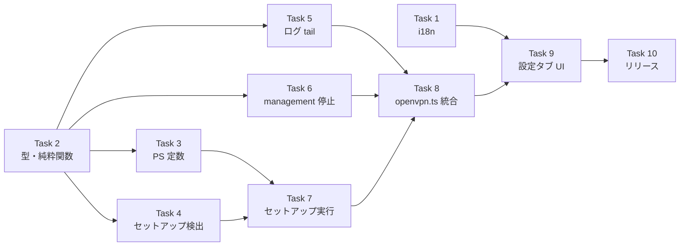

# 管理者権限分離による OpenVPN 経路確立 実装計画

> 📂 パス：80_POC_Projects/POC_017_ClaudianBridge/03_開発文書/29_管理者権限分離によるOpenVPN経路確立実装計画.md
> 📍 原本：`D:\AI-Agent\ClaudianBridge\docs\superpowers\plans\2026-09-13-vpn-admin-privilege-separation.md`
> 🔗 設計書：[[../02_設計文書/29_管理者権限分離によるOpenVPN経路確立設計]]
> 🏷️ バージョン：v1.0（2026-09-13 実装計画・承認済）


> **For agentic workers:** REQUIRED SUB-SKILL: Use superpowers:subagent-driven-development (recommended) or superpowers:executing-plans to implement this plan task-by-task. Steps use checkbox (`- [ ]`) syntax for tracking.

**Goal:** `openvpn.exe` だけを管理者権限で動かすことで、OpenVPN の経路追加と MTU 設定を成功させ、接続時のエラー行と ClaudianBridge の警告をゼロにする。

**Architecture:** Obsidian は非管理者のまま維持し、`%ProgramData%\ClaudianBridge\` に置いた固定パスの PowerShell ラッパーを `RunLevel=Highest` のタスクスケジューラ タスク経由で起動する。ClaudianBridge は「リクエスト JSON を書く → `schtasks /run` → ログファイルを tail」の3段で接続し、停止は `--management` 経由の `signal SIGTERM` で行う。`redirect-gateway` は CLI 引数で無視し、インターネットは直通のままにする。

**Tech Stack:** TypeScript (ES2022, strict) / esbuild / vitest / Node `child_process`・`fs`・`net` / PowerShell 5.1 / タスクスケジューラ / OpenVPN 2.7.7

**設計書:** `80_POC_Projects/POC_017_ClaudianBridge/02_設計文書/29_管理者権限分離によるOpenVPN経路確立設計.md`

## Global Constraints

- プラグイン ID は `ClaudianBridge`（変更しない）。
- 対象は **Windows のみ**。非 Windows は既存の直接 spawn を維持する（`process.platform !== 'win32'` で分岐）。
- Obsidian 自体を昇格させない。昇格するのは `openvpn.exe` のみ。
- `OpenVpnController` の既存メソッド（`start` / `stop` / `getStatus` / `getRecentLog` / `getLastError` / `getWarning` / `subscribe` / `detectExternalConnection`）のシグネチャと意味を変更しない。**追加のみ可**。
- バージョンは `0.46.0` / 機能番号は **F-045**。`package.json`・`src/manifest.json`・`Plugin/manifest.json`・`versions.json` の 4 箇所を同期する。
- i18n は `ja` / `en` / `zh` の 3 言語すべてにキーを追加する。`zh` の文言に日本語漢字（`設定` `保存` `追加` `削除` `有効化` `フォルダ` 等）を使わない（`tests/core/i18n.test.ts` が検出する）。
- CSS は **リポジトリ直下の `styles.css` のみ**を編集する。`Plugin/styles.css` はビルド生成物なので触らない。
- テストは `tests/features/network/` 配下。`obsidian` は `tests/mocks/obsidian.ts` に alias 済み。`child_process` / `fs` / `net` は各テストファイルで `vi.mock` する。
- テスト用コマンド: `npx vitest run <path>` / 型検査: `npm run typecheck`。
- コミットメッセージは Conventional Commits + 日本語 + `(v0.46.0)` タグ。末尾に `Co-Authored-By: Claude Fable 5 <noreply@anthropic.com>`。
- 作業ブランチは現行の `hotfix/v0.32.1` に乗せる（このリポジトリは長命ブランチ運用）。

---

## File Structure

| 種別 | パス | 責務 |
|:----:|------|------|
| Create | `src/features/network/privileged-vpn.ts` | 型・純粋関数・タスク検出・リクエスト書出・タスク起動・ログ tail・management 停止 |
| Create | `src/features/network/vpn-host-script.ts` | 管理者側 PowerShell（`vpn-host.ps1` / セットアップ）を TS 文字列定数として保持（唯一のソース） |
| Create | `tests/features/network/privileged-vpn.test.ts` | 上記のテスト |
| Create | `tests/features/network/vpn-host-script.test.ts` | スクリプト定数のテスト |
| Modify | `src/features/network/openvpn.ts` | 警告文の差し替え・`isSetupRequired()` 追加・昇格経路の分岐・ログ供給元の差し替え |
| Modify | `src/core/i18n.ts` | 8 キー × 3 言語 |
| Modify | `src/settings/SettingTabNetwork.ts` | セットアップボタン・状態表示・案内行 |
| Modify | `styles.css` | `.cb-vpn-setup*` のスタイル |
| Modify | `tests/features/network/openvpn.test.ts` | 警告文・昇格分岐のテスト追加 |
| Modify | `tests/core/i18n.test.ts` | 新キーの必須チェック |
| Modify | `package.json` / `src/manifest.json` / `versions.json` / `CHANGELOG.md` | バージョン同期 |

---

## Task 1: i18n 文字列の追加

**Files:**
- Modify: `src/core/i18n.ts`（`LocaleStrings` に 8 キー、`ja`/`en`/`zh` の 3 オブジェクトに文言）
- Test: `tests/core/i18n.test.ts`

**Interfaces:**
- Consumes: なし
- Produces: `LocaleStrings` に以下のキー（すべて `string`）
  `networkOpenVpnAdminSetupHeading` / `networkOpenVpnAdminSetupDesc` / `networkOpenVpnAdminSetupButton` / `networkOpenVpnAdminSetupRunning` / `networkOpenVpnAdminSetupDone` / `networkOpenVpnAdminSetupNotDone` / `networkOpenVpnSetupRequiredNotice` / `networkOpenVpnSetupRequiredWarning`

- [ ] **Step 1: 失敗するテストを書く**

`tests/core/i18n.test.ts` の末尾（最後の `});` の後ろ）に追記する。既存の F-038 ブロックと同じ形にすること。

```ts
// === v0.46.0 (F-045): 管理者セットアップ ===
describe('F-045: networkOpenVpnAdminSetup* / networkOpenVpnSetupRequired* ラベル', () => {
  const REQUIRED_KEYS = [
    'networkOpenVpnAdminSetupHeading',
    'networkOpenVpnAdminSetupDesc',
    'networkOpenVpnAdminSetupButton',
    'networkOpenVpnAdminSetupRunning',
    'networkOpenVpnAdminSetupDone',
    'networkOpenVpnAdminSetupNotDone',
    'networkOpenVpnSetupRequiredNotice',
    'networkOpenVpnSetupRequiredWarning',
  ];
  it('3 言語すべてで必須キーが空でない文字列として定義される', () => {
    for (const lang of SUPPORTED_LOCALES) {
      const v = getLocaleStrings(lang);
      for (const k of REQUIRED_KEYS) {
        expect(typeof v[k as keyof typeof v], `${lang}.${k} not string`).toBe('string');
        expect((v[k as keyof typeof v] as string).length, `${lang}.${k} empty`).toBeGreaterThan(0);
      }
    }
  });
});
```

必要な import は既存ファイルに揃っている（`describe`, `it`, `expect`, `SUPPORTED_LOCALES`, `getLocaleStrings`）。

- [ ] **Step 2: テストが失敗することを確認**

Run: `npx vitest run tests/core/i18n.test.ts`
Expected: FAIL — `ja.networkOpenVpnAdminSetupHeading not string`（キー未定義のため `typeof undefined === 'undefined'`）

- [ ] **Step 3: `LocaleStrings` にキーを追加**

`src/core/i18n.ts` の `interface LocaleStrings` 内、`vpnToggleTitleNotConfigured: string;` の直後に追加する。

```ts
  // === v0.46.0 (F-045): 管理者セットアップ ===
  networkOpenVpnAdminSetupHeading: string;
  networkOpenVpnAdminSetupDesc: string;
  networkOpenVpnAdminSetupButton: string;
  networkOpenVpnAdminSetupRunning: string;
  networkOpenVpnAdminSetupDone: string;
  networkOpenVpnAdminSetupNotDone: string;
  networkOpenVpnSetupRequiredNotice: string;
  networkOpenVpnSetupRequiredWarning: string;
```

- [ ] **Step 4: 3 言語の文言を追加**

`STRINGS` の各ロケールで、`vpnToggleTitleNotConfigured:` の行の直後（`outputsMirrorHeading:` の前）に挿入する。**3 箇所すべて**、同じ並び順で。

`ja`:

```ts
    // === v0.46.0 (F-045): 管理者セットアップ ===
    networkOpenVpnAdminSetupHeading: '🛡️ 管理者セットアップ（初回のみ）',
    networkOpenVpnAdminSetupDesc: 'OpenVPN の経路追加には管理者権限が必要です。初回のみ UAC を 1 回許可すると、以降は UAC なしで接続できます。Obsidian 自体は管理者になりません。',
    networkOpenVpnAdminSetupButton: '🛡️ 管理者セットアップを実行',
    networkOpenVpnAdminSetupRunning: '⏳ セットアップ中...（UAC の確認を許可してください）',
    networkOpenVpnAdminSetupDone: '✅ セットアップ済み',
    networkOpenVpnAdminSetupNotDone: '⚠️ 未セットアップ（経路が確立できません）',
    networkOpenVpnSetupRequiredNotice: 'ℹ️ 管理者セットアップが必要です。ネットワークタブの「管理者セットアップを実行」を押してください。',
    networkOpenVpnSetupRequiredWarning: 'VPN 経路が確立できませんでした。ネットワークタブの「🛡️ 管理者セットアップを実行」を押してから再接続してください。',
```

`en`:

```ts
    // === v0.46.0 (F-045): 管理者セットアップ ===
    networkOpenVpnAdminSetupHeading: '🛡️ Administrator setup (one time only)',
    networkOpenVpnAdminSetupDesc: 'Adding OpenVPN routes requires administrator rights. Allow UAC once and later connections need no UAC. Obsidian itself does not run elevated.',
    networkOpenVpnAdminSetupButton: '🛡️ Run administrator setup',
    networkOpenVpnAdminSetupRunning: '⏳ Setting up... (please allow the UAC prompt)',
    networkOpenVpnAdminSetupDone: '✅ Setup complete',
    networkOpenVpnAdminSetupNotDone: '⚠️ Not set up (routes cannot be established)',
    networkOpenVpnSetupRequiredNotice: 'ℹ️ Administrator setup is required. Press "Run administrator setup" in the Network tab.',
    networkOpenVpnSetupRequiredWarning: 'VPN routes could not be established. Press "🛡️ Run administrator setup" in the Network tab, then reconnect.',
```

`zh`:

```ts
    // === v0.46.0 (F-045): 管理者セットアップ ===
    networkOpenVpnAdminSetupHeading: '🛡️ 管理员初始化（仅首次）',
    networkOpenVpnAdminSetupDesc: 'OpenVPN 添加路由需要管理员权限。首次允许一次 UAC 后，之后连接无需 UAC。Obsidian 本体不会以管理员运行。',
    networkOpenVpnAdminSetupButton: '🛡️ 执行管理员初始化',
    networkOpenVpnAdminSetupRunning: '⏳ 初始化中...（请允许 UAC 提示）',
    networkOpenVpnAdminSetupDone: '✅ 初始化完成',
    networkOpenVpnAdminSetupNotDone: '⚠️ 未初始化（无法建立路由）',
    networkOpenVpnSetupRequiredNotice: 'ℹ️ 需要管理员初始化。请在网络选项卡按“执行管理员初始化”。',
    networkOpenVpnSetupRequiredWarning: '无法建立 VPN 路由。请在网络选项卡按“🛡️ 执行管理员初始化”后重新连接。',
```

- [ ] **Step 5: テストが通ることを確認**

Run: `npx vitest run tests/core/i18n.test.ts`
Expected: PASS（既存の `zh` 日本語漢字チェックも含めて全件）

- [ ] **Step 6: 型検査**

Run: `npm run typecheck`
Expected: エラーなし

- [ ] **Step 7: コミット**

```bash
git add src/core/i18n.ts tests/core/i18n.test.ts
git commit -m "feat(network): 管理者セットアップの i18n 文字列 8 キー (v0.46.0)"
```

---

## Task 2: 型と純粋関数（リクエスト／ポリシー生成）

**Files:**
- Create: `src/features/network/privileged-vpn.ts`
- Test: `tests/features/network/privileged-vpn.test.ts`

**Interfaces:**
- Consumes: `OpenVpnSettings`（`./types`）
- Produces:
  - `interface VpnRequest { version: 1; action: 'start' | 'stop'; configPath: string; authFilePath: string; logFilePath: string; pidFilePath: string; managementPort: number; managementPwPath: string; serverOverride: string; binaryPath: string }`
  - `interface VpnPolicy { version: 1; allowedConfigDirs: string[]; allowedWriteDirs: string[]; allowedOptions: string[]; deniedOptions: string[] }`
  - `const TASK_NAME = 'ClaudianBridge-OpenVPN'`
  - `const ADMIN_DIR: string` / `const USER_DIR: string`
  - `function buildVpnRequest(input: { settings: OpenVpnSettings; managementPort: number }): VpnRequest`
  - `function buildVpnPolicy(configPath: string): VpnPolicy`
  - `function summarizeRequest(r: VpnRequest): string`

- [ ] **Step 1: 失敗するテストを書く**

`tests/features/network/privileged-vpn.test.ts` を新規作成する。

```ts
import { describe, it, expect, vi, beforeEach } from 'vitest';

vi.mock('os', () => ({
  default: { tmpdir: () => 'C:\\Temp' },
  tmpdir: () => 'C:\\Temp',
}));

vi.mock('fs', () => ({
  default: {},
  existsSync: vi.fn(() => true),
  writeFileSync: vi.fn(),
  readFileSync: vi.fn(() => ''),
  mkdirSync: vi.fn(),
  unlinkSync: vi.fn(),
  statSync: vi.fn(() => ({ size: 0 })),
}));

vi.mock('child_process', () => ({
  spawn: vi.fn(),
  execSync: vi.fn(() => ''),
}));

const SETTINGS = {
  enabled: true,
  configPath: 'C:\\Users\\me\\OpenVPN\\KentoCloud.ovpn',
  username: 'u',
  password: 'p',
  autoConnectOnLlm: true,
  openvpnBinaryPath: '',
  serverOverride: 'KentoCloud.myqnapcloud.com:1194',
};

describe('privileged-vpn: buildVpnRequest (F-045)', () => {
  beforeEach(() => { vi.clearAllMocks(); });

  it('全フィールドが埋まり version=1 / action=start になる', async () => {
    const { buildVpnRequest } = await import('../../../src/features/network/privileged-vpn');
    const r = buildVpnRequest({ settings: SETTINGS, managementPort: 47913 });
    expect(r.version).toBe(1);
    expect(r.action).toBe('start');
    expect(r.configPath).toBe(SETTINGS.configPath);
    expect(r.managementPort).toBe(47913);
    expect(r.serverOverride).toBe('KentoCloud.myqnapcloud.com:1194');
  });

  it('log / pid / managementPw はユーザーディレクトリ配下に置かれる', async () => {
    const { buildVpnRequest, USER_DIR } = await import('../../../src/features/network/privileged-vpn');
    const r = buildVpnRequest({ settings: SETTINGS, managementPort: 47913 });
    for (const p of [r.logFilePath, r.pidFilePath, r.managementPwPath]) {
      expect(p.startsWith(USER_DIR)).toBe(true);
    }
  });

  it('serverOverride が空なら空文字のまま渡す', async () => {
    const { buildVpnRequest } = await import('../../../src/features/network/privileged-vpn');
    const r = buildVpnRequest({ settings: { ...SETTINGS, serverOverride: '' }, managementPort: 1 });
    expect(r.serverOverride).toBe('');
  });
});

describe('privileged-vpn: buildVpnPolicy (F-045)', () => {
  beforeEach(() => { vi.clearAllMocks(); });

  it('config の親ディレクトリだけを allowedConfigDirs に入れる', async () => {
    const { buildVpnPolicy } = await import('../../../src/features/network/privileged-vpn');
    const p = buildVpnPolicy(SETTINGS.configPath);
    expect(p.version).toBe(1);
    expect(p.allowedConfigDirs).toEqual(['C:\\Users\\me\\OpenVPN']);
  });

  it('危険なオプションが deniedOptions に含まれる', async () => {
    const { buildVpnPolicy } = await import('../../../src/features/network/privileged-vpn');
    const p = buildVpnPolicy(SETTINGS.configPath);
    for (const k of ['--plugin', '--up', '--down', '--script-security', '--daemon']) {
      expect(p.deniedOptions).toContain(k);
      expect(p.allowedOptions).not.toContain(k);
    }
  });

  it('必要なオプションが allowedOptions に含まれる', async () => {
    const { buildVpnPolicy } = await import('../../../src/features/network/privileged-vpn');
    const p = buildVpnPolicy(SETTINGS.configPath);
    for (const k of ['--config', '--auth-user-pass', '--log', '--writepid', '--management', '--pull-filter', '--remote']) {
      expect(p.allowedOptions).toContain(k);
    }
  });
});

describe('privileged-vpn: summarizeRequest (F-045)', () => {
  beforeEach(() => { vi.clearAllMocks(); });

  it('ログに出してよい範囲（パスと action）だけを含み、パスワードを含まない', async () => {
    const { buildVpnRequest, summarizeRequest } = await import('../../../src/features/network/privileged-vpn');
    const r = buildVpnRequest({ settings: SETTINGS, managementPort: 47913 });
    const s = summarizeRequest(r);
    expect(s).toContain('start');
    expect(s).toContain('KentoCloud.ovpn');
    expect(s).not.toContain(SETTINGS.password);
  });
});
```

- [ ] **Step 2: テストが失敗することを確認**

Run: `npx vitest run tests/features/network/privileged-vpn.test.ts`
Expected: FAIL — `Cannot find module '../../../src/features/network/privileged-vpn'`

- [ ] **Step 3: 最小実装を書く**

`src/features/network/privileged-vpn.ts` を新規作成する。

```ts
/**
 * OpenVPN の管理者権限分離。
 * v0.46.0 (F-045): ネットワークタブ・OpenVPN 接続機能で追加。
 *
 * 非管理者の Obsidian から、RunLevel=Highest のタスクスケジューラ タスクを
 * 経由して openvpn.exe のみを昇格起動する。入力は vpn-request.json、
 * 許可範囲は管理者側の policy.json が唯一の正とする。
 */
import { homedir, tmpdir } from 'os';
import { dirname, join } from 'path';
import type { OpenVpnSettings } from './types';

/** v0.46.0: タスクスケジューラのタスク名（固定） */
export const TASK_NAME = 'ClaudianBridge-OpenVPN';
/** v0.46.0: 管理者のみ書込可のディレクトリ */
export const ADMIN_DIR = join(process.env.ProgramData ?? 'C:\\ProgramData', 'ClaudianBridge');
/** v0.46.0: ユーザーが書込可のディレクトリ */
export const USER_DIR = join(homedir(), 'AppData', 'Local', 'ClaudianBridge');
/** v0.46.0: セットアップ用の中間ディレクトリ */
export const SETUP_DIR = join(USER_DIR, 'setup');

export const REQUEST_NAME = 'vpn-request.json';
export const POLICY_NAME = 'policy.json';
export const HOST_SCRIPT_NAME = 'vpn-host.ps1';
export const SETUP_SCRIPT_NAME = '_cb_setup_elevated.ps1';

export interface VpnRequest {
  version: 1;
  action: 'start' | 'stop';
  configPath: string;
  authFilePath: string;
  logFilePath: string;
  pidFilePath: string;
  managementPort: number;
  managementPwPath: string;
  serverOverride: string;
  binaryPath: string;
}

export interface VpnPolicy {
  version: 1;
  allowedConfigDirs: string[];
  allowedWriteDirs: string[];
  allowedOptions: string[];
  deniedOptions: string[];
}

/** v0.46.0: ラッパーが openvpn に渡してよいオプション（ホワイトリスト） */
export const ALLOWED_OPTIONS = [
  '--config', '--auth-user-pass', '--auth-nocache', '--remote',
  '--mute-replay-warnings', '--writepid', '--log', '--log-append',
  '--management', '--management-query-passwords', '--pull-filter',
  '--verb', '--cd', '--route-delay', '--connect-retry', '--connect-retry-max',
];

/** v0.46.0: 明示的に拒否するオプション（任意コード実行・常駐化） */
export const DENIED_OPTIONS = [
  '--plugin', '--up', '--down', '--route-up', '--route-pre-down', '--ipchange',
  '--script-security', '--daemon', '--service', '--client-connect',
  '--learn-address', '--tls-verify', '--auth-user-pass-verify',
  '--user', '--group', '--chroot', '--dev-node', '--engine',
];

export const DEFAULT_MANAGEMENT_PORT = 47913;

/** v0.46.0: 接続リクエストを組み立てる（純粋関数） */
export function buildVpnRequest(input: {
  settings: OpenVpnSettings;
  managementPort: number;
}): VpnRequest {
  const { settings, managementPort } = input;
  return {
    version: 1,
    action: 'start',
    configPath: settings.configPath,
    authFilePath: join(tmpdir(), 'cb-openvpn-auth-request'),
    logFilePath: join(USER_DIR, 'vpn-session.log'),
    pidFilePath: join(USER_DIR, 'vpn-session.pid'),
    managementPort,
    managementPwPath: join(USER_DIR, 'vpn-mgmt.pw'),
    serverOverride: settings.serverOverride,
    binaryPath: settings.openvpnBinaryPath,
  };
}

/** v0.46.0: 管理者側ポリシーを組み立てる（純粋関数） */
export function buildVpnPolicy(configPath: string): VpnPolicy {
  return {
    version: 1,
    allowedConfigDirs: [dirname(configPath)],
    allowedWriteDirs: [USER_DIR, tmpdir()],
    allowedOptions: [...ALLOWED_OPTIONS],
    deniedOptions: [...DENIED_OPTIONS],
  };
}

/** v0.46.0: ログに出してよい要約（パスワード類は含めない） */
export function summarizeRequest(r: VpnRequest): string {
  return `action=${r.action} config=${r.configPath} log=${r.logFilePath}`
    + ` port=${r.managementPort} remote=${r.serverOverride || '(from .ovpn)'}`;
}
```

- [ ] **Step 4: テストが通ることを確認**

Run: `npx vitest run tests/features/network/privileged-vpn.test.ts`
Expected: PASS（7 件）

- [ ] **Step 5: コミット**

```bash
git add src/features/network/privileged-vpn.ts tests/features/network/privileged-vpn.test.ts
git commit -m "feat(network): 昇格リクエスト/ポリシーの型と純粋関数 (v0.46.0)"
```

---

## Task 3: 管理者側ラッパーの TS 文字列定数

**Files:**
- Create: `src/features/network/vpn-host-script.ts`
- Test: `tests/features/network/vpn-host-script.test.ts`

**Interfaces:**
- Consumes: `TASK_NAME` / `POLICY_NAME` / `REQUEST_NAME` / `HOST_SCRIPT_NAME`（`./privileged-vpn`）
- Produces:
  - `const VPN_HOST_SCRIPT: string` — 管理者タスクが実行する本体
  - `const VPN_SETUP_SCRIPT: string` — 初回のみ UAC で実行するセットアップ
  - `function buildSetupCommand(setupScriptPath: string): string` — `Start-Process -Verb RunAs` の引数文字列

- [ ] **Step 1: 失敗するテストを書く**

`tests/features/network/vpn-host-script.test.ts` を新規作成する。

```ts
import { describe, it, expect, vi, beforeEach } from 'vitest';

vi.mock('os', () => ({
  default: { tmpdir: () => 'C:\\Temp' },
  tmpdir: () => 'C:\\Temp',
}));

describe('vpn-host-script (F-045)', () => {
  beforeEach(() => { vi.clearAllMocks(); });

  it('ラッパーは policy.json と vpn-request.json を読む', async () => {
    const { VPN_HOST_SCRIPT } = await import('../../../src/features/network/vpn-host-script');
    expect(VPN_HOST_SCRIPT).toContain('policy.json');
    expect(VPN_HOST_SCRIPT).toContain('vpn-request.json');
  });

  it('ラッパーは redirect-gateway を無視し management を有効にする', async () => {
    const { VPN_HOST_SCRIPT } = await import('../../../src/features/network/vpn-host-script');
    expect(VPN_HOST_SCRIPT).toContain("'--pull-filter'");
    expect(VPN_HOST_SCRIPT).toContain('redirect-gateway');
    expect(VPN_HOST_SCRIPT).toContain("'--management'");
  });

  it('ラッパーは許可リスト検証を持ち、拒否オプションを弾く', async () => {
    const { VPN_HOST_SCRIPT } = await import('../../../src/features/network/vpn-host-script');
    expect(VPN_HOST_SCRIPT).toContain('allowedOptions');
    expect(VPN_HOST_SCRIPT).toContain('deniedOptions');
    expect(VPN_HOST_SCRIPT).toContain('Assert-UnderDir');
  });

  it('ラッパーは残骸経路を削除する', async () => {
    const { VPN_HOST_SCRIPT } = await import('../../../src/features/network/vpn-host-script');
    expect(VPN_HOST_SCRIPT).toContain('route delete');
  });

  it('セットアップは ProgramData へ複製しタスクを登録する', async () => {
    const { VPN_SETUP_SCRIPT, TASK_NAME_FOR_TEST } = await import('../../../src/features/network/vpn-host-script');
    expect(VPN_SETUP_SCRIPT).toContain('Register-ScheduledTask');
    expect(VPN_SETUP_SCRIPT).toContain('RunLevel Highest');
    expect(VPN_SETUP_SCRIPT).toContain(TASK_NAME_FOR_TEST);
    expect(VPN_SETUP_SCRIPT).toContain('ProgramData');
  });

  it('Start-Process -Verb RunAs のコマンドを組み立てる', async () => {
    const { buildSetupCommand } = await import('../../../src/features/network/vpn-host-script');
    const cmd = buildSetupCommand('C:\\Users\\me\\AppData\\Local\\ClaudianBridge\\setup\\_cb_setup_elevated.ps1');
    expect(cmd).toContain('Start-Process');
    expect(cmd).toContain('-Verb RunAs');
    expect(cmd).toContain('_cb_setup_elevated.ps1');
  });
});
```

- [ ] **Step 2: テストが失敗することを確認**

Run: `npx vitest run tests/features/network/vpn-host-script.test.ts`
Expected: FAIL — `Cannot find module '../../../src/features/network/vpn-host-script'`

- [ ] **Step 3: 実装を書く**

`src/features/network/vpn-host-script.ts` を新規作成する。

```ts
/**
 * 管理者側 PowerShell スクリプト（唯一のソース）。
 * v0.46.0 (F-045): 独立した .ps1 ファイルはリポジトリに置かない。
 * セットアップ時にこの文字列を %LOCALAPPDATA% へ書き出し、
 * 昇格ヘルパーが %ProgramData% へ複製する。
 */
import { REQUEST_NAME, POLICY_NAME, HOST_SCRIPT_NAME, TASK_NAME } from './privileged-vpn';

/** テストから参照するための再エクスポート */
export const TASK_NAME_FOR_TEST = TASK_NAME;

export const VPN_HOST_SCRIPT = String.raw`# ClaudianBridge OpenVPN privileged host (F-045)
# 管理者タスクとして実行される。唯一の入力は vpn-request.json。許可範囲は policy.json。
$ErrorActionPreference = 'Stop'

$AdminDir    = Join-Path $env:ProgramData 'ClaudianBridge'
$UserDir     = Join-Path $env:LOCALAPPDATA 'ClaudianBridge'
$PolicyPath  = Join-Path $AdminDir 'policy.json'
$RequestPath = Join-Path $UserDir  'vpn-request.json'
$HostLog     = Join-Path $AdminDir 'host.log'

# 検証関数より先に定義する（PowerShell は呼び出し前に定義が必要）
function Write-HostLog([string]$m) {
  try { Add-Content -Path $HostLog -Encoding UTF8 -Value ("{0} {1}" -f (Get-Date -Format 'yyyy-MM-dd HH:mm:ss'), $m) } catch {}
}
function Fail([string]$m) { Write-HostLog "REJECT: $m"; exit 2 }

function Assert-UnderDir([string]$Path, $Dirs, [string]$Label) {
  if ([string]::IsNullOrWhiteSpace($Path)) { Fail "$Label is empty" }
  $full = [System.IO.Path]::GetFullPath($Path)
  if ($full -match '\.\.') { Fail "$Label contains .." }
  foreach ($d in $Dirs) {
    $prefix = [System.IO.Path]::GetFullPath([string]$d).TrimEnd('\') + '\'
    if ($full.StartsWith($prefix, [System.StringComparison]::OrdinalIgnoreCase)) { return $full }
  }
  Fail "$Label is outside allowed dirs: $full"
}

function Quote-Arg([string]$a) {
  if ($a -match '[\s"]') { return '"' + ($a -replace '"', '\"') + '"' }
  return $a
}

function Remove-StaleRoutes {
  foreach ($r in @(
    @('0.0.0.0',   '128.0.0.0'),
    @('128.0.0.0', '128.0.0.0'),
    @('10.8.0.0',  '255.255.255.0')
  )) {
    $out = (route delete $r[0] mask $r[1] 2>&1 | Out-String).Trim()
    Write-HostLog ("route delete {0} mask {1} -> {2}" -f $r[0], $r[1], $out)
  }
}

function Stop-OwnedOpenVpn {
  foreach ($p in (Get-CimInstance Win32_Process | Where-Object {
      $_.Name -eq 'openvpn.exe' -and $_.CommandLine -like '*vpn-session.log*' })) {
    Write-HostLog ("kill leftover openvpn PID={0}" -f $p.ProcessId)
    Stop-Process -Id $p.ProcessId -Force -ErrorAction SilentlyContinue
  }
}

function Stop-ByManagement {
  param([int]$Port, [string]$PwPath)
  if (-not (Test-Path $PwPath)) { return $false }
  try {
    $client = New-Object System.Net.Sockets.TcpClient
    $client.Connect('127.0.0.1', $Port)
    $stream = $client.GetStream()
    $writer = New-Object System.IO.StreamWriter($stream)
    $writer.AutoFlush = $true
    $writer.WriteLine((Get-Content $PwPath -TotalCount 1))
    Start-Sleep -Milliseconds 250
    $writer.WriteLine('signal SIGTERM')
    Start-Sleep -Milliseconds 1000
    $client.Close()
    return $true
  } catch {
    Write-HostLog ("management stop failed: {0}" -f $_.Exception.Message)
    return $false
  }
}

try {
  if (-not (Test-Path $PolicyPath))  { Fail 'policy.json not found' }
  if (-not (Test-Path $RequestPath)) { Fail 'vpn-request.json not found' }

  $policy  = Get-Content $PolicyPath  -Raw | ConvertFrom-Json
  $request = Get-Content $RequestPath -Raw | ConvertFrom-Json

  if ([int]$policy.version  -ne 1) { Fail ('policy version mismatch: '  + $policy.version) }
  if ([int]$request.version -ne 1) { Fail ('request version mismatch: ' + $request.version) }
  if (@('start','stop') -notcontains [string]$request.action) { Fail ('bad action: ' + $request.action) }

  Write-HostLog ('BEGIN ' + $request.action)

  if ([string]$request.action -eq 'stop') {
    if (Stop-ByManagement -Port ([int]$request.managementPort) -PwPath ([string]$request.managementPwPath)) {
      Start-Sleep -Milliseconds 1500
    }
    Stop-OwnedOpenVpn
    Remove-StaleRoutes
    Write-HostLog 'END stop'
    exit 0
  }

  $configFull = Assert-UnderDir ([string]$request.configPath) $policy.allowedConfigDirs 'configPath'
  if (-not (Test-Path $configFull)) { Fail ('configPath not found: ' + $configFull) }

  $logFull = Assert-UnderDir ([string]$request.logFilePath) $policy.allowedWriteDirs 'logFilePath'
  $pidFull = Assert-UnderDir ([string]$request.pidFilePath) $policy.allowedWriteDirs 'pidFilePath'
  $pwFull  = Assert-UnderDir ([string]$request.managementPwPath) $policy.allowedWriteDirs 'managementPwPath'

  $authFull = ''
  if (-not [string]::IsNullOrWhiteSpace([string]$request.authFilePath)) {
    $authFull = Assert-UnderDir ([string]$request.authFilePath) $policy.allowedWriteDirs 'authFilePath'
  }

  # --- 残骸の掃除（昇格して初めて可能） ---
  Stop-OwnedOpenVpn
  Remove-StaleRoutes

  # --- 起動引数の組み立て ---
  $argList = @(
    '--config', $configFull,
    '--mute-replay-warnings',
    '--pull-filter', 'ignore', 'redirect-gateway',
    '--log', $logFull,
    '--writepid', $pidFull,
    '--management', '127.0.0.1', ([string][int]$request.managementPort), $pwFull
  )

  if (-not [string]::IsNullOrWhiteSpace([string]$authFull)) {
    $argList += @('--auth-user-pass', $authFull)
  }

  if (-not [string]::IsNullOrWhiteSpace([string]$request.serverOverride)) {
    $parts = ([string]$request.serverOverride).Split(':')
    if ($parts.Count -gt 2) { Fail 'serverOverride must be host or host:port' }
    $port = '1194'
    if ($parts.Count -eq 2) {
      if ($parts[1] -notmatch '^\d+$') { Fail 'serverOverride port must be numeric' }
      $port = $parts[1]
    }
    $argList += @('--remote', $parts[0], $port)
  }

  # --- 許可リスト照合（最後の関門） ---
  foreach ($a in $argList) {
    if ($a -like '--*') {
      if ($policy.deniedOptions  -contains $a) { Fail ('denied option: ' + $a) }
      if ($policy.allowedOptions -notcontains $a) { Fail ('option not allowed: ' + $a) }
    }
  }

  $exe = [string]$request.binaryPath
  if ([string]::IsNullOrWhiteSpace($exe)) { $exe = Join-Path $env:ProgramFiles 'OpenVPN\bin\openvpn.exe' }
  if (-not (Test-Path $exe)) { Fail ('openvpn binary not found: ' + $exe) }

  $quoted = ($argList | ForEach-Object { Quote-Arg $_ }) -join ' '
  Write-HostLog ('launch ' + $exe)
  Start-Process -FilePath $exe -ArgumentList $quoted -WindowStyle Hidden
  Write-HostLog 'END start'
  exit 0
} catch {
  Fail ('unhandled: ' + $_.Exception.Message)
}
`;

export const VPN_SETUP_SCRIPT = String.raw`# ClaudianBridge 管理者セットアップ（初回のみ・UAC で 1 回実行）
# %LOCALAPPDATA%\ClaudianBridge\setup の中身を %ProgramData%\ClaudianBridge へ複製し、
# RunLevel=Highest のタスクを登録する。
$ErrorActionPreference = 'Stop'

$Src = Join-Path $env:LOCALAPPDATA 'ClaudianBridge\setup'
$Dst = Join-Path $env:ProgramData 'ClaudianBridge'
New-Item -ItemType Directory -Force -Path $Dst | Out-Null

Copy-Item (Join-Path $Src 'vpn-host.ps1') (Join-Path $Dst 'vpn-host.ps1') -Force
Copy-Item (Join-Path $Src 'policy.json')  (Join-Path $Dst 'policy.json')  -Force

# ACL: 管理者と SYSTEM のみ書込可、一般ユーザーは読取可（SID 指定でロケール非依存）
# *S-1-5-32-544 = Administrators, *S-1-5-18 = SYSTEM, *S-1-5-32-545 = Users
icacls $Dst /inheritance:r /grant:r "*S-1-5-32-544:(OI)(CI)F" "*S-1-5-18:(OI)(CI)F" "*S-1-5-32-545:(OI)(CI)RX" | Out-Null

$scriptPath = Join-Path $Dst 'vpn-host.ps1'
$action = New-ScheduledTaskAction -Execute 'powershell.exe' `
  -Argument ('-NoProfile -ExecutionPolicy Bypass -WindowStyle Hidden -File "{0}"' -f $scriptPath)
$principal = New-ScheduledTaskPrincipal -UserId ("{0}\{1}" -f $env:USERDOMAIN, $env:USERNAME) `
  -LogonType Interactive -RunLevel Highest
$settings = New-ScheduledTaskSettingsSet -AllowStartIfOnBatteries -DontStopIfGoingOnBatteries `
  -ExecutionTimeLimit ([TimeSpan]::Zero) -MultipleInstances IgnoreNew

Register-ScheduledTask -TaskName 'ClaudianBridge-OpenVPN' -Action $action `
  -Principal $principal -Settings $settings -Force | Out-Null

Write-Output 'SETUP OK'
`;

/** v0.46.0: UAC 1 回でセットアップスクリプトを実行するコマンド */
export function buildSetupCommand(setupScriptPath: string): string {
  const ps = `Start-Process -FilePath 'powershell.exe' -Verb RunAs `
    + `-ArgumentList '-NoProfile','-ExecutionPolicy','Bypass','-File','${setupScriptPath}' `
    + `-Wait -WindowStyle Hidden`;
  return `powershell -NoProfile -ExecutionPolicy Bypass -Command "${ps}"`;
}

/** テスト用: 生成物と定数の整合を確認するための再エクスポート */
export { POLICY_NAME, REQUEST_NAME, HOST_SCRIPT_NAME };
```

- [ ] **Step 4: テストが通ることを確認**

Run: `npx vitest run tests/features/network/vpn-host-script.test.ts`
Expected: PASS（6 件）

- [ ] **Step 5: 型検査**

Run: `npm run typecheck`
Expected: エラーなし

- [ ] **Step 6: コミット**

```bash
git add src/features/network/vpn-host-script.ts tests/features/network/vpn-host-script.test.ts
git commit -m "feat(network): 管理者側 PowerShell ラッパーを TS 定数として追加 (v0.46.0)"
```

---

## Task 4: セットアップ状態の検出

**Files:**
- Modify: `src/features/network/privileged-vpn.ts`
- Test: `tests/features/network/privileged-vpn.test.ts`（追記）

**Interfaces:**
- Consumes: `TASK_NAME`
- Produces:
  - `function parseSchtasksQuery(output: string): boolean` — `schtasks /query` の出力を解釈（純粋関数）
  - `function isSetupComplete(): boolean` — 実際に `schtasks /query` を実行

- [ ] **Step 1: 失敗するテストを書く**

`tests/features/network/privileged-vpn.test.ts` の末尾に追記する。

```ts
describe('privileged-vpn: セットアップ検出 (F-045)', () => {
  beforeEach(() => {
    vi.clearAllMocks();
  });

  it('parseSchtasksQuery: タスク名を含む出力は true', async () => {
    const { parseSchtasksQuery } = await import('../../../src/features/network/privileged-vpn');
    expect(parseSchtasksQuery('TaskName:      \\ClaudianBridge-OpenVPN\r\nStatus:  Ready')).toBe(true);
  });

  it('parseSchtasksQuery: 見つからない旨の出力は false', async () => {
    const { parseSchtasksQuery } = await import('../../../src/features/network/privileged-vpn');
    expect(parseSchtasksQuery('ERROR: The system cannot find the file specified.')).toBe(false);
    expect(parseSchtasksQuery('')).toBe(false);
  });

  it('isSetupComplete: execSync が throw したら false（例外を投げない）', async () => {
    const cp = await import('child_process');
    (cp.execSync as ReturnType<typeof vi.fn>).mockImplementation(() => { throw new Error('not found'); });
    const { isSetupComplete } = await import('../../../src/features/network/privileged-vpn');
    expect(isSetupComplete()).toBe(false);
  });

  it('isSetupComplete: タスクがあれば true', async () => {
    const cp = await import('child_process');
    (cp.execSync as ReturnType<typeof vi.fn>).mockReturnValue('TaskName: \\ClaudianBridge-OpenVPN');
    const { isSetupComplete } = await import('../../../src/features/network/privileged-vpn');
    expect(isSetupComplete()).toBe(true);
  });

  it('isSetupComplete: 非 Windows は false', async () => {
    const { isSetupComplete } = await import('../../../src/features/network/privileged-vpn');
    if (process.platform !== 'win32') expect(isSetupComplete()).toBe(false);
  });
});
```

- [ ] **Step 2: テストが失敗することを確認**

Run: `npx vitest run tests/features/network/privileged-vpn.test.ts`
Expected: FAIL — `parseSchtasksQuery is not a function`

- [ ] **Step 3: 実装を追加**

`src/features/network/privileged-vpn.ts` の先頭 import に `execSync` を追加する。

```ts
import { execSync } from 'child_process';
```

ファイル末尾に追加する。

```ts
/**
 * v0.46.0: `schtasks /query` の出力を解釈する（純粋関数）。
 * タスクが存在すれば出力にタスク名が含まれる。存在しなければエラー文言になる。
 */
export function parseSchtasksQuery(output: string): boolean {
  if (!output) return false;
  if (/cannot find|見つかりません|ERROR:/i.test(output)) return false;
  return output.includes(TASK_NAME);
}

/**
 * v0.46.0: 管理者セットアップが完了しているか。
 * 例外は投げず false に倒す（プラグイン読み込みを止めないため）。
 */
export function isSetupComplete(): boolean {
  if (process.platform !== 'win32') return false;
  try {
    const out = execSync(`schtasks /query /tn "${TASK_NAME}" /FO LIST`, {
      encoding: 'utf-8',
      timeout: 5000,
      stdio: ['ignore', 'pipe', 'ignore'],
    });
    return parseSchtasksQuery(out);
  } catch {
    return false;
  }
}
```

- [ ] **Step 4: テストが通ることを確認**

Run: `npx vitest run tests/features/network/privileged-vpn.test.ts`
Expected: PASS（12 件）

- [ ] **Step 5: コミット**

```bash
git add src/features/network/privileged-vpn.ts tests/features/network/privileged-vpn.test.ts
git commit -m "feat(network): 管理者セットアップ状態の検出 (v0.46.0)"
```

---

## Task 5: ログファイル tail による状態判定

**Files:**
- Modify: `src/features/network/privileged-vpn.ts`
- Test: `tests/features/network/privileged-vpn.test.ts`（追記）

**Interfaces:**
- Consumes: なし
- Produces:
  - `interface LogTailHandle { stop(): void }`
  - `function startLogTail(input: { path: string; intervalMs: number; onChunk: (text: string) => void }): LogTailHandle`
  - `const LOG_POLL_INTERVAL_MS = 300`

**挙動の要点:** 前回読んだ**文字数**を保持し、増分だけを `onChunk` に渡す。ファイルが消えた／読めない場合は何もせず次周期を待つ（例外を投げない）。`stop()` 後は一切発火しない。

- [ ] **Step 1: 失敗するテストを書く**

`tests/features/network/privileged-vpn.test.ts` の末尾に追記する。

```ts
describe('privileged-vpn: ログファイル tail (F-045)', () => {
  beforeEach(() => {
    vi.clearAllMocks();
  });

  it('増分だけを onChunk に渡す', async () => {
    vi.useFakeTimers();
    try {
      const fs = await import('fs');
      const readMock = fs.readFileSync as ReturnType<typeof vi.fn>;
      readMock.mockReturnValue('AAA');
      const { startLogTail } = await import('../../../src/features/network/privileged-vpn');

      const chunks: string[] = [];
      const h = startLogTail({ path: 'C:\\Temp\\x.log', intervalMs: 300, onChunk: (t) => chunks.push(t) });

      await vi.advanceTimersByTimeAsync(300);
      expect(chunks).toEqual(['AAA']);

      readMock.mockReturnValue('AAABBB');
      await vi.advanceTimersByTimeAsync(300);
      expect(chunks).toEqual(['AAA', 'BBB']);

      h.stop();
    } finally {
      vi.useRealTimers();
    }
  });

  it('読み取り失敗でも例外を投げず、stop() 後は発火しない', async () => {
    vi.useFakeTimers();
    try {
      const fs = await import('fs');
      const readMock = fs.readFileSync as ReturnType<typeof vi.fn>;
      readMock.mockImplementation(() => { throw new Error('ENOENT'); });
      const { startLogTail } = await import('../../../src/features/network/privileged-vpn');

      const chunks: string[] = [];
      const h = startLogTail({ path: 'missing.log', intervalMs: 300, onChunk: (t) => chunks.push(t) });
      await vi.advanceTimersByTimeAsync(900);
      expect(chunks).toEqual([]);

      h.stop();
      readMock.mockReturnValue('ZZZ');
      await vi.advanceTimersByTimeAsync(900);
      expect(chunks).toEqual([]);
    } finally {
      vi.useRealTimers();
    }
  });
});
```

`vi.mock('fs')` の `readFileSync` は既定で `''` を返すため、上記の上書きで制御できる。

- [ ] **Step 2: テストが失敗することを確認**

Run: `npx vitest run tests/features/network/privileged-vpn.test.ts`
Expected: FAIL — `startLogTail is not a function`

- [ ] **Step 3: 実装を追加**

`src/features/network/privileged-vpn.ts` の import に `readFileSync` を追加する。

```ts
import { readFileSync } from 'fs';
```

ファイル末尾に追加する。

```ts
/** v0.46.0: ログファイルのポーリング間隔 */
export const LOG_POLL_INTERVAL_MS = 300;

export interface LogTailHandle {
  stop(): void;
}

/**
 * v0.46.0: 昇格プロセスのログファイルを tail する。
 * --log は追記型なので、前回読了した文字数からの増分だけを onChunk に渡す。
 * Obsidian（ブラウザ環境）の setInterval は数値を返し unref を持たないため、
 * unref は optional 呼び出しにする（v0.44.2 と同じ配慮）。
 */
export function startLogTail(input: {
  path: string;
  intervalMs: number;
  onChunk: (text: string) => void;
}): LogTailHandle {
  let readChars = 0;
  let stopped = false;

  const timer = setInterval(() => {
    if (stopped) return;
    try {
      const text = readFileSync(input.path, 'utf-8');
      if (text.length > readChars) {
        const delta = text.slice(readChars);
        readChars = text.length;
        input.onChunk(delta);
      }
    } catch {
      /* ファイル未生成・読取不能は次周期を待つ */
    }
  }, input.intervalMs);
  (timer as unknown as { unref?: () => void }).unref?.();

  return {
    stop(): void {
      stopped = true;
      clearInterval(timer as unknown as ReturnType<typeof setInterval>);
    },
  };
}
```

- [ ] **Step 4: テストが通ることを確認**

Run: `npx vitest run tests/features/network/privileged-vpn.test.ts`
Expected: PASS（14 件）

- [ ] **Step 5: コミット**

```bash
git add src/features/network/privileged-vpn.ts tests/features/network/privileged-vpn.test.ts
git commit -m "feat(network): 昇格プロセス用ログファイル tail (v0.46.0)"
```

---

## Task 6: management 経由の正常停止

**Files:**
- Modify: `src/features/network/privileged-vpn.ts`
- Test: `tests/features/network/privileged-vpn.test.ts`（追記）

**Interfaces:**
- Consumes: なし
- Produces:
  - `function buildManagementCommands(password: string): string[]` — 送信する行（純粋関数）
  - `function sendVpnStop(input: { port: number; password: string; timeoutMs: number }): Promise<boolean>`

- [ ] **Step 1: 失敗するテストを書く**

`tests/features/network/privileged-vpn.test.ts` の末尾に追記する。

```ts
describe('privileged-vpn: management 停止 (F-045)', () => {
  beforeEach(() => { vi.clearAllMocks(); });

  it('buildManagementCommands: パスワード → 待機 → signal SIGTERM の順', async () => {
    const { buildManagementCommands } = await import('../../../src/features/network/privileged-vpn');
    const cmds = buildManagementCommands('s3cret');
    expect(cmds).toEqual(['s3cret', 'signal SIGTERM']);
  });

  it('sendVpnStop: 接続できなければ false を返し例外を投げない', async () => {
    const net = await import('net');
    (net.connect as unknown as ReturnType<typeof vi.fn>).mockImplementation(() => {
      const s = new EventEmitter();
      (s as unknown as { write: () => void }).write = () => { throw new Error('ECONNREFUSED'); };
      (s as unknown as { end: () => void }).end = () => {};
      (s as unknown as { destroy: () => void }).destroy = () => {};
      setTimeout(() => s.emit('error', new Error('ECONNREFUSED')), 0);
      return s;
    });
    const { sendVpnStop } = await import('../../../src/features/network/privileged-vpn');
    await expect(sendVpnStop({ port: 1, password: 'x', timeoutMs: 200 })).resolves.toBe(false);
  });
});
```

テストファイル先頭の import に `import { EventEmitter } from 'events';` を追加し、`vi.mock` 群に `net` を追加する。

```ts
vi.mock('net', () => ({
  connect: vi.fn(),
}));
```

- [ ] **Step 2: テストが失敗することを確認**

Run: `npx vitest run tests/features/network/privileged-vpn.test.ts`
Expected: FAIL — `buildManagementCommands is not a function`

- [ ] **Step 3: 実装を追加**

`src/features/network/privileged-vpn.ts` の import に `net` を追加する。

```ts
import { connect as netConnect } from 'net';
```

ファイル末尾に追加する。

```ts
/** v0.46.0: management へ送る行（パスワード → signal）。 */
export function buildManagementCommands(password: string): string[] {
  return [password, 'signal SIGTERM'];
}

/**
 * v0.46.0: management インターフェース経由で正常終了させる。
 * 非管理者から昇格プロセスを kill することはできないため、これが唯一の正常終了手段。
 * 失敗しても例外を投げず false を返す（呼び出し側が強制終了にフォールバックする）。
 */
export function sendVpnStop(input: { port: number; password: string; timeoutMs: number }): Promise<boolean> {
  return new Promise<boolean>((resolve) => {
    let settled = false;
    const done = (v: boolean): void => {
      if (settled) return;
      settled = true;
      resolve(v);
    };
    let socket: ReturnType<typeof netConnect>;
    try {
      socket = netConnect({ host: '127.0.0.1', port: input.port });
    } catch {
      done(false);
      return;
    }
    const timer = setTimeout(() => {
      try { socket.destroy(); } catch { /* ignore */ }
      done(false);
    }, input.timeoutMs);
    (timer as unknown as { unref?: () => void }).unref?.();

    socket.on('connect', () => {
      try {
        const [pw, signalCmd] = buildManagementCommands(input.password);
        socket.write(`${pw}\n`);
        setTimeout(() => {
          try { socket.write(`${signalCmd}\n`); } catch { /* ignore */ }
          setTimeout(() => {
            try { socket.end(); } catch { /* ignore */ }
            clearTimeout(timer);
            done(true);
          }, 500);
        }, 250);
      } catch {
        clearTimeout(timer);
        done(false);
      }
    });
    socket.on('error', () => { clearTimeout(timer); done(false); });
    socket.on('close', () => { clearTimeout(timer); done(true); });
  });
}
```

- [ ] **Step 4: テストが通ることを確認**

Run: `npx vitest run tests/features/network/privileged-vpn.test.ts`
Expected: PASS（16 件）

- [ ] **Step 5: コミット**

```bash
git add src/features/network/privileged-vpn.ts tests/features/network/privileged-vpn.test.ts
git commit -m "feat(network): management 経由の正常停止 (v0.46.0)"
```

---

## Task 7: セットアップ実行とタスク起動

**Files:**
- Modify: `src/features/network/privileged-vpn.ts`
- Test: `tests/features/network/privileged-vpn.test.ts`（追記）

**Interfaces:**
- Consumes: `buildVpnRequest` / `buildVpnPolicy` / `isSetupComplete` / `TASK_NAME` / `ADMIN_DIR` / `USER_DIR` / `SETUP_DIR` / `REQUEST_NAME` / `POLICY_NAME` / `HOST_SCRIPT_NAME` / `SETUP_SCRIPT_NAME` / `VPN_HOST_SCRIPT` / `VPN_SETUP_SCRIPT` / `buildSetupCommand`
- Produces:
  - `function writeSetupFiles(configPath: string): void` — スクリプトとポリシーを `SETUP_DIR` に書き出す
  - `function runElevatedSetup(): { ok: boolean; message: string }` — UAC 1 回でセットアップ
  - `function writeVpnRequest(request: VpnRequest): void`
  - `function runVpnTask(): boolean` — `schtasks /run`

- [ ] **Step 1: 失敗するテストを書く**

`tests/features/network/privileged-vpn.test.ts` の末尾に追記する。

```ts
describe('privileged-vpn: セットアップ実行とタスク起動 (F-045)', () => {
  beforeEach(() => {
    vi.clearAllMocks();
  });

  it('writeSetupFiles: スクリプトとポリシーを SETUP_DIR に書き出す', async () => {
    const fs = await import('fs');
    const { writeSetupFiles, SETUP_DIR, HOST_SCRIPT_NAME, POLICY_NAME } = await import('../../../src/features/network/privileged-vpn');
    writeSetupFiles(SETTINGS.configPath);
    const wrote = (fs.writeFileSync as ReturnType<typeof vi.fn>).mock.calls.map((c) => c[0] as string);
    expect(wrote.some((p) => p.includes(SETUP_DIR) && p.includes(HOST_SCRIPT_NAME))).toBe(true);
    expect(wrote.some((p) => p.includes(SETUP_DIR) && p.includes(POLICY_NAME))).toBe(true);
  });

  it('writeVpnRequest: リクエスト JSON をユーザーディレクトリへ書く', async () => {
    const fs = await import('fs');
    const { writeVpnRequest, buildVpnRequest, USER_DIR, REQUEST_NAME } = await import('../../../src/features/network/privileged-vpn');
    writeVpnRequest(buildVpnRequest({ settings: SETTINGS, managementPort: 47913 }));
    const wrote = (fs.writeFileSync as ReturnType<typeof vi.fn>).mock.calls.map((c) => c[0] as string);
    expect(wrote.some((p) => p.includes(USER_DIR) && p.includes(REQUEST_NAME))).toBe(true);
  });

  it('runVpnTask: schtasks /run を実行し成功で true', async () => {
    const cp = await import('child_process');
    (cp.execSync as ReturnType<typeof vi.fn>).mockReturnValue('SUCCESS: Attempted to run the scheduled task.');
    const { runVpnTask } = await import('../../../src/features/network/privileged-vpn');
    expect(runVpnTask()).toBe(true);
    const cmd = (cp.execSync as ReturnType<typeof vi.fn>).mock.calls[0][0] as string;
    expect(cmd).toContain('schtasks /run');
    expect(cmd).toContain('ClaudianBridge-OpenVPN');
  });

  it('runVpnTask: 例外時は false', async () => {
    const cp = await import('child_process');
    (cp.execSync as ReturnType<typeof vi.fn>).mockImplementation(() => { throw new Error('access denied'); });
    const { runVpnTask } = await import('../../../src/features/network/privileged-vpn');
    expect(runVpnTask()).toBe(false);
  });

  it('runElevatedSetup: 非 Windows は ok=false を返し throw しない', async () => {
    const { runElevatedSetup } = await import('../../../src/features/network/privileged-vpn');
    if (process.platform !== 'win32') {
      expect(runElevatedSetup()).toEqual({ ok: false, message: expect.any(String) });
    }
  });
});
```

- [ ] **Step 2: テストが失敗することを確認**

Run: `npx vitest run tests/features/network/privileged-vpn.test.ts`
Expected: FAIL — `writeSetupFiles is not a function`

- [ ] **Step 3: 実装を追加**

`src/features/network/privileged-vpn.ts` の import に `mkdirSync` / `writeFileSync` を追加する。

```ts
import { mkdirSync, writeFileSync } from 'fs';
```

また、ファイル冒頭の import 群にスクリプト定数を追加する（循環 import を避けるため `vpn-host-script.ts` は `privileged-vpn.ts` の定数を import しており、ここでは逆向きに import する。`vpn-host-script.ts` 側は値の再エクスポートのみなので循環しても評価順は安全）。

```ts
import { VPN_HOST_SCRIPT, VPN_SETUP_SCRIPT, buildSetupCommand } from './vpn-host-script';
```

ファイル末尾に追加する。

```ts
/**
 * v0.46.0: セットアップ用ファイルをユーザーが書けるディレクトリへ書き出す。
 * %ProgramData% へは非管理者が書けないため、複製は昇格ヘルパーが行う。
 */
export function writeSetupFiles(configPath: string): void {
  mkdirSync(SETUP_DIR, { recursive: true });
  writeFileSync(join(SETUP_DIR, HOST_SCRIPT_NAME), VPN_HOST_SCRIPT, 'utf-8');
  writeFileSync(join(SETUP_DIR, POLICY_NAME), JSON.stringify(buildVpnPolicy(configPath), null, 2) + '\n', 'utf-8');
  writeFileSync(join(SETUP_DIR, SETUP_SCRIPT_NAME), VPN_SETUP_SCRIPT, 'utf-8');
}

/**
 * v0.46.0: UAC を 1 回だけ出してセットアップを実行する。
 * 例外は投げず { ok, message } を返す。
 */
export function runElevatedSetup(): { ok: boolean; message: string } {
  if (process.platform !== 'win32') {
    return { ok: false, message: '管理者セットアップは Windows 専用です。' };
  }
  try {
    const setupScriptPath = join(USER_DIR, 'setup', SETUP_SCRIPT_NAME);
    const cmd = buildSetupCommand(setupScriptPath);
    execSync(cmd, { timeout: 180000, stdio: ['ignore', 'pipe', 'ignore'] });
    if (!isSetupComplete()) {
      return { ok: false, message: 'タスク登録を確認できませんでした（UAC を拒否した可能性があります）。' };
    }
    return { ok: true, message: 'セットアップが完了しました。' };
  } catch (e) {
    return { ok: false, message: e instanceof Error ? e.message : String(e) };
  }
}

/** v0.46.0: 接続リクエストを書き出す */
export function writeVpnRequest(request: VpnRequest): void {
  mkdirSync(USER_DIR, { recursive: true });
  writeFileSync(join(USER_DIR, REQUEST_NAME), JSON.stringify(request, null, 2) + '\n', 'utf-8');
}

/** v0.46.0: 登録済みタスクを起動する（UAC なし） */
export function runVpnTask(): boolean {
  if (process.platform !== 'win32') return false;
  try {
    execSync(`schtasks /run /tn "${TASK_NAME}"`, {
      encoding: 'utf-8',
      timeout: 8000,
      stdio: ['ignore', 'pipe', 'pipe'],
    });
    return true;
  } catch {
    return false;
  }
}

/** v0.46.0: stop 用リクエストを書き出してタスクを起動する */
export function requestStop(input: { managementPort: number; managementPwPath: string }): boolean {
  const request: VpnRequest = {
    version: 1,
    action: 'stop',
    configPath: '',
    authFilePath: '',
    logFilePath: '',
    pidFilePath: '',
    managementPort: input.managementPort,
    managementPwPath: input.managementPwPath,
    serverOverride: '',
    binaryPath: '',
  };
  writeVpnRequest(request);
  return runVpnTask();
}
```

- [ ] **Step 4: テストが通ることを確認**

Run: `npx vitest run tests/features/network/privileged-vpn.test.ts`
Expected: PASS（21 件）

- [ ] **Step 5: 型検査**

Run: `npm run typecheck`
Expected: エラーなし

- [ ] **Step 6: コミット**

```bash
git add src/features/network/privileged-vpn.ts tests/features/network/privileged-vpn.test.ts
git commit -m "feat(network): セットアップ実行とタスク起動 (v0.46.0)"
```

---

## Task 8: `openvpn.ts` の統合

**Files:**
- Modify: `src/features/network/openvpn.ts:160-163`（`ROUTE_MISSING_MESSAGE`）、`:139-154`（インターフェース）、`:165-186`（フィールド）、`:326-466`（`start`）、`:468-506`（`stop`）、`:508-515`（cleanup）
- Test: `tests/features/network/openvpn.test.ts`

**Interfaces:**
- Consumes: `isSetupComplete` / `buildVpnRequest` / `writeVpnRequest` / `runVpnTask` / `startLogTail` / `sendVpnStop` / `requestStop` / `USER_DIR` / `DEFAULT_MANAGEMENT_PORT` / `buildVpnPolicy` / `writeSetupFiles` / `runElevatedSetup`
- Produces:
  - `OpenVpnController` に追加: `isSetupRequired(): boolean`
  - `OpenVpnController` に追加: `isSetupComplete(): boolean`
  - `OpenVpnController` に追加: `runAdminSetup(): { ok: boolean; message: string }`

**挙動の要点:**
1. `ROUTE_MISSING_MESSAGE` を「Obsidian を管理者として実行」から「管理者セットアップを実行」に差し替える。
2. Windows かつ `isSetupComplete()` のときだけ昇格経路を使う。それ以外は既存の直接 spawn（フォールバック）。
3. 昇格経路では `spawn` せず、`writeVpnRequest` → `runVpnTask` → `startLogTail` の順。ログの増分は既存の `handleStreamChunk` にそのまま流す。
4. 昇格経路の `stop()` は `sendVpnStop`（失敗時は `requestStop` で強制終了＋経路掃除）。
5. 未セットアップ時は `warning` を立てず `setupRequired = true` にする（アラームを出さない）。

- [ ] **Step 1: 失敗するテストを書く**

`tests/features/network/openvpn.test.ts` の末尾に追記する。

```ts
// === v0.46.0 (F-045): 管理者セットアップ連携 ===

vi.mock('../../../src/features/network/privileged-vpn', async (importOriginal) => {
  const actual = await importOriginal<typeof import('../../../src/features/network/privileged-vpn')>();
  return {
    ...actual,
    isSetupComplete: vi.fn(() => false),
    writeVpnRequest: vi.fn(),
    runVpnTask: vi.fn(() => false),
    startLogTail: vi.fn(() => ({ stop: vi.fn() })),
    sendVpnStop: vi.fn(async () => true),
    requestStop: vi.fn(() => true),
    runElevatedSetup: vi.fn(() => ({ ok: true, message: 'ok' })),
    writeSetupFiles: vi.fn(),
  };
});

describe('admin setup integration (F-045)', () => {
  beforeEach(() => {
    mockSpawn.mockReset();
    mockExecSync.mockReset();
    mockExecSync.mockReturnValue('');
    activeProc = null;
  });

  afterEach(() => {
    if (activeProc) {
      activeProc.emit('exit', 0);
      activeProc = null;
    }
  });

  it('未セットアップ時は warning ではなく setupRequired を立てる', async () => {
    vi.useFakeTimers();
    try {
      const proc = makeMockChild();
      mockSpawn.mockReturnValue(proc);
      mockExecSync.mockReturnValue('');

      const { getOpenVpnController } = await import('../../../src/features/network/openvpn');
      const controller = getOpenVpnController();

      const p = controller.start({ ...VALID_SETTINGS });
      await Promise.resolve();
      (proc as unknown as { stdout: EventEmitter }).stdout.emit(
        'data', Buffer.from('Initialization Sequence Completed\n'),
      );
      await p;
      await vi.advanceTimersByTimeAsync(3000);

      if (process.platform === 'win32') {
        expect(controller.getWarning()).toBeNull();
        expect(controller.isSetupRequired()).toBe(true);
      }
    } finally {
      vi.useRealTimers();
    }
  });

  it('未セットアップ時の警告文は Obsidian の昇格ではなくセットアップを案内する', async () => {
    const src = await import('../../../src/features/network/openvpn');
    expect(src.__ROUTE_MISSING_MESSAGE_FOR_TEST).not.toContain('Obsidian を管理者として実行');
    expect(src.__ROUTE_MISSING_MESSAGE_FOR_TEST).toContain('管理者セットアップ');
  });

  it('セットアップ済みなら spawn せず昇格経路を使う', async () => {
    const pv = await import('../../../src/features/network/privileged-vpn');
    (pv.isSetupComplete as ReturnType<typeof vi.fn>).mockReturnValue(true);
    (pv.runVpnTask as ReturnType<typeof vi.fn>).mockReturnValue(true);

    const { getOpenVpnController } = await import('../../../src/features/network/openvpn');
    const controller = getOpenVpnController();
    const spawnCallsBefore = mockSpawn.mock.calls.length;

    const p = controller.start({ ...VALID_SETTINGS });
    await Promise.resolve();

    if (process.platform === 'win32') {
      expect(pv.writeVpnRequest).toHaveBeenCalled();
      expect(pv.runVpnTask).toHaveBeenCalled();
      expect(pv.startLogTail).toHaveBeenCalled();
      expect(mockSpawn.mock.calls.length).toBe(spawnCallsBefore);
    }
    // 後始末: 状態を戻す
    (pv.isSetupComplete as ReturnType<typeof vi.fn>).mockReturnValue(false);
    await controller.stop();
    void p;
  });
});
```

`openvpn.ts` は `__ROUTE_MISSING_MESSAGE_FOR_TEST` を追加で export する必要がある（テスト容易性のため）。

- [ ] **Step 2: テストが失敗することを確認**

Run: `npx vitest run tests/features/network/openvpn.test.ts`
Expected: FAIL — `controller.isSetupRequired is not a function`

- [ ] **Step 3: 警告文と追加メソッドを実装**

`src/features/network/openvpn.ts` の `ROUTE_MISSING_MESSAGE`（160-163 行）を差し替える。

```ts
/** v0.46.0: 経路が 1 本も入っていない場合の警告文（F-045 で案内先を変更） */
const ROUTE_MISSING_MESSAGE =
  'VPN 経路が確立できませんでした。ネットワークタブの「🛡️ 管理者セットアップを実行」を'
  + '押してから再接続してください。';

/** v0.46.0: テストから参照するためのエクスポート */
export const __ROUTE_MISSING_MESSAGE_FOR_TEST = ROUTE_MISSING_MESSAGE;
```

`:147-154` の `OpenVpnController` インターフェースに追加する。

```ts
  /** v0.46.0: 管理者セットアップが必要か（未セットアップで経路を確立できない状態） */
  isSetupRequired(): boolean;
  /** v0.46.0: 管理者セットアップが完了しているか */
  isSetupComplete(): boolean;
  /** v0.46.0: UAC 1 回でセットアップを実行する */
  runAdminSetup(): { ok: boolean; message: string };
```

`:165-186` のフィールド群に追加する。

```ts
  /** v0.46.0: 管理者セットアップが必要な状態か */
  private setupRequired = false;
  /** v0.46.0: 昇格経路のログ tail ハンドル */
  private logTail: { stop(): void } | null = null;
  /** v0.46.0: 昇格経路で使った management のポートとパスワードファイル */
  private elevatedManagement: { port: number; password: string } | null = null;
```

getter を追加する（`:183-186` の既存 getter の並びに）。

```ts
  /** v0.46.0: 管理者セットアップが必要か */
  isSetupRequired(): boolean { return this.setupRequired; }
  /** v0.46.0: 管理者セットアップが完了しているか */
  isSetupComplete(): boolean { return isSetupCompleteProbe(); }
  /** v0.46.0: UAC 1 回でセットアップを実行する */
  runAdminSetup(): { ok: boolean; message: string } {
    const configPath = this.lastSettings?.configPath ?? '';
    writeSetupFiles(configPath);
    return runElevatedSetup();
  }
```

`lastSettings` を保持するフィールドを追加する。

```ts
  /** v0.46.0: 直近の start() 引数（セットアップ時の config ディレクトリ解決に使う） */
  private lastSettings: OpenVpnSettings | null = null;
```

- [ ] **Step 4: 昇格経路を `start()` に組み込む**

`src/features/network/openvpn.ts` の import を追加する。

```ts
import {
  buildVpnRequest, writeVpnRequest, runVpnTask, startLogTail, sendVpnStop,
  requestStop, isSetupComplete as isSetupCompleteProbe, USER_DIR,
  DEFAULT_MANAGEMENT_PORT, LOG_POLL_INTERVAL_MS, writeSetupFiles,
  runElevatedSetup,
} from './privileged-vpn';
```

`start()` のバリデーション直後（`const args: string[] = [...]` の前）に昇格分岐を挿入する。

```ts
    // v0.46.0 (F-045): セットアップ済みなら openvpn を昇格起動する
    if (process.platform === 'win32' && isSetupCompleteProbe()) {
      this.lastSettings = settings;
      await this.startElevated(settings);
      return this.startPromise;
    }
```

`startElevated` メソッドを追加する。

```ts
  /**
   * v0.46.0 (F-045): 管理者タスク経由で openvpn を昇格起動する。
   * spawn は行わず、リクエスト → タスク起動 → ログファイル tail で制御する。
   */
  private async startElevated(settings: OpenVpnSettings): Promise<void> {
    const password = randomUUID();
    const managementPort = DEFAULT_MANAGEMENT_PORT;
    const request = buildVpnRequest({ settings, managementPort });

    writeFileSync(request.managementPwPath, `${password}\n`, { mode: 0o600 });
    if (settings.username || settings.password) {
      writeFileSync(request.authFilePath, `${settings.username}\n${settings.password}\n`, { mode: 0o600 });
    }
    writeVpnRequest(request);

    this.elevatedManagement = { port: managementPort, password };

    this.startPromise = new Promise<void>((resolve) => { this.startResolvers.push(resolve); });
    this.setStatus('connecting');

    if (!runVpnTask()) {
      this.lastError = '管理者タスクを起動できませんでした（セットアップをやり直してください）。';
      this.appendLog(`${this.lastError}\n`);
      this.setStatus('error');
      return;
    }

    this.logTail = startLogTail({
      path: request.logFilePath,
      intervalMs: LOG_POLL_INTERVAL_MS,
      onChunk: (text) => this.handleStreamChunk(text),
    });
  }
```

`handleStreamChunk` をクラスメソッドに昇格させる（現在は `start()` 内のローカル関数）。`start()` 内の `const handleStreamChunk = (chunk: Buffer): void => { const text = chunk.toString(); ... }` を次のように置き換える。

```ts
    const handleStreamChunk = (chunk: Buffer): void => this.handleStreamChunk(chunk.toString());
```

そしてクラスにメソッドを追加する（中身は現在のローカル関数そのまま、`chunk.toString()` の行だけ削る）。

```ts
  /** v0.43.3/v0.46.0: stdout/stderr とログファイルの両方から呼ばれる共通ハンドラ */
  private handleStreamChunk(text: string): void {
    this.appendLog(text);
    const dhcp = text.match(/DHCP-serv:\s*([0-9.]+)/);
    if (dhcp) this.expectedGateway = dhcp[1];

    if (text.includes('Initialization Sequence Completed')) {
      this.setStatus('connected');
      this.scheduleRouteVerification();
    } else if (
      text.includes('currently in use or disabled') ||
      text.includes('could not talk to service')
    ) {
      this.lastError =
        'OpenVPN アダプタを確保できません（他の OpenVPN クライアントが使用中か、'
        + '管理者権限/interactive service が不足しています）';
      this.appendLog(`${this.lastError}\n`);
      try { this.process?.kill(); } catch { /* 既に死んでいる場合は無視 */ }
      this.setStatus('error');
    } else if (text.includes('AUTH_FAILED') || text.includes('TLS Error')) {
      const firstLine = text.split('\n')[0];
      this.lastError = `OpenVPN エラー: ${firstLine}`;
      this.appendLog(`${this.lastError}\n`);
      try { this.process?.kill(); } catch { /* 既に死んでいる場合は無視 */ }
      this.setStatus('error');
    }
  }
```

`verifyRoutes()` に、未セットアップ時のショートサーキットを追加する。挿入位置は既存の次の 2 行の**直後**（`expected` を取り出す前）。

```ts
    if (this.status !== 'connected') return;
    const gateways = this.getVpnRouteGateways();
    if (gateways === null) return; // route print が取れない環境は判定しない
```

その直後に挿入する。

```ts
    // v0.46.0 (F-045): 未セットアップ（非昇格）で経路が入らないのは既知の制約。
    // 警告ではなく「セットアップが必要」として扱い、アラームを出さない。
    if (gateways.length === 0 && !isSetupCompleteProbe()) {
      this.setupRequired = true;
      this.setWarning(null);
      return;
    }
```

`stop()` の冒頭に昇格経路の停止を追加する。

```ts
    // v0.46.0 (F-045): 昇格経路の停止は management 経由（非管理者は kill できない）
    if (this.logTail !== null) {
      this.clearRouteCheck();
      this.warning = null;
      this.stopRequested = true;
      const mgmt = this.elevatedManagement;
      this.logTail.stop();
      this.logTail = null;
      this.elevatedManagement = null;
      if (mgmt) {
        const ok = await sendVpnStop({ port: mgmt.port, password: mgmt.password, timeoutMs: 3000 });
        if (!ok) requestStop({ managementPort: mgmt.port, managementPwPath: join(USER_DIR, 'vpn-mgmt.pw') });
      }
      try { unlinkSync(join(USER_DIR, 'vpn-mgmt.pw')); } catch { /* ignore */ }
      this.setStatus('disconnected');
      return;
    }
```

`import { join } from 'path';` を追加する。

- [ ] **Step 5: テストが通ることを確認**

Run: `npx vitest run tests/features/network/openvpn.test.ts`
Expected: PASS（既存 40 件 + 追加 3 件）

- [ ] **Step 6: 全テストと型検査**

Run: `npm test && npm run typecheck`
Expected: すべて PASS

- [ ] **Step 7: コミット**

```bash
git add src/features/network/openvpn.ts tests/features/network/openvpn.test.ts
git commit -m "feat(network): 昇格経路の統合と警告文の差し替え (v0.46.0)"
```

---

## Task 9: ネットワークタブのセットアップ UI

**Files:**
- Modify: `src/settings/SettingTabNetwork.ts`（`renderOpenVpnStatus` の直前）
- Modify: `styles.css`（末尾に追加）
- Test: `tests/settings/SettingTabNetwork.test.ts`（既存があれば追記）

**Interfaces:**
- Consumes: `OpenVpnController.isSetupRequired()` / `isSetupComplete()` / `runAdminSetup()`、i18n の `networkOpenVpnAdminSetup*` / `networkOpenVpnSetupRequired*`
- Produces: 追加の UI（公開 API なし）

- [ ] **Step 1: 失敗するテストを書く**

`tests/settings/SettingTabNetwork.test.ts` に追記する（無ければ新規作成）。ファイル先頭に `// @vitest-environment jsdom` を置き、**モックは静的な `vi.mock` で宣言する**（`vi.doMock` は後続テストのモジュール解決と干渉するため使わない）。

```ts
// @vitest-environment jsdom
import { describe, it, expect, vi, beforeEach } from 'vitest';

const mockController = {
  getStatus: vi.fn(() => 'disconnected'),
  getRecentLog: vi.fn(() => ''),
  getWarning: vi.fn(() => null as string | null),
  isSetupRequired: vi.fn(() => true),
  isSetupComplete: vi.fn(() => false),
  runAdminSetup: vi.fn(() => ({ ok: true, message: 'ok' })),
  subscribe: vi.fn(() => () => {}),
  start: vi.fn(),
  stop: vi.fn(),
};

vi.mock('../../src/features/network/openvpn', () => ({
  getOpenVpnController: () => mockController,
}));

vi.mock('../../src/features/network/vpn-toggle', () => ({
  refreshVpnToggles: vi.fn(),
}));

vi.mock('obsidian', async (importOriginal) => {
  const actual = await importOriginal<typeof import('obsidian')>();
  return {
    ...actual,
    moment: { locale: () => 'ja' },
    Notice: vi.fn(),
    Setting: class {
      setName() { return this; }
      setDesc() { return this; }
      addToggle() { return this; }
      addText() { return this; }
    },
  };
});

// === v0.46.0 (F-045): 管理者セットアップ UI ===
describe('管理者セットアップ UI (F-045)', () => {
  beforeEach(() => {
    vi.clearAllMocks();
    document.body.innerHTML = '';
    mockController.isSetupComplete.mockReturnValue(false);
  });

  it('未セットアップ時はセットアップボタンと未完了表示を出す', async () => {
    const { renderNetworkTab } = await import('../../src/settings/SettingTabNetwork');
    const el = document.createElement('div');
    const store = {
      load: () => ({
        network: {
          proxy: { enabled: false, url: '', noProxyHosts: '' },
          openvpn: {
            enabled: true, configPath: 'C:/x.ovpn', username: '', password: '',
            autoConnectOnLlm: true, openvpnBinaryPath: '', serverOverride: '',
          },
        },
      }),
      save: vi.fn(),
    };
    renderNetworkTab(null as never, el, store as never);

    expect(el.querySelector('.cb-vpn-setup-button')).not.toBeNull();
    expect(el.textContent).toContain('未セットアップ');
  });

  it('セットアップ済みなら完了表示になる', async () => {
    mockController.isSetupComplete.mockReturnValue(true);
    const { renderNetworkTab } = await import('../../src/settings/SettingTabNetwork');
    const el = document.createElement('div');
    const store = {
      load: () => ({
        network: {
          proxy: { enabled: false, url: '', noProxyHosts: '' },
          openvpn: {
            enabled: true, configPath: 'C:/x.ovpn', username: '', password: '',
            autoConnectOnLlm: true, openvpnBinaryPath: '', serverOverride: '',
          },
        },
      }),
      save: vi.fn(),
    };
    renderNetworkTab(null as never, el, store as never);

    expect(el.textContent).toContain('セットアップ済み');
  });
});
```

- [ ] **Step 2: テストが失敗することを確認**

Run: `npx vitest run tests/settings/SettingTabNetwork.test.ts`
Expected: FAIL — `.cb-vpn-setup-button` が null

- [ ] **Step 3: UI を実装**

`src/settings/SettingTabNetwork.ts` の `renderNetworkTab` 内、`renderOpenVpnStatus(...)` の呼び出しの直前に追加する。

```ts
    // ── 管理者セットアップ（v0.46.0 F-045）──
    renderAdminSetupSection(containerEl, controller, draw);
```

ファイル末尾に追加する。

```ts
/**
 * v0.46.0 (F-045): 管理者セットアップの状態表示と実行ボタン。
 * 未セットアップでも「警告」ではなく「案内」として提示する（アラームを出さない）。
 */
function renderAdminSetupSection(
  containerEl: HTMLElement,
  controller: ReturnType<typeof getOpenVpnController>,
  draw: () => void,
): void {
  const s = getLocaleStrings(getUILanguage());

  containerEl.createEl('h3', { text: s.networkOpenVpnAdminSetupHeading });
  containerEl.createEl('p', { text: s.networkOpenVpnAdminSetupDesc, cls: 'setting-item-description' });

  const done = controller.isSetupComplete();
  const stateEl = containerEl.createDiv('cb-vpn-setup-state');
  stateEl.setText(done ? s.networkOpenVpnAdminSetupDone : s.networkOpenVpnAdminSetupNotDone);

  const btn = containerEl.createEl('button', {
    text: s.networkOpenVpnAdminSetupButton,
    cls: 'cb-vpn-setup-button',
  });
  btn.addEventListener('click', () => {
    btn.disabled = true;
    btn.setText(s.networkOpenVpnAdminSetupRunning);
    const result = controller.runAdminSetup();
    new Notice(result.ok ? s.networkOpenVpnAdminSetupDone : result.message);
    draw();
  });
}
```

- [ ] **Step 4: CSS を追加**

`styles.css` の末尾に追加する。

```css
/* === v0.46.0 (F-045): 管理者セットアップ === */
.cb-vpn-setup-button {
  margin-top: 6px;
}

.cb-vpn-setup-state {
  font-size: 0.9em;
  color: var(--text-muted);
  margin: 4px 0;
}
```

- [ ] **Step 5: テストが通ることを確認**

Run: `npx vitest run tests/settings/SettingTabNetwork.test.ts`
Expected: PASS

- [ ] **Step 6: コミット**

```bash
git add src/settings/SettingTabNetwork.ts styles.css tests/settings/SettingTabNetwork.test.ts
git commit -m "feat(network): ネットワークタブに管理者セットアップ UI (v0.46.0)"
```

---

## Task 10: バージョン同期・CHANGELOG・ビルド

**Files:**
- Modify: `package.json` / `src/manifest.json` / `versions.json` / `CHANGELOG.md`
- Regenerate: `Plugin/main.js` / `Plugin/manifest.json` / `Plugin/styles.css`

- [ ] **Step 1: 3 箇所のバージョンを `0.46.0` に更新**

`package.json` の `"version"`、`src/manifest.json` の `"version"`、`versions.json` に `"0.46.0": "1.7.2"` を追加する。**`versions.json` は既に JSON として壊れている**（末尾 2 行にカンマが無い）。この機会にカンマを補って妥当な JSON に直す。

- [ ] **Step 2: CHANGELOG を追記**

`CHANGELOG.md` の先頭（`# Changelog` の直後）に追加する。

```markdown
## [0.46.0] - 2026-09-13 — 管理者権限分離で VPN 経路を確立（アラーム解消）

### Added

- 🛡️ **管理者セットアップ**: 初回のみ UAC 1 回でタスクを登録し、以降は UAC なしで
  `openvpn.exe` のみを昇格起動する。Obsidian 自体は非管理者のまま。
- 🔀 **昇格経路**: リクエスト JSON → `schtasks /run` → ログファイル tail で接続。
  停止は `--management` 経由の `signal SIGTERM`（非管理者は昇格プロセスを kill できない）。
- 🧹 **残骸の自動掃除**: 接続時に自前の残存 openvpn と残骸経路
  （`0.0.0.0/1`・`128.0.0.0/1`・`10.8.0.0/24`）を昇格側で削除する。

### Fixed

- 🔇 **接続途中の警告を解消**: `route addition failed ... アクセスが拒否されました [status=5]`
  が 4 件出ていた事象は、openvpn が非管理者で起動されていたことが原因。経路と MTU が
  正しく設定されるようになり、エラー行も ClaudianBridge の警告も出なくなる。
- 🌐 `--pull-filter ignore "redirect-gateway"` により、インターネット通信は直通のまま
  （全トラフィック VPN 経由にしない）。
```

- [ ] **Step 3: ビルドとデプロイ**

Run: `npm run build`
Expected: `Plugin/main.js` が更新され、Vault の `.obsidian/plugins/ClaudianBridge/` へデプロイされる（デプロイ後のマーカー検証も通ること）

- [ ] **Step 4: 全テストと型検査**

Run: `npm test && npm run typecheck && npm run check:changelog`
Expected: すべて PASS

- [ ] **Step 5: `Plugin/` の生成物をコミット**

```bash
git add package.json src/manifest.json versions.json CHANGELOG.md Plugin/
git commit -m "chore(release): v0.46.0 F-045 管理者権限分離で VPN 経路確立"
```

---

## 実機 UAT（実装完了後に必ず実施）

| # | 手順 | 期待結果 |
|:--:|------|------|
| U1 | ネットワークタブの「🛡️ 管理者セットアップを実行」を押す | UAC が 1 回出る → 「✅ セットアップ済み」表示 |
| U2 | `schtasks /query /tn ClaudianBridge-OpenVPN` を実行 | タスクが存在し `RunLevel=Highest` |
| U3 | VPN を接続する | **接続中に UAC が出ない** |
| U4 | コピーしたログを確認 | `ERROR: route addition failed` が **0 件**、`Initialization Sequence Completed` あり |
| U5 | ネットワークタブの警告行を確認 | **警告が空**（⚠️ が出ない） |
| U6 | `route print -4` を確認 | `10.8.0.0/24` の経路がゲートウェイ `10.8.0.13` で存在し、残骸 `10.8.0.5`/`10.8.0.9` が消えている |
| U7 | `tracert -d -h 2 8.8.8.8` | 1 hop が `192.168.43.1`（インターネットは直通のまま） |
| U8 | NAS へアクセス | 従来どおり到達できる |
| U9 | VPN を切断 | 警告なく切断。`route print -4` に `10.8.0.0/24` の残骸が**残らない** |
| U10 | 未セットアップ状態（タスク削除後）で接続 | **⚠️ アラームが出ず**、案内のみ表示される |

> ⚠️ Task 3 の PowerShell は実機での初回実行時に構文・挙動の調整が必要になる可能性が高い。U1〜U3 で問題が出たら `%ProgramData%\ClaudianBridge\host.log` を確認して修正する。

---

## 依存関係



Task 2 完了後、Task 3〜6 は並列実行できる。Task 7 は Task 3 と 4 に依存し、Task 8 は 5・6・7 に依存する。
