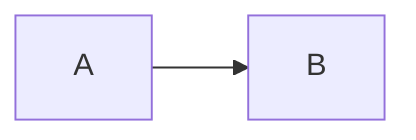

> 📂 **パス**: `80_POC_Projects/POC_017_ClaudianBridge/03_開発文書/99_上流フィードバック_realclaudianコピーbug.md`
> 🎯 **用途**: realclaudian 作者（Yishen Tu）への GitHub Issue 提案文案

---

# 🐛 上流 Issue 提案:コードブロックコピーが ``` フェンスを欠落する

> **対象**: realclaudian（Yishen Tu） / GitHub Issues
> **推奨タイトル**: `[Bug] Copying a code block from Claudian chat drops the ``` fences (Mermaid broken)`

---

## Issue 本文（GitHub に貼る文案）

### Summary

When clicking the language label (e.g. "mermaid") on a code block in the Claudian chat view, the copied text omits the ``` fences. Pasting into Obsidian produces plain text instead of a rendered code block / Mermaid diagram.

### Environment

- realclaudian v2.1.3
- Obsidian 1.7.2+

### Steps to reproduce

1. Ask Claudian for a Mermaid diagram (or any code block).
2. Hover over the code block.
3. Click the language label (top-right, e.g. "mermaid").
4. Paste into a Markdown file (source mode).
5. Observe: the paste starts with `graph LR` and ends with `style ...`, with no ```mermaid / ``` fences.

### Expected

The clipboard should contain the fenced code block:



### Root cause (analysis)

In `main.js`, the copy handler for the language label does:

```js
await navigator.clipboard.writeText(u.textContent || "");
```

`u.textContent` is the rendered DOM text of the `<code>` element. The ``` fences are Markdown syntax that does not exist in the rendered DOM (they become `<code class="language-mermaid">`), so they are never copied. The language label text ("mermaid") may also be included when the user selects text manually.

### Suggested fix

Prepend/append the fence using the detected language:

```diff
- await navigator.clipboard.writeText(u.textContent || "");
+ const lang = v; // e.g. "mermaid"
+ await navigator.clipboard.writeText("```" + lang + "\n" + (u.textContent || "") + "\n```");
```

### Workaround

A companion plugin (claudian-bridge v0.9.0) intercepts the click in the capture phase and writes the fenced content instead. This is a stopgap; an upstream fix would let users remove the workaround.

---

## 🔗 関連リンク

- [[../08_説明書/03_リリースノート/既知の問題|既知の問題 KB-001]]
- [[../08_説明書/03_リリースノート/リリースノート|リリースノート v0.9.0]]

---

*🐛 上流フィードバック v1.0.0 · POC_017 Claudian Bridge · MiuMiu 🐾*
