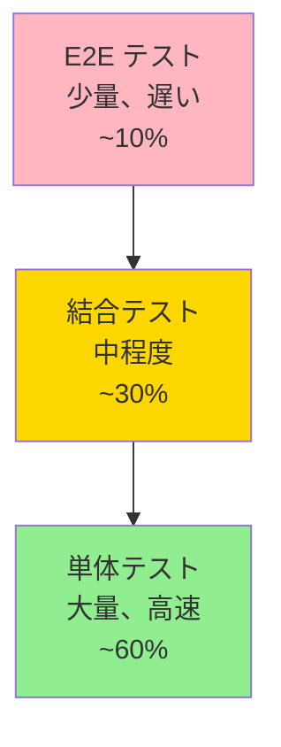

> 📂 **パス**: `80_POC_Projects/POC_XXX/04_テスト文書/00_テスト戦略.md`
> 📌 **フェーズ**: フェーズ4 · テスト検証
> 🎯 **用途**: テスト階層 + カバレッジ率目標

# 🧪 テスト戦略

> **関連プロジェクト**: [[../README|フェーズインデックス]]

---

## 🏛️ テストピラミッド



---

## 📊 カバレッジ率目標

| 階層 | カバレッジ率目標 | 現在 | 状態 |
|------|:----------:|:----:|:----:|
| 単体テスト | ≥ 80% | 0% | ⬜ |
| 結合テスト | ≥ 60% | 0% | ⬜ |
| E2E テスト | 重要パス 100% | 0% | ⬜ |
| 全体 | ≥ 75% | 0% | ⬜ |

---

## 🧰 テストツール

| タイプ | ツール | 用途 |
|------|------|------|
| **単体テスト** | pytest + pytest-asyncio | Python 単体テスト |
| **Mock** | pytest-mock | 外部依存の Mock |
| **カバレッジ率** | pytest-cov | カバレッジ率集計 |
| **E2E** | Playwright | エンドツーエンドテスト |
| **API テスト** | httpx | API 結合テスト |
| **パフォーマンス** | Locust | 負荷テスト |

---

## 📋 テストタイプ

| タイプ | 範囲 | ツール | タイミング |
|------|------|------|------|
| **スモークテスト** | コアフロー | 手動 + E2E | 毎回のデプロイ |
| **機能テスト** | すべての F-番号 | 単体 + 結合 | 毎回の提出 |
| **回帰テスト** | 過去の Bug | 単体 | 毎回の提出 |
| **パフォーマンステスト** | 重要 API | Locust | リリース前 |
| **セキュリティテスト** | OWASP Top 10 | 脆弱性スキャン | リリース前 |
| **E2E テスト** | ユーザーフロー | Playwright | 毎回のリリース |

---

## 🔄 CI/CD 統合

```yaml
# .github/workflows/test.yml（例）
name: Tests
on: [push, pull_request]
jobs:
  test:
    runs-on: ubuntu-latest
    steps:
      - uses: actions/checkout@v3
      - uses: actions/setup-python@v4
        with:
          python-version: '3.10'
      - run: pip install -r requirements-dev.txt
      - run: pytest --cov=app --cov-report=xml
      - run: pytest tests/e2e
```

---

## 🎯 受け入れ基準

- [ ] 単体テストカバレッジ率 ≥ 80%
- [ ] すべてのテスト合格（0 failed）
- [ ] 重大 Bug なし（P0/P1）
- [ ] パフォーマンス指標達成
- [ ] セキュリティスキャンに高リスクなし

---

## 🔗 関連ドキュメント

- [[01_テストケース|テストケース]]
- [[02_テスト報告書|テスト報告書]]
- [[03_テストフロー|テストフロー]]

---

*🧪 テスト戦略 v2.0.0 · テストピラミッド + カバレッジ率目標 · MiuMiu 🐾*
