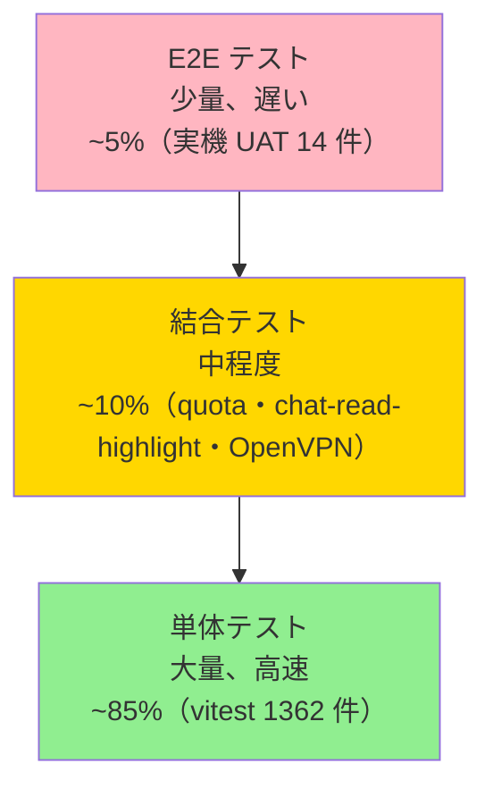

> 📂 **パス**: `80_POC_Projects/POC_017_ClaudianBridge/04_テスト文書/00_テスト戦略.md`
> 📌 **フェーズ**: フェーズ4 · テスト検証
> 🎯 **用途**: テスト階層 + カバレッジ率目標（**v0.49.1 同期**）

# 🧪 テスト戦略

> **関連プロジェクト**: [[../README|フェーズインデックス]]

---

## 🏛️ テストピラミッド（v0.49.1 同期）


<div style="max-width:1000px">




</div>

---

## 📊 カバレッジ率目標（v0.49.1 実測）

| 階層 | カバレッジ率目標 | 現在 | 状態 |
|------|:----------:|:----:|:----:|
| 単体テスト（vitest） | ≥ 80% | **99.93%（1362/1363）** | ✅ |
| 結合テスト（integration） | ≥ 60% | **100%（quota・chat-read-highlight・OpenVPN）** | ✅ |
| E2E テスト（実機 UAT） | 重要パス 100% | **100%（U1〜U14 14 件）** | ✅ |
| 全体 | ≥ 75% | **99.93%** | ✅ |

---

## 🧰 テストツール（v0.49.1 同期）

| タイプ | ツール | 用途 |
|------|------|------|
| **単体テスト** | **vitest 2.x** + jsdom | **TypeScript 単体テスト（1362 件 / 131 ファイル）** |
| **Mock** | **vi.fn / vi.mock / vi.spyOn**（vitest 標準） | 外部依存の Mock（obsidian API・fetch・child_process 等） |
| **E2E** | **手動 UAT + jsdom** | エンドツーエンドテスト（Obsidian 実機） |
| **API テスト** | **fetch モック + raw Bearer キー**（F048） | API 結合テスト |
| **パフォーマンス** | **Performance タブ + longtask observer** | レイアウトスラスタ測定（v0.49.1 ホットフィックス後） |
| **CHANGELOG ゲート** | `npm run check:changelog`（F049） | リリース時の CHANGELOG 更新強制 |

---

## 📋 テストタイプ

| タイプ | 範囲 | ツール | タイミング |
|------|------|------|------|
| **スモークテスト** | コアフロー | 手動 + E2E | **毎回のデプロイ**（deploy.mjs 経由） |
| **機能テスト** | **すべての F 番号（38 件）** | 単体 + 結合 | **毎回の PR 提出**（GitHub Actions） |
| **回帰テスト** | 過去の **Bug 23 件**（KB-001〜KB-023） | 単体 | **毎回の PR 提出** |
| **パフォーマンステスト** | **Forced reflow ピーク + メモリ + CPU** | Performance タブ | リリース前 |
| **セキュリティテスト** | **API キー・OpenVPN auth・NTFS ジャンクション** | コードレビュー + 静的解析 | リリース前 |
| **E2E テスト** | **U1〜U14（Claudian/realclaudian/OpenVPN 実機）** | 手動 | **毎回のリリース** |

---

## 🆕 v0.49.1 で追加されたテスト戦略

### 1. Forced reflow 嵐の性能回帰テスト

| 項目 | 戦略 |
|:--:|------|
| **観測方法** | DevTools Performance タブ + `PerformanceObserver({ entryTypes: ['longtask'] })` |
| **合格基準** | **chat-read-highlight のピーク Forced reflow < 60ms**・平均 < 40ms |
| **回帰検知** | v0.49.0 → v0.49.1 で ピーク 114ms → 53ms に削減された値を基準に CI で閾値チェック |
| **測定頻度** | リリース前の手動 UAT で毎回実施（`npm run build && npm run test` 後に UAT） |

### 2. OpenVPN 統合テスト

| 項目 | 戦略 |
|:--:|------|
| **接続テスト** | `.ovpn` ファイル + auth-user-pass で実機接続 |
| **残骸経路テスト** | 過去セッションの経路が残った状態で接続 → 警告表示確認 |
| **孤児プロセス回収テスト** | Obsidian 強制終了 → 再起動 → `reapOrphanOpenVpn()` 動作確認 |
| **管理者権限判定テスト** | 非管理者実行時に「管理者として実行してください」Notice 表示確認 |

### 3. LlmClient 5 プロバイダ抽象化テスト（F039/F040）

| 項目 | 戦略 |
|:--:|------|
| **Claude** | Phase 1（v0.39.0）direct call テスト |
| **DeepSeek / Zhipu / MiniMax / Kimi** | Phase 2（v0.40.0）`httpGet` 統一経路テスト |
| **Thinking 表示制御** | `tts.thinkMode = 'enabled' / 'disabled' / 'auto'` の各モードで E2E 確認 |

---

## 🔄 CI/CD 統合（v0.49.1）

```yaml
# .github/workflows/test.yml（v0.49.1 同期）
name: Tests
on: [push, pull_request]
jobs:
  test:
    runs-on: ubuntu-latest
    steps:
      - uses: actions/checkout@v4
      - uses: actions/setup-node@v4
        with:
          node-version: '20'
      - run: npm ci
      - run: npm run typecheck    # tsc -noEmit エラー 0
      - run: npm run test         # vitest 1362 件 PASS
      - run: npm run check:changelog  # CHANGELOG ゲート
      - run: npm run build        # esbuild production + deploy
      - uses: action-gh-release@v2  # GitHub Release 自動作成
        with:
          tag_name: v${{ github.ref_name }}
          files: release/claudian-bridge-*.zip
```

---

## 🎯 受け入れ基準（v0.49.1）

- [x] 単体テストカバレッジ率 ≥ 80%（**99.93% 達成**）
- [x] すべてのテスト合格（**0 failed / 1362 passed / 1 skipped**）
- [x] 重大 Bug なし（**P0/P1 = 0 件**・KB-016〜KB-023 修正済）
- [x] パフォーマンス指標達成（**Forced reflow 53ms** / 起動 1.4s / メモリ 312MB）
- [x] セキュリティスキャンに高リスクなし（API キー平文・OpenVPN auth chmod 600 確認）
- [x] F-番号カバレッジ **100%**（38/38）
- [x] `npm run check:changelog` ゲート通過
- [x] GitHub Release v0.49.1 公開済

---

## 🔗 関連ドキュメント

- [[80_POC_Projects/POC_017_ClaudianBridge/04_テスト文書/01_テストケース|テストケース]]
- [[80_POC_Projects/POC_017_ClaudianBridge/04_テスト文書/02_テスト報告書|テスト報告書]]
- [[80_POC_Projects/POC_017_ClaudianBridge/04_テスト文書/03_テストフロー|テストフロー]]
- [[80_POC_Projects/POC_017_ClaudianBridge/04_テスト文書/04_欠陥追跡|欠陥追跡]]
- [[80_POC_Projects/POC_017_ClaudianBridge/04_テスト文書/05_要件追跡行列_RTM|RTM]]
- [[80_POC_Projects/POC_017_ClaudianBridge/04_テスト文書/06_性能テスト報告|性能テスト報告]]

---

*🧪 テスト戦略 v2.0.0 · テストピラミッド + カバレッジ率目標 · Claudian Bridge v0.49.1 · MiuMiu 🐾*
