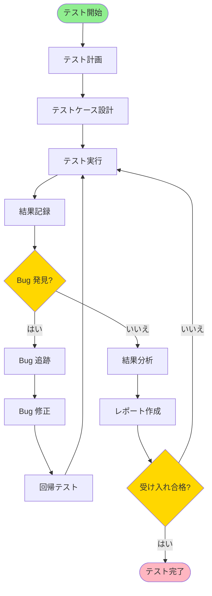
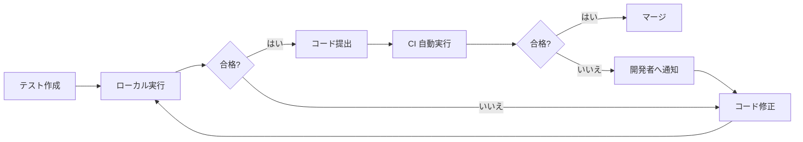
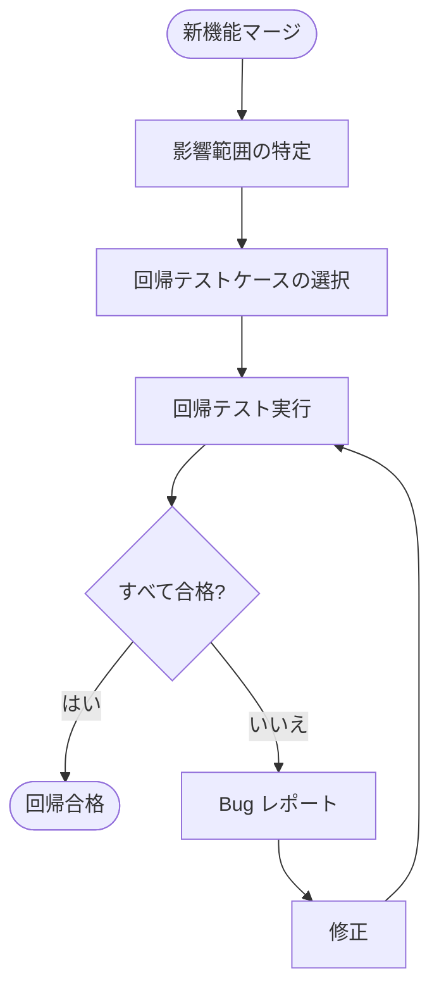
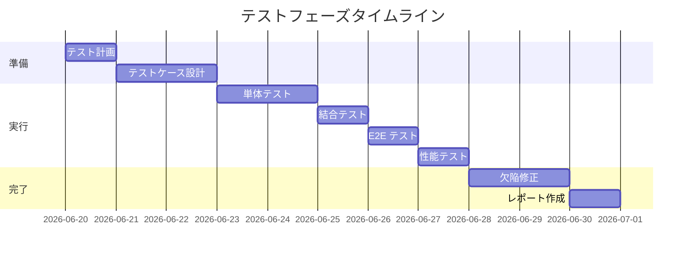
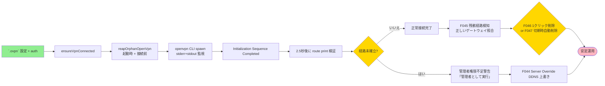
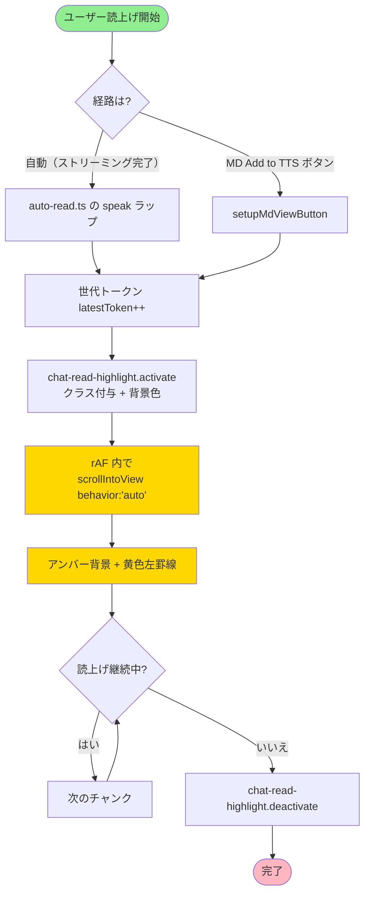

> 📂 **パス**: `80_POC_Projects/POC_XXX/04_テスト文書/03_テストフロー.md`
> 📌 **フェーズ**: フェーズ4 · テスト検証
> 🎯 **用途**: テスト業務フロー（flowchart）

# 🔄 テストフロー

> **関連プロジェクト**: [[../README|フェーズインデックス]]

---

## 📐 UML 要素説明

| 属性 | 値 |
|------|-----|
| **UML タイプ** | フローチャート（Flowchart） |
| **Mermaid 実装** | `flowchart` |
| **核心要素** | ノード（Node）+ エッジ（Edge）+ 意思決定（Decision） |

---

## 🔄 主テストフロー


<div style="max-width:1000px">




</div>

---

## 🔍 詳細サブフロー

### フロー 1:単体テスト


<div style="max-width:1000px">




</div>

### フロー 2:回帰テスト


<div style="max-width:1000px">




</div>

### フロー 3:Bug 提出フロー


<div style="max-width:1000px">


</div>

---

## 📋 テストフェーズフロー


<div style="max-width:1000px">




</div>

---

## 🆕 v0.49.1 サブフロー

### フロー 4: Forced reflow 嵐の緊急対応（v0.49.1 ホットフィックス）


<div style="max-width:1000px">

```mermaid
flowchart TB
    Start([v0.49.0 リリース]) --> User[ユーザー読上げ開始]
    User --> Reflow{Forced reflow<br/>114ms ピーク発生?}
    
    Reflow -->|はい| Diag[DevTools Performance タブで犯人特定]
    Diag --> Locate[scrollIntoView{behavior:'smooth'}<br/>と getBoundingClientRect を検出]
    Locate --> Patch[requestAnimationFrame 内で<br/>behavior:'auto' 化]
    Patch --> Hotfix[v0.49.1 hotfix リリース<br/>ピーク 53ms に削減]
    Hotfix --> Verify[Performance タブで<br/>53ms 以下を確認]
    
    Reflow -->|いいえ| Pass([継続監視])
    Verify --> Pass
    
    style Start fill:#FFB6C1
    style Hotfix fill:#90EE90
    style Reflow fill:#FFD700
```


</div>

### フロー 5: OpenVPN 統合の動作確認（F041-F047）


<div style="max-width:1000px">




</div>

### フロー 6: チャット読上げハイライト + MD 画面ボタン（F050/F051）


<div style="max-width:1000px">




</div>

---

## 🔗 関連ドキュメント

- [[80_POC_Projects/POC_017_ClaudianBridge/04_テスト文書/00_テスト戦略|テスト戦略]]
- [[80_POC_Projects/POC_017_ClaudianBridge/04_テスト文書/01_テストケース|テストケース]]
- [[80_POC_Projects/POC_017_ClaudianBridge/04_テスト文書/04_欠陥追跡|不具合追跡]]
- [[80_POC_Projects/POC_017_ClaudianBridge/04_テスト文書/06_性能テスト報告|性能テスト報告]]
- [[80_POC_Projects/POC_017_ClaudianBridge/02_設計文書/32_チャット読上げハイライト設計|F-050 設計]]
- [[80_POC_Projects/POC_017_ClaudianBridge/02_設計文書/27_ネットワークタブOpenVPN設計|F-041 設計]]

---

*🔄 テストフロー v2.0.0 · flowchart メインフロー + 6 サブフロー · Claudian Bridge v0.49.1 · MiuMiu 🐾*
