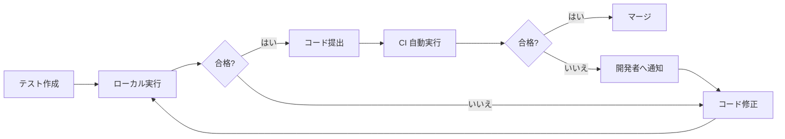
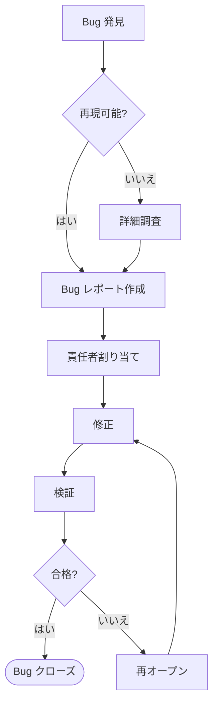
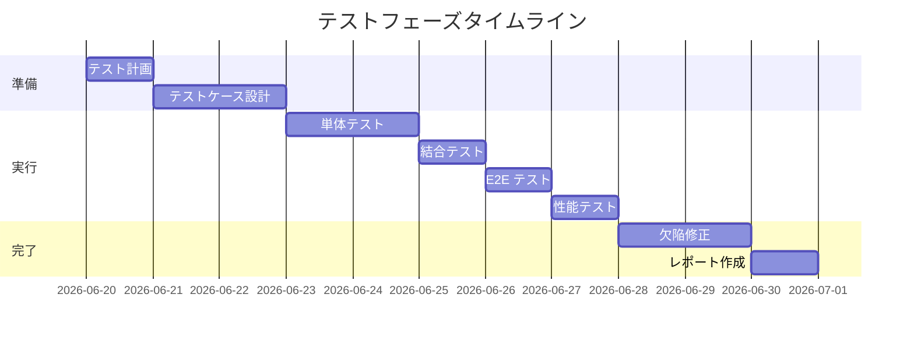

> 📂 **パス**: `80_POC_Projects/POC_XXX/04_テスト文書/03_テストフロー.md`
> 📌 **フェーズ**: フェーズ4 · テスト検証
> 🎯 **用途**: テスト業務フロー（flowchart）

# 🔄 テストフロー

> **関連プロジェクト**: [[../README|フェーズインデックス]]

---

## 📐 UML 要素説明

| 属性 | 値 |
|------|-----|
| **UML タイプ** | フローチャート（Flowchart） |
| **Mermaid 実装** | `flowchart` |
| **核心要素** | ノード（Node）+ エッジ（Edge）+ 意思決定（Decision） |

---

## 🔄 主テストフロー

---

## 🔍 詳細サブフロー

### フロー 1:単体テスト

### フロー 2:回帰テスト

### フロー 3:Bug 提出フロー

---

## 📋 テストフェーズフロー

---

## 🔗 関連ドキュメント

- [[00_テスト戦略|テスト戦略]]
- [[01_テストケース|テストケース]]
- [[04_欠陥追跡|不具合追跡]]

---

*🔄 テストフロー v2.0.0 · flowchart メインフロー + 3 サブフロー · MiuMiu 🐾*
