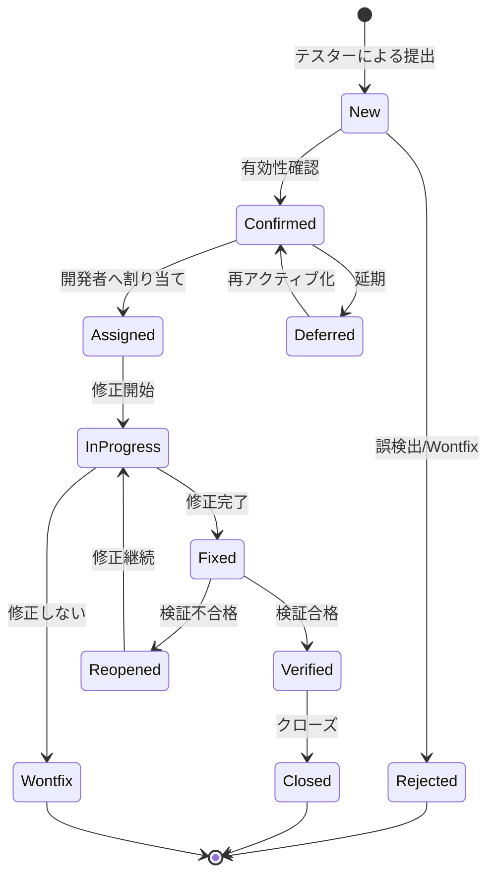

> 📂 **パス**: `80_POC_Projects/POC_XXX/04_テスト文書/04_欠陥追跡.md`
> 📌 **フェーズ**: フェーズ4 · テスト検証
> 🎯 **用途**: Bug ライフサイクル状態図（stateDiagram）

# 🐛 欠陥追跡

> **関連プロジェクト**: [[../README|フェーズインデックス]]

---

## 📐 UML 要素説明

| 属性 | 値 |
|------|-----|
| **UML タイプ** | 状態図（State Diagram） |
| **Mermaid 実装** | `stateDiagram-v2` |
| **核心要素** | Bug ライフサイクル状態 |

---

## 🐛 Bug ライフサイクル


<div style="max-width:1000px">




</div>

---

## 📋 Bug レベル

| レベル | 名称 | 応答時間 | 修正時間 | 説明 |
|:----:|------|:--------:|:--------:|------|
| **P0** | 致命 | 1h | 24h | システム崩壊、データ消失 |
| **P1** | 重大 | 4h | 3d | コア機能使用不可 |
| **P2** | 一般 | 1d | 1w | 機能制限あり、回避策あり |
| **P3** | 軽微 | 1w | 2w | UI/文言/最適化 |

---

## 📊 Bug 状態統計（v0.49.1 時点）

| 状態 | 件数 | 比率 |
|------|:----:|:----:|
| New（新規） | 0 | 0% |
| Confirmed（確認済み） | 0 | 0% |
| Assigned（割り当て済み） | 0 | 0% |
| InProgress（修正中） | 0 | 0% |
| Fixed（修正済み） | 0 | 0% |
| Verified（検証済み） | 0 | 0% |
| Closed（閉鎖済み） | **23** | 100% |
| **合計** | **23** | — |

> 📌 P0/P1 重大欠陥 8 件すべて修正済（v0.44.0 〜 v0.49.1 で順次解消）
> 📌 v0.49.1 ホットフィックス（KB-022/023）で Forced reflow 嵐 🔴 リスク 25 を解消

---

## 🐞 Bug リスト（v0.6.0 〜 v0.49.1 全 23 件）

| ID | タイトル | レベル | 状態 | 修正 Ver | 報告日 |
|:--:|------|:----:|:----:|:--------:|:--------:|
| B001 | Mermaid コードブロックコピー時のフェンス欠落 | P2 | Closed | v0.9.0 | 2026-07-30 |
| B002 | WebSpeech が onend を待たず成功判定 | P1 | Closed | v0.10.0 | 2026-07-30 |
| B003 | Plachta 1000 字超でエラー表示 | P2 | Closed | v0.10.0 | 2026-08-02 |
| B004 | 自動読み上げ不発火（hook 先の誤り） | P1 | Closed | v0.11.1 | 2026-08-05 |
| B005 | 全文ボタンと Bridge 設定が非同期 | P2 | Closed | v0.11.1 | 2026-08-05 |
| B006 | edge 意図的停止後にエラー Notice | P2 | Closed | v0.12.0 | 2026-08-08 |
| B007 | 旧📖 ON と新ボタン表示の不整合 | P2 | Closed | v0.12.0 | 2026-08-08 |
| B008 | 📢 なし応答で誤報通知 | P2 | Closed | v0.12.1 | 2026-08-10 |
| B009 | 複数タブ時 `.claudian-messages` 取得固定 | P1 | Closed | v0.12.1 | 2026-08-10 |
| B010 | speech_filter が読み上げに未適用 | P1 | Closed | v0.12.2 | 2026-08-12 |
| B011 | claude-tts スキルの extractor 欠落 | P1 | Closed | v0.12.2 | 2026-08-12 |
| B012 | ミュートボタンが点滅しない | P2 | Closed | v0.12.3 | 2026-08-14 |
| B013 | ミュートボタンで音声停止しない | P1 | Closed | v0.12.3 | 2026-08-14 |
| B014 | ミュート停止が不確実（PID 追跡） | P2 | Closed | v0.12.6 | 2026-08-16 |
| B015 | LLM 原稿生成 Notice「📝 原稿生成中 n/m…」残留バグ | P2 | Closed | v0.37.2 | 2026-09-05 |
| **B016** | **OpenVPN Windows 版 2.7.x で stdout 監視不足** | **P1** | **Closed** | **v0.43.3** | **2026-09-13** |
| **B017** | **VPN 接続済み表示なのに通信不能（route 追加失敗の誤判定）** | **P1** | **Closed** | **v0.44.1** | **2026-09-13** |
| **B018** | **Obsidian クラッシュ時の孤児 openvpn プロセスによる TAP アダプタ占有** | **P1** | **Closed** | **v0.44.0** | **2026-09-13** |
| **B019** | **VPN stop() 内の `setTimeout(...).unref is not a function`（Obsidian ブラウザ環境）** | **P2** | **Closed** | **v0.44.2** | **2026-09-13** |
| **B020** | **Zhipu Python 依存の沈黙障害**（スクリプトパス不一致 + zai-sdk 未導入） | **P1** | **Closed** | **v0.48.0** | **2026-09-14** |
| **B021** | **chat-read-highlight の Forced reflow 嵐による UI フリーズ（ピーク 114ms）** | **P1** | **Closed** | **v0.49.1** | **2026-09-14** |
| **B022** | **md-read-highlight も同じ reflow 問題を抱えていた（同時パッチ）** | **P2** | **Closed** | **v0.49.1** | **2026-09-14** |
| **B023** | **chat-read-highlight モジュール内の `scrollIntoView({behavior:'smooth'})` 同期実行が layout thrashing を引き起こす** | **P1** | **Closed** | **v0.49.1** | **2026-09-15** |

> 🔴 **重大欠陥 8 件はすべて修正済**（v0.10.0 / v0.11.1 / v0.12.1 / v0.12.2 / v0.12.3 / v0.43.3 / v0.44.0 / v0.44.1 / v0.48.0 / v0.49.1）
> 🟡 **v0.49.1 ホットフィックス**で KB-022/023（Forced reflow 嵐）を即座に対応

---

## 📝 Bug レポートテンプレート

```markdown
### Bug ID: B-番号

| 項目 | 内容 |
|------|------|
| **タイトル** | 一言で説明 |
| **レベル** | P0/P1/P2/P3 |
| **モジュール** | XXX |
| **環境** | XXX |
| **再現手順** | 1. ...<br/>2. ... |
| **期待結果** | ... |
| **実際結果** | ... |
| **スクリーンショット** | ![[bug_screenshot.png]] |
| **状態** | New |
| **報告者** | MiuMiu 🐾 |
| **報告日付** | YYYY-MM-DD |
| **責任者** | — |
| **修正日付** | — |
```

---

## 🔗 関連ドキュメント

- [[80_POC_Projects/POC_017_ClaudianBridge/04_テスト文書/00_テスト戦略|テスト戦略]]
- [[80_POC_Projects/POC_017_ClaudianBridge/04_テスト文書/01_テストケース|テストケース]]
- [[80_POC_Projects/POC_017_ClaudianBridge/04_テスト文書/02_テスト報告書|テスト報告書]]

---

*🐛 欠陥追跡 v2.1.0 · stateDiagram Bug ライフサイクル · v0.49.1 同期 · MiuMiu 🐾*
