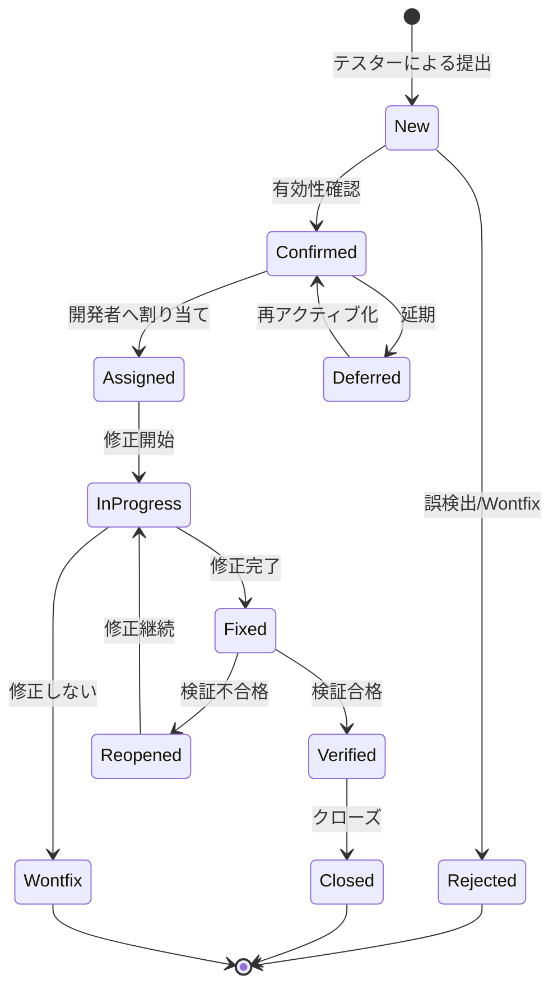

> 📂 **パス**: `80_POC_Projects/POC_XXX/04_テスト文書/04_欠陥追跡.md`
> 📌 **フェーズ**: フェーズ4 · テスト検証
> 🎯 **用途**: Bug ライフサイクル状態図（stateDiagram）

# 🐛 欠陥追跡

> **関連プロジェクト**: [[../README|フェーズインデックス]]

---

## 📐 UML 要素説明

| 属性 | 値 |
|------|-----|
| **UML タイプ** | 状態図（State Diagram） |
| **Mermaid 実装** | `stateDiagram-v2` |
| **核心要素** | Bug ライフサイクル状態 |

---

## 🐛 Bug ライフサイクル



---

## 📋 Bug レベル

| レベル | 名称 | 応答時間 | 修正時間 | 説明 |
|:----:|------|:--------:|:--------:|------|
| **P0** | 致命 | 1h | 24h | システム崩壊、データ消失 |
| **P1** | 重大 | 4h | 3d | コア機能使用不可 |
| **P2** | 一般 | 1d | 1w | 機能制限あり、回避策あり |
| **P3** | 軽微 | 1w | 2w | UI/文言/最適化 |

---

## 📊 Bug 状態統計

| 状態 | 件数 | 比率 |
|------|:----:|:----:|
| New（新規） | 0 | 0% |
| Confirmed（確認済み） | 0 | 0% |
| Assigned（割り当て済み） | 0 | 0% |
| InProgress（修正中） | 0 | 0% |
| Fixed（修正済み） | 0 | 0% |
| Verified（検証済み） | 0 | 0% |
| Closed（閉鎖済み） | 0 | 0% |
| **合計** | **0** | — |

---

## 🐞 Bug リスト

| ID | タイトル | レベル | 状態 | 責任者 | 報告日付 |
|:--:|------|:----:|:----:|--------|:--------:|
| B001 | サンプル Bug | P2 | New | — | — |

> テスト後に記入

---

## 📝 Bug レポートテンプレート

```markdown
### Bug ID: B-番号

| 項目 | 内容 |
|------|------|
| **タイトル** | 一言で説明 |
| **レベル** | P0/P1/P2/P3 |
| **モジュール** | XXX |
| **環境** | XXX |
| **再現手順** | 1. ...<br/>2. ... |
| **期待結果** | ... |
| **実際結果** | ... |
| **スクリーンショット** | ![[bug_screenshot.png]] |
| **状態** | New |
| **報告者** | MiuMiu 🐾 |
| **報告日付** | YYYY-MM-DD |
| **責任者** | — |
| **修正日付** | — |
```

---

## 🔗 関連ドキュメント

- [[00_テスト戦略|テスト戦略]]
- [[01_テストケース|テストケース]]
- [[02_テスト報告書|テスト報告書]]

---

*🐛 欠陥追跡 v2.0.0 · stateDiagram Bug ライフサイクル · MiuMiu 🐾*
