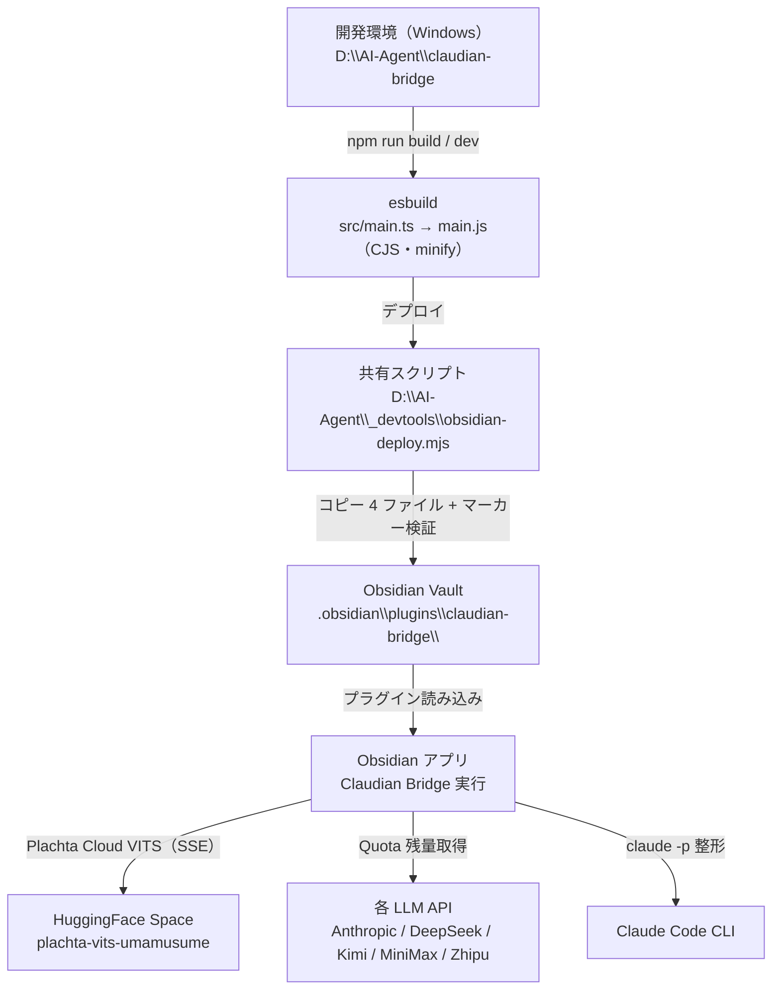

> 📂 **パス**: `80_POC_Projects/POC_017_ClaudianBridge/05_デプロイ運用/00_デプロイアーキテクチャ.md`
> 📌 **フェーズ**: フェーズ5 · デプロイリリース
> 🎯 **用途**: Claudian Bridge のデプロイトポロジ（デプロイ図）

# 🏗️ デプロイアーキテクチャ

> **関連プロジェクト**: [[../README|フェーズインデックス]] | [[01_環境インベントリ|環境インベントリ]]

---

## 📐 概要

Claudian Bridge は **Obsidian デスクトッププラグイン**（`isDesktopOnly: true`）であり、
ビルド → 共有スクリプト → ローカル Vault のプラグインフォルダへのコピーという **ローカル単一ノード** 構成を持つ。
外部依存は TTS（Plachta HF Space）・Quota（各 LLM API）のみ。

---

## 🌐 デプロイトポロジ

---

## 📋 ノード一覧

| ノード | スペック / パス | 数量 | 用途 |
|------|------|:----:|------|
| **開発環境** | Windows 11・Node 20+ | 1 | ソース編集・ビルド・テスト |
| **ソースリポジトリ** | `D:\AI-Agent\ClaudianBridge\` | 1 | git main ブランチ |
| **共有デプロイツール** | `D:\AI-Agent\_devtools\obsidian-deploy.mjs` | 1 | 全 Obsidian プラグイン共通のデプロイ |
| **デプロイ先** | `C:\Users\superlambkin\OneDrive\Edge\Obsidian Vault\.obsidian\plugins\claudian-bridge\` | 1 | main.js / manifest.json / styles.css / versions.json |
| **Obsidian アプリ** | Obsidian 1.7.2+（Windows） | 1 | プラグイン実行 |
| **HuggingFace Space** | plachta-vits-umamusume-voice-synthesizer | 1 | Plachta Cloud VITS 音声合成 |
| **各 LLM API** | Anthropic / DeepSeek / Kimi / MiniMax / Zhipu | 5 | Quota 残量検知 |

---

## 🔒 セキュリティポリシー

| 層 | 対策 |
|------|------|
| **API キー** | Quota 各プロバイダのキーは設定（data.json）で管理・コードに埋め込まない |
| **ローカル実行** | プラグインはローカル Vault 内でのみ実行（`isDesktopOnly: true`） |
| **外部通信** | TTS（HF Space）・Quota（各 LLM API）への HTTPS 通信 |
| **移行データ** | 旧プラグインの data.json は退避の上、移行後もバックアップ保持 |
| **デプロイ検証** | デプロイ後に文字列マーカー（`Claudian Bridge` / `claudian-bridge`）を検証し、欠落時は exit 1 |

---

## 🔗 関連ドキュメント

- [[01_環境インベントリ|環境インベントリ]]
- [[02_デプロイフロー|デプロイフロー]]
- [[03_監視アラート|監視アラート]]

---

## 📝 更新履歴

| バージョン | 日付 | 修正内容 | 修正者 |
|------|------|---------|--------|
| v1.0.0 | 2026-08-17 | 実内容を記入（Obsidian プラグインのローカルデプロイトポロジ） | MiuMiu 🐾 |

---

*🏗️ デプロイアーキテクチャ v1.0.0 · POC_017 Claudian Bridge · MiuMiu 🐾*
