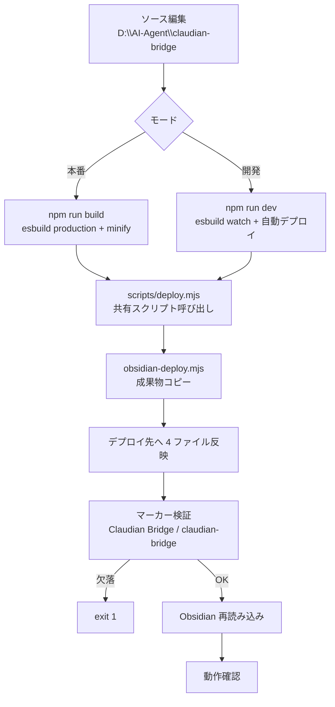

> 📂 **パス**: `80_POC_Projects/POC_017_ClaudianBridge/05_デプロイ運用/02_デプロイフロー.md`
> 📌 **フェーズ**: フェーズ5 · デプロイリリース
> 🎯 **用途**: デプロイ手順（flowchart）

# 🔄 デプロイフロー

> **関連プロジェクト**: [[../README|フェーズインデックス]] | [[00_デプロイアーキテクチャ|デプロイアーキテクチャ]]

---

## 🎯 デプロイ手順



---

## 📋 手順詳細

### 本番デプロイ（`npm run build`）

```bash
cd D:\AI-Agent\ClaudianBridge
npm run typecheck    # 1. 型チェック
npm test             # 2. 全テスト（592 passed / 1 skipped）
npm run build        # 3. esbuild production → main.js（minify）→ 自動デプロイ + マーカー検証
```

- デプロイ先: `.obsidian\plugins\claudian-bridge\`
- コピー対象: `main.js` / `manifest.json` / `styles.css` / `versions.json`

### 開発デプロイ（`npm run dev`）

```bash
cd D:\AI-Agent\ClaudianBridge
npm run dev          # esbuild watch + ビルド成功ごとに自動デプロイ
```

- ビルドエラー時はデプロイをスキップ（stale main.js 誤デプロイ防止）
- Hot-Reload プラグイン有効時は Obsidian 側も自動リロード

### デプロイのみ

```bash
npm run deploy       # ビルド済み成果物を再コピー
```

---

## ✅ デプロイ後確認

| 確認項目 | 期待結果 |
|------|------|
| `manifest.json` の version | `0.19.0` |
| 設定画面のバージョン表示 | `Claudian Bridge v0.19.0` |
| 旧プラグイン | community-plugins.json に不在 |
| 診断ログ（Developer Console） | `[claudian-bridge] loaded` |

---

## 🔗 関連ドキュメント

- [[../03_開発文書/06_ビルド設定|ビルド設定]]
- [[01_環境インベントリ|環境インベントリ]]

---

## 📝 更新履歴

| バージョン | 日付 | 修正内容 | 修正者 |
|------|------|---------|--------|
| v1.0.0 | 2026-08-17 | 実内容を記入（npm run build / dev / deploy 手順） | MiuMiu 🐾 |

---

*🔄 デプロイフロー v1.0.0 · POC_017 Claudian Bridge · MiuMiu 🐾*
