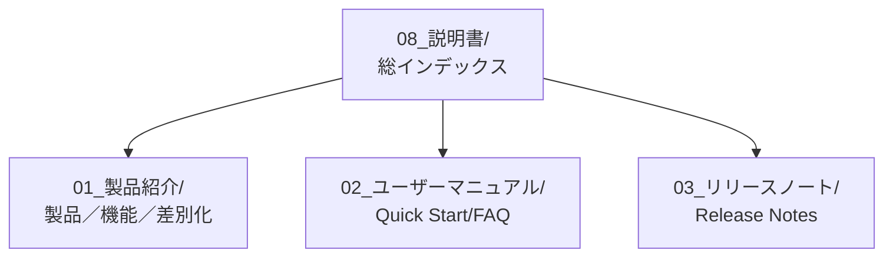

> 📂 **パス**: `08_説明書/README.md`
> 🎯 **用途**: 外部向けドキュメント総インデックス、顧客とユーザーのための完全なドキュメント体系

---

# 📚 説明書 · 総インデックス

## 📖 ドキュメント構造

---

## 📚 ドキュメント一覧

### 📦 01_製品紹介（顧客向け）

| ドキュメント | 内容 | 対象 |
|------|------|------|
| [[01_製品紹介/製品紹介|製品紹介]] | 製品概要、対象ユーザー | 潜在顧客 |
| [[01_製品紹介/コア機能|コア機能]] | F-番号機能詳細 | 製品意思決定者 |
| [[01_製品紹介/差別化優位性|差別化優位性]] | 競合比較 | 営業 |

### 👤 02_ユーザーマニュアル（ユーザー向け）

| ドキュメント | 内容 | 対象 |
|------|------|------|
| [[02_ユーザーマニュアル/クイックスタート|クイックスタート]] | 5分間入門 | 新ユーザー |
| [[02_ユーザーマニュアル/機能詳細|機能詳細]] | 詳細な使い方ガイド | 上級ユーザー |
| [[02_ユーザーマニュアル/FAQ|FAQ]] | トラブルシューティング | 問題を抱えるユーザー |

### 📢 03_リリースノート（全員向け）

| ドキュメント | 内容 | 対象 |
|------|------|------|
| [[03_リリースノート/リリースノート|リリースノート]] | 現在のバージョン説明 | すべてユーザー |
| [[03_リリースノート/バージョン履歴|バージョン履歴]] | これまでのバージョン | 既存ユーザー |
| [[03_リリースノート/既知の問題|既知の問題]] | 現在の不具合一覧 | テスト／技術 |

---

## 🎯 ドキュメントの位置づけ

| 対象 | 推奨閲覧順 |
|------|-------------|
| **潜在顧客** | 製品紹介 → コア機能 → 差別化優位性 |
| **新ユーザー** | クイックスタート → FAQ → 機能詳細 |
| **既存ユーザー** | リリースノート → バージョン履歴 |
| **内部チーム** | リリースノート → 既知の問題 |

---

*📚 説明書総インデックス v1.0.0 · MiuMiu 🐾*

## 🔗 関連

### 用語集

- [[200_Output/99_技術用語対照表|99_技術用語対照表.md]] — 技術用語
