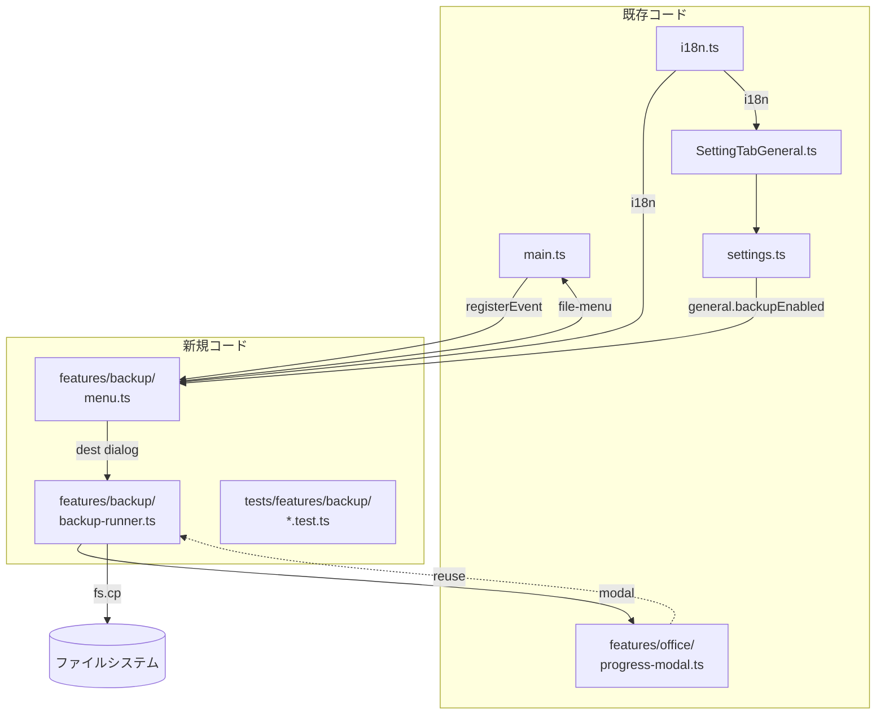
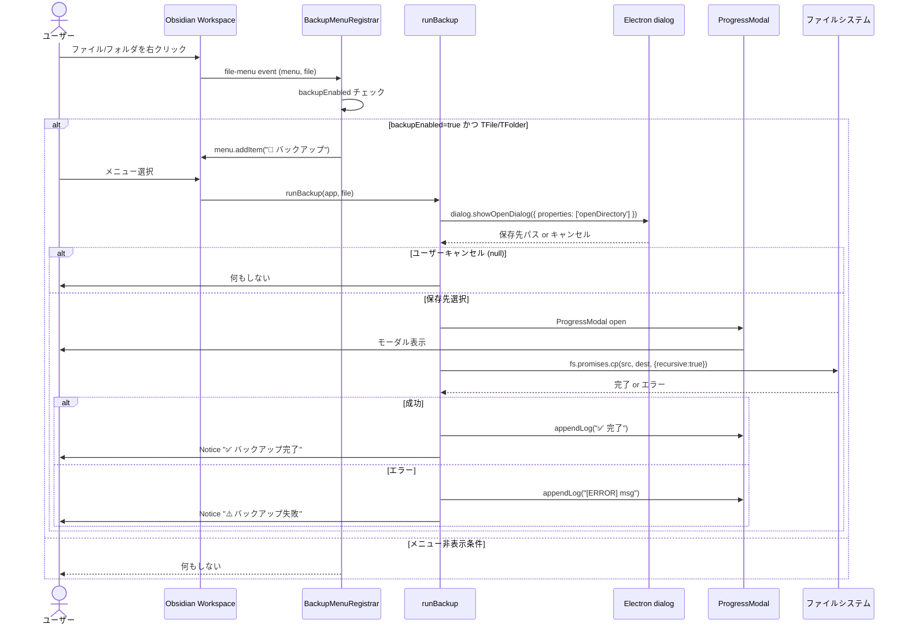

# バックアップ機能 デザイン仕様書

> 📑 **仕様書 ID**: backup-feature
> 📅 **作成日**: 2026-08-17
> 🎯 **対象バージョン**: ClaudianBridge v0.21.0
> 👤 **作成者**: MiuMiu（ブレインストーミング経由）

---

## 概要

Claudian Bridge の左ファイルツリーで、フォルダまたはファイルを右クリックした際に出てくるメニューに「💾 バックアップ」を追加する。保存先を選択する OS ネイティブダイアログが開き、選択した保存先にファイル/フォルダをタイムスタンプ付きでコピーする。

設定画面 (`SettingTabGeneral`) で機能の有効・無効を切り替え可能。

---

## 動機 / 目的

- 編集中の Markdown ファイルをバックアップしたい
- フォルダ単位でスナップショットを残したい
- OS レベルのファイルシステムに退避したい（Vault 外へのエクスポート）

---

## スコープ

### In-Scope
- ファイルツリーの右クリックメニューに「バックアップ」項目を追加
- フォルダ単位の再帰バックアップ（全拡張子）
- ファイル単位の単一バックアップ
- OS ネイティブダイアログでの保存先選択
- プログレスモーダルでの実行状況表示
- 設定画面での ON/OFF トグル

### Out-of-Scope（将来検討）
- ZIP 圧縮バックアップ（v0.22 以降）
- 差分バックアップ（v0.23 以降）
- 自動バックアップスケジュール（v0.24 以降）
- Vault 内フォルダ選択ダイアログ（OS ネイティブのみサポート）

---

## デザイン決定

### D1: 保存先ダイアログは Electron の `dialog.showOpenDialog`

**決定**: `require('electron').dialog.showOpenDialog({ properties: ['openDirectory', 'createDirectory'] })` を使用
**理由**:
- Obsidian の `App` クラスには `openFolderDialog` が**存在しない**（v0.21.0 実装時に確認）
- `electron.remote` は deprecated なので使わず、`require('electron')` の `dialog` を直接使用（Obsidian プラグインの標準パターン）
- Vault 外への保存が要件（OS レベルのファイルシステムへ退避）
- OS ネイティブの UX（Electron ラッパー）
- esbuild の `external` に `'electron'` が含まれており、実行時に require で解決される

**キャンセル時**: `{ canceled: true }` → `null` を返す → 何もしない（モーダル・Notice なし）

### D2: プログレスモーダルを採用

**決定**: 既存の `ProgressModal`（`src/features/office/progress-modal.ts`）を再利用
**理由**:
- 大フォルダでも UI が固まらない
- 既存の Office 変換メニューと UX が統一される
- 新規コンポーネント作成より既存コンポーネント再利用が YAGNI に沿う

### D3: メニュー表示条件は `general.backupEnabled` フラグ + ファイル種別

**決定**: `workspace.on('file-menu', ...)` のハンドラ内で以下を判定
- `settingsRef().general.backupEnabled === false` → メニュー非表示
- 引数が `TFile` または `TFolder` でない → メニュー非表示
- それ以外 → メニュー表示

**理由**: 既存の `OfficeMenuRegistrar.registerFileMenu` パターン（menu.ts:87）と整合

### D4: バックアップ名 = `<元名>_<YYYYMMDD>_<HHMMSS>` (+ 拡張子)

**例**:
- `note.md` → `note_20260817_143022.md`
- `folder/` → `folder_20260817_143022/`

**理由**:
- YYYYMMDD_HHMMSS 形式: クロスプラットフォームで安全なファイル名、ソート容易
- 元名保持: バックアップ元が一目でわかる

### D5: 同名ファイルの上書き

**決定**: 同名のバックアップ先フォルダが存在する場合、`fs.cp` の `recursive: true` でマージ（上書き）
**理由**:
- 1 秒以内の連発は稀
- ユーザー選択「上書き（Notice で通知）」に従う

### D6: 確認ダイアログなし（即実行）

**決定**: 保存先選択後、確認なしで即座にバックアップ実行
**理由**:
- ユーザー選択「確認なしで即実行」
- ダイアログ乱立を避ける UX

### D7: メニュー表示拡張子 = 全ファイル

**決定**: ファイル種別に依らず全ファイルにメニュー表示
**理由**:
- ユーザー選択「すべてのファイルに表示」
- バックアップは汎用機能として位置付け

### D8: 設定マスタースイッチは `general.backupEnabled`

**決定**: `ClaudianBridgeSettings.general.backupEnabled: boolean` を新設（既定 `true`）
**理由**:
- プラグイン全体の汎用設定として `general` セクションに配置
- 既存の `folderEnabled`（selection セクション）とは区別

---

## アーキテクチャ



### 責務分離

| ファイル | 責務 |
|----------|------|
| `src/features/backup/menu.ts` | `workspace.on('file-menu', ...)` で右クリックメニュー登録、`backupEnabled` チェック |
| `src/features/backup/backup-runner.ts` | OS ダイアログ → ProgressModal 起動 → fs.cp 再帰コピー → 完了/エラー通知 |
| `src/core/settings.ts` | `general.backupEnabled: boolean` 追加（既定 `true`）+ 正規化 + バリデーション |
| `src/core/i18n.ts` | ja/zh/en に 3 文字列追加（メニュー設定名・説明） |
| `src/settings/SettingTabGeneral.ts` | トグル UI 追加（codeCopyFence の直後） |
| `src/main.ts` | `BackupMenuRegistrar.register(...)` 呼び出しを追加 |
| `src/manifest.json` | バージョン番号を `0.21.0` に更新 |

---

## データフロー



---

## API 契約

### `BackupMenuRegistrar.register`

```typescript
static register(
  plugin: PluginHost,
  app: App,
  settingsRef: () => ClaudianBridgeSettings,
  pluginDir?: string,
): void
```

- `plugin`: Obsidian Plugin（`registerEvent` を持つ）
- `app`: Obsidian App
- `settingsRef`: 現在の設定を取得するゲッター関数（リアクティブ反映のため）
- `pluginDir`: プラグインのディレクトリ（オプショナル、現状未使用）

### `runBackup`

```typescript
export async function runBackup(
  app: App,
  target: TFile | TFolder,
  pluginDir?: string,
): Promise<void>
```

- `app`: Obsidian App
- `target`: バックアップ対象（TFile or TFolder）
- `pluginDir`: プラグインのディレクトリ（オプショナル、現状未使用）
- 戻り値: Promise<void>（完了/失敗どちらでも正常終了）

### 内部関数

```typescript
function buildTimestamp(): string
// → "20260817_143022" 形式

function resolveDestName(srcPath: string, isDir: boolean): string
// → "note_20260817_143022.md" or "notes_20260817_143022"
```

---

## 設定変更詳細

### `src/core/settings.ts`

**`ClaudianBridgeSettings.general` インターフェース追加**:

```typescript
general: {
  // ... 既存フィールド
  codeCopyFence: boolean;
  // === v0.21.0: バックアップ機能 ===
  backupEnabled: boolean;
};
```

**`DEFAULT_CLAUDIAN_BRIDGE_SETTINGS` 追加**:

```typescript
general: {
  // ... 既存
  codeCopyFence: true,
  backupEnabled: true,
},
```

**`normalizeClaudianBridgeSettings` 追加**:

```typescript
backupEnabled: typeof r.general?.backupEnabled === 'boolean'
  ? r.general.backupEnabled
  : true,
```

**`validateClaudianBridgeSettings` 追加**:

```typescript
if (typeof cfg.general.backupEnabled !== 'boolean')
  return 'general.backupEnabled は boolean である必要があります';
```

### `src/core/i18n.ts`

**`LocaleStrings` インターフェース追加**:

```typescript
generalBackupEnabled: string;
generalBackupEnabledDesc: string;
```

**3 言語分の値**:

| 言語 | generalBackupEnabled | generalBackupEnabledDesc |
|------|---------------------|--------------------------|
| ja | `💾 右クリックバックアップ` | `ファイル/フォルダ右クリックメニューに「バックアップ」を追加（OFF で非表示）` |
| en | `💾 Right-click backup` | `Add "Backup" to file/folder right-click menu (hide when OFF)` |
| zh | `💾 右键备份` | `在文件/文件夹右键菜单中添加"备份"（关闭时不显示）` |

### `src/settings/SettingTabGeneral.ts`

`codeCopyFence` トグルの直後に追加:

```typescript
new Setting(containerEl)
  .setName(s.generalBackupEnabled)
  .setDesc(s.generalBackupEnabledDesc)
  .addToggle((t) => t.setValue(cfg.general.backupEnabled).onChange(async (v) => {
    try {
      const latest = store.load();
      store.save({ ...latest, general: { ...latest.general, backupEnabled: v } });
      new Notice(s.noticeSaved);
    } catch (e) {
      new Notice(s.noticeSaveFailed.replace('{msg}', (e as Error).message));
      draw();
    }
  }));
```

---

## マイグレーション

### 後方互換性

`backupEnabled` フィールドが無い既存ユーザーの `data.json` は `normalizeClaudianBridgeSettings` で `true` にフォールバック。破壊的変更なし。

### バージョン番号

- `src/manifest.json`: `"version": "0.20.0"` → `"0.21.0"`

---

## テスト計画

### 新規テストファイル

```
tests/features/backup/
├── backup-runner.test.ts
└── menu.test.ts
```

### カバー範囲

| ファイル | テストケース |
|----------|-------------|
| `backup-runner.test.ts` | `buildTimestamp()` フォーマット（YYYYMMDD_HHMMSS） |
| `backup-runner.test.ts` | `resolveDestName()` ファイル版（`note.md` → `note_<TS>.md`） |
| `backup-runner.test.ts` | `resolveDestName()` フォルダ版（`notes` → `notes_<TS>`） |
| `backup-runner.test.ts` | メニュー非表示条件（`backupEnabled=false`） |
| `backup-runner.test.ts` | メニュー表示条件（`backupEnabled=true` + TFile/TFolder） |
| `backup-runner.test.ts` | 文字列 TFile/TFolder 以外でメニュー非表示 |
| `menu.test.ts` | `BackupMenuRegistrar.register()` が `workspace.on('file-menu', ...)` を呼ぶ |
| `menu.test.ts` | `plugin.registerEvent` が呼ばれる |

### 既存テストへの影響

- **`tests/core/settings.test.ts`**: `validateClaudianBridgeSettings` テストケースに `backupEnabled` の boolean チェック追加
- **`tests/core/settings.test.ts`**: `normalizeClaudianBridgeSettings` テストに `backupEnabled` デフォルト値 `true` の確認追加

---

## デプロイ

```bash
npm run build
# esbuild ビルド → obsidian-deploy.mjs 経由で .obsidian/plugins/ClaudianBridge/ に配置
```

---

## リリースノート

`POC_017_ClaudianBridge/08_説明書/03_リリースノート/リリースノート.md` に v0.21.0 エントリ追加:

```markdown
## v0.21.0 (2026-08-17)

### 新機能

- 💾 **右クリックバックアップ機能**: ファイルツリーでフォルダまたはファイルを右クリック → 「💾 バックアップ」→ 保存先ダイアログ → タイムスタンプ付きでバックアップ
- 設定画面「一般」タブで ON/OFF 切替可能（既定 ON）

### 改善

- （既存機能の改善があれば記載）

### 互換性

- 既存ユーザーの `data.json` への破壊的変更なし
```

---

## 影響範囲

### 新規ファイル
- `src/features/backup/menu.ts`
- `src/features/backup/backup-runner.ts`
- `tests/features/backup/menu.test.ts`
- `tests/features/backup/backup-runner.test.ts`
- `docs/superpowers/specs/2026-08-17-backup-feature-design.md`（本仕様書）

### 変更ファイル
- `src/main.ts`（register 呼び出し追加）
- `src/core/settings.ts`（`general.backupEnabled` 追加）
- `src/core/i18n.ts`（3 言語分 3 文字列追加）
- `src/settings/SettingTabGeneral.ts`（トグル UI 追加）
- `src/manifest.json`（バージョン 0.21.0）
- `tests/core/settings.test.ts`（テスト追加）
- `POC_017_ClaudianBridge/08_説明書/03_リリースノート/リリースノート.md`（v0.21.0 エントリ追加）

### 非影響
- 既存のオフィス変換、TTS、Whitelist、Chroma、Memory 機能には一切影響なし
- 既存の `data.json` 形式に破壊的変更なし

---

## オープンアイテム

なし（本仕様書で全要件確定）

---

## 参考

- 既存実装: `src/features/office/menu.ts:87` (`OfficeMenuRegistrar.registerFileMenu`)
- 既存実装: `src/main.ts:280-288`（フォルダ右クリック「Add to Claudian」）
- 既存実装: `src/legacy/migration.ts:14` (`backupLegacyData` - 旧バックアップ参考実装)
- 既存実装: `src/features/office/progress-modal.ts`（プログレスモーダル再利用率）

---

*📚 v0.21.0 バックアップ機能デザイン仕様書 · MiuMiu 🐾 · 2026-08-17*