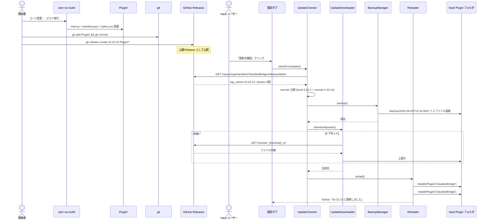
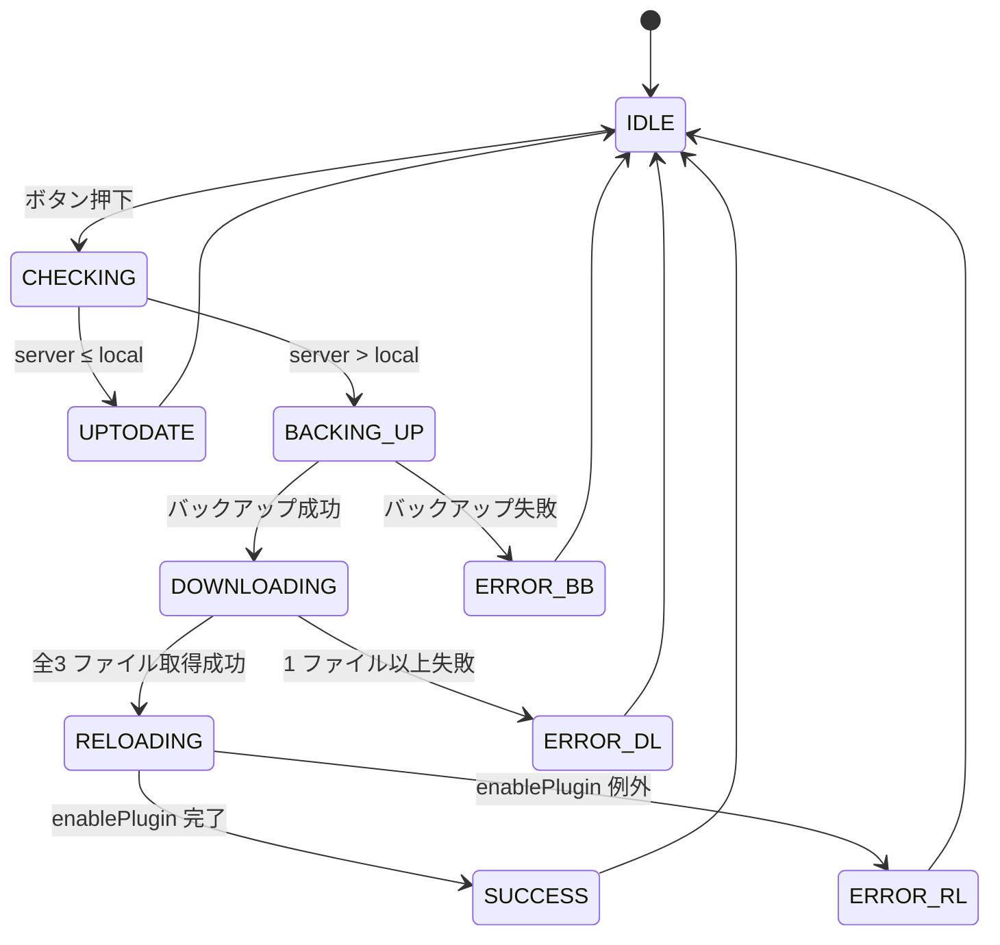

# 自己更新機能（Plugin フォルダ + GitHub Releases）デザイン仕様書

> 📑 **仕様書 ID**: self-update
> 📅 **作成日**: 2026-09-03
> 🎯 **対象バージョン**: ClaudianBridge v0.32.2（ロールバック後）→ v0.32.10 でリリース
> 👤 **作成者**: MiuMiu（ブレインストーミング経由）

---

## 概要

Claudian Bridge v0.32.2 を起点に、(1) ソースフォルダ内にビルド成果物（Plugin 3 ファイル）を Git tracked で保持する `Plugin/` ディレクトリを新設、(2) GitHub Releases への手動アップロード運用を確立、(3) 設定画面に「更新を確認」ボタンを設置し、ボタン押下で最新 Release をダウンロードしてプラグインを自動リロードする機能を実装する。

---

## 動機 / 目的

- プラグイン 3 ファイル（main.js / manifest.json / styles.css）を GitHub 経由で配布可能にする
- ユーザーが Obsidian を再起動せず最新版へ追随できる UX を提供する
- ビルド成果物の「真実のソース」を 1 か所（`Plugin/`）に集約し、デプロイの Single Source of Truth を確立する
- ロールバック容易性（壊れた Release を上げても前回版から自動復元できる）

---

## スコープ

### In-Scope
- v0.32.2 への `hotfix/v0.32.1` ブランチ巻き戻し（`git reset --hard v0.32.2`）
- `Plugin/` ディレクトリの新設（Git tracked、3 ファイルのみ）
- `esbuild.config.mjs` の `outfile` を `Plugin/main.js` に変更
- `scripts/deploy.mjs` を修正：Plugin/ から Vault プラグインフォルダへコピー、Python/RAG/edge_tts は従来通りソースから直接コピー
- `.gitignore` 修正：`!/Plugin/` を追加し `Plugin/` 配下のみ Git tracked
- `src/features/self-update/` 配下に 4 コンポーネント新設（UpdateChecker / UpdateDownloader / BackupManager / Reloader）
- `SettingTabGeneral.ts` のバージョン行右に「更新を確認」ボタン追加
- `src/core/i18n.ts` の一般タブ用文字列に更新関連メッセージ追加
- GitHub Releases への手動アップロード手順（`gh release create`）の確立
- TDD による vitest テスト追加

### Out-of-Scope（将来検討）
- GitHub Actions による自動アップロード
- リリース zip 形式での配信
- プラグインのバージョン番号以外の互換性チェック
- チェックサム検証（SHA-256）
- 自動ロールバック（enablePlugin 失敗時の復元）
- 自動更新チェック（起動時・定期）

---

## デザイン決定

### D1: ロールバック方法は `git reset --hard v0.32.2`（`hotfix/v0.32.1` 維持）

**決定**: 現在の `hotfix/v0.32.1` ブランチで `git reset --hard v0.32.2` を実行。
**理由**:
- ご主人様の指示：「全コミット破棄して v0.32.2 だけ」
- v0.32.3〜v0.32.9 の 7 コミットおよび未コミット v0.32.10 plachta テストは破棄（reflog に `a8acd9b` として残るため必要なら復元可）
- ロールバック後、`src/manifest.json` と `package.json` の `version` を `0.32.2` に揃える
- ロールバック直後に新ブランチ `feature/plugin-self-update` を作成するかは、ブランチ戦略 SSOT に従う（v0.32.10 リリースまで現状ブランチ継続）

### D2: `Plugin/` ディレクトリの構造は最小 3 ファイル

**決定**: `Plugin/` 配下には `main.js` / `manifest.json` / `styles.css` のみ。
**理由**:
- GitHub Releases へのアップロードを最小サイズに保つ
- 更新時のダウンロードを高速化
- Python ヘルパー（`_chroma_inspect.py` 等）・RAG（`rag/` 配下）・edge_tts（`py/edge_tts/`）はサイズが大きく更新頻度も低いので GitHub Releases 配布に含めない（手動 `npm run deploy` で別途 Vault へ反映する従来運用を維持）
- ご主人様の指示：「最小プラグイン 3 ファイル」

### D3: Plugin/ を scripts/deploy.mjs の Single Source of Truth にする

**決定**: `scripts/deploy.mjs` の `main.js` / `manifest.json` / `styles.css` コピーは `Plugin/` 配下から行う。Python/RAG/edge_tts は従来通りソースから直接コピー。
**理由**:
- ビルド成果物 → Plugin/ → Vault のチェーンが一本化され、デバッグが容易
- ローカルビルドと GitHub 経由の更新で同一のファイルが Vault に配置される
- ご主人様の指示：「Plugin フォルダを Vault デプロイのソースに」

### D4: GitHub Releases + 手動 `gh release create`

**決定**: GitHub Releases に 3 ファイルを個別アセットとしてアップロード。コマンドは手動実行。
**理由**:
- ご主人様の指示：「手動 gh release create」「公開リポ」
- CI/CD は不要（運用シンプル・トークン管理不要）
- `--generate-notes` で自動 changelog を生成
- 公開リポなので Releases API は認証不要（ただし 60 req/h のレート制限あり）

### D5: 更新検知は semver 厳密比較

**決定**: GitHub の `tag_name`（例: `v0.32.3`）のプレフィックス `v` を除去し、ローカル `PLUGIN_VERSION` と数値セグメント毎に比較。
**理由**:
- 既存の `PLUGIN_VERSION` 定数（`src/settings/SettingTabGeneral.ts:9`）を Single Source of Truth として再利用
- prerelease 形式（`0.32.3-alpha.1` 等）は今回スコープ外（Major.Minor.Patch のみ）

### D6: ダウンロードは Obsidian `requestUrl` を使用

**決定**: HTTP クライアントは Obsidian 標準の `requestUrl`（`app.requestUrl` または `requestUrl` グローバル）を使用。
**理由**:
- CORS を Obsidian が自動回避（Electron 経由のため）
- 外部依存ゼロ
- 既存プラグイン（Brat 等）と同じパターン
- メモリ消費は許容（3 ファイル合計 < 1MB 想定）

### D7: バックアップは `<pluginDir>/.backup/<UTC-ISO>/`

**決定**: 更新前に現行の `main.js` / `manifest.json` / `styles.css` を `<pluginDir>/.backup/<ISO-UTC>/` へコピー。
**理由**:
- ダウンロード失敗時の手動復旧手段を提供
- `.backup/` は先頭 `.` で Obsidian の表示から除外
- UTC-ISO 形式で衝突回避（秒精度）
- 自動復元は今回スコープ外（手動 `cp` で戻す運用）

### D8: リロードは `disablePlugin` → `enablePlugin`

**決定**: 更新成功後、`app.plugins.disablePlugin('ClaudianBridge')` → `app.plugins.enablePlugin('ClaudianBridge')` で再読込。
**理由**:
- ご主人様の指示：「Obsidian プラグイン disable→enable」
- `window.location.reload()` より安全（作業状態保持）
- 既存コードで `enablePlugin` / `disablePlugin` を呼んでいる箇所あり（`SettingTabGeneral.ts:37-39`）→ 同パターンを踏襲
- 注意点: enablePlugin 失敗時は Obsidian のプラグイン一覧で「無効」状態に戻る。手動で「有効」クリックが必要

### D9: i18n 文字列は既存パターンに準拠

**決定**: 新規文字列（ボタンラベル・エラーメッセージ等）は `src/core/i18n.ts` の `getLocaleStrings` 配下、既存キー（`generalBackupButton` 等）と同じ命名規則で追加。
**理由**:
- 多言語対応の Single Source of Truth
- 既存パターンから外れるとレビュー指摘されるリスク

---

## ディレクトリ構造（追加・変更分）

```
D:\AI-Agent\ClaudianBridge\
├── Plugin/                                  ← 新設（Git tracked）
│   ├── main.js                              ← esbuild outfile から転写
│   ├── manifest.json                        ← src/manifest.json から転写
│   └── styles.css                           ← ルート styles.css から転写
├── .gitignore                               ← 修正：!/Plugin/ 追加
├── esbuild.config.mjs                       ← 修正：outfile を Plugin/main.js に
├── scripts/
│   └── deploy.mjs                           ← 修正：Plugin/ から Vault コピー
├── src/
│   ├── core/
│   │   └── i18n.ts                          ← 修正：更新関連文字列を追加
│   ├── settings/
│   │   └── SettingTabGeneral.ts             ← 修正：バージョン行右に更新ボタン
│   └── features/
│       └── self-update/                     ← 新設
│           ├── types.ts
│           ├── update-checker.ts
│           ├── update-downloader.ts
│           ├── backup-manager.ts
│           ├── reloader.ts
│           └── index.ts
└── tests/features/self-update/              ← 新設
    ├── backup-manager.test.ts
    ├── update-checker.test.ts
    ├── update-downloader.test.ts
    └── self-update-flow.test.ts
```

---

## データフロー

### ビルド → アップロード → 配布 → 更新



### 更新ボタンの状態遷移



---

## コンポーネント責務

| コンポーネント | 責務 | 入力 | 出力 | 依存 |
|---|---|---|---|---|
| `UpdateChecker` | GitHub Releases API から最新 Release 取得、ローカル semver 比較 | `requestUrl` / `PLUGIN_VERSION` | `{ updateAvailable: boolean, tagName: string, assets: Asset[] }` | Obsidian `requestUrl` |
| `BackupManager` | `<pluginDir>/.backup/<UTC-ISO>/` への退避 | `pluginDir` | `backupPath` | `app.vault.adapter` |
| `UpdateDownloader` | Asset 3 ファイルをメモリ DL → Vault Plugin フォルダへ上書き | `assets: Asset[]`, `pluginDir` | `Promise<void>` | `requestUrl` / `app.vault.adapter` |
| `Reloader` | `disablePlugin` → `enablePlugin` で再読込 | `pluginId` | `Promise<void>` | `app.plugins` |

---

## エラーハンドリング

| 失敗ケース | 検出方法 | 挙動 | ユーザーへの通知 |
|---|---|---|---|
| GitHub API 404 | `response.status === 404` | `ERROR` 状態に遷移 | Notice「GitHub に接続できません」 |
| レート制限 | `response.status === 403` + `X-RateLimit-Remaining: 0` | `ERROR` 状態に遷移 | Notice「レート制限です。1 時間後に再試行してください」 |
| ネットワーク不通 | `requestUrl` が throw | `ERROR` 状態に遷移 | Notice「ネットワークエラー：<message>」 |
| Asset DL 失敗（1 件以上） | DL ループ内で throw | `ERROR` 状態に遷移（backup は保持） | Notice「ダウンロード失敗。手動で復元可能です」 |
| バックアップ書込失敗 | BackupManager が throw | `ERROR_BB` 状態に遷移（Plugin 未更新） | Notice「バックアップ作成失敗。中断します」 |
| `enablePlugin` 例外 | Reloader が throw | `ERROR_RL` 状態に遷移（backup は保持） | Notice「起動失敗。手動で復元してください」 |

---

## テスト戦略（TDD）

| 層 | ファイル | 主要ケース |
|---|---|---|
| Unit | `tests/features/self-update/backup-manager.test.ts` | 退避成功・復元、対象3 ファイル確認、`<pluginDir>/.backup/<ISO>` パス生成、既存 `<ISO>` と衝突時の別名採番（`-001` 等） |
| Unit | `tests/features/self-update/update-checker.test.ts` | semver 比較（同値・上位・下位）、タグ `v` プレフィックス除去、404/403 ハンドリング |
| Unit | `tests/features/self-update/update-downloader.test.ts` | 3 ファイル上書き、部分的 DL 失敗時の throw |
| Integration | `tests/features/self-update/self-update-flow.test.ts` | mock requestUrl + mock app.vault.adapter で「古い→新しい→リロード成功」「DL失敗→backup保持」 |

### テストヘルパー

- `tests/helpers/mock-request-url.ts` — `requestUrl` を Promise.resolve/reject で制御
- `tests/helpers/mock-vault-adapter.ts` — `app.vault.adapter` を in-memory Map で実装
- `tests/helpers/fake-plugins-api.ts` — `app.plugins.enablePlugin/disablePlugin` の呼び出し履歴

---

## 移行手順（実装フェーズでの順序）

1. **ロールバック**: `git reset --hard v0.32.2` で v0.32.2 に着地 → version を `0.32.2` に揃える
   - **補足**: 本仕様書コミット (441c326) も `reset` で消えるため、`git cherry-pick 441c326` で再適用する（または reflog から復元）
2. **テスト先行**: `tests/features/self-update/` を vitest 仮実装込みで作成（RED）
3. **Build 修正**: `esbuild.config.mjs` の `outfile` を `Plugin/main.js` に変更
4. **deploy.mjs 修正**: Plugin/ から Vault プラグインフォルダへコピー（Python/RAG は従来通り）
5. **.gitignore 修正**: `!/Plugin/` 追加
6. **UpdateChecker 実装**: GitHub Releases API + semver 比較 (GREEN)
7. **BackupManager 実装**: 退避 (GREEN)
8. **UpdateDownloader 実装**: 3 ファイル DL・上書き (GREEN)
9. **Reloader 実装**: disable → enable (GREEN)
10. **SettingTabGeneral 統合**: 「更新を確認」ボタン追加 + i18n 文字列追加
11. **実機 UAT**: テスト Release を `gh release create` で上げ、更新ボタン動作確認
12. **CHANGELOG・リリースノート**: F-029 として v0.32.10 でリリース

---

## リスク・ロールバック

- ロールバック前に `git reflog` で v0.32.9 commit `a8acd9b` が見えるため、必要なら `git reset --hard a8acd9b` で復元可能
- 更新ボタン由来の障害は「手動で vault の plugin フォルダを `git checkout Plugin/ --` で戻す」または「`<pluginDir>/.backup/<UTC>/` から手動 `cp`」で復旧可能
- GitHub Release 公開後の取り消しは `gh release delete v0.32.10` で可能（ただし既に DL 済みのユーザーには影響しない）

---

## 参照文献

- ご主人様指示（2026-09-03 朝）
- [[80_POC_Projects/POC_017_ClaudianBridge/02_設計文書/_superpowers原本/2026-08-13-tts-anime-tts-addition-design.md]] — feature/ ディレクトリ規約
- 既存 deploy.mjs: `D:\AI-Agent\ClaudianBridge\scripts\deploy.mjs`
- 既存 SettingTabGeneral.ts: `D:\AI-Agent\ClaudianBridge\src\settings\SettingTabGeneral.ts`