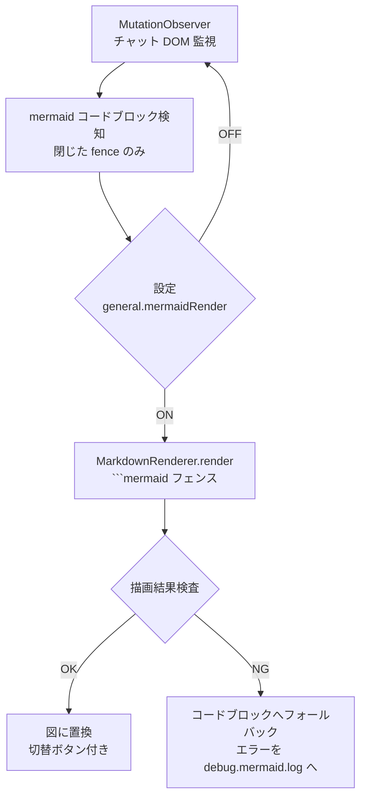

# Mermaid チャット内自動描画 設計仕様書

> 📂 パス：docs/superpowers/specs/2026-09-04-mermaid-render-design.md
> 📍 源码：D:\AI-Agent\ClaudianBridge\src\features\mermaid-render\
> 🏷️ バージョン：v1.0（2026-09-04 設計・承認待ち）

---

## 1. 背景・目的

Claudian チャット画面では realclaudian 本体に Mermaid レンダラがなく、
```` ```mermaid ```` ブロックがコードとして表示される。ユーザーは図を確認する
ためコードをコピーしてノートに貼る必要がある。

本機能は、チャット内で閉じた mermaid ブロックを自動的に図へ置換することで、
チャット画面だけで図の確認を完結させる。

## 2. 要件（決定済み）

| # | 要件 | 決定 |
|:-:|------|------|
| R1 | 描画方式 | 自動描画＋「`</>`」切替ボタン（案1） |
| R2 | 描画タイミング | フェンスが閉じた（textContent が 2 回連続同一）ブロックから順次描画（案2） |
| R3 | 描画エンジン | Obsidian 標準 `MarkdownRenderer.render()`（案A・mermaid 非同梱） |
| R4 | エラー時 | 元コードブロックへフォールバック＋「描画失敗」バッジ＋ログ記録（案1） |
| R5 | ログ | プラグイン dir 直下 `debug.mermaid.log` へ追記（diag.ts パターン） |
| R6 | 設定 | `general.mermaidRender`（既定 ON）・SettingTab・i18n（ja/zh/en） |

## 3. アーキテクチャ

code-copy-fence と同一パターンの DOM post-process feature。



## 4. コンポーネント

| コンポーネント | 責務 |
|------|------|
| `index.ts` | `setupMermaidRender(app, plugin, store)`： MutationObserver 管理・処理済みブロックの Set で重複防止・teardown 返却（`main.ts` で `register()`） |
| `render.ts` | ブロック 1 個の描画： フェンス組み立て → `MarkdownRenderer.render()` → 結果検査（`.error` 要素 / 空コンテナ） → 置換 or フォールバック |
| `logger.ts` | `diag.ts` と同型の追記ログ（`debug.mermaid.log`） |

## 5. 動作仕様

- **検知**： `.claudian-code-wrapper` 内 `pre code`（または `code`）の親ラベル言語が
  `mermaid` / `mmd`。既に処理済みの wrapper は再処理しない。
- **切替**： 図の右上「`</>`」ボタン → コードブロック表示に戻す。コード表示時は
  「図として表示」ボタンで再描画。
- **コピー連携**： 既存 code-copy-fence は元コードブロックを非表示保持するため
  図表示中も機能する（フェンス付きコピー維持）。
- **設定 OFF**： 観察を続けるが一切描画しない（code-copy-fence 同様の素通し）。
- **エラー時**： 元コードブロック表示に戻し、小さな「描画失敗」バッジ。エラー内容
  （メッセージ・スタック先頭 6 行）を `debug.mermaid.log` に追記し、console にも出力。

## 6. テスト（TDD・vitest + jsdom）

code-copy-fence の既存テスト構成に倣う。

1. 検知： 言語判定（mermaid/mmd/他言語除外）
2. 検知： 閉じ判定（未確定ブロックを描画しない）
3. 置換： 描画成功時の DOM 置換と切替ボタン生成
4. トグル： 図 ⇔ コード の往復
5. 設定 OFF： 描画しない
6. エラー： フォールバック＋バッジ＋ログ追記
