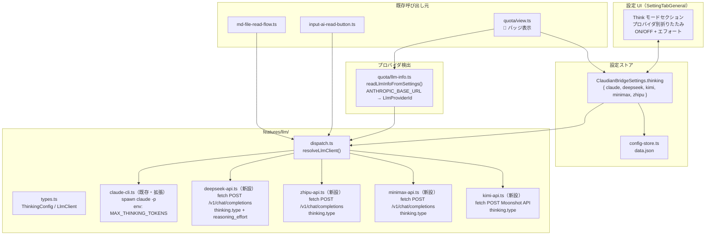
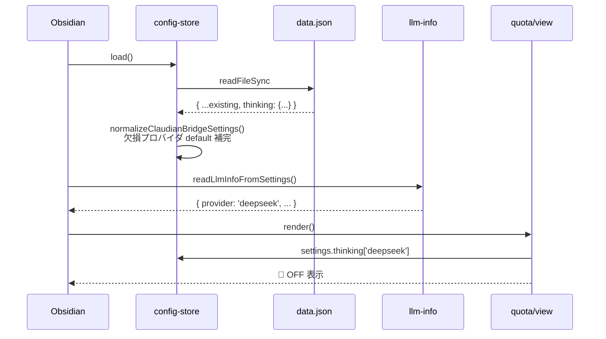
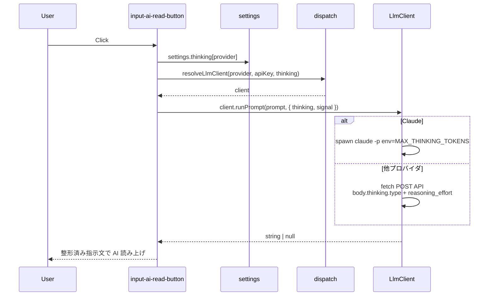
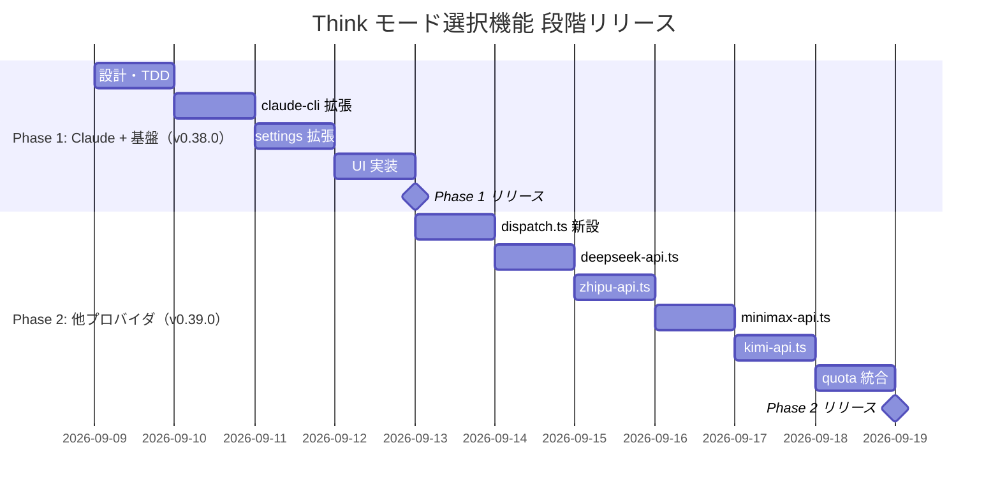

# Think モード選択機能 設計仕様書

> 📂 パス：docs/superpowers/specs/2026-09-08-think-mode-selection-design.md
> 📍 源码：D:\AI-Agent\ClaudianBridge\src\features\llm\、src\core\settings.ts、src\settings\SettingTabGeneral.ts
> 🏷️ バージョン：v1.0（2026-09-08 設計・承認待ち）

---

## 1. 背景・目的

ClaudianBridge の整形機能（MD 読み上げ・AI 読み上げボタン）は `claude -p` 経由で Claude を呼び出し、
`MAX_THINKING_TOKENS=0` 環境変数で拡張思考を無効化している（v0.37.1）。

一方、`ANTHROPIC_BASE_URL` を切り替えて **DeepSeek / Zhipu (GLM) / MiniMax / Kimi** を利用するユーザーが増えているが、

| # | 現状課題 |
|:-:|----------|
| A | 他プロバイダ利用時に Think モードを切り替える手段がない（常に固定） |
| B | 各プロバイダで Think 制御パラメータが異なる（Claude: env 変数 / 他: リクエストボディ） |
| C | 設定 UI が存在せず、ソースコード修正しないと切り替えられない |
| D | ステータスバーに「どの Think 設定で動いているか」が見えない |

本設計で次を実現する：

| # | 項目 |
|:-:|------|
| A | 5 プロバイダそれぞれの Think モード（ON/OFF + エフォート）を **設定タブで個別に選択** |
| B | プロバイダ別の **Think パラメータマッピング** を実装（抽象化） |
| C | `LlmClient` インターフェース統一により **Claude 以外も抽象化された経路で呼び出し** |
| D | quota ステータスバーに 🧠 バッチ表示（現在の Think 状態を可視化） |

---

## 2. 要件（決定済み）

| # | 要件 | 決定 |
|:-:|------|------|
| R1 | スコープ | **全 LLM 機能（整形 + quota 含む）を統合** |
| R2 | 選択方式 | **プロバイダごとに手動設定**（自動検出でなく明示的） |
| R3 | UI 粒度 | **ON/OFF + エフォートスライダー**（low / medium / high の 3 値） |
| R4 | 設定保存先 | **プラグイン設定 data.json** |
| R5 | 対応プロバイダ（v0.38.0/v0.39.0 合計） | Claude / DeepSeek / Zhipu / MiniMax / Kimi の 5 プロバイダ |
| R6 | アーキテクチャ | **プロバイダ別ファイルに分離**（既存 `quota/providers/*.ts` パターン踏襲） |
| R7 | UI 配置 | **SettingTabGeneral に「Think モード」セクション追加**（プロバイダ別折りたたみ） |
| R8 | 後方互換 | 既存の `ClaudeCliOptions.disableThinking` は v0.38.0 で deprecated 化、削除は次メジャー |
| R9 | 段階リリース | v0.38.0 = Claude のみ、v0.39.0 = 他 4 プロバイダ |

---

## 3. アーキテクチャ



---

## 4. コンポーネント詳細

### 4.1 新設ファイル

| ファイル | 行数目安 | 責務 |
|----------|--------:|------|
| `src/features/llm/types.ts` | 30 | `ThinkingConfig`, `ThinkingEffort`, `LlmClient` 定義 |
| `src/features/llm/dispatch.ts` | 50 | `resolveLlmClient(provider, apiKey, thinking)` の switch ディスパッチ |
| `src/features/llm/deepseek-api.ts` | 80 | fetch + body 構築（`thinking.type` + `reasoning_effort`） |
| `src/features/llm/zhipu-api.ts` | 80 | fetch + body 構築（`thinking.type` のみ） |
| `src/features/llm/minimax-api.ts` | 80 | fetch + body 構築（`thinking.type`、`enabled/adaptive/disabled`） |
| `src/features/llm/kimi-api.ts` | 70 | fetch + body 構築（OpenAI 互換） |
| `tests/llm/*.test.ts` | 各 40-80 | 各プロバイダの単体テスト |

### 4.2 既存ファイル変更

| ファイル | 変更内容 |
|----------|---------|
| `src/features/llm/claude-cli.ts` | `ClaudeCliOptions.disableThinking` を deprecated 化。新 `createClaudeClient(thinking): LlmClient` を export。env 変換ロジックを `ThinkingConfig → MAX_THINKING_TOKENS` に刷新 |
| `src/core/settings.ts` | `ClaudianBridgeSettings.thinking` フィールド追加（5 プロバイダ）。`DEFAULT_THINKING_CONFIGS` 定数追加。`normalizeClaudianBridgeSettings` で default 補完 |
| `src/settings/SettingTabGeneral.ts` | 「Think モード」セクション新設。プロバイダ別の `<details>` ブロック（ON/OFF トグル + エフォートスライダー） |
| `src/features/tts/input-ai-read-button.ts` | `polishInstruction` 直接呼び出し → `resolveLlmClient` 経由に変更 |
| `src/features/tts/md-file-read-flow.ts` | 同上 |
| `src/features/quota/view.ts` | ステータスバーに 🧠 ON/OFF バッジ追加 |
| `src/core/i18n.ts` | Think モード関連の i18n キー追加 |

### 4.3 コア型定義（types.ts）

```typescript
/** エフォートレベル */
export type ThinkingEffort = 'off' | 'low' | 'medium' | 'high';

export interface ThinkingConfig {
  enabled: boolean;
  effort: ThinkingEffort;
}

export interface LlmClient {
  readonly id: 'claude' | 'deepseek' | 'kimi' | 'minimax' | 'zhipu';
  runPrompt(
    prompt: string,
    opts: {
      thinking: ThinkingConfig;
      timeoutMs?: number;
      signal?: AbortSignal;
    },
  ): Promise<string | null>;
}
```

### 4.4 プロバイダ別パラメータマッピング

| プロバイダ | `enabled=false` | `enabled=true` | effort 対応 | 検証状況 |
|-----------|----------------|---------------|------------|---------|
| **Claude** | `MAX_THINKING_TOKENS=0` env | 設定なし（既定 ON） | `low=512` / `medium=1024` / `high=4096` を env 数値で送る ※数値は推定、UAT で実機検証 | ✅ Claude Code CLI 既知 |
| **DeepSeek** | `thinking.type=disabled` body | `thinking.type=enabled` body | `reasoning_effort`: `low/high/max`（`medium` → `high` フォールバック） | ✅ 公式 Docs 確認済 |
| **Zhipu (GLM)** | `thinking.type=disabled` body | `thinking.type=enabled` body | `reasoning_effort` のサポートは**未確認**。実装時に Z.AI 公式ドキュメントを調査 | ⚠️ 未確認・要調査 |
| **MiniMax** | `thinking.type=disabled` body | `thinking.type=enabled`（`adaptive` も可） body | MiniMax API に `reasoning_effort` パラメータは**未確認**。effort 値は `thinking.type` の選択肢切替にマップ | ⚠️ 未確認・要調査 |
| **Kimi** | `thinking.type=disabled` body | `thinking.type=enabled` body | Moonshot 公式の thinking パラメータ名は**未確認**。実装時に Moonshot ドキュメントを調査 | ⚠️ 未確認・要調査 |

> ⚠️ **Claude だけ env 変数経由、他はリクエストボディ**。`LlmClient` 実装側で吸収。
> 
> 🔬 **未確認プロバイダの実装方針**：`reasoning_effort` がサポートされていれば送る。未サポートなら body から omit し、API デフォルト挙動にフォールバック。リクエストが失敗しても Thinking モード自体は ON として扱う（content は返ってくる）。

### 4.5 設定 UI（SettingTabGeneral 抜粋イメージ）

```
▼ Claudian 本体（既存）
   ...

▼ Think モード（新規）
   現在 LLM プロバイダ: DeepSeek（ANTHROPIC_MODEL から検出）

   ▼ Claude
     [✓] Think モード     [  effort: medium ▼]
     ※ claude -p 経由。MAX_THINKING_TOKENS で制御

   ▼ DeepSeek
     [ ] Think モード     [  effort: high    ▼]
     ※ API 直接呼び出し。thinking.type + reasoning_effort

   ▼ Kimi       [折り畳み]
   ▼ MiniMax    [折り畳み]
   ▼ Zhipu      [折り畳み]
```

---

## 5. データフロー

### 5.1 起動時



### 5.2 polishInstruction 呼び出し



---

## 6. エラーハンドリング

| ケース | 挙動 |
|--------|------|
| `apiKey` 未設定 | `null` 返却（polishInstruction 既存挙動） |
| API 401/403 | `null` 返却 + `console.warn` |
| API 5xx / ネットワーク | `null` 返却 + `console.warn` |
| Timeout | 既存 `runClaudePrompt` 同様。新 fetch は `AbortSignal.timeout()` |
| 外部 `signal.aborted` | 即 abort + `null` |
| `thinking.enabled=true` + `effort='off'` | 型上到達不可。コード上は `MAX_THINKING_TOKENS=0` フォールバック |
| 不明プロバイダ (`unknown`) | Claude クライアントにフォールバック（既存挙動） |

---

## 7. テスト戦略

### 7.1 既存パターンの踏襲

- テストランナー：**vitest**（既存 1006+ 件パス）
- モック：`tests/mocks/obsidian.ts` 既存踏襲 + `fetch` モック（`vi.fn()`）
- TDD：**Red → Green → Refactor**（CLAUDE.md 学習ログ準拠）

### 7.2 新規テスト一覧（目標 44 件）

| テストファイル | 件数 | 内容 |
|---------------|----:|------|
| `tests/llm/types.test.ts` | 4 | 型ガード・不正 effort 検出 |
| `tests/llm/dispatch.test.ts` | 6 | provider → LlmClient 解決・unknown フォールバック |
| `tests/llm/claude-cli.test.ts` | 6 | ThinkingConfig → env 変換（enabled × effort の 4 組合せ + abort + timeout） |
| `tests/llm/deepseek-api.test.ts` | 6 | fetch body 検証（enabled/disabled + reasoning_effort）+ 401/5xx で null |
| `tests/llm/zhipu-api.test.ts` | 5 | fetch body 検証 + abort |
| `tests/llm/minimax-api.test.ts` | 5 | fetch body 検証（adaptive 含む）+ abort |
| `tests/llm/kimi-api.test.ts` | 4 | OpenAI 互換 API 呼び出し |
| `tests/core/settings.test.ts` | 4 | `normalizeClaudianBridgeSettings` default 補完・後方互換 |
| `tests/settings/SettingTabGeneral.test.ts` | 4 | UI レンダリング・トグル変更で `settings.thinking` 更新 |
| **合計** | **44** | |

### 7.3 受入テスト（UAT）

| # | 検証項目 |
|:-:|----------|
| 1 | 設定タブで各プロバイダの ON/OFF トグルが動く |
| 2 | エフォートスライダー変更で data.json に保存 |
| 3 | Claude 利用中に OFF → 整形が体感高速化 |
| 4 | DeepSeek 利用中に ON → API リクエストに `thinking.type=enabled` が含まれる |
| 5 | Zhipu 利用中に OFF → `thinking.type=disabled` |
| 6 | 既存挙動（OFF デフォルト）との後方互換性 |
| 7 | quota ステータスバーに 🧠 バッジ表示 |
| 8 | `npm run build` で typecheck PASS |
| 9 | 全テスト（1006+44 = **1050 件**）PASS |

---

## 8. リスクと対策

| # | リスク | 影響度 | 対策 |
|:-:|--------|------:|------|
| R1 | Claude Code CLI の `MAX_THINKING_TOKENS` 仕様変更 | 中 | 複数 env 変数 fallback。バージョン changelog 監視 |
| R2 | DeepSeek の `reasoning_content` 仕様変更 | 中 | `reasoning_content ?? reasoning ?? ''` で多段フォールバック |
| R3 | GLM の `thinking.type` が将来 `auto` 追加 | 低 | string union 拡張を許容 |
| R4 | MiniMax で Think ON 時のトークン消費急増 | 高 | 既定 OFF 維持。quota ビューにヒント表示 |
| R5 | fetch 直接呼び出しで CORS | 中 | Obsidian の `requestUrl` API 利用 or Node 20+ fetch |
| R6 | 既存ユーザーが設定タブ再読み込み時にセクション見えない | 低 | `normalizeClaudianBridgeSettings` で default 補完 |
| R7 | 5 プロバイダ同時実装でスコープ肥大 | 中 | **段階リリース**（Phase 1: Claude、Phase 2: 他 4） |

### ロールバック計画

- **Phase 1 (v0.38.0)**: 旧 `disableThinking` API を deprecated として 1 バージョン併存
- **Phase 2 (v0.39.0)**: 各 provider クライアントを feature flag（`settings.thinking.<provider>.enabled = false`）で個別 OFF 可能

---

## 9. 段階リリース計画



| リリース | 内容 | 価値 |
|----------|------|------|
| **v0.38.0** | Claude 向け Think モード UI + ON/OFF + エフォート。既存 `disableThinking` 上位互換 | 即日価値・低リスク |
| **v0.39.0** | DeepSeek / Zhipu / MiniMax / Kimi を `LlmClient` 経由で実装 | 他プロバイダ UX 向上 |

---

## 10. ドキュメント更新

| ファイル | 内容 |
|----------|------|
| `80_POC_Projects/POC_017_ClaudianBridge/CHANGELOG.md` | v0.38.0 / v0.39.0 エントリ追加 |
| `RELEASE-NOTES-v0.38.0.md` / `RELEASE-NOTES-v0.39.0.md` | テンプレ準拠で作成 |
| `00_使用ガイド.md` | Think モード節追加 |
| `00_プロジェクト立項.md` | 機能一覧に F-038 / F-039 追加 |

---

## 11. 承認

| 項目 | 状態 |
|------|------|
| 設計承認 | ⏳ ユーザー承認待ち |
| 実装計画書 | 未着手（設計承認後に writing-plans で作成） |
