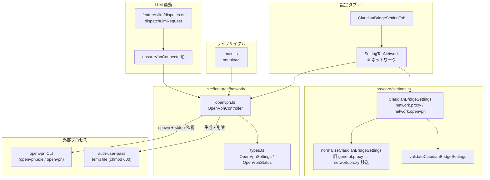

# ネットワークタブ・OpenVPN 接続機能 設計仕様書

> 📂 パス：docs/superpowers/specs/2026-09-13-network-tab-openvpn-design.md
> 📍 源码：D:\AI-Agent\ClaudianBridge\src\features\network\、src\settings\SettingTabNetwork.ts、src\core\settings.ts
> 🏷️ バージョン：v1.0（2026-09-13 設計・承認待ち）
> 🔗 機能番号：F-041（OpenVPN 接続）/ F-042（ネットワークタブ）

---

## 1. 背景・目的

ClaudianBridge は v0.38.0（2026-08）で LLM アクセス用プロキシ設定（`general.proxy`）を追加したが、設定タブが「一般」内に埋没しており、関連ネットワーク設定の集約先がない。

一方、Tech_Research R10 OpenVPN 調査（2026-09-13 完了）で LAN 内 LLM/Chroma サーバへの VPN 経由アクセス要件が明確化された。GijiMemo Android 向けの調査だったが、ClaudianBridge 利用者にも「外出先から自宅 LAN の Ollama / ChromaDB / Whisper サーバにアクセスしたい」ニーズがある。

| # | 現状課題 |
|:-:|----------|
| A | プロキシが「一般」タブにあり、ネットワーク関連設定の集約先がない |
| B | LAN 内 LLM/Chroma サーバへのアクセス手段が VPN 未設定では不可 |
| C | openvpn 接続のライフサイクル管理が OS 任せ（ユーザーが手動で GUI 起動） |
| D | LLM リクエスト時に VPN が要ることにユーザーが気付きにくい |

本設計で次を実現する：

| # | 項目 |
|:-:|------|
| A | 「🌐 ネットワーク」タブ新設（F-042）、プロキシ設定を移動 |
| B | OpenVPN 接続機能（F-041）— `.ovpn` 指定で openvpn CLI を spawn/管理 |
| C | 手動 Connect/Disconnect ボタン + LLM 呼び出し時の自動接続 |
| D | 既存の LAN 内 LLM/Chroma 設定（quota/chroma）と組み合わせて利用可能 |

---

## 2. 要件（決定済み）

| # | 要件 | 決定 |
|:-:|------|------|
| R1 | タブ構成 | **「🎛️ 一般」と「📝 テキスト挿入」の間に「🌐 ネットワーク」を新設** |
| R2 | プロキシ移動 | **一般タブからプロキシセクションを削除し、ネットワークタブへ移動**（値の引き継ぎは normalize で自動） |
| R3 | OpenVPN 起動主体 | **プラグインから openvpn CLI を直接 spawn**（OS の VPN クライアントには依存しない） |
| R4 | 接続ライフサイクル | **手動ボタン + LLM 呼び出し時の自動起動**（両方とも設定トグルで選択可） |
| R5 | OpenVPN 設定 | **.ovpn ファイルパス参照 + 別途資格情報**（auth-user-pass 用ユーザー名・パスワード） |
| R6 | プロキシと OpenVPN の関係 | **独立した設定として並置**（互いに連動しない） |
| R7 | 対象プラットフォーム | **デスクトップのみ**（Win/Mac/Linux）。モバイルでは UI に「デスクトップのみ」注記 |
| R8 | 認証情報保管 | **平文で data.json**（既存 API キー・プロキシ URL と同じ運用） |
| R9 | 設定保存先 | **プラグイン設定 data.json**（`network.openvpn`） |
| R10 | 段階リリース | **v0.43.0 で同時リリース**（ネットワークタブ + OpenVPN 一体運用） |
| R11 | LLM 連動先 | **`dispatchLlmRequest` 入口で `await ensureVpnConnected()`**（ストリーミング・非ストリーミング共通） |
| R12 | 接続失敗時挙動 | **LLM 呼び出しは継続**（Notice で警告のみ。意図しない沈黙防止） |
| R13 | アーキテクチャ | **既存パターン準拠**（Service 抽象化なし、`runSelfUpdate` 等と同形の素朴な実装） |
| R14 | 後方互換 | `general.proxy` キーも normalize で読み取り、新 `network.proxy` へ自動移送 |

---

## 3. アーキテクチャ

### 3.1 全体構成図



### 3.2 ファイル変更計画

| 種別 | パス | 内容 |
|------|------|------|
| 🆕 新規 | `src/settings/SettingTabNetwork.ts` | 新タブ UI レンダラ |
| 🆕 新規 | `src/features/network/openvpn.ts` | openvpn CLI プロセス管理 |
| 🆕 新規 | `src/features/network/types.ts` | `OpenVpnSettings` / `OpenVpnStatus` 型 |
| 🆕 新規 | `tests/features/network/openvpn.test.ts` | ユニットテスト |
| 🆕 新規 | `tests/settings/SettingTabNetwork.test.ts` | 設定 UI テスト |
| ✏️ 変更 | `src/settings/ClaudianBridgeSettingTab.ts` | `tabNetwork` を TABS に追加 |
| ✏️ 変更 | `src/settings/SettingTabGeneral.ts` | プロキシセクションを削除 |
| ✏️ 変更 | `src/core/settings.ts` | `OpenVpnSettings` 型 + DEFAULT + normalize + validate 追加、`network` セクション新設 |
| ✏️ 変更 | `src/core/i18n.ts` | `tabNetwork` / `networkOpenVpnHeading` 等追加（ja/en/zh-CN） |
| ✏️ 変更 | `src/features/llm/dispatch.ts` | `ensureVpnConnected()` フック挿入 |
| ✏️ 変更 | `src/main.ts` | onunload で VPN 切断 |

---

## 4. データモデル

### 4.1 `OpenVpnSettings`（新規）

```typescript
// src/features/network/types.ts
export type OpenVpnStatus = 'disconnected' | 'connecting' | 'connected' | 'error';

export interface OpenVpnSettings {
  /** OpenVPN 機能の ON/OFF（既定 false） */
  enabled: boolean;
  /** .ovpn ファイル絶対パス（OS ファイルシステム） */
  configPath: string;
  /** auth-user-pass ユーザー名（空文字なら .ovpn 内インライン認証想定） */
  username: string;
  /** auth-user-pass パスワード */
  password: string;
  /** LLM リクエスト時の自動接続（既定 true） */
  autoConnectOnLlm: boolean;
  /** openvpn CLI バイナリパス（空文字なら PATH 解決） */
  openvpnBinaryPath: string;
}

export const DEFAULT_OPEN_VPN_SETTINGS: OpenVpnSettings = {
  enabled: false,
  configPath: '',
  username: '',
  password: '',
  autoConnectOnLlm: true,
  openvpnBinaryPath: '',
};
```

### 4.2 `ClaudianBridgeSettings` への組み込み

```typescript
export interface ClaudianBridgeSettings {
  general: GeneralSettings;  // ← proxy を削除（残存メンバ: enabled/codeCopyFence/mermaidRender/backup*/tokenRate*/quickReply*/outputsMirror*/hideDotFolders/migratedFrom）
  network: {
    proxy: ProxySettings;        // ← 旧 general.proxy
    openvpn: OpenVpnSettings;    // ← 新規
  };
  selection: SelectionSettings;
  tts: TtsSettings;
  office: OfficeSettings;
  whitelist: WhitelistSettings;
  quota: QuotaSettings;
  chroma: ChromaSettings;
  memory: MemorySettings;
  thinking: ThinkingConfigs;
  imageGen: ImageGenSettings;
}
```

### 4.3 マイグレーション（v0.42.x → v0.43.0）

```typescript
// src/core/settings.ts normalizeClaudianBridgeSettings 内
network: {
  proxy: normalizeProxySettings(
    r.network?.proxy ??
    r.general?.proxy ??
    DEFAULT_PROXY_SETTINGS,
  ),
  openvpn: normalizeOpenVpnSettings(r.network?.openvpn),
},
```

---

## 5. UI 仕様

### 5.1 タブ順序

```
[🎛️ 一般] [🌐 ネットワーク] [📝 テキスト挿入] [🔊 TTS] [📄 Office] ... [📋 改定履歴]
                ↑ NEW（一般とテキスト挿入の間に配置）
```

### 5.2 ネットワークタブ内構成

```
🌐 ネットワーク
─────────────────────────────────────────
💡 OpenVPN はデスクトップ環境（Win/Mac/Linux）でのみ動作します。モバイルでは接続できません。
─────────────────────────────────────────

🌐 プロキシ設定
  [✓] プロキシ使用
  🔗 プロキシ URL
  🚫 プロキシ除外ホスト

🔐 OpenVPN 接続
  [✓] OpenVPN を使用
  📁 .ovpn ファイルパス
  👤 ユーザー名
  🔑 パスワード
  🔧 openvpn バイナリパス
  [✓] LLM 呼び出し時に自動接続

─────────────────────────────────────────
状態: 🔴 切断中  / 🟡 接続中  / 🟢 接続済  / 🔴 エラー
最終ログ: <stderr 末尾 2000 文字>
[🔌 接続]  [⏹ 切断]  [📋 ログをコピー]
```

### 5.3 i18n キー一覧

| キー | ja | en | zh-CN |
|------|----|----|-------|
| `tabNetwork` | `🌐 ネットワーク` | `🌐 Network` | `🌐 网络` |
| `networkNoticeDesktopOnly` | `💡 OpenVPN はデスクトップ環境（Win/Mac/Linux）でのみ動作します。モバイルでは接続できません。` | `💡 OpenVPN works only on desktop (Win/Mac/Linux). Not available on mobile.` | `💡 OpenVPN 仅在桌面端（Win/Mac/Linux）可用。移动端无法连接。` |
| `networkOpenVpnHeading` | `🔐 OpenVPN 接続` | `🔐 OpenVPN Connection` | `🔐 OpenVPN 连接` |
| `networkOpenVpnEnabled` | `🔐 OpenVPN を使用` | `🔐 Enable OpenVPN` | `🔐 启用 OpenVPN` |
| `networkOpenVpnEnabledDesc` | `有効にすると、.ovpn ファイルを使って VPN トンネルを確立します。LLM/Chroma 等の LAN 内サービスへのアクセスに使用します。` | `When enabled, establishes a VPN tunnel using the .ovpn file. Used to access LAN services such as LLM/Chroma.` | `启用后，使用 .ovpn 文件建立 VPN 隧道。用于访问局域网内 LLM/Chroma 等服务。` |
| `networkOpenVpnConfigPath` | `📁 .ovpn ファイルパス` | `📁 .ovpn file path` | `📁 .ovpn 文件路径` |
| `networkOpenVpnConfigPathDesc` | `例: C:/Users/me/qnap.ovpn（QNAP QVPN からエクスポート）` | `e.g. C:/Users/me/qnap.ovpn (exported from QNAP QVPN)` | `例: C:/Users/me/qnap.ovpn（从 QNAP QVPN 导出）` |
| `networkOpenVpnUsername` | `👤 ユーザー名` | `👤 Username` | `👤 用户名` |
| `networkOpenVpnPassword` | `🔑 パスワード` | `🔑 Password` | `🔑 密码` |
| `networkOpenVpnBinaryPath` | `🔧 openvpn バイナリパス` | `🔧 openvpn binary path` | `🔧 openvpn 二进制路径` |
| `networkOpenVpnBinaryPathDesc` | `空欄なら PATH から自動解決（`openvpn` コマンド）` | `If empty, resolved from PATH (openvpn command)` | `为空时从 PATH 自动解析（openvpn 命令）` |
| `networkOpenVpnAutoConnect` | `🚀 LLM 呼び出し時に自動接続` | `🚀 Auto-connect on LLM call` | `🚀 LLM 调用时自动连接` |
| `networkOpenVpnStatus` | `状態` | `Status` | `状态` |
| `networkOpenVpnStatusDisconnected` | `🔴 切断中` | `🔴 Disconnected` | `🔴 已断开` |
| `networkOpenVpnStatusConnecting` | `🟡 接続中...` | `🟡 Connecting...` | `🟡 连接中...` |
| `networkOpenVpnStatusConnected` | `🟢 接続済` | `🟢 Connected` | `🟢 已连接` |
| `networkOpenVpnStatusError` | `🔴 エラー` | `🔴 Error` | `🔴 错误` |
| `networkOpenVpnConnect` | `🔌 接続` | `🔌 Connect` | `🔌 连接` |
| `networkOpenVpnDisconnect` | `⏹ 切断` | `⏹ Disconnect` | `⏹ 断开` |
| `networkOpenVpnCopyLog` | `📋 ログをコピー` | `📋 Copy log` | `📋 复制日志` |

---

## 6. プロセス管理（openvpn.ts）

### 6.1 公開 API

```typescript
export interface OpenVpnController {
  start(settings: OpenVpnSettings): Promise<void>;     // throws on failure
  stop(): Promise<void>;
  getStatus(): OpenVpnStatus;
  getRecentLog(): string;                              // 末尾 2000 文字
  subscribe(listener: (status: OpenVpnStatus, log: string) => void): () => void;
}

let controller: OpenVpnController | null = null;
export function getOpenVpnController(): OpenVpnController {
  if (!controller) controller = createOpenVpnController();
  return controller;
}

export async function ensureVpnConnected(settings: OpenVpnSettings): Promise<void>;
```

### 6.2 start() フロー

```
start(settings)
  ├─ 既に 'connecting' / 'connected' なら no-op (throw or return)
  ├─ configPath 存在チェック (fs.existsSync) → なければ throw
  ├─ auth-user-pass 用の一時ファイル生成 (os.tmpdir() + crypto.randomUUID)
  │   内容: `${username}\n${password}\n` (chmod 600)
  ├─ openvpn バイナリ解決
  │   - openvpnBinaryPath 非空ならそれを使用
  │   - 空なら `which openvpn` (Windows は `where openvpn`) で PATH 解決
  │   - 解決失敗なら throw "openvpn バイナリが見つかりません"
  ├─ args 構築
  │   --config <configPath>
  │   --auth-user-pass <tempAuthFile>
  │   --mute-replay-warnings
  │   --log <logFilePath>             ← PluginDir/openvpn.log
  │   (--daemon は使わない)
  ├─ spawn(binary, args, { stdio: ['ignore', 'pipe', 'pipe'] })
  ├─ stderr.on('data', ...) → 行単位で:
  │   - "Initialization Sequence Completed" → status = 'connected'
  │   - "AUTH_FAILED" → status = 'error' + kill + throw
  │   - "TLS Error" → status = 'error' + kill + throw
  │   - その他 → recentLog に追記 (最大 2000 文字 FIFO)
  ├─ process.on('exit', code) → code !== 0 なら status = 'error'、0 なら 'disconnected'
  └─ status = 'connecting' を即座に set
```

### 6.3 多重起動防止

```typescript
let connectPromise: Promise<void> | null = null;

export async function ensureVpnConnected(settings: OpenVpnSettings): Promise<void> {
  if (!settings.enabled || !settings.autoConnectOnLlm) return;
  const c = getOpenVpnController();
  const status = c.getStatus();
  if (status === 'connected') return;
  if (status === 'connecting' && connectPromise) return connectPromise;
  connectPromise = c.start(settings).finally(() => { connectPromise = null; });
  await connectPromise;
}
```

### 6.4 セキュリティ

| 項目 | 対策 |
|------|------|
| パスワード平文 | `os.tmpdir()` に chmod 600 で一時ファイル、切断時に `unlinkSync`（Windows では POSIX chmod が無効化されるため、ACL は OS 既定値のまま。プロセス異常終了時はファイルが残る可能性あり → 起動時に古い一時ファイルを削除するクリーンアップを実装） |
| パストラバーサル | `configPath` はユーザー入力そのまま（OS 側権限チェックに依存） |
| バイナリパスインジェクション | `spawn(binary, args[])` 配列渡し |
| stderr ログサイズ | 2000 文字上限でループ防止 |
| 認証情報の一時ファイル | `.ovpn` インライン認証使用時は作成しない |

### 6.5 エラーハンドリング表

| エラー | 検知方法 | 挙動 |
|--------|---------|------|
| `configPath` 不在 | `fs.existsSync` | `throw` → UI に `Notice` |
| openvpn バイナリ未検出 | `which` 失敗 | `throw "openvpn バイナリが見つかりません"` |
| 認証失敗 | stderr "AUTH_FAILED" | status='error' + kill + `Notice` |
| TLS handshake 失敗 | stderr "TLS Error" | status='error' + kill + `Notice` |
| プロセス異常終了 | exit code !== 0 | status='error' + 終了コード表示 |

---

## 7. LLM 連動

### 7.1 フック挿入位置

```typescript
// src/features/llm/dispatch.ts（変更）
import { ensureVpnConnected } from '../network/openvpn';

export async function dispatchLlmRequest(
  cfg: ClaudianBridgeSettings,
  messages: LlmMessage[],
  abortSignal?: AbortSignal,
): Promise<LlmResponse> {
  // ─── NEW: OpenVPN 接続保証 ───
  if (cfg.network.openvpn.enabled && cfg.network.openvpn.autoConnectOnLlm) {
    try {
      await ensureVpnConnected(cfg.network.openvpn);
    } catch (e) {
      new Notice(`⚠️ OpenVPN 接続に失敗: ${(e as Error).message}\nLLM 呼び出しは継続します（LAN 外の場合は失敗する可能性あり）`);
    }
  }
  // ────────────────────────────

  return await doDispatchLlm(cfg, messages, abortSignal);
}
```

### 7.2 設計判断

| 判断 | 選択 | 理由 |
|------|------|------|
| VPN 失敗時の挙動 | LLM 呼び出しは**継続** | 意図しない沈黙防止 |
| 接続待機 | `await ensureVpnConnected()` でブロック | openvpn 起動 1〜2 秒（実測 R10）を隠蔽しない |
| Chroma / 画像生成 | **当面は対象外** | それぞれ別の接続経路・API 都合 |

---

## 8. テスト戦略

### 8.1 テストレイヤー

| レイヤー | 対象 | 手法 | 新規ファイル |
|---------|------|------|------------|
| ユニット | `openvpn.ts` 状態管理・stderr 解析・spawn モック | vitest | `tests/features/network/openvpn.test.ts` |
| 統合 | `SettingTabNetwork.ts` UI レンダリング・保存 | vitest + obsidian-mock | `tests/settings/SettingTabNetwork.test.ts` |
| マイグレーション | `normalizeClaudianBridgeSettings` 旧 → 新移送 | vitest | `tests/core/settings.test.ts` 追加ケース |
| バリデーション | `validateClaudianBridgeSettings` 新セクション | vitest | `tests/core/settings.test.ts` 追加ケース |
| E2E（手動） | 実機 openvpn 起動・LAN 疎通 | UAT | UAT チェックリスト |

### 8.2 ユニットテストケース（openvpn.test.ts）

```typescript
describe('OpenVpnController', () => {
  // ── 状態管理 ──
  it('initial status is disconnected')
  it('start sets status to connecting then connected on success')
  it('start sets status to error on AUTH_FAILED stderr')
  it('start sets status to error on TLS Error stderr')
  it('start sets status to disconnected on clean exit code 0')
  it('start sets status to error on non-zero exit')
  it('stop() while connecting transitions to disconnected')

  // ── 多重起動防止 ──
  it('concurrent start() calls share the same promise')
  it('start() while connected is no-op')

  // ── セキュリティ ──
  it('writes auth-user-pass temp file with chmod 600')
  it('removes temp auth file on stop')
  it('does not write auth file when username/password are empty')

  // ── バイナリ解決 ──
  it('uses openvpnBinaryPath when provided')
  it('falls back to PATH lookup when empty')
  it('throws when openvpn binary not found')

  // ── 設定検証 ──
  it('throws when configPath does not exist')
  it('throws when enabled but configPath empty')

  // ── ログ管理 ──
  it('appends stderr lines to recent log')
  it('truncates log to 2000 chars')
  it('getRecentLog returns latest 2000 chars')

  // ── subscribe ──
  it('notifies listeners on status change')
  it('unsubscribe stops notifications')
});
```

### 8.3 SettingTab UI テスト（SettingTabNetwork.test.ts）

```typescript
describe('SettingTabNetwork', () => {
  it('renders proxy section (migrated from general)')
  it('renders openvpn section with all settings')
  it('updates configPath on input change')
  it('updates password on input change')
  it('connect button triggers controller.start')
  it('disconnect button triggers controller.stop')
  it('status badge reflects controller status')
  it('shows desktop-only notice on mobile')
  it('autoConnect toggle persists to settings')
});
```

### 8.4 マイグレーション・バリデーションテスト

```typescript
describe('normalizeClaudianBridgeSettings migration', () => {
  it('moves general.proxy to network.proxy')
  it('preserves network.proxy if both old and new are present')
  it('initializes network.openvpn from DEFAULT_OPEN_VPN_SETTINGS when missing')
  it('preserves network.openvpn when present')
});

describe('validateClaudianBridgeSettings', () => {
  it('rejects when network.proxy is missing')
  it('rejects when network.openvpn is missing')
  it('rejects enabled=true with empty configPath')
  it('accepts enabled=false with empty configPath')
});
```

### 8.5 UAT チェックリスト（手動）

- [ ] 設定 → ネットワーク タブが表示される
- [ ] 旧「一般」タブからプロキシ項目が消失
- [ ] 旧プロキシ設定値が新タブで正しく表示される（マイグレーション確認）
- [ ] OpenVPN 有効化 → 接続ボタン押下 → 「🟢 接続済」表示
- [ ] LLM 呼び出し時に VPN 未接続なら自動接続が走る
- [ ] VPN 切断後、再 LLM 呼び出しで再接続
- [ ] 不正な .ovpn パスで「ファイルが存在しません」Notice
- [ ] openvpn 未インストール環境でエラーメッセージ
- [ ] プラグイン無効化で VPN も切断
- [ ] モバイル（Obsidian Mobile）で「デスクトップのみ」注記表示

### 8.6 目標テスト数

| 既存 | 追加 | 合計 |
|------|------|------|
| 1250+ | +50〜70 | 1300〜1320 |

---

## 9. マイグレーション・後方互換

### 9.1 影響を受ける既存ユーザー

| ケース | 影響 |
|--------|------|
| プロキシ未使用（既定） | プロキシ項目が「一般」→「ネットワーク」へ移動（ラベル・挙動不変） |
| プロキシ使用中 | 同上（値の引き継ぎ確認必要） |
| OpenVPN | 全員新規追加（既定 OFF） |

### 9.2 後方互換チェックリスト

| 項目 | 確認 |
|------|------|
| `data.json` に `general.proxy` が残ったままでも動作 | ✅ normalize で移送 |
| 既存テスト（プロキシ関連）すべて pass | ✅ 検証ステップで明示確認 |
| プロキシ関連の i18n キーを維持（`generalProxyHeading` 等） | ✅ キー名・既定値とも不変 |
| 旧 CHANGELOG・リリースノートとの整合 | ✅ v0.43.0 CHANGELOG に明記 |

### 9.3 ロールバック計画

| シナリオ | 対応 |
|---------|------|
| v0.43.0 で起動不能 | normalize が旧キー対応なので、旧 v0.42.x に戻してもデータ無傷 |
| OpenVPN 起動が頻繁にクラッシュ | `enabled=false` で機能 OFF（既定値）— 他機能に影響なし |
| プロキシが新タブで見えない | 旧キー移送失敗ケース — data.json を直接確認／normalize 単体テストで再現 |

---

## 10. CHANGELOG エントリ（案）

```markdown
## [v0.43.0] - 2026-09-xx

### ✨ 新機能

- 🌐 **ネットワークタブ新設**（F-042）: 一般タブからプロキシ設定を移動し、OpenVPN 接続セクションを新設
- 🔐 **OpenVPN 接続機能**（F-041）: `.ovpn` ファイルを使った VPN トンネル確立（デスクトップ環境のみ・Win/Mac/Linux）
  - 手動接続ボタン + LLM 呼び出し時の自動接続（既定 ON）
  - LAN 内 LLM/Chroma サーバへのアクセス用途
  - auth-user-pass 対応（ユーザー名・パスワードを別途指定）

### 🔄 変更

- 一般タブからプロキシ設定を削除し、ネットワークタブへ移動（値の引き継ぎは自動）

### ⚠️ 制限事項

- OpenVPN はデスクトップ環境でのみ動作（モバイルでは不可）
```

### 10.1 ドキュメント更新

| 種別 | パス | 内容 |
|------|------|------|
| 機能要件 | `80_POC_Projects/POC_017_ClaudianBridge/01_要件定義/02_機能要件/F-041_OpenVPN接続機能.md` | 新規 |
| 機能要件 | `80_POC_Projects/POC_017_ClaudianBridge/01_要件定義/02_機能要件/F-042_ネットワークタブ.md` | 新規 |
| リリースノート | `80_POC_Projects/POC_017_ClaudianBridge/08_説明書/03_リリースノート/` | v0.43.0 追記 |
| 設計書 | `80_POC_Projects/POC_017_ClaudianBridge/02_設計文書/15_ネットワークタブOpenVPN設計.md` | 本スペックをベース |
| README | プラグイン README | 新セクション追記 |

---

## 11. オープン項目・将来課題

| # | 項目 | 対応 |
|:-:|------|------|
| 1 | 複数 .ovpn プロファイル切替 | v0.44.x 以降で検討（YAGNI） |
| 2 | openvpn `--management` ソケット活用 | SOCKS5 経由連携が必要になった段階で |
| 3 | 認証情報の暗号化 | API キー暗号化と同時に対応（要 v0.50+） |
| 4 | Chroma / 画像生成時の VPN 連動 | 利用実績を見て判断 |
| 5 | WireGuard 対応 | R10 で代替技術比較済み、必要性発生時 |

---

*📐 ネットワークタブ・OpenVPN 接続機能 設計仕様書 v1.0 · MiuMiu 🐾 · 2026-09-13*
*🔗 機能番号 F-041 / F-042 · 関連: [[../../../OneDrive/Edge/Obsidian Vault/60_Tech_Research/R10_OpenVPN-Research/00_README\|R10 OpenVPN 調査]]*
