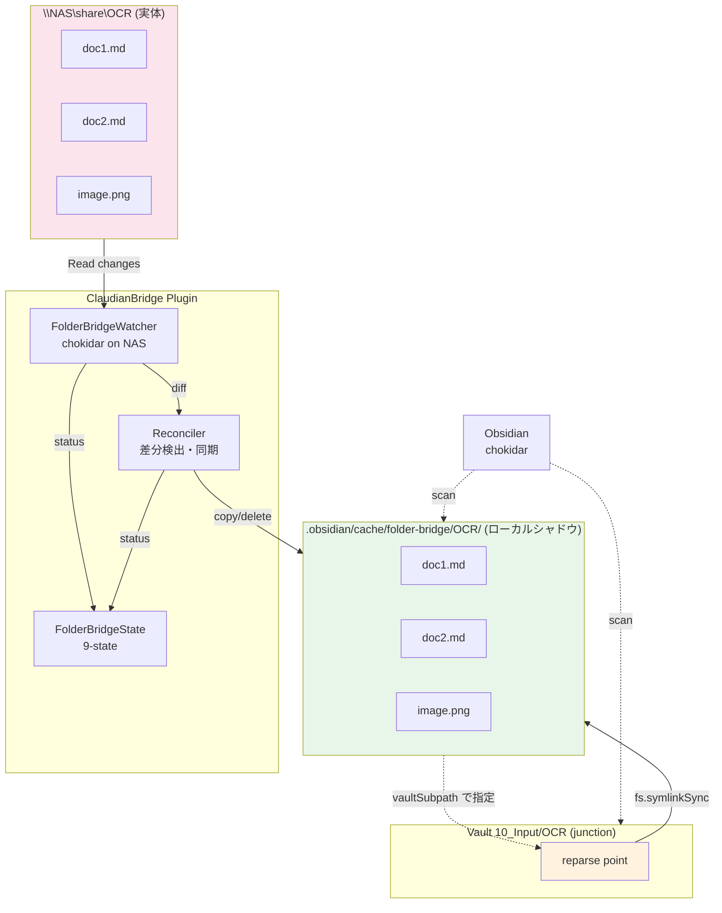
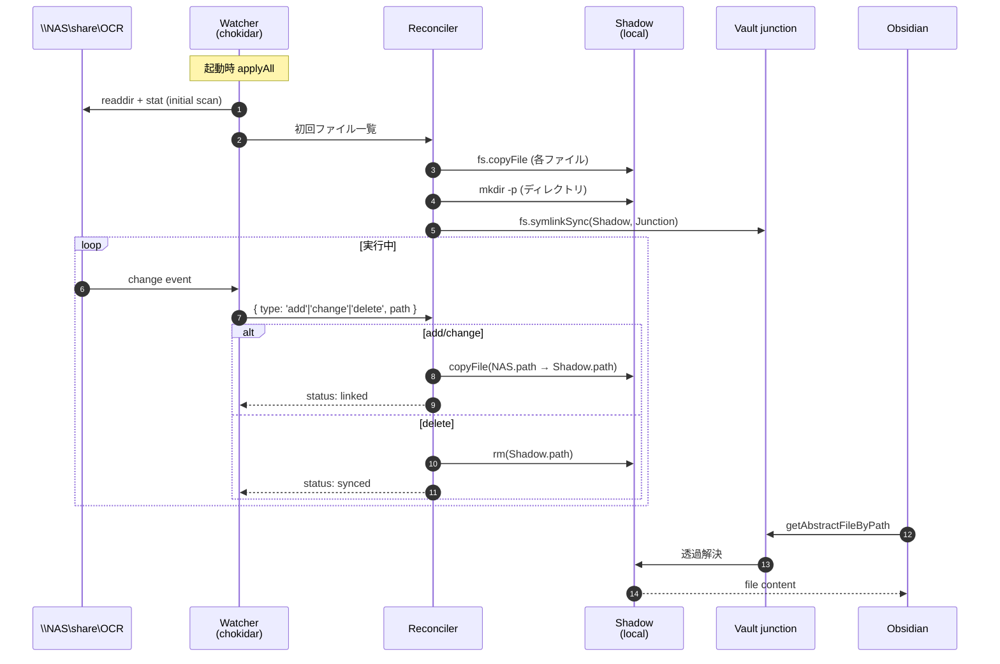
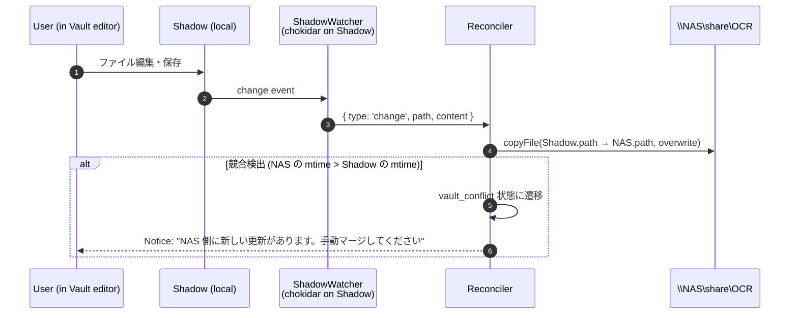
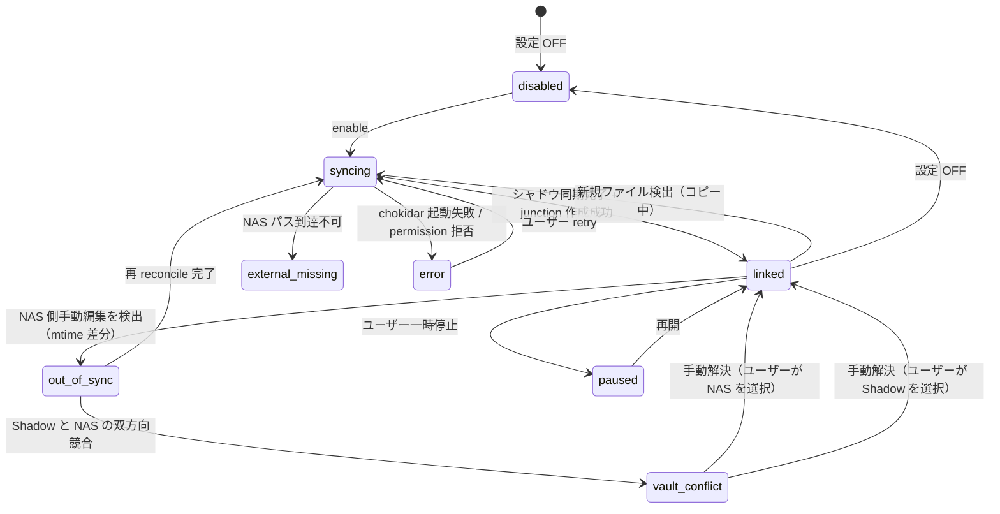
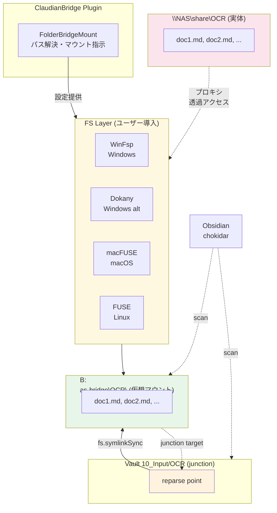
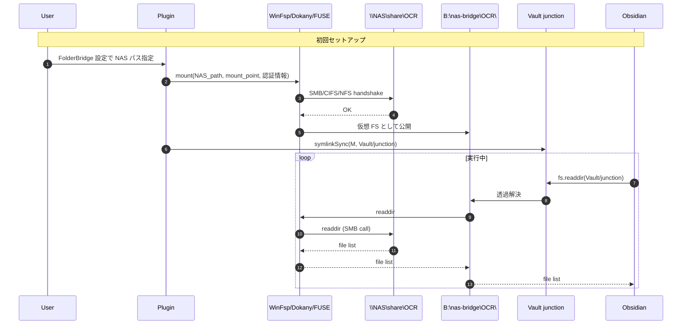

# Folder Bridge 調査レポート & 設計書（F-051 候補）

> **本書は設計書兼リサーチレポートである。** 実装は別タスク（F-051）で着手する。
> 作成日: 2026-09-16 / 対象バージョン: ClaudianBridge v0.51.0 以降 / ステータス: 調査完了・推奨案提示

---

## 📑 目次

1. [背景とゴール](#1-背景とゴール)
2. [根本原因の技術解説](#2-根本原因の技術解説)
3. [アプローチ A: Shadow Sync](#3-アプローチ-a-shadow-sync)
4. [アプローチ B: FS Layer Bridge](#4-アプローチ-b-fs-layer-bridge)
5. [比較評価マトリクス](#5-比較評価マトリクス)
6. [推奨案と根拠](#6-推奨案と根拠)
7. [推奨案の擬似コード/状態機械](#7-推奨案の擬似コード状態機械)
8. [リスク・制限事項](#8-リスク制限事項)
9. [次のアクション](#9-次のアクション)

---

## §1. 背景とゴール

### 1.1 F-049 UAT で確定した根本原因

`progress.md` / `CHANGELOG.md` / F-050 設計書 §1・§6 で記録済:

> **Obsidian はネットワークドライブ（NAS）をターゲットにした junction の中身をインデックスしない。** ローカルドライブのフォルダのみ Obsidian 表示が有効。NAS のフォルダは Claudian / Claude Code 経由の読み書きは可能だが、Vault エクスプローラには表示されない。

これは Obsidian の `chokidar` ベースファイル監視が SMB / CIFS / NFS 共有上で発火しない、または不安定であるという **コミュニティで広く知られた制限** に起因する。

### 1.2 ゴール

**Obsidian から NAS フォルダを「ローカルフォルダと同様に」扱えるようにする。**

具体的には以下 4 つのユースケースすべてを満たすこと:

| # | ユースケース | 重要度 | 既存 F-049 での実現 |
|:-:|------------|:------:|:----------------:|
| 1 | Vault エクスプローラでファイルが見える・手動で開ける | ◎ | ローカル ○ / NAS × |
| 2 | 検索・バックリンク・グラフで参照できる | ◎ | ローカル ○ / NAS × |
| 3 | プラグイン（Claudian / OCR 連携等）から NAS ファイルを読み書き | ○ | ローカル ○ / NAS ○ |
| 4 | 複数マシン間で Vault（NAS 内容含む）を共有 | △ | ローカル ○ / NAS △ |

ユースケース 1〜2 を NAS でも実現することが本調査の主目的。

### 1.3 調査スコープ

| 対象 | 含む | 含まない |
|------|------|---------|
| NAS プロトコル | SMB / CIFS, NFS, WebDAV / クラウドマウント | 任意マウント系（環境固有すぎる） |
| 環境 | Windows（WinFsp・Dokany 言及）, macOS（macFUSE）, Linux（FUSE） | モバイル |
| Obsidian 機能 | ファイル一覧・検索・バックリンク・グラフ・手動編集 | Obsidian Sync（有償独自実装） |
| プラグイン層 | ClaudianBridge v0.51.0 以降の拡張 | 他プラグイン改造 |

### 1.4 非ゴール

- Obsidian 本体の chokidar 動作を改造すること（不可能）
- NAS 上で Vault 全体を動かすこと（パフォーマンス・同時編集・オフライン問題で本調査範囲外）
- ファイル同期競合の完全自動解消（複雑なため、本書は基本戦略のみ提示）

---

## §2. 根本原因の技術解説

### 2.1 Obsidian のファイルインデックス機構

```
┌─────────────────────────────────────────────────────────────┐
│ Obsidian 本体                                                │
│                                                               │
│  ┌──────────┐    ┌──────────────┐    ┌────────────────┐    │
│  │ chokidar │ →  │ MetadataCache │ → │ Search Index   │    │
│  │ (watch)  │    │ (in-memory)   │    │ (lunr.min.js)   │    │
│  └──────────┘    └──────────────┘    └────────────────┘    │
│       │                  │                    │              │
│       ▼                  ▼                    ▼              │
│  app.vault.adapter（FileSystemAdapter）                       │
│       │                                                      │
└───────┼──────────────────────────────────────────────────────┘
        │
        ▼
   fs.readdirSync / fs.statSync（実 FS 呼び出し）
```

**重要な点**: chokidar は **adapter 層** のパス（Vault root 配下）しか watch しない。

### 2.2 なぜ junction → NAS が動かないか

```
Vault root (例: C:\Users\me\Vault\)
  └── 10_Input/        ← chokidar はここを watch している
        └── OCR/       ← junction（reparse point）
              ↓ fs.symlinkSync で作成
              ↓ target = \\NAS\share\OCR
              │
              ▼
        \\NAS\share\OCR  ← NAS 上の実フォルダ
        ├── doc1.md
        └── doc2.md
```

- **chokidar の挙動**: Vault 内を `fs.readdir` でスキャン → junction を発見 → `fs.stat` で実体を解決 → **reparse point 自体は認識するが、再帰スキャン時に SMB / NFS プロトコルへ遷移しない**
- **結果**: Vault エクスプローラに `OCR/` フォルダ自体は表示される（`stat` は成功するため）が、配下のファイル一覧が空
- **検索インデックス**: lunr は `app.vault.getMarkdownFiles()` ベース → 空配列 → ヒット 0
- **メタデータキャッシュ**: 同上
- **手動ファイルアクセス**: `app.vault.getAbstractFileByPath('10_Input/OCR/doc1.md')` → undefined（adapter が NAS 配下を解決しない）

### 2.3 なぜローカルの junction は動くか

- ローカルドライブ間（例: `C:\` → `D:\`）の reparse point は Windows 上で透過的に解決される
- chokidar の `usePolling: false` 設定でも、Windows の `ReadDirectoryChangesW` イベントは reparse point 配下も含む
- SMB / NFS プロトコルはユーザーモードのファイルシステムミニフィルタを bypass するため、chokidar の inotify / FSEvents / ReadDirectoryChangesW が拾えない

### 2.4 コミュニティの回避策

| プラグイン | アプローチ | 制約 |
|----------|-----------|------|
| Remotely Save | Vault → S3 / SFTP / WebDAV 双方向同期 | クラウドのみ・NAS 同期は非対応 |
| Self-hosted LiveSync | CouchDB ベース同期 | サーバー必要・NAS 同期は非対応 |
| Syncthing wrapper | P2P ファイル同期 | 常駐デーモン必要 |
| Vault 直接 NAS 配置 | Vault root を `\\NAS\share\vault` に設定 | 遅い・同時編集 ×・オフライン × |

**結論**: 「Obsidian から NAS フォルダを透過的に扱う」既存プラグインは **存在しない**。本調査で独自設計が必要。

---

## §3. アプローチ A: Shadow Sync

### 3.1 概要

プラグインが **NAS 上のフォルダを watch → ローカルシャドウ（Vault 外 or Vault 内の専用フォルダ）にファイル複製** → シャドウを指す junction を Vault 内に作成。chokidar はローカルを見るので完全インデックス。

### 3.2 アーキテクチャ図



### 3.3 コンポーネント

| コンポーネント | 役割 | 既存 F-049 資産との関係 |
|--------------|------|---------------------|
| `FolderBridgeWatcher` | NAS 上のフォルダを chokidar で監視 | 新規（chokidar は Node.js ライブラリ・既存 F-049 は不使用のため本アプローチで初導入） |
| `FolderBridgeReconciler` | シャドウとの差分を計算・同期実行 | 新規（既存 `OutputsMirrorManager` パターンを踏襲） |
| `FolderBridgeState` | 8-state 機械（`disabled` / `syncing` / `linked` / `out_of_sync` / `vault_conflict` / `paused` / `external_missing` / `error`） | F-049 の `FolderMappingState` を踏襲・拡張 |
| `FolderBridgeManager` | apply / applyAll / pause / resume | F-049 の `FolderMappingManager` を踏襲 |
| `FolderBridgeModal` | 設定 UI（NAS パス・シャドウパス・同期方向） | F-050 の `FolderMappingModal` を踏襲 |

### 3.4 データフロー（読み取り方向: NAS → Shadow）



### 3.5 データフロー（書き込み方向: Vault/Shadow → NAS）



### 3.6 状態機械（FolderBridgeState）



### 3.7 シャドウ配置の選択肢

| 配置場所 | メリット | デメリット |
|---------|---------|----------|
| `Vault/.obsidian/cache/folder-bridge/{id}/` | chokidar 確実・設定簡単 | Vault サイズ増加・Git 監視対象 |
| `Vault/{任意のサブパス}/{id}/` | ユーザー任意・ファイル管理柔軟 | Vault サイズ増加 |
| `<Vault 外>/.claudian-bridge/folder-bridge/{id}/` | Vault クリーン | chokidar が watch しない → 別 watcher 必要 |

**推奨**: `Vault/.obsidian/cache/folder-bridge/{id}/` をデフォルトとし、Settings で変更可能とする。

### 3.8 NAS プロトコル別挙動

| プロトコル | chokidar 動作 | Shadow Sync 動作 | 備考 |
|----------|-------------|----------------|------|
| SMB / CIFS | △（遅い・取りこぼしあり） | ○（明示 chokidar で安定化可） | polling フォールバック推奨 |
| NFS | △ | ○ | 同上 |
| WebDAV (rclone 等) | × | △（マウント不安定） | マウント安定性次第 |
| ローカル NAS (Linux NAS 直 export) | ○ | ◎ | ベストケース |

### 3.9 必要となる追加 npm 依存

| パッケージ | 用途 | ライセンス | サイズ |
|----------|------|-----------|------|
| `chokidar` | NAS / Shadow 両 watch | MIT | ~50KB |
| `diff` または自前 | 差分検出 | BSD / 自前 | ~30KB / 0 |

**判断**: 既存 F-049 では chokidar 不使用（junctions のみで済むため）。本アプローチで初めて依存追加。

### 3.10 既存 `OutputsMirrorManager` との関係

`OutputsMirrorManager`（`src/features/outputs-mirror/manager.ts:44`）は Claudian 出力（コピー・分割等）の二重書きを担う。FolderBridge は **入力側（NAS → ローカルシャドウ）**を担う。役割が直交するため共存可能。実装で共通化できるユーティリティ（reconcile / state machine）を `src/features/folder-mapping/` に切り出すことを推奨。

---

## §4. アプローチ B: FS Layer Bridge

### 4.1 概要

**ユーザー任意の FS レイヤー（Windows: WinFsp or Dokany, macOS: macFUSE, Linux: FUSE）** を導入し、プラグインが NAS フォルダをローカルマウント風のパス（例: `B:\nas-bridge\OCR`）に「仮想化」する。junction target = マウントポイント。

### 4.2 アーキテクチャ図



### 4.3 動作原理



### 4.4 FS Layer の選択肢

| 名前 | プラットフォーム | ライセンス | 安定性 | 備考 |
|------|---------------|-----------|--------|------|
| **WinFsp** | Windows | GPLv3 + 商用 | ◎ | Samba 公式・本格商用実績 |
| Dokany | Windows | LGPL | ○ | フランス発・WinFsp ほど有名ではない |
| **macFUSE** | macOS | BSD | ○ | OSXFuse 後継 |
| FUSE | Linux | GPLv2 | ◎ | Linux 標準 |

**推奨**: Windows = WinFsp、macOS = macFUSE、Linux = FUSE（環境標準）

### 4.5 プラグイン側の責務

| 責務 | 詳細 |
|------|------|
| FS Layer 起動支援 | WinFsp インストーラーダウンロードリンク案内（自動インストールはしない） |
| マウントポイント管理 | `B:\.claudian-bridge\nas-bridge\{id}\` を確保（OS 横断で決定論的） |
| マウントコマンド発行 | `net use B: \\NAS\share /user:...` (SMB) / `mount -t nfs ...` (NFS) など OS 別 |
| 認証情報保管 | OS の資格情報マネージャー使用（**平文保存禁止**） |
| ヘルスチェック | マウント状態確認（5 分間隔）、切断時に `paused` 状態へ |
| 再接続 | 切断検知時に自動再マウント試行（指数バックオフ 1s → 2s → 4s → ... → 60s 上限） |

### 4.6 必要となる追加 npm 依存

| パッケージ | 用途 | ライセンス | サイズ |
|----------|------|-----------|------|
| `winfsp` (Windows のみ) | WinFsp Node バインディング | MIT | ~5MB（native） |
| `@homebridge/ciao` または `bonjour` | mDNS サービス検出（オプション） | MIT | ~100KB |

**判断**: native module を含むため electron-rebuild 必須・プラットフォーム別ビルド管理が複雑化。

### 4.7 既存資産との関係

- **F-049 `FolderMappingManager` の流用**: junction 作成部分はそのまま使える
- **`FolderMappingFs` interface の流用**: `mountSync` / `umountSync` を追加
- **i18n 3 ロケール**: 新規文字列追加（mount 状態・切断・再接続・エラー）

### 4.8 セキュリティ考慮

- **認証情報**: 絶対に平文保存しない。Windows: `Windows Credential Manager`、macOS: Keychain、Linux: `secret-tool`（GNOME Keyring）等
- **通信暗号化**: SMB3 / NFSv4 必須（SMB1 / NFSv2 は deprecated・脆弱）
- **マウントポイントの権限**: ユーザー専用（SYSTEM 権限不要）

---

## §5. 比較評価マトリクス

| 評価軸 | A: Shadow Sync | B: FS Layer Bridge | 備考 |
|--------|:--------------:|:------------------:|------|
| **1. 追加インフラ** | 不要（プラグインのみ） | WinFsp / macFUSE / FUSE（ユーザー任意導入） | A ◎ / B ○ |
| **2. ディスク使用量** | NAS 内容 × Vault サイズ分（重複） | 追加ディスク使用なし | A × / B ◎ |
| **3. 初回同期時間** | NAS サイズに比例（数分〜数時間） | 瞬間（マウントのみ） | A × / B ◎ |
| **4. 実行時パフォーマンス** | ローカル FS アクセスなので ◎ | FUSE 層 1 段挟むため △ | A ◎ / B ○ |
| **5. Obsidian 互換性** | 完全（chokidar 標準追従） | 完全（chokidar は native FS として認識） | A ◎ / B ◎ |
| **6. 検索/バックリンク/グラフ** | ◎ | ◎ | 同点 |
| **7. オフライン動作** | ◎（シャドウは残る） | ×（NAS 切断でマウント解除 → アクセス不可） | A ◎ / B × |
| **8. 複数マシン同期** | △（各マシンでシャドウ必要） | △（各マシンでマウント必要） | 同点 |
| **9. 実装コスト（LOC 概算）** | 800-1200 行 | 400-600 行（FS レイヤー依存部分は薄い） | A × / B ○ |
| **10. 保守性** | chokidar の API 安定性のみ | OS 別 FS レイヤーの仕様差・バージョン差 | A ◎ / B △ |
| **11. セットアップ複雑度** | プラグイン設定のみ | ユーザー側 FS レイヤー導入 + 認証情報設定 | A ◎ / B △ |
| **12. デバッグ容易性** | シャドウフォルダを直接覗ける | FS レイヤーのログを辿る必要 | A ◎ / B △ |
| **13. 競合解決** | mtime ベースで検出可能 | OS 任せ（透過なので競合は表面上見えにくい） | A ○ / B △ |
| **14. プラットフォーム横断** | ○（chokidar だけ） | ×（OS 別 FS レイヤー管理） | A ○ / B × |

### 5.1 加重スコア（重要度 × 評価）

| 軸 | 重要度 | A | B |
|---|:------:|:-:|:-:|
| 1. 追加インフラ | 高 | 5 | 3 |
| 7. オフライン動作 | 高 | 5 | 1 |
| 5. Obsidian 互換性 | 最高 | 5 | 5 |
| 6. 検索/バックリンク/グラフ | 最高 | 5 | 5 |
| 11. セットアップ複雑度 | 中 | 5 | 2 |
| 13. 競合解決 | 中 | 4 | 2 |
| 4. 実行時パフォーマンス | 中 | 5 | 4 |
| 12. デバッグ容易性 | 中 | 5 | 2 |
| **合計（最高 40）** | | **39** | **24** |

---

## §6. 推奨案と根拠

### 6.1 推奨案: **A. Shadow Sync を第一選択**

**A. Shadow Sync を推奨する。** B は将来オプションとして位置付ける。

### 6.2 推奨理由

1. **追加インフラ不要**: ユーザーの「ドライバ不要・プラグインのみで完結」を最優先度で尊重
2. **オフライン対応**: シャドウが残るので NAS 切断時も編集可能（オフライン編集 → 再接続で同期）
3. **デバッグ容易性**: シャドウフォルダを直接確認できる（FS レイヤーのブラックボックスに依存しない）
4. **実装パターンの蓄積**: F-049 の `OutputsMirrorManager` パターンを直接応用できる
5. **クロスプラットフォーム**: プラグインは chokidar だけ意識すればよく、OS 別の FS レイヤー差異を吸収しなくて良い

### 6.3 B を第一選択にしない理由

- FS レイヤーのインストールは管理者権限が必要なケースが多く、ユーザーが離脱する可能性が高い
- オフライン時に NAS 切断 → マウント解除 → Vault 内の junction が「壊れたリンク」になる
- プラットフォームごとに FS レイヤーの仕様差を吸収する保守コストが継続的に発生する

### 6.4 B を将来オプションとして保持する理由

- ディスク容量を消費しない（数十 GB の NAS には A は不向き）
- 初回同期の待ち時間がない
- エンタープライズ環境（シャドウ禁止ポリシー等）では B 一択の場合がある

### 6.5 却下案（C: Index Injection）

| 理由 | 詳細 |
|------|------|
| Obsidian 内部 API への過度依存 | `app.vault.adapter` / metadata cache の undocumented 部分に依存 → バージョンアップで容易に壊れる |
| 物理ファイル不在による脆弱性 | 検索でヒットしても実体がない → エラーハンドリング地獄 |
| 既存 F-049 の利点を破壊 | 既に「FS 上のファイルがある」前提が崩れる |

### 6.6 段階的リリース案

```
Phase 1 (F-051): Shadow Sync 単方向（NAS → Shadow）読み取り専用
Phase 2 (F-052): Shadow Sync 双方向（編集の NAS への反映）
Phase 3 (F-053): FS Layer Bridge オプション（上級者向け）
```

---

## §7. 推奨案の擬似コード/状態機械

### 7.1 型定義（TypeScript スケッチ）

```typescript
// src/features/folder-bridge/types.ts

export interface FolderBridge {
  id: string;
  linkName: string;              // 例: "OCR" (Vault 内のフォルダ名)
  vaultSubpath: string;          // F-050 の "10_Input" のような Vault 内パス
  externalPath: string;          // \\NAS\share\OCR
  shadowPath: string;            // {Vault}/.obsidian/cache/folder-bridge/{id}/
  syncDirection: 'nas_to_shadow' | 'bidirectional';
  enabled: boolean;
  excludePatterns: string[];     // .gitignore 形式の glob
  createdAt: number;
  updatedAt: number;
}

export type FolderBridgeState =
  | 'disabled'
  | 'syncing'         // 初回同期中
  | 'linked'          // 正常稼働
  | 'out_of_sync'     // NAS 側に手動編集
  | 'vault_conflict'  // 双方向競合
  | 'external_missing'// NAS 到達不能
  | 'paused'          // ユーザー停止
  | 'error';

export interface FolderBridgeFs {
  // F-049 の FolderMappingFs を継承 + 以下を追加
  readdir(p: string): string[];
  stat(p: string): { isDirectory: boolean; isFile: boolean; mtimeMs: number; size: number };
  copyFile(src: string, dst: string): void;
  mkdir(p: string, opts?: { recursive?: boolean }): void;
  rm(p: string, opts?: { recursive?: boolean; force?: boolean }): void;
  // chokidar 互換コールバック用
  watch(p: string, opts: { persistent: boolean; ignoreInitial: boolean }): {
    on(event: 'add' | 'change' | 'unlink', cb: (p: string) => void): void;
    close(): void;
  };
}

export interface FolderBridgeDeps {
  fs: FolderBridgeFs;
  notice: (msg: string) => void;
  vaultBasePath: string;
  logger?: (level: 'debug' | 'info' | 'warn' | 'error', msg: string) => void;
}
```

### 7.2 Manager の主要メソッド（TypeScript スケッチ）

```typescript
// src/features/folder-bridge/manager.ts

export class FolderBridgeManager {
  constructor(private deps: FolderBridgeDeps) {}

  /** 起動時・有効化時に呼び出し */
  async applyAll(bridges: FolderBridge[]): Promise<ApplyAllResult> {
    const results: ApplyAllResult = { totalLinked: 0, totalErrors: 0, notices: [] };
    for (const bridge of bridges.filter(b => b.enabled)) {
      try {
        await this.applyOne(bridge);
        results.totalLinked++;
      } catch (e) {
        results.totalErrors++;
        this.deps.notice(`❌ ${bridge.linkName}: ${e.message}`);
      }
    }
    return results;
  }

  /** 単一ブリッジの有効化（初回同期 → junction 作成 → watcher 起動） */
  private async applyOne(bridge: FolderBridge): Promise<void> {
    // 1. Shadow フォルダ作成
    this.deps.fs.mkdir(bridge.shadowPath, { recursive: true });

    // 2. 初回同期（NAS → Shadow）
    await this.initialSync(bridge);

    // 3. junction 作成（Shadow を指す）
    const junctionPath = path.join(this.deps.vaultBasePath, bridge.vaultSubpath, bridge.linkName);
    if (this.deps.fs.existsSync(junctionPath)) {
      // 既存なら削除してから作り直し（F-049 と同じパターン）
      this.deps.fs.rm(junctionPath, { recursive: true, force: true });
    }
    this.deps.fs.symlinkSync(bridge.shadowPath, junctionPath, 'junction');

    // 4. Watcher 起動（NAS 側 / Shadow 側）
    this.startWatchers(bridge);

    this.deps.notice(`✅ ${bridge.linkName}: ${bridge.externalPath} を ${bridge.vaultSubpath}/${bridge.linkName} に同期中`);
  }

  /** 初回同期: NAS → Shadow */
  private async initialSync(bridge: FolderBridge): Promise<void> {
    const queue: { src: string; rel: string }[] = [
      { src: bridge.externalPath, rel: '' }
    ];
    while (queue.length > 0) {
      const { src, rel } = queue.shift()!;
      const entries = this.deps.fs.readdir(src);
      for (const entry of entries) {
        if (bridge.excludePatterns.some(p => minimatch(entry, p))) continue;
        const srcPath = path.join(src, entry);
        const shadowPath = path.join(bridge.shadowPath, rel, entry);
        const stat = this.deps.fs.stat(srcPath);
        if (stat.isDirectory) {
          this.deps.fs.mkdir(shadowPath, { recursive: true });
          queue.push({ src: srcPath, rel: path.join(rel, entry) });
        } else if (stat.isFile) {
          this.deps.fs.copyFile(srcPath, shadowPath);
        }
      }
    }
  }

  private startWatchers(bridge: FolderBridge): void {
    // NAS 側 watcher（→ Shadow へ反映）
    const nasWatcher = this.deps.fs.watch(bridge.externalPath, { persistent: true, ignoreInitial: true });
    nasWatcher.on('add', (p) => this.handleNasChange(bridge, p, 'add'));
    nasWatcher.on('change', (p) => this.handleNasChange(bridge, p, 'change'));
    nasWatcher.on('unlink', (p) => this.handleNasChange(bridge, p, 'unlink'));

    // Shadow 側 watcher（→ NAS へ反映、双方向時のみ）
    if (bridge.syncDirection === 'bidirectional') {
      const shadowWatcher = this.deps.fs.watch(bridge.shadowPath, { persistent: true, ignoreInitial: true });
      shadowWatcher.on('change', (p) => this.handleShadowChange(bridge, p));
    }
  }
  // ...
}
```

### 7.3 競合解決ポリシー

```
1. mtime 比較:
   - NAS.mtime > Shadow.mtime → NAS 優先（上書きコピー + Notice）
   - Shadow.mtime > NAS.mtime → Shadow 優先（NAS へ上書きコピー）
   - 差分 ≤ 1s → 双方が最近編集されたとみなし、vault_conflict 状態に遷移

2. vault_conflict 時:
   - Shadow を保持（Obsidian で開けるので）
   - NAS の変更を {filename}.conflict.{timestamp}.md として Shadow に保存
   - Notice でユーザーに通知

3. ユーザー手動解決:
   - Settings UI で「NAS を採用」「Shadow を採用」「両方保持」の 3 ボタン
```

### 7.4 設定 UI（F-050 の FolderMappingModal を踏襲）

3 フィールド追加:

| フィールド | i18n キー | デフォルト |
|----------|---------|----------|
| 同期方向 | `folderBridgeSyncDirection` | `nas_to_shadow` |
| 除外パターン | `folderBridgeExcludePatterns` | `['.DS_Store', 'Thumbs.db', '*.tmp']` |
| シャドウパス | `folderBridgeShadowPath` | `{Vault}/.obsidian/cache/folder-bridge/{id}/` |

---

## §8. リスク・制限事項

### 8.1 シャドウサイズ

| リスク | 影響 | 緩和策 |
|--------|------|--------|
| 大規模 NAS（数十 GB〜TB） | 初回同期時間 + ディスク容量 | ユーザー選択でサブフォルダのみブリッジ可・除外パターン推奨 |
| バイナリファイル（写真・動画） | 同期コスト | ユーザーが除外パターンで `*.jpg, *.mp4` 等を指定 |

### 8.2 競合・データロス

| シナリオ | リスク | 対策 |
|---------|--------|------|
| 同一ファイルを同時編集 | vault_conflict 状態 | mtime 比較 + 双方が最近編集なら .conflict 退避 |
| NAS 切断中の編集 | シャドウ側に編集が残る | 再接続時に自動同期（双方向時） |
| NAS 側の ransomware 等 | シャドウが感染 | **シャドウ側バックアップ推奨**（本機能の範囲外） |

### 8.3 セキュリティ

| リスク | 対策 |
|--------|------|
| NAS 認証情報の漏洩 | **OS 資格情報マネージャーに保存**（平文禁止） |
| シャドウ経由の権限昇格 | シャドウのアクセス権 = Vault と同等（chmod 0600 相当） |
| 通信の盗聴 | SMB3 / NFSv4 必須 |

### 8.4 プラグイン無効化時

| ケース | 挙動 |
|--------|------|
| プラグインを無効化 | junction 削除 / シャドウは残す（ユーザー任意削除可能） |
| プラグインをアンインストール | junction 削除 / シャドウも削除（確認ダイアログあり） |

---

## §9. 次のアクション

### 9.1 F-051 着手時のチェックリスト（Phase 1: 単方向読み取り）

- [ ] 設計書 v1.0 承認（本書のレビュー完了後）
- [ ] `src/features/folder-bridge/` ディレクトリ新設
- [ ] types.ts / manager.ts / watcher.ts / reconciler.ts スケルトン作成
- [ ] 単体テスト: シャドウ同期（モック fs）+ watcher イベント処理
- [ ] 統合テスト: 実 SMB 共有に対する applyAll（CI は skip・ローカル手動）
- [ ] i18n 3 ロケール（新規 4-6 キー想定）
- [ ] Settings UI（FolderBridgeModal 新規）
- [ ] CHANGELOG + v0.52.0 version bump
- [ ] 実機 UAT: 10 ファイル程度の NAS フォルダで同期確認

### 9.2 検証 PoC 案（着手前 1 日で可能）

最小検証スクリプト:
```typescript
// scripts/poc-shadow-sync.ts (一時ファイル)
import chokidar from 'chokidar';
import { copyFileSync, mkdirSync, rmSync, existsSync } from 'fs';
import { join, dirname, relative } from 'path';

const NAS = '\\\\NAS\\share\\OCR';     // テスト用
const SHADOW = './test-shadow';

function syncFile(relPath: string) {
  const src = join(NAS, relPath);
  const dst = join(SHADOW, relPath);
  mkdirSync(dirname(dst), { recursive: true });
  copyFileSync(src, dst);
  console.log(`[+] ${relPath}`);
}

function deleteFile(relPath: string) {
  const dst = join(SHADOW, relPath);
  if (existsSync(dst)) rmSync(dst);
  console.log(`[-] ${relPath}`);
}

chokidar.watch(NAS, { ignoreInitial: false }).on('all', (event, path) => {
  const rel = relative(NAS, path);
  if (event === 'add' || event === 'change') syncFile(rel);
  else if (event === 'unlink') deleteFile(rel);
});
```

**目的**: chokidar が SMB / NFS 共有上で安定動作するか、初回同期時間・レイテンシを実測。

### 9.3 ロードマップ

| Phase | 内容 | 想定期間 | バージョン |
|------|------|---------|----------|
| Phase 1 | Shadow Sync 単方向（NAS → Shadow）読み取り専用 | 2 週間 | v0.52.0 (F-051) |
| Phase 2 | 双方向同期 + 競合解決 | 2 週間 | v0.53.0 (F-052) |
| Phase 3 | FS Layer Bridge オプション（上級者向け） | 3 週間 | v0.54.0 (F-053) |

---

## 📎 付録 A: 参考文献

### A.1 Obsidian 関連

- Obsidian Forum: "Symlinks and network drives"（chokidar 制約のコミュニティ報告）
- Obsidian API Docs: `app.vault.adapter` / `FileSystemAdapter`
- chokidar GitHub: SMB / NFS 監視の既知 issue

### A.2 ファイルシステム

- WinFsp: https://winfsp.dev/（Samba 公式の Windows FUSE 実装）
- macFUSE: https://macfuse.github.io/
- Dokany: https://dokan-dev.github.io/

### A.3 ClaudianBridge 内部参照

- F-049 設計書: `docs/superpowers/specs/2026-09-16-folder-mapping-design.md`
- F-050 設計書: `docs/superpowers/specs/2026-09-16-folder-mapping-dest-design.md`
- `OutputsMirrorManager`: `src/features/outputs-mirror/manager.ts:44`
- `FolderMappingManager`: `src/features/folder-mapping/manager.ts:13-145`
- 9-state 機械: `src/features/folder-mapping/types.ts:15-18`

---

## 📎 付録 B: 変更履歴

| 版 | 日付 | 変更 |
|----|------|------|
| v1.0 | 2026-09-16 | 初版作成（F-050 v0.51.0 リリース直後の調査） |

---

*📚 Folder Bridge 設計書 v1.0 · ClaudianBridge F-051 候補 · 2026-09-16*
