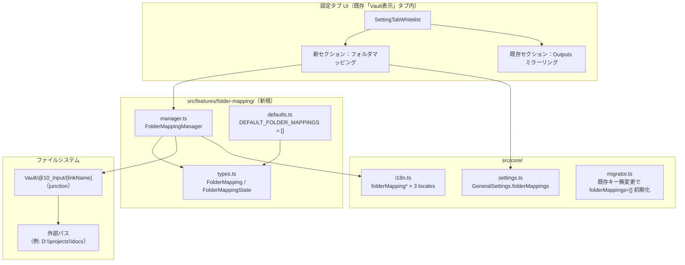
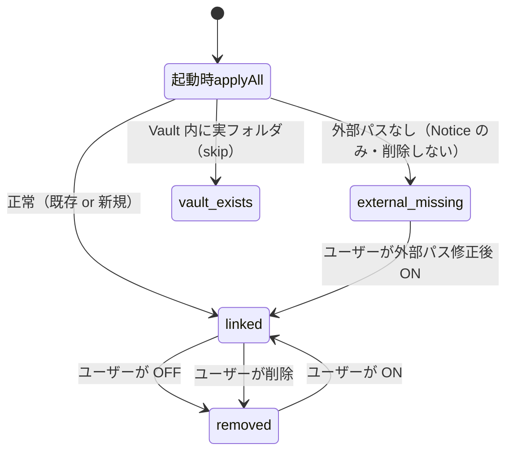

# フォルダマッピング機能（F-049）設計仕様書

> 📂 パス：docs/superpowers/specs/2026-09-16-folder-mapping-design.md
> 📍 源码：D:\AI-Agent\ClaudianBridge\src\features\folder-mapping\、src\settings\SettingTabWhitelist.ts、src/core/settings.ts、src/core/i18n.ts、main.ts
> 🏷️ バージョン：v1.0（2026-09-16 設計・承認待ち）
> 🔗 機能番号：F-049

---

## 1. 背景・目的

ClaudianBridge v0.49.1 には **Outputs フォルダミラーリング機能**（Vault/Outputs ← junction → Documents/ObsidainOutputs）が存在する。これは単一フォルダの双方向リンクを提供するが、以下のような限界がある。

| # | 現状課題 |
|:-:|----------|
| A | リンクできる外部フォルダが「Outputs」1 つだけ。複数プロジェクトのドキュメント・Downloads・別 Vault などをまとめて参照できない |
| B | リンク先 Vault パスが `Vault/Outputs` 固定で、Vault ルート直下が散らかる（@10_Input のような入力系集約先がない） |
| C | Claudian チャットで外部プロジェクトのドキュメントを読ませたい／生成的コードを別プロジェクトの作業フォルダに直接書き出したい、という要望に個別対応できていない |

本設計で次を実現する：

| # | 項目 |
|:-:|------|
| A | 設定画面で **複数の任意外部フォルダ** を登録し、各々を `Vault/@10_Input/{linkName}` として双方向リンク |
| B | 既存 Outputs ミラーリング機能と並走（後方互換 100%・既存ユーザーへの破壊変更ゼロ） |
| C | 双方向（読み込み・書き出し）両用途をサポート |

---

## 2. 要件（決定済み・ユーザー承認済み）

| # | 要件 | 決定 |
|:-:|------|------|
| R1 | マッピング先 Vault パス | **Vault/@10_Input/{linkName} 固定** |
| R2 | リンク方式 | **Windows ジャンクション**（既存 OutputsMirrorManager と同方式） |
| R3 | 用途 | **双方向**（外部→Claudian 読み、外部←Claudian 書き出し） |
| R4 | 命名 | **ユーザー任意**（英数・`_`・`-`・CJK・空白可。1〜64 文字） |
| R5 | 件数 | **無制限**（data.json 容量内・実用 20〜30 件） |
| R6 | UI 配置 | **既存「Vault表示」タブ内・新セクション「フォルダマッピング」**（Outputs ミラーリングの上に配置） |
| R7 | 削除挙動 | **ジャンクションのみ削除**（外部ファイル不可触） |
| R8 | F 番号 | **F-049** |
| R9 | リリース | **v0.50.0**（後方互換追加のため minor bump） |
| R10 | デフォルト | **空配列 `[]`**（既存ユーザー影響ゼロ） |
| R11 | 既存 Outputs 機能 | **完全無変更・並走**（既存 data.json キー `general.outputsMirror*` 触らない） |

---

## 3. アーキテクチャ

### 3.1 全体構成図



### 3.2 新規ファイル

```
src/features/folder-mapping/
├── manager.ts          # FolderMappingManager（junction の作成/削除/検証）
├── manager.test.ts     # 単体テスト 20+ 件
├── types.ts            # FolderMapping, FolderMappingState, FolderMappingDeps
└── defaults.ts         # DEFAULT_FOLDER_MAPPINGS = []
```

### 3.3 変更ファイル

| ファイル | 変更内容 |
|---------|---------|
| `src/core/settings.ts` | `GeneralSettings` に `folderMappings: FolderMapping[]` 追加 + `DEFAULT_FOLDER_MAPPINGS = []` |
| `src/settings/SettingTabWhitelist.ts` | 新セクション「フォルダマッピング」を Outputs ミラーリングの上に追加 |
| `src/core/i18n.ts` | i18n キー 8 個 × 3 ロケール（ja/en/zh） |
| `src/core/migrator.ts` | 既存 data.json に `folderMappings` 無い場合に `[]` で初期化（既存パターン） |
| `main.ts` | プラグイン `onload()` 内で `applyAllMappings()` を呼び永続化 |
| `src/features/folder-mapping/manager.test.ts` | 新規 20+ 件 |
| `CHANGELOG.md` | v0.50.0 エントリ追加 |
| `manifest.json` | バージョン bump（0.49.1 → 0.50.0） |

### 3.4 モジュール依存関係

```mermaid
graph LR
    User[ユーザー] -->|設定画面操作| ST[SettingTabWhitelist]
    ST -->|save| CS[ConfigStore/data.json]
    CS -->|load on startup| Main[main.ts onload]
    Main -->|applyAll| FM[FolderMappingManager]
    FM -->|symlinkSync junction| FS[Vault/@10_Input/name]
    FM -->|外部 FS アクセス| Ext[External Path]
```

### 3.5 既存 `OutputsMirrorManager` との関係（並走）

| | `OutputsMirrorManager` | `FolderMappingManager` |
|---|---|---|
| 用途 | Claudian **出力のデフォルト退避先** | ユーザー定義の**任意**マッピング |
| UI | 「Vault表示」タブ末尾に既存 1 セクション | 新セクション（同タブ内・上に配置） |
| 件数 | 単一（固定で `Vault/Outputs`） | 複数（`Vault/@10_Input/{name}`） |
| 設定キー | `general.outputsMirror*` | `general.folderMappings[]` |

---

## 4. 型・インターフェース

### 4.1 `FolderMapping` 型

```typescript
// src/features/folder-mapping/types.ts
export interface FolderMapping {
  /** 一意識別子（UUID v4）。UI 並び替え・更新のキー */
  id: string;
  /** Vault 内リンク名（Vault/@10_Input/{linkName} の {linkName}）。
   *  英数・アンダースコア・ハイフン・CJK 可。空文字禁止・重複禁止・先頭ドット禁止 */
  linkName: string;
  /** マッピング元 外部絶対パス（Windows: "D:\\foo\\bar", POSIX: "/home/x/y"）。
   *  空文字禁止。Vault 自身・祖先・システムフォルダはバリデーションで拒否 */
  externalPath: string;
  /** 有効/無効（OFF のときジャンクション削除・ON で再作成） */
  enabled: boolean;
  /** 作成時刻（ms epoch） */
  createdAt: number;
  /** 最終更新時刻（ms epoch） */
  updatedAt: number;
}

/** 1 件エントリに apply した直後の状態 */
export type FolderMappingState =
  | 'linked'           // ジャンクション存在 & ターゲット有効
  | 'created'          // 新規作成された
  | 'removed'          // OFF にして削除された
  | 'inactive'         // OFF のまま（リンクなし）
  | 'vault_exists'     // Vault/@10_Input/{linkName} に実フォルダがあり上書き不可
  | 'external_missing' // 外部パスが存在しない（OFF にせず Notice のみ）
  | 'circular'         // 外部パスが Vault 自身・祖先を指している
  | 'forbidden_path'   // ブラックリストに一致
  | 'error';           // その他 FS エラー
```

### 4.2 `FolderMappingManager` クラス

```typescript
// src/features/folder-mapping/manager.ts
export interface FolderMappingDeps {
  vaultBasePath: string;
  fs: {
    existsSync: (p: string) => boolean;
    mkdirSync: (p: string, opts: { recursive: true }) => void;
    symlinkSync: (target: string, path: string, type: string) => void;
    lstatSync: (p: string) => { isSymbolicLink(): boolean };
    rmdirSync: (p: string) => void;
    rmSync: (p: string, opts?: { recursive?: boolean; force?: boolean }) => void;
    realpathSync?: (p: string) => string;
    statSync?: (p: string) => { isDirectory(): boolean };
  };
  notice: (msg: string) => void;
  openPath: (p: string) => Promise<string>;
  generateId?: () => string;        // テスト用（既定: crypto.randomUUID）
  now?: () => number;                // テスト用（既定: Date.now）
}

export interface ApplyAllResult {
  applied: Array<{ id: string; state: FolderMappingState }>;
  totalCreated: number;
  totalRemoved: number;
  totalErrors: number;
}

export class FolderMappingManager {
  constructor(deps?: Partial<FolderMappingDeps>) { /* DI */ }

  /** Vault 内リンク先パスを計算: vaultBasePath/@10_Input/{linkName} */
  resolveLinkPath(mapping: FolderMapping): string;

  /** 1 件エントリに適用（有効/無効 toggle・新規・削除のいずれでも使用） */
  apply(mapping: FolderMapping): FolderMappingState;

  /** 全エントリを一括適用（プラグイン起動時） */
  applyAll(mappings: FolderMapping[]): ApplyAllResult;

  /** ステータス取得（設定 UI 表示用） */
  status(mapping: FolderMapping): { linked: boolean; target?: string; state: FolderMappingState };

  /** 外部パスを Explorer/Finder で開く */
  async openExternal(mapping: FolderMapping): Promise<void>;
}
```

### 4.3 設定スキーマ追加

```typescript
// src/core/settings.ts
import type { FolderMapping } from '../features/folder-mapping/types';

export const DEFAULT_FOLDER_MAPPINGS: FolderMapping[] = [];

export interface GeneralSettings {
  // ...既存フィールド...
  folderMappings: FolderMapping[];
}
```

### 4.4 バリデーションルール

| 項目 | ルール |
|------|------|
| `linkName` | `^[A-Za-z0-9_\-ぁ-んァ-ヴ一-鿿\s]{1,64}$`（**`/`・`\`・制御文字・先頭ドット・末尾空白は除外**・UTF-16 サロゲートペア保護のため RegExp には `u` フラグ付与） |
| `externalPath` | 絶対パス必須（`nodePath.isAbsolute`）・null バイト除外 |
| 禁止 `externalPath` | `vaultBasePath` 自体 / 祖先 / `C:\Windows` / `C:\Program Files` / `~/.ssh` 等 |
| 重複検出 | 既存マッピング間で `linkName` 重複・`externalPath` 重複 |

---

## 5. データフロー・ライフサイクル

### 5.1 状態遷移



### 5.2 主要データフロー

| 操作 | 起点 | 処理 | 終点 |
|------|------|------|------|
| **起動** | `main.ts onload()` | `applyAll(mappings)` を呼ぶ。`external_missing` 等は Notice のみ・自動削除しない | 既存 junction を復元 or 新規作成 |
| **追加** | UI「＋追加」ボタン → モーダルで `linkName` + `externalPath` 入力 | `validate()` → `apply()` → `data.json` 保存 → 画面再描画 | 新規 junction 作成 |
| **ON/OFF** | 行ごとの Toggle | `enabled` を更新 → `apply()` → 保存 → 描画 | junction 作成/削除 |
| **削除** | 行ごとの「✕」ボタン → 確認ダイアログ | `apply({enabled:false})` で junction 削除 → `data.json` から除去 → 描画 | junction 削除 |
| **修正** | 行の「✎ 編集」 → パス再入力 | `apply()` → 保存 → 描画 | 古い junction 削除 → 新規作成（Windows junction は target を atomic に変更できないため、`linkName` 変更・`externalPath` 変更いずれの場合も削除→再作成） |
| **外部を開く** | 行の「📂 開く」 | `electron.shell.openPath(externalPath)` | Explorer 起動 |

### 5.3 マイグレーション

- **既存ユーザー**: 影響なし。`general.folderMappings` が `data.json` に無ければ `DEFAULT_FOLDER_MAPPINGS = []` で初期化（migrator.ts 既存パターン流用）
- **既存 Outputs**: 完全無変更（並走）

---

## 6. 設定 UI レイアウト

### 6.1 タブ内配置

既存「Vault表示」タブ（`SettingTabWhitelist.ts`）のセクション順：

```
1. 拡張子ホワイトリスト（既存）
2. フォルダ常時表示・_/. 開始フォルダ非表示（既存）
3. ★ 新セクション：フォルダマッピング（F-049）
4. Outputs フォルダミラーリング（既存・無変更）
```

### 6.2 新セクション UI

```
─────────────────────────────────────────────
h3: フォルダマッピング（F-049）
p  : Vault/@10_Input/{linkName} として外部フォルダをリンクします。
     双向利用可（読み込み・書き出し）。リンク先はあくまで @10_Input 配下です。

─────────────────────────────────────────────
+ ＋ 追加...                            [ボタン]
─────────────────────────────────────────────
| リンク名       | 外部パス             | 状態     | 操作            |
|----------------|----------------------|----------|-----------------|
| 🔗 ExternalDocs| D:\projects\docs     | ✅ Linked| ON [●] ✎ ✕ 📂   |
| 🔗 Downloads   | C:\Users\x\Downloads| ✅ Linked| ON [●] ✎ ✕ 📂   |
| 🔗 OldArchive  | D:\backup\2024       | ⚠ 外部無| OFF [○] ✎ ✕ 📂  |
| 🔗 VaultMirror | C:\forbidden         | ❌ 拒否 | OFF [○] ✎ ✕ 📂  |
─────────────────────────────────────────────
（行がない場合：「まだマッピングがありません。＋追加... から登録してください。」）
```

### 6.3 追加モーダル

| フィールド | UI | バリデーション |
|-----------|-----|--------------|
| リンク名 | テキスト入力（placeholder: 例: `ExternalDocs`） | リアルタイムで `linkName` 規則チェック + 既存重複チェック |
| 外部パス | テキスト入力 + 「📁 参照」ボタン（OS ネイティブダイアログ） | 絶対パス必須 + 禁止パスチェック |

- 「💾 追加」ボタンで確定
- バリデーション NG 時はボタンを disabled にして下部に赤字理由

### 6.4 編集モーダル

追加モーダルとほぼ同型。**`linkName` 変更・`externalPath` 変更いずれの場合も既存 junction 削除→新規作成**（Windows junction は target を atomic に変更できないため）。`enabled` トグル変更時は削除→再作成が不要（既存 junction がそのまま残る）。

### 6.5 確認ダイアログ

- 削除時：「`@10_Input/ExternalDocs` のリンクを削除しますか？外部パス `D:\projects\docs` のファイルは削除されません。」
- 編集時：`linkName` 変更時のみ追加で確認（「リンク名変更は junction の作り直しを伴います」）

---

## 7. エラーハンドリングと安全性

### 7.1 状態別 Notice メッセージ

| `FolderMappingState` | Notice レベル | メッセージ（日本語） |
|----------------------|--------------|----------------------|
| `linked` | info（無通知） | （成功・静かに） |
| `created` | info | `@10_Input/{linkName} → {externalPath} のリンクを作成しました` |
| `removed` | info | `@10_Input/{linkName} のリンクを削除しました` |
| `inactive` | info（無通知） | （OFF 状態は正常） |
| `vault_exists` | warn | `@10_Input/{linkName} に実フォルダが存在します。リンク作成をスキップしました。手動で確認してください。` |
| `external_missing` | warn | `外部パス {externalPath} が存在しません。設定を確認してください（リンクは作成していません）。` |
| `circular` | warn | `外部パスが Vault 自身を指しているため拒否しました: {path}` |
| `forbidden_path` | warn | `禁止パス（Vault 祖先 / システムフォルダ等）: {path}` |
| `error` | error | `予期しないエラー: {error message}` |

### 7.2 禁止パスブラックリスト

| 種別 | 例 |
|------|-----|
| Vault 自身 | `vaultBasePath` 完全一致 |
| Vault の祖先 | `vaultBasePath` の `path.relative` が `..` で始まる |
| システムフォルダ | `C:\Windows`, `C:\Windows\System32`, `C:\Program Files`, `C:\Program Files (x86)` |
| ユーザープロファイル保護 | `~/.ssh`, `~/.aws`, `~/.gnupg`（POSIX は best-effort） |
| Vault 内実フォルダ衝突 | `Vault/@10_Input/{linkName}` に既に実フォルダ or 別 junction |

### 7.3 失敗時のロールバック方針

| 操作 | 失敗時の挙動 |
|------|--------------|
| 新規追加 | junction 作成失敗 → `data.json` には追加しない（ロールバック） |
| 編集 | 旧 junction 削除成功 → 新規作成失敗 → 旧 junction 復元試行 → それでもダメなら Notice で手動促し |
| 削除 | junction 削除失敗 → `data.json` は更新（次回起動で再試行される） |
| 起動時 applyAll | 1 件失敗しても他は続行。最後に `totalErrors` を Notice で報告 |

### 7.4 並行性

- 設定画面操作とプラグインリロードの競合：設定保存は `store.save()` のアトミック書込（既存パターン）
- junction 操作は同期 FS API で順序保証

---

## 8. テスト戦略

### 8.1 テストカテゴリと目標数

| カテゴリ | 目標 | 配置 |
|---------|------|------|
| 単体テスト（manager） | 20+ 件 | `src/features/folder-mapping/manager.test.ts` |
| 単体テスト（settings マイグレーション） | 3 件 | `src/core/settings.test.ts` 追記 |
| 単体テスト（i18n） | 4 件 | `src/core/i18n.test.ts` 追記 |
| 統合テスト（SettingTab） | 6 件 | `src/settings/SettingTabWhitelist.test.ts` 追記 |
| **追加合計** | **33+ 件** | 既存 1348 → 1381 件 |

### 8.2 主要テストケース（抜粋）

**manager.ts**：
- ✅ `resolveLinkPath` が `vaultBasePath + '@10_Input/' + linkName` を返す
- ✅ `apply({enabled:true, ...})` で新規 junction 作成 → `created`
- ✅ 既存 junction あり → `linked`（冪等）
- ✅ `apply({enabled:false, ...})` で junction 削除 → `removed`
- ✅ 外部パス不在 → `external_missing`、junctions 作成せず Notice
- ✅ 外部パスが Vault 自身を指す → `circular`、junctions 作成せず
- ✅ Vault 祖先パス → `circular` 拒否
- ✅ `C:\Windows` → `forbidden_path` 拒否
- ✅ `~/.ssh` → `forbidden_path` 拒否（POSIX のみ・Windows はスキップ）
- ✅ `applyAll()` で複数件一括処理、`ApplyAllResult` の集計値正しい
- ✅ `applyAll()` で 1 件失敗しても他は続行
- ✅ 既に `@10_Input/{name}` に実フォルダあり → `vault_exists`、上書きしない
- ✅ `status()` が `linked` / ターゲットパス返却
- ✅ `openExternal()` で `electron.shell.openPath` 呼ばれる
- ✅ `generateId` を DI で注入 → テスト再現性
- ✅ `now` を DI で注入 → タイムスタンプ固定

**settings.ts**：
- ✅ 旧 data.json に `folderMappings` 無い → `[]` で初期化
- ✅ 既存 `outputsMirror*` キーは無変更

**SettingTabWhitelist.ts**：
- ✅ 新セクション見出し「フォルダマッピング」表示
- ✅ 既存セクション「Outputs フォルダミラーリング」より上に配置
- ✅ 「＋追加」ボタンで行追加 → junction 作成 → data.json 保存
- ✅ 行 Toggle OFF → junction 削除
- ✅ 行「✕」で削除 → 確認ダイアログ → 確定で削除
- ✅ 行「✎ 編集」 → 編集モーダル → 保存で再作成

### 8.3 テストヘルパー

- 既存 `OutputsMirrorManager` の DI パターン（`fs` を mock 注入）を踏襲
- `node:fs` の実 API を mock せずカスタムモックで検証
- 一時ディレクトリは `os.tmpdir()` 配下（`fs.mkdtempSync`）、テスト後に `fs.rmSync(..., {recursive:true})`

---

## 9. リリース計画

### 9.1 バージョンと位置づけ

| 項目 | 内容 |
|------|------|
| **バージョン** | **v0.50.0**（minor bump・後方互換追加のため） |
| **F 番号** | **F-049** |
| **影響範囲** | **追加のみ**（既存機能・既存 data.json・既存テストへの破壊変更ゼロ） |
| **ロールバック容易性** | v0.49.x へ戻せば新コード経路は消える・既存 Outputs は無傷 |

### 9.2 リリース手順（POC 開発メタプロセス準拠）

1. 設計書（本ファイル）を `docs/superpowers/specs/` に格納（git コミット済み・commit `28ec530`）。**承認後、行動ルール v2.28 に基づき Vault 側ミラーを `80_POC_Projects/POC_017_ClaudianBridge/02_設計文書/30_フォルダマッピング設計.md` に改名（設計書テンプレ命名）して `_superpowers原本/` から移動**
2. `writing-plans` スキルで実装プラン（タスク分解）を作成
3. `test-driven-development` スキルで TDD：テスト 33 件を先に書き、失敗を確認
4. 実装 → テスト全件 PASS
5. `requesting-code-review` スキルで subagent レビュー
6. `verification-before-completion`：vitest 全件 PASS + tsc 0 エラー + ビルド成功 + Vault デプロイ
7. CHANGELOG.md v0.50.0 エントリ追加
8. リリースノート作成 + git tag + master マージ
9. v0.50.0 で **デフォルト OFF**（= `folderMappings = []`）のため既存ユーザー影響ゼロ

### 9.3 受け入れ基準（UAT）

- [ ] 設定画面に「フォルダマッピング」セクションが表示される
- [ ] 「＋追加」で外部パス `D:\test\external` を `@10_Input\ExternalDocs` として登録 → Explorer で `D:\test\external` が見える
- [ ] `@10_Input\ExternalDocs` 内にファイル作成 → `D:\test\external` 側にも反映される（双方向）
- [ ] `D:\test\external` を削除 → プラグイン再起動後 `external_missing` の Notice が出る
- [ ] 行 Toggle OFF → junction 削除 → `D:\test\external` ファイルは無傷
- [ ] 行「✕」→ 確認ダイアログ → 削除
- [ ] `C:\Windows` を指定 → `forbidden_path` 警告
- [ ] Vault 自身を指定 → `circular` 警告
- [ ] 既存の `Outputs` ミラーリング機能が引き続き動作（無影響）

### 9.4 リスクと対策

| リスク | 対策 |
|--------|------|
| junction 作成で権限不足 | 既存 Outputs と同じ `try/catch` + Notice |
| 既存ユーザーの data.json 破損 | 新キー追加のみ・書換なし・migrator 既存パターン |
| junction が他ツールと衝突 | `vault_exists` 状態で skip（上書きしない） |
| 大量の mappings で UI 肥大 | 行数無制限だがスクロール前提・段階表示 |
| 将来の Outputs 統合 | 将来案 B への道筋を CHANGELOG に明記 |

---

## 10. 将来展望（参考・本リリースでは対応しない）

- **案 B への道筋**: `features/outputs-mirror/` を `folder-mapping/` に物理統合し、`outputsMirror*` を `folderMappings[linkName="Outputs"]` に集約する v1.0 系リリースを後追い検討
- **相対パス対応**: `externalPath` を Vault 起点の相対パスでも指定可能にする（将来的に）
- **テンプレート**: よく使うマッピングパターン（D:\git-data\obsidian-vault\ 等）をプリセット化

---

*📚 設計書 v1.0 · ClaudianBridge F-049 · 2026-09-16 設計・承認待ち*
